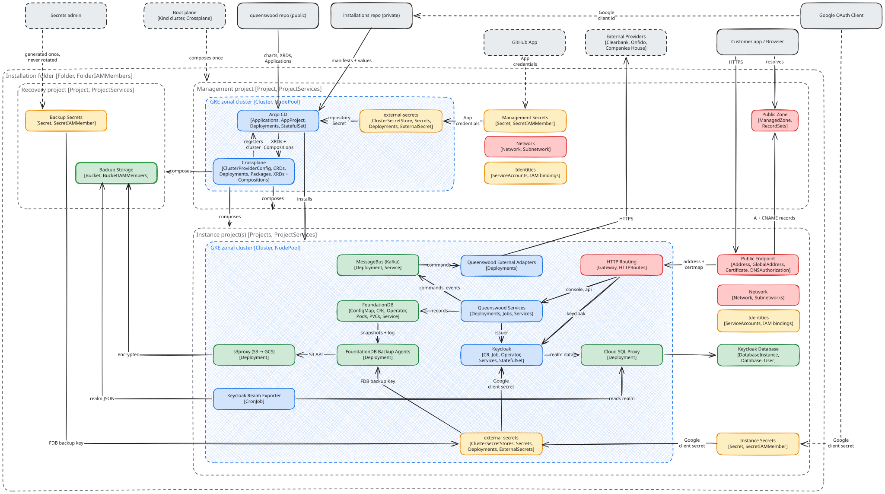

# Diagrams

Excalidraw sources (`*.excalidraw`) plus their exported SVGs. The SVGs
are theme-split: a `-light` and a `-dark` variant per diagram, both with
a transparent background, so they read cleanly on GitHub in either
colour scheme via a `<picture>` block.

## System diagram

<picture>
  <source media="(prefers-color-scheme: dark)"  srcset="system-diagram-dark.svg">
  <source media="(prefers-color-scheme: light)" srcset="system-diagram-light.svg">
  
</picture>

Colour split: grey external actors, blue ingress and message bus, violet
write side (processors), green read side (query bricks), amber record
store, orange egress adapters.

The cross-hatched amber band above the store is the domain data access
layer. Fill carries the distinction: solid boxes are things that run,
cross-hatch is a zone rather than a participant. Every store-bound arrow
crosses it, because nothing reaches FDB except through a tx-aware brick.

A dashed outline marks a box whose contents are substituted per
environment: the external APIs are the real ClearBank, Onfido, and
Companies House in production, and the simulator services in dev and
test. The adapter cannot tell the two apart, so it stays one box rather
than two.

## Infrastructure diagram

<picture>
  <source media="(prefers-color-scheme: dark)"  srcset="infrastructure-diagram-dark.svg">
  <source media="(prefers-color-scheme: light)" srcset="infrastructure-diagram-light.svg">
  
</picture>

Google's palette, by resource kind: blue compute, green data and
storage, amber identity and secrets, red networking, grey for anything
outside the installation boundary.

Fill carries the same distinction as the system diagram. Solid boxes are
things that exist; cross-hatch is a boundary rather than a participant,
so the organisation, the folder, each project and both clusters are
drawn as regions.

A dashed outline on a solid box marks a participant this repository does
not create and keep: the apex DNS zone, the Google OAuth client and the
GitHub App, none of which has an API that makes one to order; the
external providers, which are somebody else's; the person holding a
break-glass capability; and the boot plane, raised by hand and discarded
once the durable one exists.

The vertical split is lifetime, not topology. The durable tier across
the top is never torn down — the management project reconciles the
installation, and the recovery project holds backups and the key they
are encrypted under. The instance project below it is rebuilt whenever
an instance is.

The DNS project sits outside the folder entirely, because a domain has
one delegation and so exactly one zone may be authoritative for it: an
installation owning that zone could neither be rebuilt nor joined by a
second one. Each environment holds its own zone in the management
project instead, delegated to from the apex — see
[ADR-0028](../adr/0028-the-apex-belongs-to-no-installation.md).

## Regenerating the SVGs

The exports are produced headlessly from the `.excalidraw` sources by the
`excalidraw` brick, which drives Excalidraw's own `exportToSvg` so fonts
and hand-drawn strokes match the editor exactly. The hand-drawn font
(Excalifont) is inlined into each SVG as a base64 `@font-face` — GitHub's
SVG sanitiser strips external font URLs, so the font has to travel inside
the file to render. From the workspace root:

```bash
just diagram                       # the system diagram (default)
just diagram Idempotency.excalidraw   # a single named scene
just diagrams                      # every docs/diagrams/*.excalidraw
```

The first run installs the exporter's npm deps and a headless Chromium,
and bundles a headless `exportToSvg` with esbuild. Each SVG lands beside
its scene as `<slug>-light.svg` and `<slug>-dark.svg`; re-run after
editing a scene and commit the refreshed SVGs alongside it. The exporter
takes scene paths as arguments and writes beside each one; the recipes
above supply the paths.
