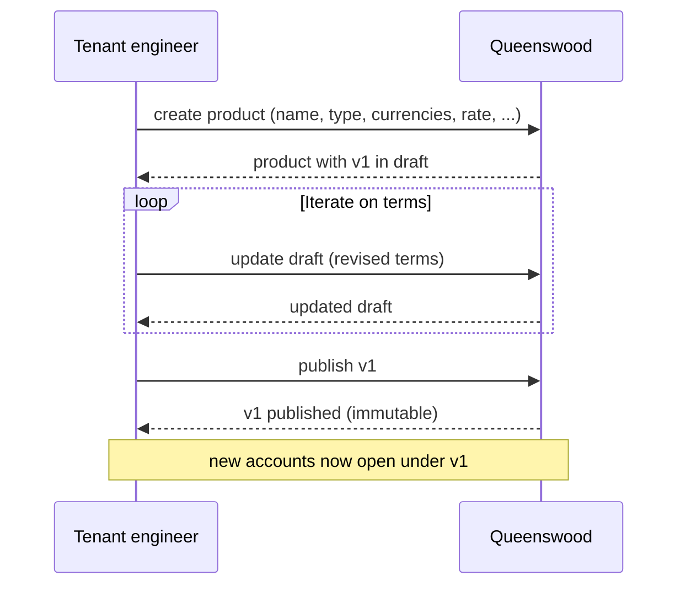
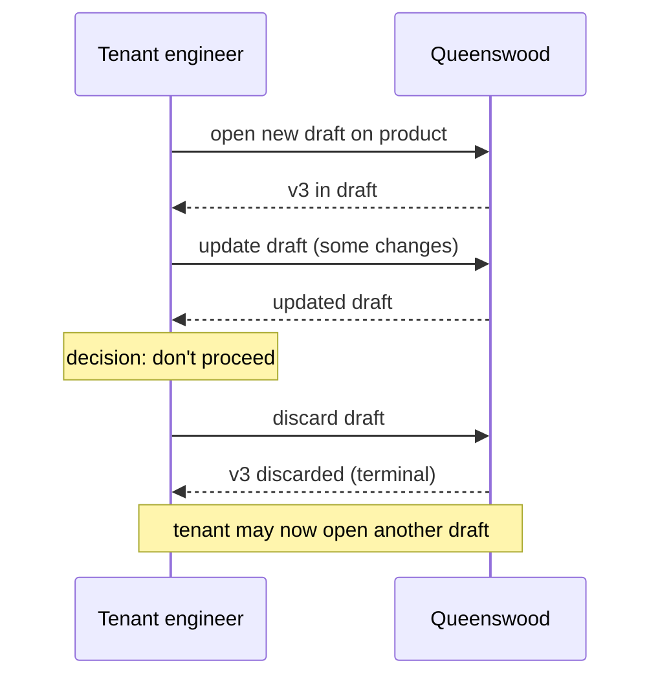
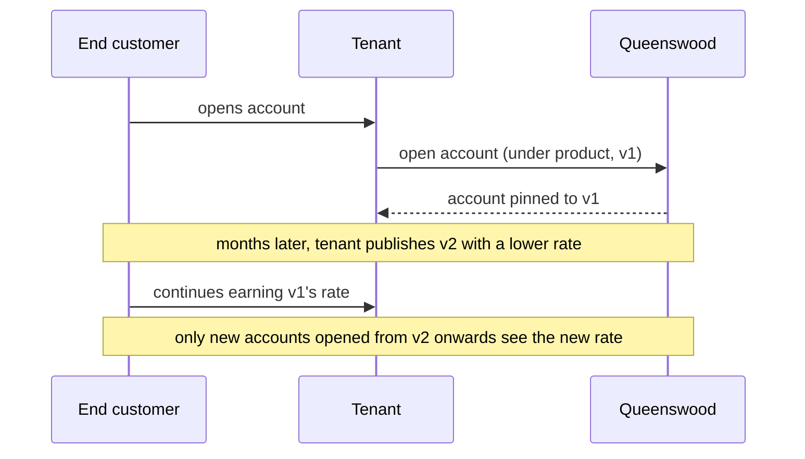

# Cash account products

## Objective

A **cash account product** is the template under which a
tenant's customer accounts are opened — it sets the
currency, the interest rate, the balance buckets the
account will carry, and the payment-address schemes the
account will accept. Tenants design their own products and
**version** them: when terms change, a new version is
published, but accounts opened under previous versions keep
their original terms. This is the model that lets banking
products evolve over time without retroactively repricing
the customers who signed up under the old terms.

## Users and stakeholders

**Tenant engineer / tenant product team.** The author of
products. Drafts new products, iterates on the terms,
publishes them, and (when terms change) opens new versions.
Cares about: the freedom to design products that match the
tenant's commercial offering, the certainty that publishing
is final, the ability to evolve terms over time without
disturbing existing customers.

**End customer.** Doesn't see the product directly, but
holds an account opened under a particular version of one.
Cares (implicitly) about: the terms they signed up to
remaining the terms they continue to receive.

**Compliance / risk function within the tenant.** Reviews
product terms before publication. Cares about: the
draft → published gate being explicit and observable, the
audit history of version changes being intact.

**Platform admin / Queenswood operator.** Sets policies
that bound what products a tenant can offer (e.g. capping
the number of products, restricting product types).

## Goals

- **Tenant-defined products.** Each tenant designs its own
  products. The platform provides the shape; the tenant
  fills in the terms.
- **Versioned terms.** Every product carries a sequence of
  versions. New accounts open under the latest published
  version; existing accounts stay on the version they were
  opened under.
- **Immutable once published.** A published version's terms
  cannot be edited. To change terms, the tenant publishes a
  new version.
- **Draft / publish gate.** Drafts are mutable; publishing
  is the explicit step that locks the version. A draft can
  also be discarded if abandoned.
- **One draft at a time, per product.** Only one draft can
  be open against a product at any moment. This keeps the
  authoring workflow linear.
- **Multiple product types.** The platform supports current
  accounts, savings accounts, term deposits, and the
  internal product types used for the tenant's own
  bookkeeping (settlement, internal).
- **Multi-currency products.** A product can list more than
  one allowed currency; the account picks one at open time.
- **Policy-bounded.** Platform-level policies cap the
  number of products a tenant can have and can restrict
  which product types a given tenant may draft.
- **Multi-tenant isolation.** Products belong to one
  tenant. Tenants don't see each other's products.

## Non-goals

- **A shared catalogue of templates.** The platform doesn't
  ship reusable starter products ("standard savings",
  "standard term deposit"). Each tenant builds its own
  products from scratch.
- **Effective-from / effective-to dating.** Publishing is
  immediate. There's no scheduling a version to take effect
  on a future date.
- **Retiring or closing a product.** A published product is
  open for new accounts indefinitely. There is no flow to
  stop accepting new accounts against a product.
- **Comparing versions.** The platform doesn't provide a
  diff between two versions. If a tenant wants to know
  "what changed between v2 and v3", they read both and
  compare.
- **Multi-currency rate variation.** A version carries one
  interest rate. A product that earns different rates in
  different currencies isn't expressible as a single
  version.
- **Repricing existing accounts.** New versions only apply
  to new accounts. There is no flow to migrate existing
  accounts onto a newer version.
- **Parallel drafts.** Compliance and product teams cannot
  prepare independent draft versions of the same product
  in parallel. One draft at a time.
- **Cleanup of discarded drafts.** Discarded drafts are
  retained as history. There's no archival or pruning
  flow.
- **Tenant-specified balance buckets.** The shape of an
  account's balances (which balance buckets it carries) is
  determined by the product type — current, savings, term
  deposit. Tenants don't choose the bucket layout
  themselves. Letting them specify it directly would be
  too easy a way to break the bank's bookkeeping.

## Functional scope

A tenant uses the banking API to design, version, and
publish cash account products. Each product is a template;
each version of a product is a specific set of terms at a
point in time.

### Creating a product

The tenant uses the banking API to create a new product,
supplying:

- A display name (e.g. "Premier Savings").
- The product type (current, savings, term deposit, or one
  of the internal types).
- The list of allowed currencies (ISO 4217 strings — e.g.
  `"GBP"` or `["GBP", "EUR"]`).
- The interest rate, expressed in basis points (e.g. `550`
  for 5.5% APR).
- The payment-address schemes the account will accept
  (e.g. UK Faster Payments).
- Whether, from the bank's books, this product is on the
  liability side (customer deposits — the typical case) or
  the asset side.

Creation produces the first version of the product, in
draft. The product itself has a stable identifier; versions
are numbered (v1, v2, v3, ...) within the product.

### Working with a draft

While a version is in draft, the tenant uses the banking
API to update its terms. Any field can change. The draft
remains open until the tenant publishes it or discards it.

Only one draft can exist for a given product at any time.
Attempting to open a second draft is rejected.

### Publishing

Publishing locks the version: from that moment on, its
terms are fixed. Any later change requires a new draft on
the same product.

### Opening a new version

Once a product has a published version, the tenant can
open a new draft to start the next version. The new draft
starts blank — it does not inherit fields from the previous
version. The tenant supplies the new terms in full.

### Discarding a draft

A draft can be discarded if the tenant decides not to
proceed with it. Discarded drafts are kept as history; the
slot is freed so the tenant can open a new draft on the
same product.

### Reading products

The tenant can read a product to see all its versions.
There is also a way to get the currently active (latest
published) version of a product, which is the version new
accounts will open under.

### How accounts use products

When an account is opened, the platform reads the product's
currently published version and pins both the product and
that version to the account. Every operation on the account
that needs the terms — interest accrual reading the rate,
payment validation reading the allowed schemes, currency
checks reading the allowed currencies — goes back to that
specific version.

When the tenant later publishes a new version, only newly
opened accounts see the new terms. Existing accounts remain
on their original version. This is the cohort property
that the versioning model exists to deliver.

### Policy bounds

The platform enforces two kinds of bounds when a tenant
drafts products:

- **Capability** — whether the tenant is allowed to draft
  products at all, and whether they're allowed to draft
  products of a particular type. A tenant might be denied,
  say, the term-deposit product type by their tier.
- **Count limit** — a cap on the total number of products
  a tenant can have.

Both bounds come from the platform's policy machinery —
see [policies](policies.md).

## User journeys

### 1. Tenant designs and publishes a new product



The tenant designs the product as a draft, iterates on the
terms, and publishes when ready. From publication onwards,
new accounts open under v1 and inherit those terms.

### 2. Tenant changes terms (new version)

```mermaid
sequenceDiagram
    participant T as Tenant engineer
    participant Q as Queenswood

    Note over T,Q: v1 is published; some accounts already exist
    T->>Q: open new draft on product
    Q-->>T: v2 in draft (blank)
    T->>Q: update draft (new rate, new terms)
    Q-->>T: updated draft
    T->>Q: publish v2
    Q-->>T: v2 published
    Note over T,Q: accounts opened on v1 keep v1 terms<br/>accounts opened from now on use v2
```

When market conditions or commercial decisions change the
terms, the tenant publishes a new version. The previous
cohort of accounts stays on the old terms; new customers
sign up to the new terms.

### 3. Tenant abandons a draft



The tenant can discard an in-flight draft. Once discarded,
the draft is closed for good; the tenant can open a fresh
draft on the same product if they want to start again.

### 4. End customer continues on their original terms



The cohort property in action: an existing customer's
account stays on the terms it was opened under, even after
the tenant publishes a new version with different terms.

## Open questions

- **Effective-from / effective-to dating.** Publishing is
  immediate. A real product team would often want to schedule
  a version to take effect on a future date — for a
  rate change announced in advance, for instance.
- **Retiring a product.** No flow exists to stop a published
  product from accepting new accounts. Once published, it's
  open for new business indefinitely.
- **Repricing existing accounts.** New versions only apply
  to new accounts. There is no migration flow for moving
  existing accounts onto a new version (with all the
  consent and notice requirements that would imply).
- **Multi-currency rate variation.** A version carries one
  interest rate. Products earning different rates in
  different currencies need either separate products per
  currency or a model change.
- **Version comparison.** "What changed between v2 and v3?"
  is left to callers. A diff helper would make audit and
  compliance review easier.
- **Parallel drafts.** Compliance and product can't prepare
  independent drafts in parallel. The argument for the
  one-at-a-time invariant is simplicity; the cost is that
  two streams of changes have to be sequenced.
- **Discarded draft cleanup.** Discarded drafts accumulate.
  An archival or pruning pass would prevent the version
  list from growing without bound for tenants that
  rapid-iterate.
- **Shared product templates.** Each tenant builds products
  from scratch. A shared library of standard shapes
  ("standard savings", "standard term deposit") would cut
  duplication.
- **Supersession history.** When a new version publishes,
  the previous version isn't marked superseded — it just
  stops being the latest. "Which versions are still in use
  by accounts" requires walking accounts; the platform
  doesn't surface it directly.
- **Balance buckets in the API today.** The current
  banking API still accepts a balance-bucket layout from
  the tenant. The intent is to remove this — the layout
  should be derived from the product type — but until
  then, tenants who set it inconsistently can break their
  own bookkeeping. A migration to product-type-derived
  layouts is a known direction.

## References

- **Engineering view**:
  [tdd/cash-account-products](../tdd/cash-account-products.md)
  for the data model, lifecycle invariants, and the cohort
  pinning mechanism.
- **Platform context**: [platform](platform.md);
  [onboarding](onboarding.md) — the tenant's default
  product is created and published as part of the bootstrap.
- **Adjacent capabilities**: [cash-accounts](cash-accounts.md)
  — accounts open against a published version and pin to
  it; [interest](interest.md) — daily accrual reads the
  rate from the version; [policies](policies.md) — the
  capability and count-limit bounds on products.
