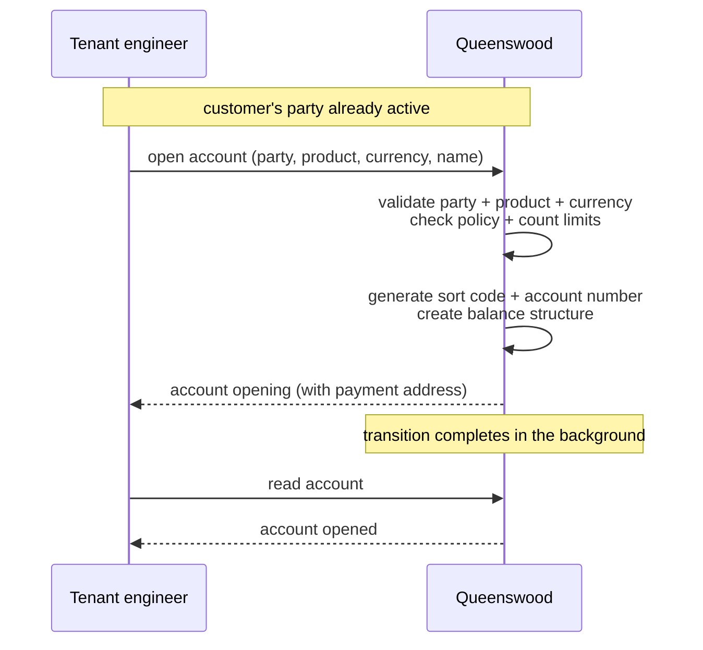
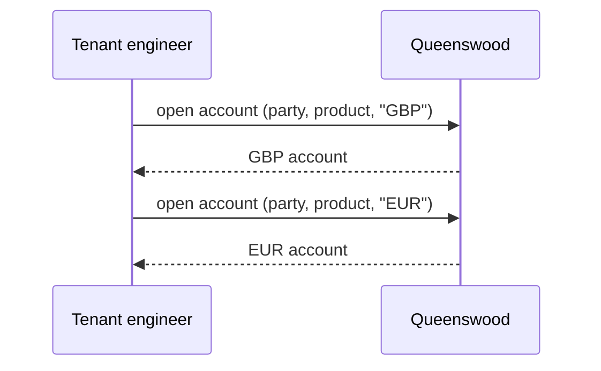
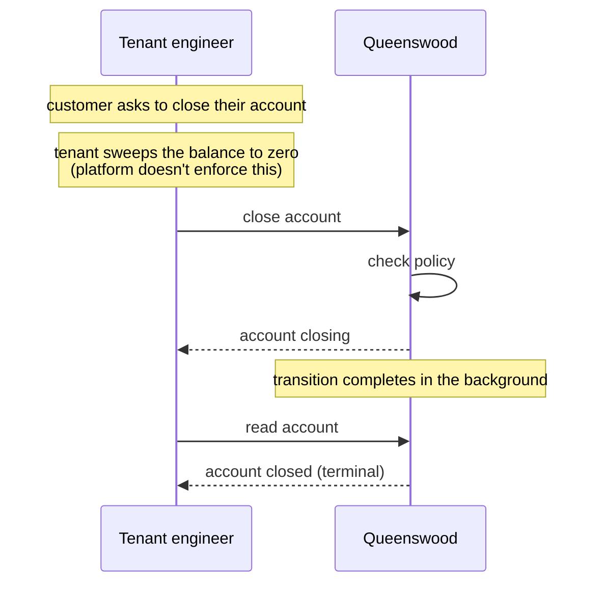

# Cash accounts

## Objective

A **cash account** is what an end customer holds and
transacts through. Each account belongs to one tenant, is
held by one party (person or organisation), is opened under
one published version of a cash account product, and is
denominated in one currency. At open time the account is
assigned a UK payment address — a sort code and account
number — that lets it receive money from any UK bank via
Faster Payments. From that point on, the account is the
identity that every movement of money references.

## Users and stakeholders

**Tenant engineer.** Opens and closes accounts on behalf
of their end customers, looks accounts up, and reads them.
Cares about: open succeeding only when the customer is
properly set up, the assigned payment address being usable
immediately, the eventual close being final.

**End customer.** The party who holds the account. Doesn't
interact with the platform directly; the account is the
thing the tenant exposes through their own customer-facing
surface. Cares (implicitly) about: the account being open
when expected, balances and statements being correct, the
sort code and account number staying stable.

**Platform admin / Queenswood operator.** Sets the
policies that cap how many accounts a tenant can open, of
which type, in which currency. Provides the bank's clearing
identity (the sort code under which all SCAN addresses are
issued).

## Goals

- **One account, one currency.** Each account is in exactly
  one currency. Multi-currency means multiple accounts —
  one per currency the customer holds.
- **Pinned to a product version.** At open time the account
  is pinned to a specific published version of the chosen
  product. Every subsequent operation that needs terms
  (interest rate, allowed payment schemes, currency
  validation) reads them from that version. This is the
  cohort property described in
  [cash-account-products](cash-account-products.md).
- **A UK payment address at open time.** Every account
  receives a unique sort code and account number when it
  opens. The address is usable for inbound and outbound
  Faster Payments from that point.
- **Owned by an active party.** An account can only be
  opened against a party that has been verified — see
  [parties](parties.md). Person parties must have passed
  identity verification; organisation and internal
  parties are active on creation.
- **Two type dimensions.** A *product type* (current,
  savings, term deposit) describes the kind of account it
  is; an *account type* (personal or business) describes
  who holds it. Both dimensions are visible to the
  platform's policies.
- **Lifecycle: open then close.** Accounts open and then,
  at the end of their life, close. Both transitions
  complete in two steps — the first step records the
  intent; the platform finishes the transition shortly
  after.
- **Multi-tenant isolation.** Every account belongs to one
  tenant. Tenants don't see each other's accounts.
- **Policy-bounded.** Platform-level policies cap the
  number of accounts a tenant can have, and can cap the
  number per (product type, account type, currency)
  combination.

## Non-goals

- **Tenant choice of sort code.** The bank operates under
  one clearing identity; every SCAN address shares the same
  sort code. Tenants don't select or vary it.
- **Multi-currency on a single account.** A customer who
  holds GBP and EUR holds two accounts.
- **Suspended or dormant states.** An account is either
  open or closed; there's no intermediate "suspended" or
  "dormant" state.
- **Re-opening a closed account.** Closing is terminal. A
  customer who closes an account and wants it back opens
  a fresh one — with a new identifier and a new payment
  address.
- **Rotating an account's payment address.** The sort code
  and account number assigned at open stay for the
  account's life. There's no flow to issue a replacement
  (after a fraud event, for example).
- **Overriding the account-type derivation.** A person
  party always opens personal accounts; an organisation
  party always opens business accounts. There's no way to
  open a "business" account on behalf of a person party.
- **Balance-zero check at close.** The platform doesn't
  enforce that an account is empty before it closes. The
  tenant is responsible for sweeping the balance.
- **International payment addresses.** No IBAN, no BIC, no
  cross-border addresses. UK SCAN only.
- **Product-derived account behaviour beyond the version
  pin.** The account itself doesn't change behaviour based
  on product type beyond what the version says.

## Functional scope

A tenant uses the banking API to open and close accounts on
behalf of its end customers, and to read accounts back.

### Opening an account

The tenant supplies:

- The party that will hold the account (must be active).
- The product the account is being opened under (must
  have a published version).
- The currency, in ISO 4217 string form (e.g. `"GBP"`).
- A user-friendly name.

Before the account is created, the platform checks:

- The party is active.
- The product has a published version.
- The chosen currency is one of the product's allowed
  currencies.
- The tenant is allowed (by policy) to open this kind of
  account.
- The tenant hasn't hit the platform's count limits — both
  the per-tenant total and the per-(product type, account
  type, currency) combination.

If all checks pass, the platform:

- Generates a unique UK payment address (sort code +
  account number).
- Records the account, pinned to the product version.
- Sets the account's status to **opening**.
- Creates the balance structure the account will use.

A moment later the platform finishes the transition and
the account becomes **opened** — the state in which it can
hold balances and appear on transactions.

### Account types

Two dimensions sit alongside each account:

- **Product type** — current, savings, or term deposit
  for customer-facing accounts; settlement or internal for
  the bank's own bookkeeping accounts. This comes from the
  product the account is opened under.
- **Account type** — personal or business. This is
  derived from the party: a person party gets a personal
  account; a non-person party gets a business account.
  The tenant doesn't supply the account type.

Both dimensions are visible to the platform's policies, so
rules can be expressed along either axis: "this tenant can
have at most three personal current accounts in GBP per
party", "business customers cannot open term deposits".

### Payment addresses

Every account is given a UK SCAN address (sort code +
account number) at open time. The sort code is the bank's
clearing identity (one shared by all accounts on the
platform); the account number is unique within that sort
code.

The address is the route money travels along: a UK Faster
Payment to that sort code and account number lands in this
account.

### Closing an account

The tenant uses the banking API to close an account.
Before closing, the platform checks:

- The tenant is allowed (by policy) to close this kind
  of account.

If allowed, the platform sets the status to **closing**.
A moment later the transition completes and the account
becomes **closed** — its terminal state.

The platform does not check that the balance is zero
before closing; the tenant is responsible for sweeping
funds out beforehand.

### Reading accounts

The tenant can:

- Read an account by its identifier.
- Look an account up by its UK payment address (sort code
  + account number) — used internally by the platform
  when an inbound payment arrives, but available to
  tenants who want to confirm an address resolves.
- Read the tenant's own bookkeeping accounts (settlement,
  internal) by type.

### Multi-tenant isolation

Every account belongs to one tenant organisation.
Cross-tenant reads are not possible through the banking
API.

## User journeys

### 1. Tenant opens a customer's first account

The tenant opens the account in a single call. The platform
validates the inputs, generates a payment address, and
returns the account immediately in the opening state. A
moment later the account is opened and ready to use.

### 2. Multi-currency: same customer, two accounts

A customer who needs both GBP and EUR holds two accounts —
one per currency. Each gets its own payment address; each
is independent of the other.

### 3. Inbound payment lands

The platform looks accounts up by their UK payment address
when an inbound Faster Payment arrives — see
[payments](payments.md). The tenant doesn't have to do
anything; the account simply credits.

### 4. Closing an account

The tenant closes the account when the customer ends the
relationship. Closing is terminal; if the customer comes
back, they open a fresh account with a new identifier and
a new payment address.

## Open questions

- **Suspended state.** Real banking has a "frozen pending
  review" state distinct from "closed". The platform's
  policy vocabulary hints at it but the lifecycle today
  doesn't express it.
- **Re-opening a closed account.** Closed is terminal. If
  a customer comes back after closing, they get a fresh
  account with a new payment address. Some operators
  prefer to retain the original identifier or address.
- **Rotating a payment address.** After a compromise, a
  customer might want a fresh sort code + account number
  on the same account. There is no flow to do this today.
- **Balance-zero on close.** The platform doesn't enforce
  it. Either the platform should refuse a non-zero close,
  or it should be configurable per tenant via policy. Today
  it's caller-side discipline.
- **Dormancy and inactivity.** Real banks have regulatory
  regimes for accounts unused for long periods (flagged,
  then closed, sometimes escheated to the state). None
  of that is modelled.
- **Account-number recycling.** When an account closes,
  whether its number returns to the pool or stays retired
  is unspecified — it depends on how the platform's
  number-generation function is configured.
- **Multiple sort codes.** The bank operates under one
  clearing identity. Multi-bank routing or per-tenant
  sort codes aren't supported.
- **International payment addresses.** No IBAN or BIC
  today. Cross-border payments are out of scope at the
  platform level.
- **Sole-trader accounts.** A sole trader is a person who
  also operates a business. Today they'd open a personal
  account (because their party is a person); a "business
  account on behalf of a person" isn't expressible.
- **Re-validating party status on long-lived accounts.**
  The party's active status is checked at open time only.
  If the party is later suspended (once that lifecycle
  exists), the account doesn't automatically reflect it.

## References

- **Engineering view**: [tdd/cash-accounts](../tdd/cash-accounts.md)
  for the data model, lifecycle transitions, payment-
  address generation, and the lookup indices.
- **Platform context**: [platform](platform.md);
  [onboarding](onboarding.md) — the tenant's own
  bookkeeping accounts are opened as part of the bootstrap.
- **Adjacent capabilities**: [parties](parties.md) — an
  account is owned by an active party;
  [cash-account-products](cash-account-products.md) — an
  account is pinned to a published version;
  [payments](payments.md) — money flows in and out via
  the account's payment address;
  [interest](interest.md) — daily accrual reads the
  account's pinned version for the rate;
  [policies](policies.md) — open and close capabilities,
  and the count limits.
