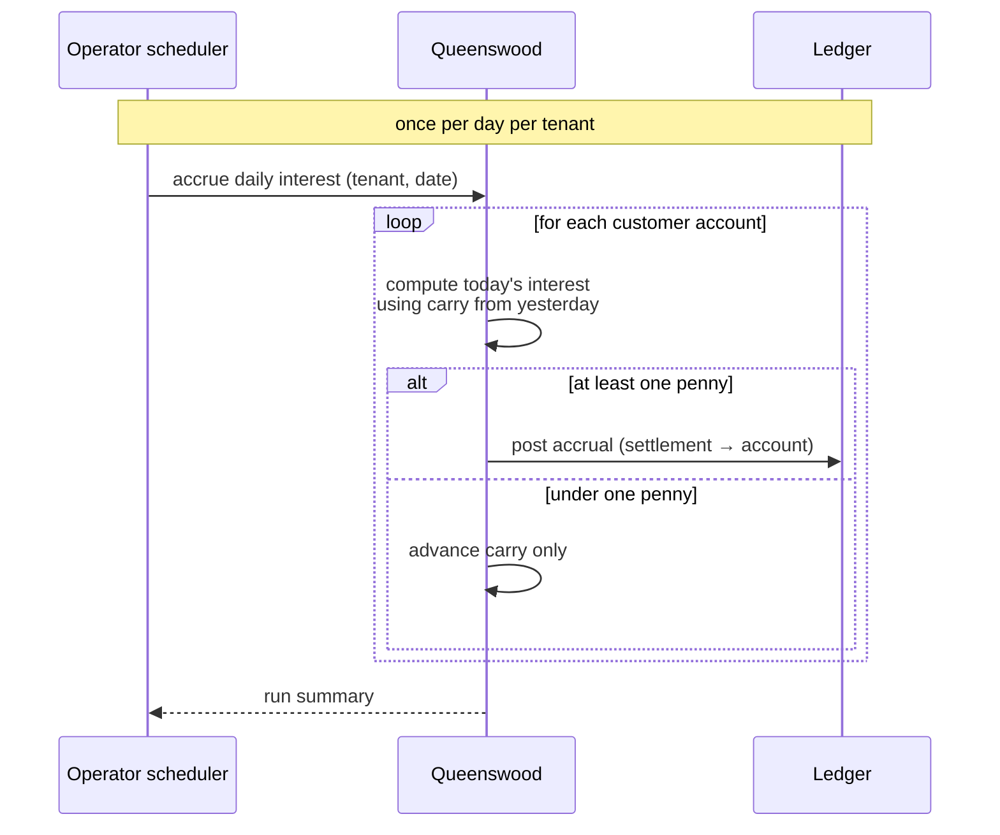
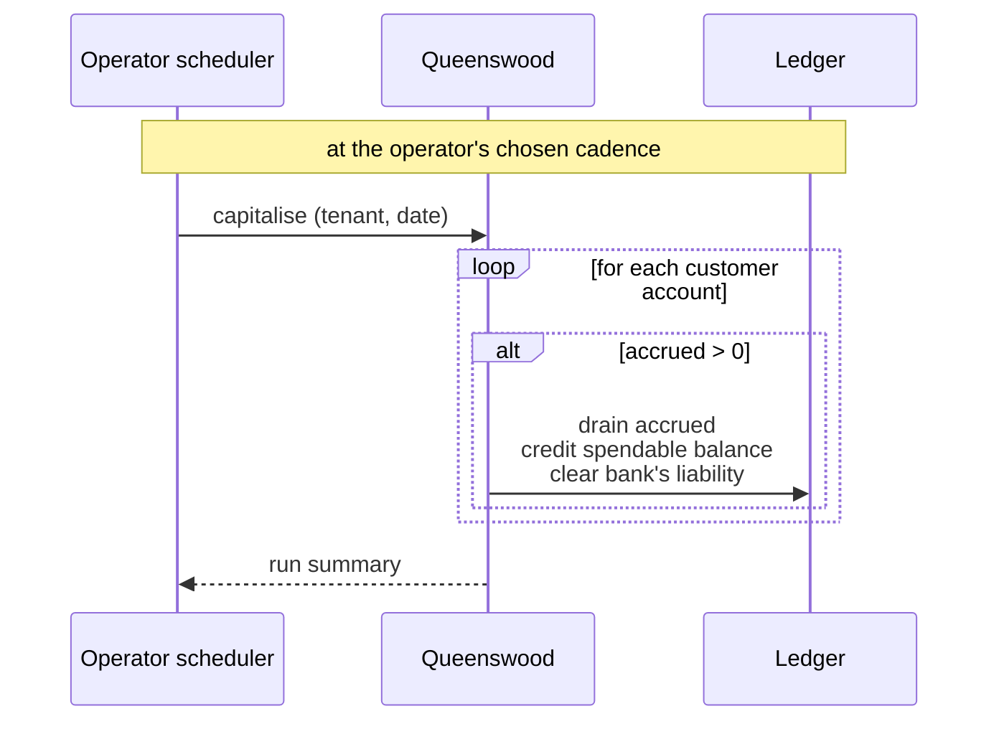
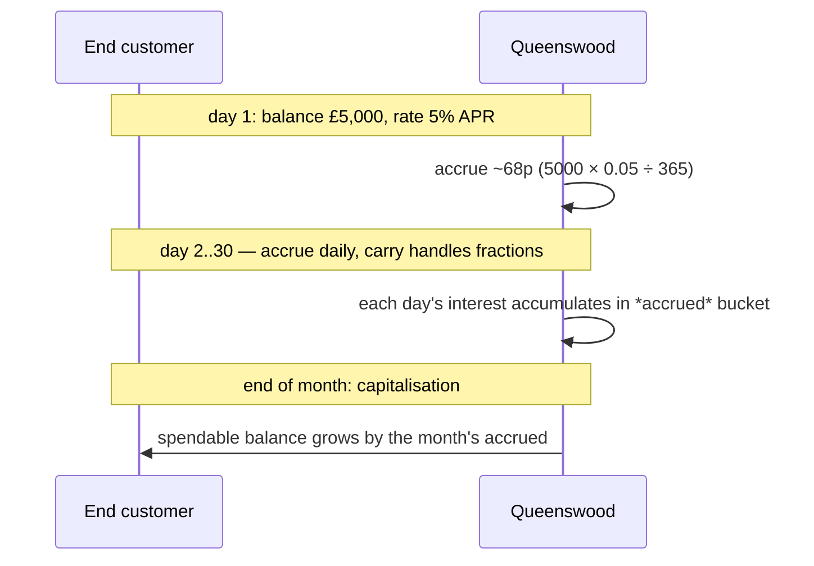
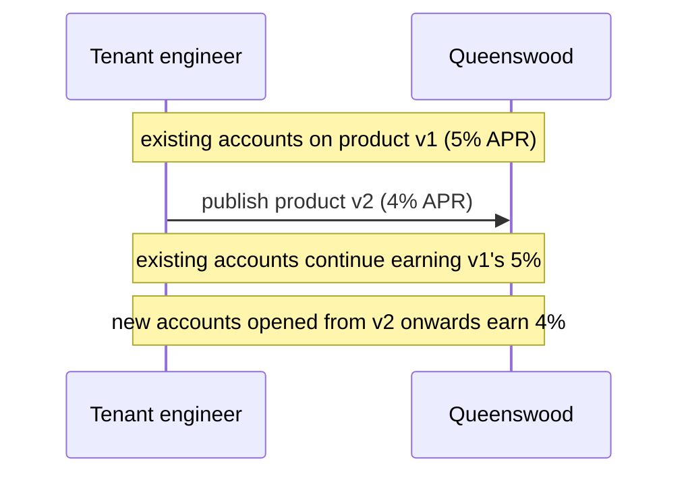

# Interest

## Objective

Customer accounts earn interest. The platform computes
interest daily on each account's settled balance, records
it as accrued, and capitalises it — moving it into the
account's spendable balance — at a cadence the operator
schedules. The arithmetic conserves every fraction of a
penny across millions of accounts and 365 days; nothing is
lost or quietly rounded away. Re-running a day is safe.

## Users and stakeholders

**End customer.** Earns interest on their settled balance.
Doesn't interact with the platform directly. Cares
(implicitly) about: interest accruing every day they hold
funds, capitalisation appearing on their account at the
expected cadence, the rate matching what they signed up
for.

**Tenant engineer / tenant product team.** Defines the
rate as part of the cash account product. Decides the
capitalisation cadence for the products they offer (in
co-ordination with the operator who runs the daily and
capitalisation jobs). Cares about: rate fidelity (the
account earns what the product says), no surprises around
rounding or lost pennies, the audit trail being intact.

**Platform admin / Queenswood operator.** Schedules the
daily accrual run and the capitalisation runs. Owns the
operational side: making sure the daily job fires every
day, sequencing capitalisation at the agreed cadence,
operating the bank's settlement account.

## Goals

- **Daily accrual on settled balance.** Every day, every
  customer account earns interest based on its settled
  balance and the rate from the product version it was
  opened under.
- **Penny conservation.** Sub-penny daily interest is
  tracked with a carry field that accumulates between
  days; once the carry rolls over a whole penny, the
  penny posts. No money is rounded away on long-tail
  balances.
- **Rate from the product version.** The interest rate is
  a property of the product version the account is pinned
  to. Customers earn the rate they signed up for, even
  after the product publishes a new version with a
  different rate — see
  [cash-account-products](cash-account-products.md).
- **Operator-scheduled capitalisation.** Capitalisation —
  the moment accrued interest becomes part of the
  spendable balance — happens at any cadence the operator
  schedules. Daily, weekly, monthly, quarterly, annual
  all work. The cadence is a product choice, not a
  platform constraint.
- **Compounding falls out of cadence.** Daily
  capitalisation produces daily-compounded interest;
  monthly produces monthly-compounded. The platform
  doesn't have a separate "compounding mode" — the
  cadence is the choice.
- **Idempotent re-runs.** Running a day's accrual or a
  capitalisation twice for the same date doesn't
  double-credit. The platform recognises the repeat and
  treats it as a no-op.
- **Per-account independence.** Each account's accrual
  and capitalisation is independent. A failure on one
  account doesn't block the rest of the run.
- **Audit trail.** Every accrual and capitalisation is
  recorded on the ledger. The bank's matching liability
  on the settlement account is recorded too — money
  moves from somewhere identifiable to the customer's
  account.
- **Multi-tenant isolation.** Each tenant's accruals run
  against its own organisation. Tenants don't share
  accrual state.

## Non-goals

- **Internal scheduling.** The platform doesn't decide
  when to run accruals or capitalisations. An external
  scheduler (cron, a workflow engine, an operator
  triggering by hand) drives the runs.
- **Floating-point arithmetic.** All interest math is
  integer arithmetic at sub-penny precision.
- **Multiple day-count conventions.** Only actual/365 is
  supported today. No actual/360, no 30/360.
- **Per-currency rates inside one product.** A product
  version carries one rate. Products that earn different
  rates in different currencies aren't expressible as a
  single product version.
- **Mid-period rate changes within a version.** Rate
  changes happen at the version boundary. There's no
  "rate effective from date X" within a version — to
  change the rate, the tenant publishes a new product
  version.
- **Interest on pending balances.** Pending-incoming and
  pending-outgoing amounts don't earn interest. Only
  settled balance does.
- **Tiered or stepped rates.** A product version carries
  one flat rate. No "5% on the first £10,000, 3% above"
  tiered shape today.
- **Negative interest.** Rates are non-negative; the
  platform doesn't model accounts charged interest on
  positive balances.
- **Borrowing / overdraft interest.** No lending products
  on the platform; no borrowing rate.
- **Reversing an accrual or capitalisation.** No
  packaged flow for unwinding a wrongly-accrued day.
  Reversal is possible by hand via the underlying ledger
  but isn't a first-class capability.

## Functional scope

The platform provides two operations: daily accrual and
capitalisation. Both are run per-tenant.

### Daily accrual

Once per day, the operator triggers the daily accrual run
for each tenant. The platform:

- Walks every customer account on that tenant.
- For each account, reads the settled balance and the
  rate from the account's pinned product version.
- Computes the day's interest using integer arithmetic
  at sub-penny precision; uses the account's carry to
  remember sub-penny remainders between days.
- If the day's interest reaches at least one whole
  penny, posts the accrual: a credit to the account's
  *interest-accrued* bucket, balanced by a debit on the
  bank's settlement account (recording the bank's
  liability to pay it out).
- Updates the account's carry with whatever sub-penny
  remainder is left.

When the day's interest is less than a penny, no posting
is made — only the carry advances. This keeps the ledger
free of zero-value entries.

### Capitalisation

At the operator's chosen cadence, the platform sweeps
accrued interest into the account's spendable balance.
For each account:

- Reads the account's accrued bucket.
- If the accrued amount is non-zero, posts a transaction
  that:
  - Drains the accrued bucket.
  - Increases the spendable balance by the same amount.
  - Clears the matching liability on the bank's
    settlement account.
- Records the audit trail of the bank paying out and the
  customer receiving.

After capitalisation, the account's spendable balance is
larger by the accrued amount; the next day's accrual
computes against the new, larger balance — which is what
makes compounding emerge from the cadence.

### Cadence choices

The operator chooses the capitalisation cadence and the
choice has real customer-facing consequences:

- **Daily.** The customer sees interest credited every
  day. Compounding is daily.
- **Weekly / monthly.** The customer sees interest credited
  at that cadence. Compounding is at the same cadence.
- **Annually.** The customer sees interest credited once
  a year. Compounding only on the anniversary.

Less frequent capitalisation means the customer earns
less in absolute terms (since accrued interest doesn't
itself earn interest until it has been capitalised). The
trade-off is a product decision; the platform supports
any choice.

### Rate stability over time

Each account is pinned to the product version it was
opened under. The interest rate comes from that version.
When the tenant publishes a new product version with a
different rate, existing accounts continue to earn the
rate from their original version. Only newly opened
accounts pick up the new rate. This is the cohort
property described in
[cash-account-products](cash-account-products.md).

### Penny conservation

Daily interest on small balances is well under a penny.
A naive system that rounded each day would credit zero
forever to small accounts. The platform avoids this by
tracking sub-penny remainders on each account: each day's
remainder is added to the next day's calculation, so a
balance that earns half a penny per day posts a penny
every other day.

Across millions of accounts and many years, the
arithmetic conserves every micro-fraction of a penny.

### Idempotent re-runs

Accrual and capitalisation runs are idempotent on the
date. If a daily run is interrupted or has to be re-fired
for the same date, the platform recognises the work
already done on each account and skips it. The tenant
and the operator can re-run safely.

### Per-account independence

The platform processes each account independently. If
one account fails for any reason — a policy denial, an
unexpected state — the run skips it (recording the
failure) and continues. The rest of the day's work isn't
held up by one bad account.

### The bank's settlement account

Every tenant has a settlement account that holds the
bank's liability to pay out accrued interest to its
customers. Accrual posts to it; capitalisation drains it.
This is part of the tenant's bookkeeping, set up at
[onboarding](onboarding.md).

## User journeys

### 1. Daily accrual run

The operator's scheduler triggers the run once per day
per tenant. The platform walks every customer account,
computes the day's interest, posts where it's at least a
penny, and advances the carry on every account.

### 2. Capitalisation run

At the chosen cadence, the operator triggers
capitalisation. Accrued interest moves into the customer's
spendable balance and the bank's matching liability
clears.

### 3. End customer earns and is paid

From the customer's point of view: every day, interest
accrues silently in the background; on the cadence the
tenant offers, the accrued amount becomes part of the
spendable balance and is now available to spend.

### 4. Tenant publishes a new rate

The cohort property in action. Existing customers don't
see a rate cut overnight when the tenant publishes a new
version with a different rate.

## Open questions

- **Internal scheduling.** Today the platform relies on
  an external scheduler to trigger the daily accrual and
  the capitalisation runs. A real product probably wants
  the platform to be the source of truth for "did today's
  accrual fire?" rather than depending on operator
  discipline.
- **Reversing a wrongly-accrued day.** No packaged flow
  for unwinding an accrual or capitalisation. Reversal
  is possible by hand via the underlying ledger but
  isn't a first-class capability.
- **Capitalisation date validation.** Calling
  capitalisation with a particular date capitalises
  whatever's in the accrued bucket at that moment; the
  platform doesn't validate that the date is a
  period-end or that all of the period's accruals have
  posted. Sequencing is the operator's responsibility.
- **Tiered or stepped rates.** No "5% on the first
  £10,000, 3% above". Real retail products often use
  tiered rates; the platform doesn't model them.
- **Per-currency rates within one product.** A product
  version carries one rate. Products that earn different
  rates in different currencies need a model change.
- **Mid-period rate changes.** A rate change requires
  publishing a new product version. There's no "rate
  effective from date X within the same version" flow.
  Real products sometimes need this for promotional
  rates.
- **Interest on pending balances.** Pending-incoming and
  pending-outgoing amounts don't earn interest. A "earn
  interest on cleared funds same day" feature would need
  explicit treatment.
- **Day-count convention.** Only actual/365 is
  supported. Other conventions (actual/360, 30/360)
  would matter for some product types.
- **Account-skip and run summary.** When an account
  fails its checks during a run, the run records the
  failure and continues. A more developed run summary
  (counts of processed, skipped, failed; reasons; date
  range) would help operations.
- **Negative rates.** The platform models non-negative
  rates only.
- **Borrowing interest.** No lending products on the
  platform, so no borrow-side interest.

## References

- **Engineering view**: [tdd/interest](../tdd/interest.md)
  for the integer-arithmetic carry mechanism, the two-leg
  daily posting, the six-leg capitalisation posting, and
  the per-account run pattern.
- **Platform context**: [platform](platform.md);
  [onboarding](onboarding.md) — the tenant's settlement
  account is set up here;
  [cash-account-products](cash-account-products.md) — the
  rate lives on the product version;
  [cash-accounts](cash-accounts.md) — every account is
  pinned to a product version, which is where its rate
  comes from.
- **Adjacent capabilities**: [payments](payments.md) —
  payments and interest both move money on the ledger but
  don't otherwise interact;
  [policies](policies.md) — capabilities and limits can
  bound which accounts earn interest, and at what
  rates.
- **Engineering depth**:
  [tdd/transactions-and-balances](../tdd/transactions-and-balances.md)
  for the double-entry posting model that sits under
  every accrual and capitalisation.
