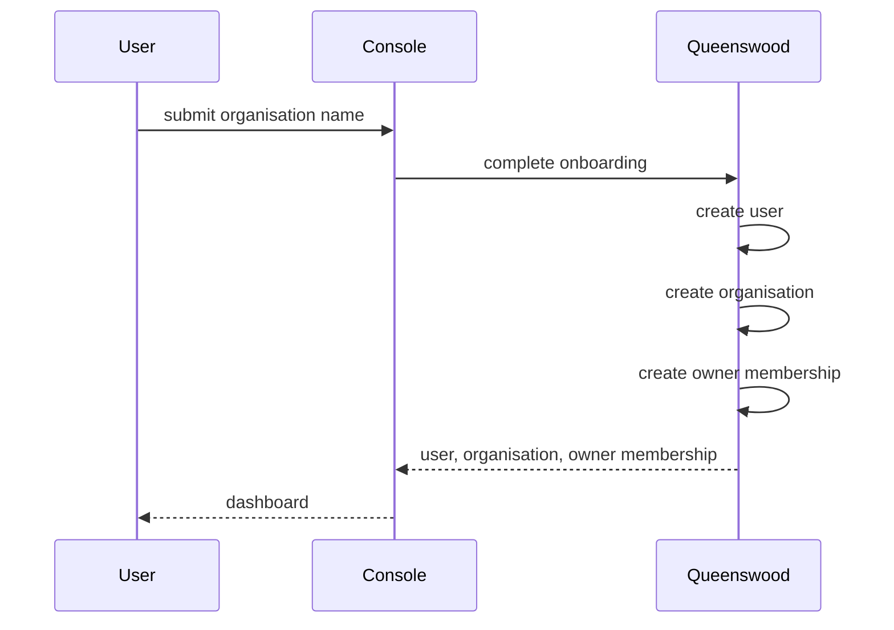
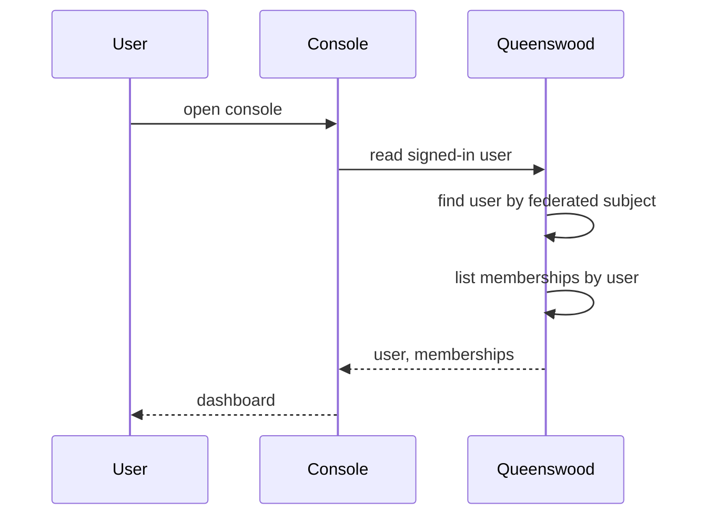
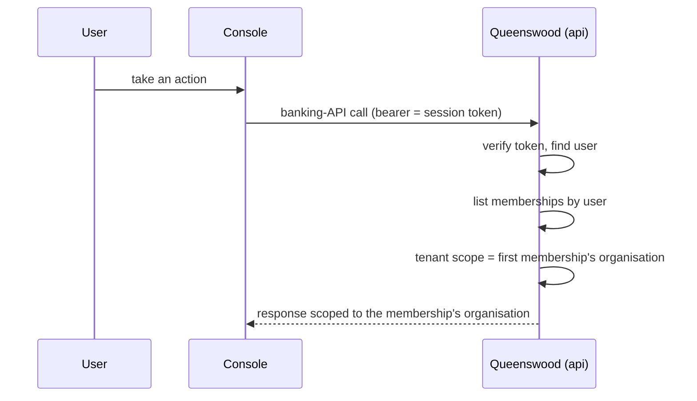

# Memberships

## Objective

Memberships bind a **user** to a tenant **organisation** with a
**role**. A user with at least one membership is a signed-in
human who can act on a tenant's behalf; the role on the
membership is the lever that controls what they can do once
they're inside. The MVP issues exactly one role — owner — and
attaches it as part of the first-sign-in onboarding flow.

The membership model is intentionally many-to-many. The data
shape lets one user belong to several organisations and one
organisation host several users, even though the MVP only ever
creates one membership per user.

## Users and stakeholders

**End user.** The human behind the user record on one side
of the membership. Cares about reaching their organisation
without administrative friction, and — eventually — being
invited into a colleague's organisation without losing access
to their own.

**Tenant organisation.** The organisation on the other side.
Cares about who can act on its behalf, and (in the future)
about being able to manage that set without going through
platform support.

**Platform admin / Queenswood operator.** Sees memberships
as the join table between human identity and tenant
authority. Cares about being able to audit who is attached
to which tenant, and about retaining a way to grant or
remove memberships out of band if a tenant gets locked out.

## Goals

- **Single owner per tenant at creation.** The user who
  creates a new tenant during onboarding becomes its owner.
  Every new organisation has exactly one membership at the
  moment it comes into existence.
- **N:M-ready model.** A user can belong to many
  organisations; an organisation can have many members. The
  storage and indexing support this even though the MVP only
  creates one membership per user.
- **Role-discriminated authority.** A membership carries a
  role enum (owner, admin, developer, viewer reserved for
  later). Today, owner is the only role assigned and grants
  full tenant-scope access. Future roles will narrow
  authority without changing the membership shape.
- **Stable identifier.** Each membership has its own
  identifier so audit trails and (future) revocation can
  refer to the binding directly, not just the user-org pair.
- **Authoritative for the principal's organisation.** When
  a signed-in user makes a banking-API call, the platform
  resolves their organisation through the membership index.
  Memberships are the source of truth for "which tenants can
  this human act on".

## Non-goals

- **Multi-org membership for end users today.** The console
  doesn't expose an org-switching surface or a "create
  another organisation" path. The MVP keeps each user
  one-to-one with their organisation even though the data
  model is more permissive.
- **Roles beyond owner.** Admin, developer, and viewer are
  reserved in the proto so we don't need to bump enum values
  later, but neither the assignment surface nor the
  permission semantics for those roles exist yet.
- **Invitations.** An owner can't invite a colleague to
  join their organisation. There is no invitation record,
  no acceptance flow, no email-on-pending-invite.
- **Role changes after creation.** Once a membership is
  created its role doesn't change. Promoting from viewer to
  admin or demoting from owner isn't supported.
- **Removing a membership.** A membership stays in the
  store for the lifetime of the user record. Tenant-side
  off-boarding (removing a former employee) isn't built.
- **Operator-driven membership grants.** Platform admins
  can't create a membership against an arbitrary user; the
  only path is a user going through onboarding for
  themselves. Out-of-band lock-out recovery isn't a flow
  today.

## Functional scope

Memberships join the platform-identity hierarchy (user) to
the banking-domain edge (tenant organisation). The console
and the banking API consume memberships indirectly — the
platform resolves them automatically when a signed-in user
makes a call.

### Creation

A membership comes into existence as part of onboarding.
When a user completes their first sign-in and names an
organisation, the platform creates the user record, the
organisation, and a membership binding the two with role
owner — see [onboarding](onboarding.md). Subsequent calls to
onboard are rejected: a user already attached to an
organisation can't onboard a second one.

### Lookup at the API edge

When a signed-in user calls the banking API, the platform
verifies the session token, identifies the user record
behind it, and consults the membership index to find the
user's organisations. The first (and only) membership's
organisation is treated as the active tenant scope. The
user gets the tenant-scoped role on the request, which is
what existing org-scoped endpoints already check.

### Listing in the console

The console asks the platform for the signed-in user's
memberships on every page load and renders the active
organisation from the first one. A future
multi-organisation UX would render this list as a switcher;
today it's a single entry.

### Identity at audit time

Each membership carries its own identifier alongside the
user and organisation identifiers. Audit records and (later)
revocation surfaces refer to the membership directly, not
to the (user, organisation) pair — so an organisation that
once had a user removed and re-added would carry two
distinct membership records, not one ambiguous shared one.

## User journeys

### 1. Owner membership is created during onboarding

A single onboarding call creates all three records together.
The owner membership ties them together and is the source of
truth for "this user can act on this organisation".

### 2. Re-sign-in resolves the same membership

On every subsequent sign-in, the console reads the user and
memberships together. The membership is what tells the
dashboard which organisation to render and what scopes to
ask for.

### 3. Banking-API call as a signed-in user

The membership index is consulted on every console-driven
request. The platform's tenant-scoping machinery doesn't see
"user" or "membership" directly — it sees the resolved
organisation and the tenant role on the principal, and runs
the same authorisation it would for a service-account JWT.

## Open questions

- **Invitations.** The natural next feature: an owner
  invites a colleague by email, the colleague signs in
  through the console, and an invitation record fans out
  into a fresh membership. Needs an invitation record, an
  acceptance flow, expiry, and a UX for the owner to manage
  pending invitations.
- **Role assignment surface.** Once admin / developer /
  viewer roles carry semantics, the platform needs a way to
  set a membership's role at creation and to change it
  later. The membership update path doesn't exist.
- **Permission semantics for non-owner roles.** Owner
  grants everything inside the tenant; the reserved roles
  imply narrower authority. The mapping from role to
  permitted operations — and how policies express it —
  isn't designed.
- **Removing a membership.** Off-boarding a former
  colleague needs a "remove" path. The shape: soft-delete
  with an `ended-at`, hard-delete, or a status field. Choice
  affects audit reconstruction.
- **Last-owner safety.** Once invitations and removal exist,
  the platform has to refuse the operation that would leave
  an organisation with no owners. The check needs a place to
  live and a way to be made bypassable by platform admins.
- **Multi-organisation switching in the console.** The data
  model supports a user belonging to many organisations, but
  the console renders only the first. A future console needs
  an org switcher, and the API needs to scope user-driven
  calls to the user-selected organisation rather than the
  arbitrary first match.
- **Operator-driven membership creation.** Platform admins
  can't create or grant memberships on behalf of a tenant.
  This shows up in lock-out recovery scenarios: a tenant who
  loses their only owner has no path back. A platform-admin
  surface to attach an arbitrary user to a tenant would
  close that gap.
- **Service-account credentials and memberships.** Today
  organisation-scoped service-account JWTs and user-scoped
  session tokens coexist with no shared model. A future
  consolidation might make service accounts a special kind
  of membership; that mapping isn't drawn yet.

## References

- **Engineering view**: [tdd/onboarding](../tdd/onboarding.md)
  — how memberships are created, stored, and looked up at the
  API edge.
- **Users**: [users](users.md) — the human identity side of
  the membership.
- **Operator-driven onboarding**: [onboarding](onboarding.md)
  — admin-driven tenant creation, which doesn't create a
  membership today (only a service-account credential).
