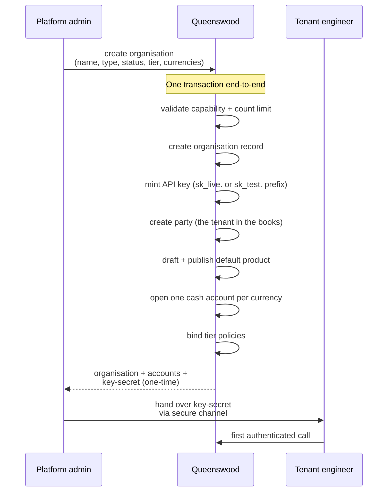

# Onboarding

## Objective

A new fintech tenant comes onto the Queenswood platform via a
single creation operation. One call by a platform admin
produces the tenant's organisation, an API key for the tenant
to authenticate with, a party representing the tenant in the
bank's books, a default product, a cash account per requested
currency, and the appropriate policy bindings — all atomic.
The tenant immediately has a working starting state: they can
authenticate and begin operating without further bootstrap.

## Users and stakeholders

**Platform admin / Queenswood operator.** Drives the
onboarding operation. Decides the tenant's type
(customer vs internal), status (live vs test), tier (which
bundle of policies binds), and supported currencies. Receives
the one-time API key secret to forward to the tenant.

**Tenant engineer.** The downstream recipient of the
credential. Their experience starts when they receive the key
and make their first authenticated call. Cares about: the key
being usable immediately, the tenant having a settled
starting state (settlement account exists, default product is
published), the tier being correct for their use case.

**Tenant organisation.** The entity created — the
multi-tenant boundary that scopes everything else.

## Goals

- **Single-call creation.** One operation creates the entire
  tenant. No follow-up calls to bootstrap a working state.
- **Atomic.** Either the tenant comes up complete or doesn't
  come up at all. No half-created tenants.
- **One-time credential delivery.** The API key secret is
  returned exactly once, at creation. The tenant must store
  it; the platform doesn't.
- **Status-marked credentials.** Keys carry a `sk_live.` or
  `sk_test.` prefix derived from the tenant's status. An
  operator looking at a key string knows immediately whether
  it's a live or test credential.
- **Tier-based policy binding.** A `tier` label at creation
  time binds the tenant to the corresponding bundle of
  policies. Different tiers can ship with different rule
  sets.
- **Default product and accounts.** A settlement product
  (for customer tenants) or internal product (for internal
  tenants) is drafted and published, and accounts are opened
  in each requested currency. The tenant has bookkeeping
  capacity from the moment of creation.
- **Multi-tenant isolation.** Every record created carries
  the tenant's organisation identifier. Other tenants cannot
  see this data; isolation is enforced at the data layer.

## Non-goals

- **Self-service tenant signup.** No public signup form.
  Tenants are minted by platform admins.
- **Billing or pricing.** No subscription, metering, or
  invoicing.
- **Tenant deactivation, closure, or off-boarding.** Tenants
  once created are permanent. No flow to close one.
- **Tier transitions post-creation.** A tenant's tier is set
  at creation and stays there. No upgrade or downgrade flow.
- **Status changes post-creation.** A live tenant stays
  live; a test tenant stays test.
- **Multiple API keys at tenant creation.** Only the default
  key is issued. Issuing further keys is a separate concern,
  with limited tooling today and no polished self-service
  flow.
- **End-customer accounts at create time.** The accounts
  opened by this flow are the tenant's bookkeeping accounts
  (settlement or internal). Customer-facing accounts are
  opened separately by the tenant for their customers.
- **User management.** No user concept exists. The tenant is
  identified by the API key, not by the human operator who
  used it.
- **Per-key audit attribution.** Which platform admin
  created the tenant isn't recorded.

## Functional scope

A platform admin uses the banking API to create a new tenant
in a single call.

**The call accepts:**

- Organisation name.
- Type — customer (an external fintech) or internal
  (Queenswood's own bookkeeping tenant).
- Status — live (production-grade) or test (sandbox).
- Tier — a string label identifying the policy bundle that
  should bind to this tenant.
- Currencies — list of ISO 4217 codes (e.g. `"GBP"` or
  `"GBP" "EUR"`).

**The call returns:**

- The created organisation (with metadata).
- The tenant's party.
- The tenant's accounts (one per currency, with embedded
  balance buckets).
- The API key metadata (id, displayable prefix, name).
- The API key secret — one-time, returned only on creation.

**Atomicity.** The operation runs as a single transaction
end-to-end. If any step fails — a capability denied, a
count limit exceeded, a currency rejected, key generation
fails — the whole tenant rolls back. There is no partial
state to clean up.

## User journeys

### 1. Platform admin creates a customer tenant

A new fintech wants to integrate with Queenswood. The
platform admin decides the tenant's tier, uses the banking
API to create the organisation, receives the bootstrap
output, and forwards the key secret to the fintech via a
secure channel. The fintech now has a working starting
state.

### 2. Tenant engineer's first API call

The tenant engineer receives the key and:

1. Configures it as the Bearer token for their HTTP client.
2. Calls a low-stakes endpoint (e.g. list cash accounts) to
   verify the key works.
3. Sees their settlement (or internal) account ready to use.
4. Begins building their integration: creating their
   customers (parties), opening accounts for those customers,
   processing payments.

### 3. Tenant requests an additional key

A tenant wants a second API key for a different service in
their backend. Today there is no self-service flow:

1. The tenant asks the platform admin out-of-band.
2. The platform admin uses limited internal tooling to mint a
   new key.
3. Forwards the new key secret to the tenant.

A self-service flow for additional keys via the banking API
is a known gap — see Open questions.

## Open questions

- **Self-service tenant signup.** Today every tenant is
  minted by a platform admin. A self-service signup flow
  with KYC for the tenant entity itself would let fintechs
  onboard without operator intervention.
- **Off-boarding / closure.** No flow exists to close a
  tenant. Operationally needed if a customer relationship
  ends.
- **Tier transitions.** Moving a tenant between tiers
  requires re-binding the policy set. No exposed flow today.
- **Status changes (live ↔ test).** Once minted, status is
  fixed. The api-key prefix was determined at create time,
  so retrofitting a status change has implications beyond
  one record.
- **Multi-key issuance flow.** A polished flow for issuing
  additional keys post-creation — naming, scoping, audit —
  isn't in place.
- **Key rotation and revocation.** Neither is exposed.
  Both are real gaps; emergency revocation is
  operationally sketchy today.
- **Per-tenant audit.** Who created the tenant, when, on
  what authority — none of this is recorded today.
- **Billing.** No metering or invoicing for tenants.
- **Auth model evolution.** Long-term the API-key model is
  being replaced by certificate-based authentication for
  service accounts, OIDC for user accounts, and a user model
  alongside the organisation model. See
  [tdd/api-keys](../tdd/api-keys.md) — Future direction.
  Onboarding will look quite different in that future:
  service-account certificates issued at tenant creation,
  end-user identity federated to the tenant's own IDP.

## References

- **Engineering view**: [tdd/organizations](../tdd/organizations.md)
  for the all-or-nothing bootstrap;
  [tdd/api-keys](../tdd/api-keys.md) for the credential
  mechanism.
- **Platform context**: [platform](platform.md).
- **Bootstrap side-effects** (each has its own PRD):
  [parties](parties.md) — the tenant's party is created
  here; [cash-account-products](cash-account-products.md) —
  the default product is published here;
  [cash-accounts](cash-accounts.md) — the bootstrap accounts;
  [policies](policies.md) — tier bindings.
