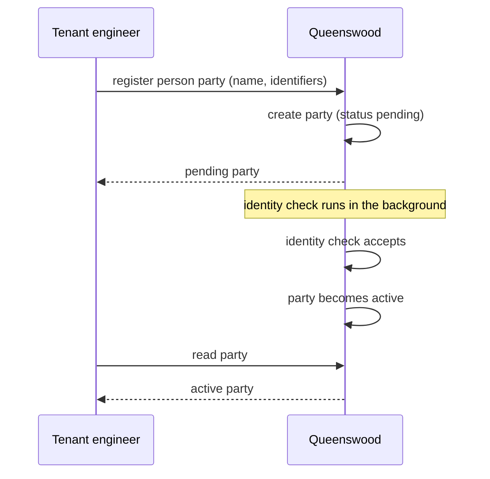
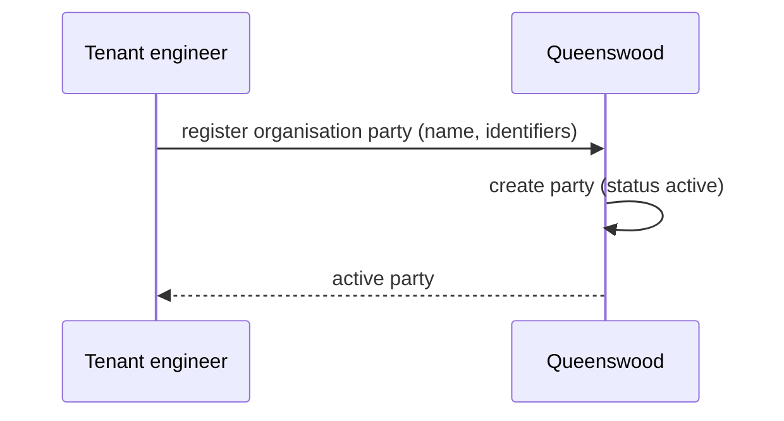
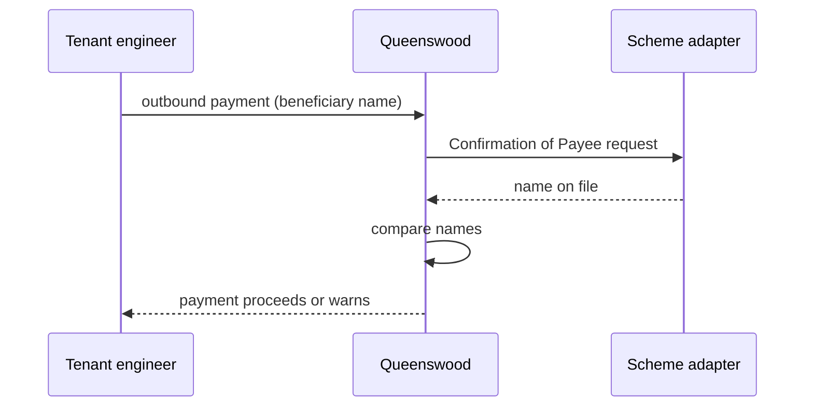

# Parties and identity

## Objective

Every account on the Queenswood platform belongs to a
**party** — a person, a non-person organisation, or an
internal bookkeeping identity. Tenants register parties
through the banking API; person parties pass identity
verification (IDV) before they can transact, while
organisation and internal parties become active immediately.
The party model is the *who* on both sides of every
movement of money.

## Users and stakeholders

**Tenant engineer.** Calls the banking API to register
parties on behalf of their end customers. Cares about: the
flow from creation to active being predictable, KYC failure
modes being legible, the active state being something they
can react to or poll for.

**End customer.** The natural human (or the business) on
whose behalf a party is registered. Doesn't interact with
Queenswood directly — they go through the tenant's
customer-facing surface — but their personal data ends up
in the party record.

**Platform admin / Queenswood operator.** Indirectly
involved. Operates the platform that runs IDV and stores PII;
needs the model to support the compliance posture the
platform takes on.

## Goals

- **Three party types in one model.** Person, organisation
  (non-person legal entity), and internal (the bank's own
  bookkeeping identities — settlement, fee P&L, suspense).
  One uniform party concept across all three; type
  discriminates lifecycle and KYC obligations.
- **KYC for persons.** Person parties carry identity
  verification before they can transact. Status starts
  pending; flips to active when IDV accepts. This is the
  KYC gate the platform enforces.
- **No KYC for non-persons.** Organisation and internal
  parties become active on creation. The platform doesn't
  carry per-organisation KYB or extra checks for internal
  bookkeeping identities.
- **Hands-off activation.** When a person party's identity
  verification completes, activation happens automatically.
  The tenant doesn't have to make a follow-up call to flip
  the status.
- **Identifier capture.** Parties can carry national
  identifiers (passport, NI number, etc.) and person
  identifications (given/family/middle names, demographics).
- **Soft name matching.** The platform offers a way to
  compare two name strings — match, close match, or no
  match. Used in Confirmation of Payee and other places
  where names need to line up without being identical.
- **Multi-tenant isolation.** Every party belongs to one
  tenant organisation. Tenants don't see each other's
  parties.

## Non-goals

- **Real identity verification provider.** The platform
  exposes the IDV concept and lifecycle, but doesn't ship a
  production-grade IDV integration. See Open questions.
- **Periodic re-verification.** Once active, a person party
  stays active. No periodic KYC refresh, no sanctions
  re-screening, no address-change-triggered re-verification.
- **Party suspension or closure.** Active is essentially
  terminal in the lifecycle today. A party flagged for fraud
  or sanctions has no status path away from active.
- **Party merging.** Two records for the same physical
  person — created in error, or arising from a duplicate —
  can't be merged.
- **PII encryption at rest.** Personal data is stored as
  plain fields. No field-level encryption or tokenisation.
- **National identifier validation.** The platform stores
  identifier type, value, and issuing country but doesn't
  validate that a "passport" value looks like a passport
  number. Caller-side discipline.
- **Vendor-grade name matching.** The platform's name
  comparison is deliberately simple. It isn't a
  fuzzy-matching library and isn't a Confirmation of Payee
  scoring engine.
- **A user model.** Parties are not users. The platform has
  no concept of the human triggering a request — see Open
  questions and [tdd/api-keys](../tdd/api-keys.md).
- **Know-your-business (KYB) for organisation parties.**
  Non-person parties activate on creation without
  beneficial-owner checks, sanctions screening, or
  registration-document capture.

## Functional scope

A tenant uses the banking API to register parties that hold
accounts and appear on transactions.

### Creating a party

The tenant uses the banking API to register a party,
supplying:

- The party type (person, organisation, internal).
- A display name.
- For person parties, person details (given name, family
  name, middle names, etc.).
- Optionally, one or more national identifiers (type,
  value, issuing country).

The call returns the created party with its identifier and
status. For organisation and internal parties, status is
active immediately. For person parties, status starts as
pending; activation follows once identity verification
completes.

### Identity verification (person parties)

When a person party is registered, the platform begins an
identity check in the background. The tenant doesn't wait
for it — the registration call returns straight away with a
pending party. Once the check completes, the party is
activated and is then ready to hold accounts and appear on
transactions. The tenant sees the new status the next time
they read the party.

### Identifiers

A party can carry zero or more national identifiers — one
per identifier type per party. Types include passport,
national insurance number, and others. The platform stores
the value and issuing country alongside the type.

Person parties also carry person details: given name, family
name, middle names, and other demographics.

### Name matching

The platform offers a way to compare two name strings and
return one of three outcomes:

- **Match** — the names are equivalent.
- **Close match** — the names look like they refer to the
  same person, allowing for middle names or abbreviations
  on either side.
- **No match** — they don't.

Used by Confirmation of Payee in the outbound payments flow,
and anywhere else a name needs to be compared with some
tolerance.

### Multi-tenant isolation

Every party record carries the tenant's organisation
identifier. Cross-tenant reads are not possible through the
banking API.

## User journeys

### 1. Tenant registers a person party

The tenant registers a person party for one of their
customers. The party starts as pending, the identity check
runs in the background, and the party becomes active. The
tenant sees the new status the next time they read the
party.

### 2. Tenant registers an organisation party

Non-person legal entities don't carry KYC. The party is
created active and is immediately usable — accounts can be
opened against it, payments can name it.

### 3. Internal bookkeeping party

The platform maintains internal parties for the bank's own
books — settlement, fee P&L, suspense, and so on. Tenants
don't typically register internal parties through the
banking API; they're seeded as part of the tenant's
bootstrap — see [onboarding](onboarding.md).

### 4. Confirmation of Payee on an outbound payment

The outbound payments flow compares the beneficiary name the
tenant submitted with the name returned by Confirmation of
Payee. The result shapes whether the payment proceeds,
warns, or is held — the policy belongs to payments, the
name comparison belongs here.

## Open questions

- **Real IDV provider integration.** Today IDV
  unconditionally auto-accepts. Production needs an
  integration with a real provider (Onfido, Persona,
  Veriff, ComplyAdvantage, Stripe Identity) or a
  configurable simulator base — in the spirit of the FPS
  scheme simulator. Until that lands, the platform is not
  enforcing real KYC.
- **IDV outcomes beyond accept.** Today the only outcome
  modelled is acceptance. Real IDV produces rejected,
  manual-review, expired, and partial outcomes. Each needs
  product semantics: what does the tenant see, what's the
  retry path, who's notified.
- **Periodic re-verification.** Compliance regimes
  increasingly require periodic re-KYC, sanctions
  re-screening, and re-verification on material change
  (address, name). No flow exists.
- **Party suspension and closure.** Active is essentially
  terminal. A flagged party can't be moved to a
  non-transacting state through the banking API. Real
  banking needs at least a suspended state.
- **Party merging.** Duplicate records for the same physical
  person can't be merged. Operationally a gap once any
  deduplication need arises.
- **PII at rest.** Personal data is stored unencrypted at
  the field level. Production would want tokenised storage
  or per-field encryption, depending on the regulator's
  view.
- **National identifier validation.** The platform doesn't
  enforce that a passport value looks like a passport
  number, or that a national insurance number is
  well-formed. Caller-side discipline today; a real product
  would validate per type and per issuing country.
- **Name-matching sophistication.** Token-set matching
  after lower-casing covers the bulk of cases but misses
  accent folding, transliteration, edit-distance fuzziness,
  and honorific stripping. Real CoP scoring tends to need
  vendor-grade libraries.
- **Know-your-business (KYB) for organisation parties.**
  Non-person parties activate on creation without
  beneficial-owner checks, sanctions screening, or
  registration-document capture. A real platform offering
  business banking needs KYB.
- **Party–user relationship.** Once a user model exists —
  see [tdd/api-keys](../tdd/api-keys.md) — the relationship
  between parties and users needs modelling. A user might
  act on behalf of a party, or be a party in self-service
  flows. Neither link exists today.

## References

- **Engineering view**: [tdd/parties](../tdd/parties.md)
  for the full data model, the verification flow, and the
  brick split.
- **Platform context**: [platform](platform.md);
  [onboarding](onboarding.md) — the tenant's own party is
  seeded here.
- **Adjacent capabilities**: [cash-accounts](cash-accounts.md)
  — accounts are owned by parties;
  [payments](payments.md) — payments name parties on both
  sides and use the name comparison.
- **Auth model evolution**: [tdd/api-keys](../tdd/api-keys.md)
  — Future direction, for the user-model gap that sits
  alongside parties.
