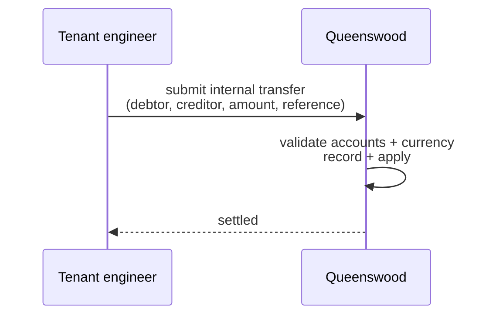
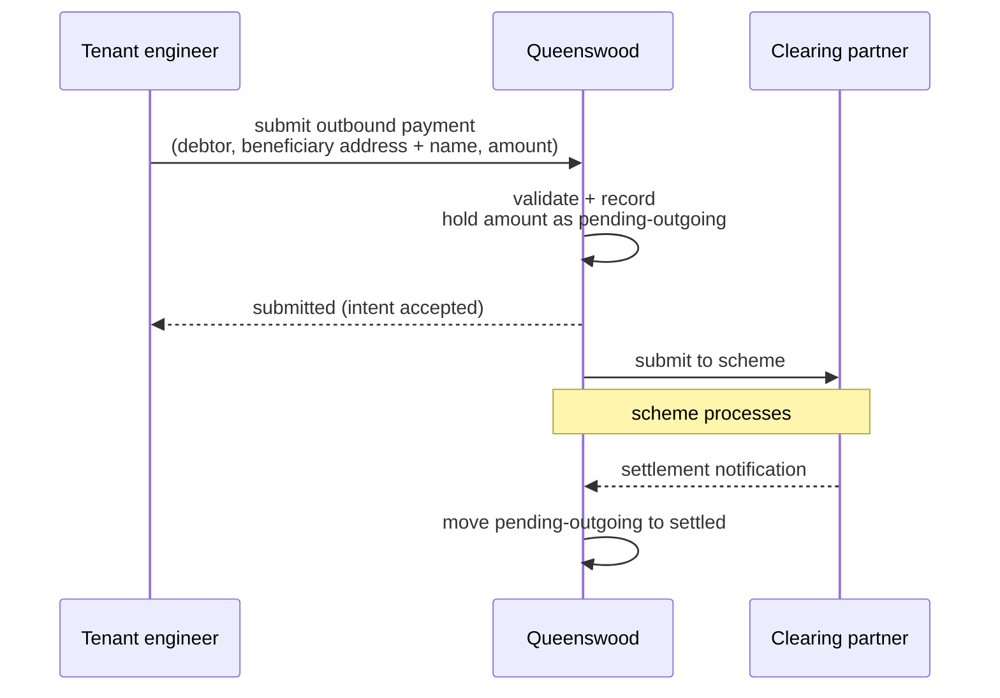
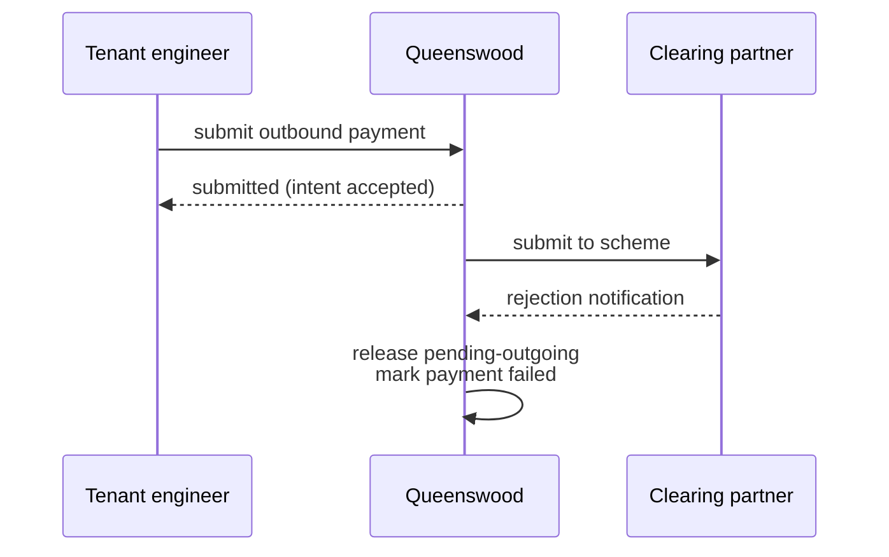
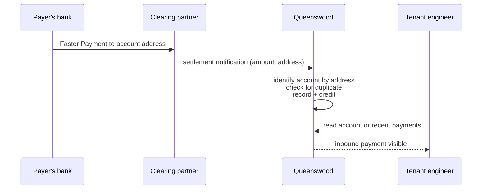
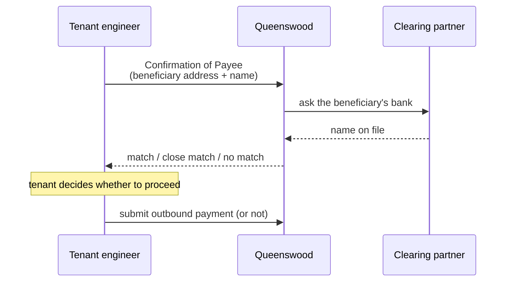
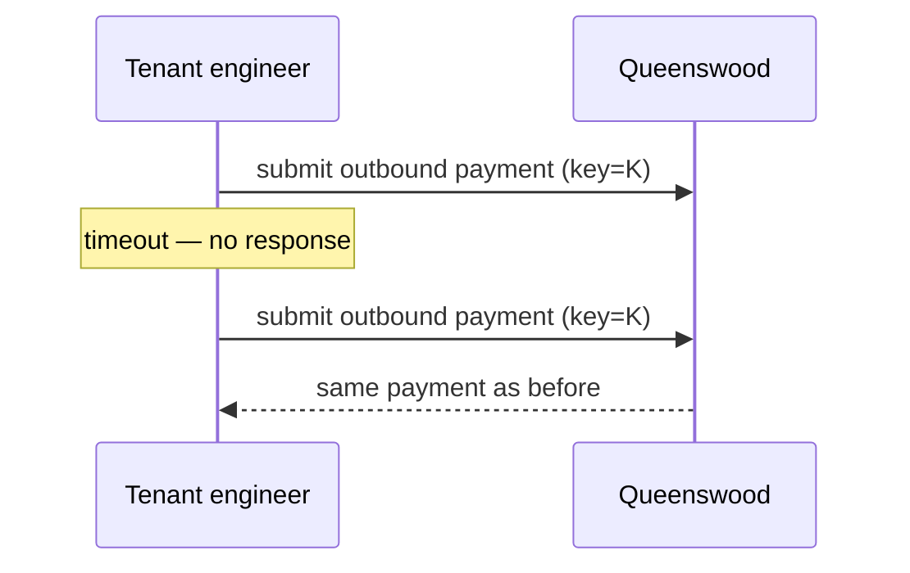

# Payments

## Objective

Queenswood moves money between accounts in three ways:
**internal** transfers between two accounts on the platform,
**outbound** payments leaving via UK Faster Payments, and
**inbound** payments arriving via the same scheme. Internal
transfers settle immediately. Outbound and inbound payments
are two-stage — the platform records the intent (or
receipt) first, then completes settlement once the scheme
confirms. Every payment is recorded against a transaction
on the account ledger, and is safe to re-submit without
double-processing.

## Users and stakeholders

**Tenant engineer.** Submits internal and outbound payments
on behalf of end customers, observes inbound payments
landing on customer accounts, and reconciles. Cares about:
the outbound flow being predictable (intent accepted now,
settlement confirmed shortly after), Confirmation of Payee
being available for outbound, idempotency being safe to
rely on for retries.

**End customer.** The party whose account is debited or
credited. Doesn't interact with the platform directly but
sees payments and balances through the tenant's surface.
Cares (implicitly) about: payments landing when expected,
the available balance reflecting in-flight outbound
payments, no double-debits or double-credits.

**Platform admin / Queenswood operator.** Operates the
scheme integration — the adapter that talks to the bank's
clearing partner for UK FPS, and the simulator that stands
in for it during development.

**Clearing partner.** The third party that fronts UK
Faster Payments for the platform. Receives outbound payment
submissions, sends settlement notifications, and forwards
inbound payments. Today the platform integrates with a
simulator standing in for a real partner.

## Goals

- **Three payment kinds in one surface.** Internal,
  outbound (UK FPS), and inbound (UK FPS). The tenant
  works with one consistent surface across all three.
- **Internal transfers settle now.** A transfer between
  two accounts on the platform is recorded and applied
  to both balances in one go. No pending state.
- **Outbound is two-stage.** When the tenant submits an
  outbound payment, the amount is immediately held in a
  *pending-outgoing* state on the debtor's account
  (visible in the available balance, unavailable for
  further spending). Settlement is recorded once the
  scheme confirms.
- **Inbound is two-stage too.** When an inbound payment
  arrives, the platform identifies the account by its UK
  payment address, records the receipt, and credits the
  balance. The tenant doesn't have to do anything to
  receive it.
- **Confirmation of Payee.** Outbound payments can be
  checked against the beneficiary's bank for name
  agreement before going out. The platform compares the
  submitted name to the name on file at the beneficiary's
  bank and reports match, close match, or no match, using
  the name comparison from [parties](parties.md).
- **Idempotent submission.** Submitting the same payment
  twice with the same idempotency key returns the same
  result without doing the work twice.
- **Idempotent inbound.** If the scheme retries a settlement
  notification (network blip, missed acknowledgement), the
  platform notices the duplicate and treats it as a no-op.
- **Audit trail.** Every payment links to a transaction on
  the ledger; the transaction is the source of truth for
  what moved between which accounts and when.
- **Multi-tenant isolation.** Every payment belongs to one
  tenant. Tenants don't see each other's payments.

## Non-goals

- **Cross-border payments.** No SEPA, no SWIFT, no
  international wires. UK Faster Payments is the only
  scheme today.
- **Cross-currency (FX) payments.** Both legs of every
  payment are in the same currency. No FX conversion at
  the platform level.
- **Payment cancellation after submission.** Once an
  outbound payment is submitted, the tenant can't recall
  it through the platform.
- **Schemes other than UK FPS.** No BACS, no CHAPS, no
  card rails. Faster Payments only.
- **Direct debits.** Only push payments. Pull payments
  (DDI / mandates) aren't supported.
- **Bulk payments / batch files.** Each payment is its
  own submission.
- **Scheduled or future-dated payments.** Submissions
  process now.
- **Recurring payments.** No standing orders.
- **Sweeps and auto-transfers.** No platform-managed rule
  that moves money between two accounts on a schedule.
- **Payments without a Queenswood account on the
  platform side.** At least one side of every payment is
  always an account on the platform.

## Functional scope

A tenant uses the banking API to submit internal and
outbound payments, and to read inbound payments that have
landed on its accounts.

### Internal transfer

The tenant supplies:

- The debtor account (the account paying out).
- The creditor account (the account receiving). Both
  accounts must belong to the same tenant.
- The amount, in the accounts' currency.
- A reference (a free-text label visible on both sides).
- An idempotency key.

The platform validates the inputs, records a transaction,
and applies the legs to both balances in one atomic step.
The reply confirms the transfer is settled. The end
customer sees the balance change immediately on both
accounts.

### Outbound payment

The tenant supplies:

- The debtor account.
- The beneficiary's UK payment address (sort code +
  account number).
- The beneficiary's name.
- The amount.
- A reference.
- An idempotency key.

Optionally, the tenant first asks the platform to perform
Confirmation of Payee — checking the submitted name
against the name on file at the beneficiary's bank.

The platform validates the inputs, records the payment as
*submitted*, and holds the amount in the *pending-outgoing*
state on the debtor's account. The available balance drops
straight away — the customer can't double-spend the held
amount. The reply confirms the intent has been accepted.

The platform then submits the payment to the scheme
through the clearing partner. Some moments later, the
scheme confirms settlement; the platform completes the
payment by moving the amount out of pending-outgoing and
marking the payment *settled*.

If the scheme rejects the payment, the platform marks it
*failed* and returns the held amount to the debtor's
available balance.

### Inbound payment

When a UK Faster Payment arrives at one of the platform's
sort code + account number addresses, the clearing partner
notifies the platform. The platform:

- Identifies the receiving account from the address.
- Checks that this isn't a duplicate of a notification
  already processed.
- Records the payment.
- Credits the receiving account.

The tenant doesn't have to do anything to receive an
inbound payment. They observe it by reading the account's
recent payments or by reading the inbound payment record
directly.

### Confirmation of Payee

Before an outbound payment is submitted, the tenant can
ask the platform to check the beneficiary's name against
the name on file at the beneficiary's bank. The platform
returns one of three outcomes:

- **Match** — the names agree.
- **Close match** — the names look like they refer to the
  same beneficiary, allowing for middle names or
  abbreviations.
- **No match** — the names don't agree.

The result is informational. The tenant decides what to
do with it — proceed, warn the customer, or hold the
payment.

### Idempotency

Every submission carries an idempotency key (an envelope
identifier). Submitting the same payment twice with the
same key returns the same result; the platform doesn't
debit the customer twice. The tenant is expected to use
the same key when retrying after a network failure or
timeout.

For inbound payments, the clearing partner's transaction
identifier serves as the equivalent. If the partner
re-sends a settlement notification, the platform treats
the duplicate as a no-op.

## User journeys

### 1. Internal transfer

Both accounts move in one step. The end customer sees the
balance change on both sides immediately.

### 2. Outbound payment (happy path)

The tenant gets a quick reply confirming the platform has
accepted the intent. The customer sees the available
balance drop right away. Once the scheme confirms, the
payment is fully settled and the held amount is gone from
the account.

### 3. Outbound payment (rejected by scheme)

The platform releases the held amount back to the available
balance and marks the payment failed. The tenant reads the
payment to see the failure.

### 4. Inbound payment

The platform handles inbound payments without any tenant
action. The tenant sees the payment when they next read
the account or its payments.

### 5. Confirmation of Payee before sending

The tenant uses the result to inform the end customer or
to decide whether to send.

### 6. Idempotent retry

If the tenant doesn't get a response — network blip,
gateway timeout — they can re-submit with the same
idempotency key. The platform returns the original
result; no duplicate payment is created.

## Open questions

- **Reconciling missed settlement notifications.** If the
  platform submits an outbound payment to the scheme but
  the settlement notification never arrives (clearing
  partner outage, network failure), the payment stays in
  *submitted* indefinitely. There's no sweeper that polls
  the partner to reconcile. A reconciliation flow is
  needed for production operation.
- **Outbound failure taxonomy.** The platform marks
  rejected payments *failed* but the depth of distinction
  (transient vs permanent, retry-eligible vs not) is
  shallower than the scheme's actual error model. A
  richer failure taxonomy would let the tenant make
  better retry decisions.
- **Payment cancellation / recall.** Once an outbound
  payment is submitted, the tenant can't recall it. UK
  FPS does have an indemnity-claim recall flow; the
  platform doesn't expose it.
- **Payment statuses for the end customer.** "Submitted",
  "settled", "failed" are the platform's vocabulary. The
  tenant's customer-facing surface may want richer states
  ("being processed", "received by recipient", "returned")
  that map onto these.
- **Bulk payments.** No way to submit a batch in one
  call. A tenant moving a salary file or a supplier run
  has to issue many submissions.
- **Scheduled / future-dated payments.** No way to ask
  the platform to send a payment at a future date.
- **Recurring payments.** No standing-order capability.
- **Direct debits.** No DDI / mandate flow. Only push
  payments today.
- **Schemes beyond UK FPS.** BACS, CHAPS, SEPA, SWIFT
  — none of these are wired. Each would need its own
  scheme integration.
- **Cross-currency.** Payments are single-currency end
  to end. Cross-currency payments would need explicit
  FX handling, both inside the platform and at the
  scheme boundary.
- **Settlement-time skew.** The platform trusts the
  clearing partner's ordering of settlement notifications.
  If notifications were ever delivered out of scheme
  order, downstream invariants might be affected.
- **The clearing-partner integration is approximate
  today.** A simulator stands in for the production
  partner. The simulator covers the happy path and a
  small set of named rejection scenarios; production
  edge cases (partial scheme acceptance, retry storms,
  malformed notifications) aren't covered.
- **Confirmation of Payee placement.** CoP currently
  lives in the scheme adapter. Whether it stays there or
  moves into the payment surface is an open structural
  question.

## References

- **Engineering view**: [tdd/payments](../tdd/payments.md)
  for the data model, the choreography between the
  payment processor, the scheme adapter, and the event
  processor, and the simulator's coverage.
- **Platform context**: [platform](platform.md);
  [cash-accounts](cash-accounts.md) — payments move
  money between accounts;
  [parties](parties.md) — parties name both sides of a
  payment, and the name comparison powers Confirmation
  of Payee.
- **Adjacent capabilities**: [interest](interest.md) —
  interest postings are recorded as their own kind of
  ledger movement, distinct from payments;
  [policies](policies.md) — capabilities and limits can
  bound which payments a tenant can submit, and when.
- **Engineering depth**:
  [tdd/transaction-processing](../tdd/transaction-processing.md)
  for the command-and-event substrate;
  [tdd/transactions-and-balances](../tdd/transactions-and-balances.md)
  for the double-entry posting model that sits under
  every payment;
  [tdd/idempotency](../tdd/idempotency.md) for the
  proposed unified idempotency model.
