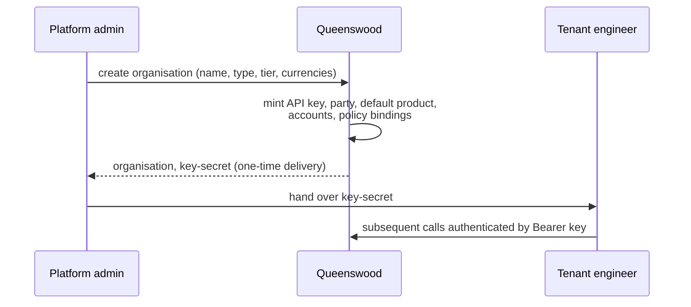
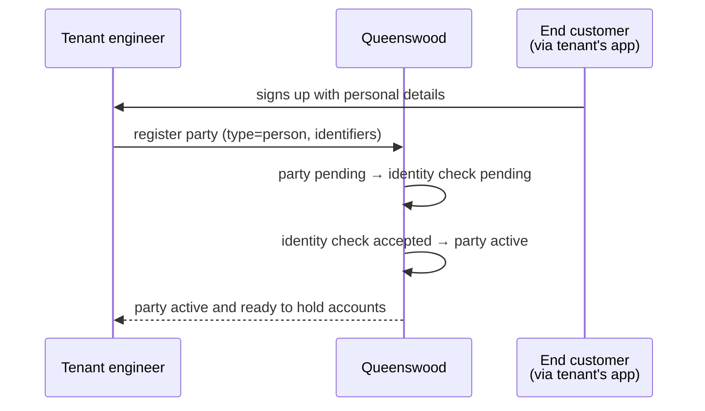
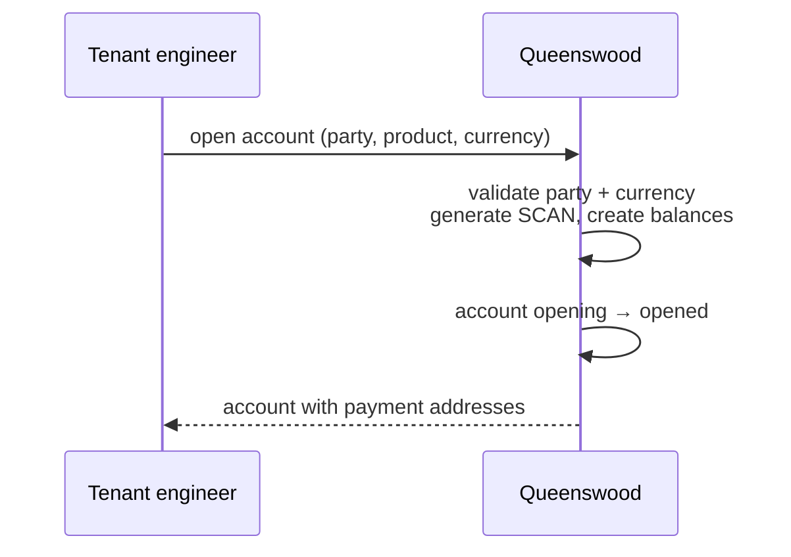
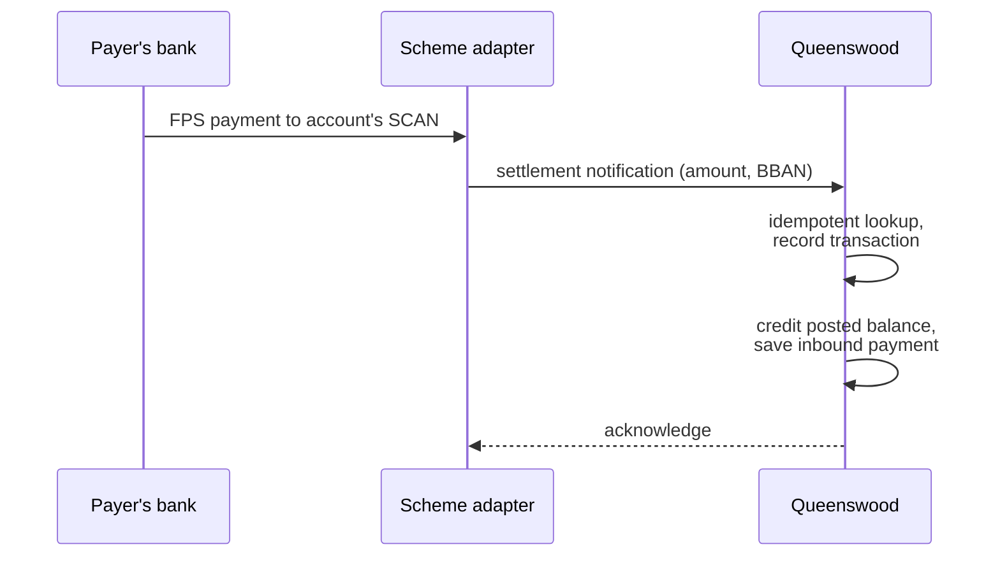
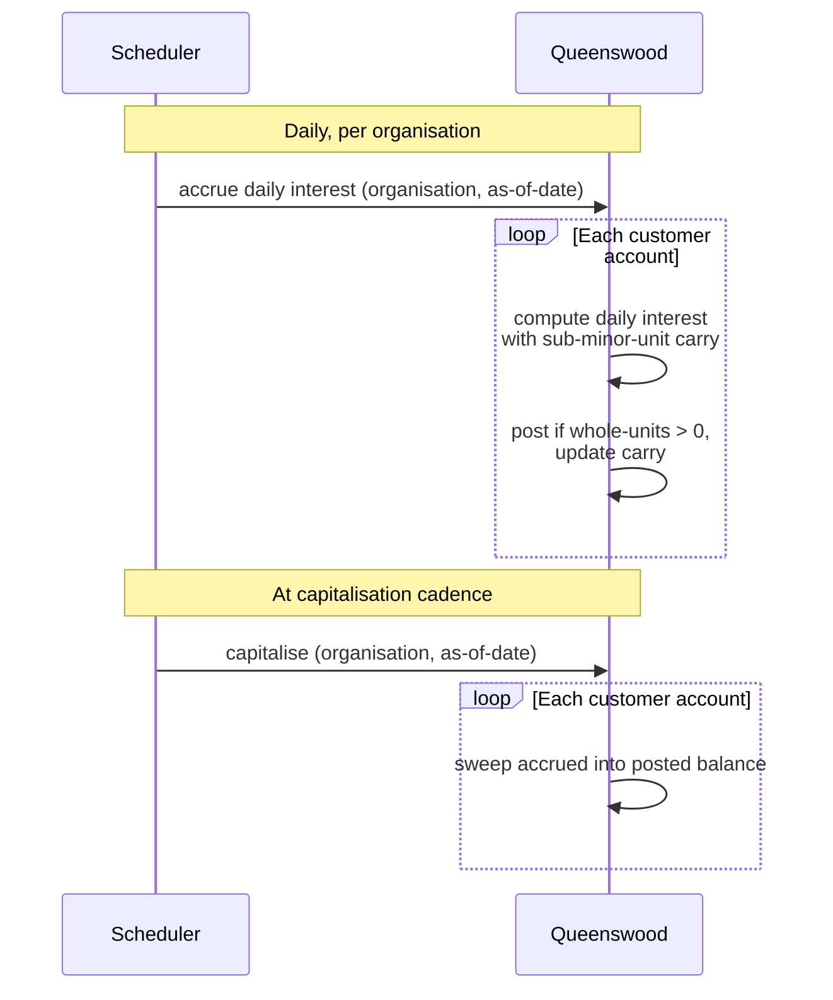

# Platform

## Objective

Queenswood is a multi-tenant banking platform. A fintech can
integrate against one OpenAPI 3.x compliant API to offer their
customers UK current/savings/term-deposit accounts, internal
transfers, UK Faster Payments (inbound and outbound), and
interest accrual with operator-scheduled capitalisation.
Tenants are isolated by organisation, the rules that govern
them are configured via policies, and identity verification is
part of customer onboarding.

This PRD names the platform as a whole — what it offers, who
it serves, and what's deliberately out of scope. Per-capability
PRDs go deep on individual product surfaces.

## Users and stakeholders

Three roles.

**Tenant engineer / fintech product team.** The primary user.
Integrates the Queenswood API into a banking-product backend.
Cares about: contract clarity, OpenAPI fidelity, policy
customisation, idempotency guarantees, error handling.

**End customer.** The human or business holding accounts
through a tenant's product. Interacts with Queenswood
indirectly via the tenant's customer-facing app. Cares about:
balance visibility, payment correctness, interest accrual,
trust.

**Platform admin / Queenswood operator.** Runs the platform
itself — mints tenants, configures platform-level policies,
operates the infrastructure. Today this is a single-operator
role; Queenswood is a research-grade platform, not a
production SaaS.

## Goals

What Queenswood delivers.

- **A single unified banking API.** One OpenAPI 3.x compliant
  surface covering organisations, parties, products, accounts,
  payments, balances, transactions, and policies. No
  microservices to glue together.
- **Multi-tenant isolation.** Every record carries an
  organisation identifier. Tenants don't see each other's
  data.
- **Customer onboarding with KYC.** Parties go through an
  identity-verification flow before they can transact.
- **Cash account products as versioned templates.** Tenants
  define their own products (currency, interest rate, allowed
  payment-address schemes, balance-bucket layout) and publish
  versioned releases. Existing accounts stay on the version
  they were opened under.
- **Cash account lifecycle.** Open and close today; suspend
  and reopen are vocabulary-ready but not yet wired. UK SCAN
  payment addresses (sort code + account number) assigned at
  open.
- **Internal transfers** between two accounts of the same
  tenant. Settle immediately.
- **UK Faster Payments.** Inbound and outbound, via a
  pluggable scheme adapter (a simulator base today; a
  clearing-bank partner adapter as the production target).
- **Interest accrual.** Daily accrual on posted balances with
  sub-minor-unit fractional carry; capitalisation at any
  cadence the operator schedules (daily, weekly, monthly,
  quarterly — the cadence is a product choice, not a
  platform constraint).
- **Policy-based authorization.** Capabilities (allow / deny
  actions) and limits (count or amount, with optional
  curative permits) as data, scoped to tenants via bindings.
  Tenants customise rules without code changes.
- **Audit trail through the transaction ledger.** Every
  movement of money is recorded with idempotency keys,
  timestamps, and references back to the originating
  intent.

## Non-goals

What Queenswood deliberately does not provide.

- **Card issuing or acquiring.** No virtual or physical
  cards; no merchant terminals.
- **Lending products.** No credit, overdrafts, mortgages, or
  buy-now-pay-later.
- **Investment products.** No stocks, bonds, funds, managed
  portfolios.
- **Cryptocurrency.** Not in scope.
- **Cross-border or multi-scheme payments.** UK Faster
  Payments is the only scheme today. No SEPA, SWIFT, or
  international wires.
- **A consumer surface.** Queenswood doesn't ship a customer
  app or end-user admin UI; that's the tenant's product.
- **Production hosting / SaaS offering.** Queenswood is a
  research-grade platform. A prospective tenant would
  self-deploy and integrate; there's no managed SaaS to sign
  up to.
- **Banking license.** Queenswood doesn't hold one.
  Production use as an actual bank would require legal and
  regulatory work outside this codebase.
- **Real-time fraud monitoring.** Policy denials are
  available; behavioural fraud detection isn't.
- **Regulatory or tax reporting frameworks.** No built-in
  reporting for AML, FATCA, CRS, etc.

## Functional scope

The platform is delivered through seven capabilities, each
covered by its own PRD.

- **Onboarding** — multi-tenant tenancy creation:
  organisation setup, API key issuance, default product and
  bookkeeping accounts bootstrapped in one transaction.
  Forthcoming PRD: [onboarding](onboarding.md).
- **Parties and identity** — customer registration with
  national identifiers and person identifications; identity
  verification that activates a person party for transacting.
  Forthcoming PRD: [parties](parties.md).
- **Cash account products** — versioned product templates
  defining account terms. Drafts mutable; published versions
  immutable. Forthcoming PRD:
  [cash-account-products](cash-account-products.md).
- **Cash accounts** — accounts opened against a published
  product version, owned by an active party, in a chosen
  currency, with payment addresses. Forthcoming PRD:
  [cash-accounts](cash-accounts.md).
- **Payments** — internal transfers (instant), inbound UK
  Faster Payments (settlement notification from the scheme),
  outbound UK Faster Payments (submission via scheme
  adapter). All idempotent on re-submission. Forthcoming
  PRD: [payments](payments.md).
- **Interest** — daily accrual with fractional carry;
  capitalisation at the operator's chosen cadence.
  Forthcoming PRD: [interest](interest.md).
- **Authorization and policies** — capabilities and limits as
  data, bindings scoped to tenants. Curative permits let a
  customer self-correct out of breach. Forthcoming PRD:
  [policies](policies.md).

## User journeys

Five flows give a feel for how the platform is used end to
end.

### 1. Tenant onboarding

A platform admin creates a tenant in one operation. The
tenant gets a complete starting state: their organisation, an
API key (delivered once), a settlement product, settlement
accounts in each requested currency, and policy bindings for
their tier.

### 2. Customer onboarding

Person parties go through identity verification before they
can transact. The check runs in the background; the tenant
sees the active status the next time they read the party.

### 3. Account opening

An account is opened against a published product version,
inheriting the version's terms (interest rate, balance-bucket
shape, allowed schemes). The SCAN address is generated at open
time and stays for the account's life.

### 4. Money in (inbound Faster Payments)

Inbound payments arrive as settlement notifications from
the scheme adapter. The bank looks up the account by BBAN,
ignores duplicates of the same scheme transaction, and
credits the posted balance.

### 5. Interest earning

The operator schedules daily accrual and chooses a
capitalisation cadence. Daily capitalisation produces
daily-compounded interest; monthly produces monthly-compounded.
The math is integer arithmetic with fractional carry between
days, so no pennies are lost over time.

## Open questions

Things deliberately left unresolved or future work.

- **Real identity-verification provider.** The IDV flow today
  auto-accepts; production use needs a real provider
  integration or a configurable simulator base.
- **Real scheme adapter.** UK FPS settlement is wired through
  a simulator today; the production target is a clearing-bank
  partner with scheme API access. The architecture is
  pluggable; the production integration isn't yet deployed.
- **User model.** Today every authenticated request resolves
  to an organisation, not a user. End-customer-attributable
  audit ("which human did this?") needs a user model
  alongside the organisation model. Likely paired with a
  customer-supplied OIDC identity provider for end-user
  authentication. See
  [tdd/api-keys](../tdd/api-keys.md) — Future direction —
  for the auth-model evolution.
- **Multi-currency rate support.** A product version carries
  a single interest rate; multi-currency products earning
  different rates per currency would need rate-per-currency.
- **Tier transitions and status changes.** Tenants are
  created with a tier label that binds tier-specific
  policies; today there's no flow to move a tenant between
  tiers post-creation, nor between live and test status.
- **Suspension, reopening, dormancy.** Cash account
  lifecycle today is open → close. Suspend, reopen, and
  dormant flows aren't wired, despite the policy vocabulary
  hinting at them. Real banking needs the full lifecycle.
- **Production deployment story.** Queenswood as a research
  platform doesn't address whether it would be offered as
  SaaS, on-prem appliance, self-hosted-by-tenant, or
  something else. The deployment model affects isolation
  guarantees, operational ownership, and pricing.
- **Regulatory framework.** Queenswood doesn't hold a
  banking license. Production use as an actual bank would
  require legal and regulatory work — sponsor-bank
  relationships, AML / CTF compliance, FCA authorisation,
  deposit guarantee scheme membership, regulatory reporting
  — outside the scope of this codebase.

## References

- **Per-capability PRDs** (forthcoming):
  [onboarding](onboarding.md), [parties](parties.md),
  [cash-account-products](cash-account-products.md),
  [cash-accounts](cash-accounts.md), [payments](payments.md),
  [interest](interest.md), [policies](policies.md).
- **Engineering view** — the corresponding TDDs at
  [docs/tdd/](../tdd/) describe how these capabilities are
  built.
- **Architecture decisions** — [docs/adr/](../adr/) for the
  load-bearing engineering choices (single unified API,
  multi-tenant model, FoundationDB substrate, anomaly-based
  error handling, system-as-data, and others).
