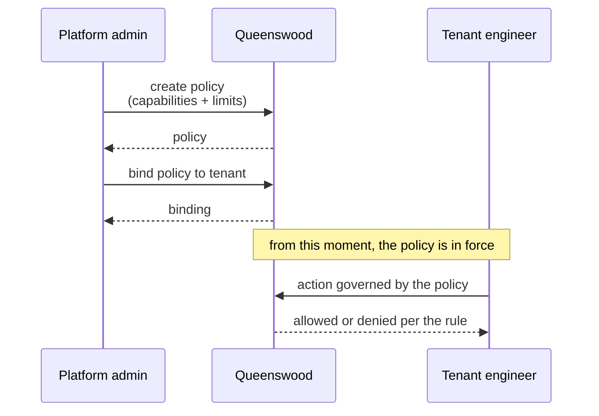
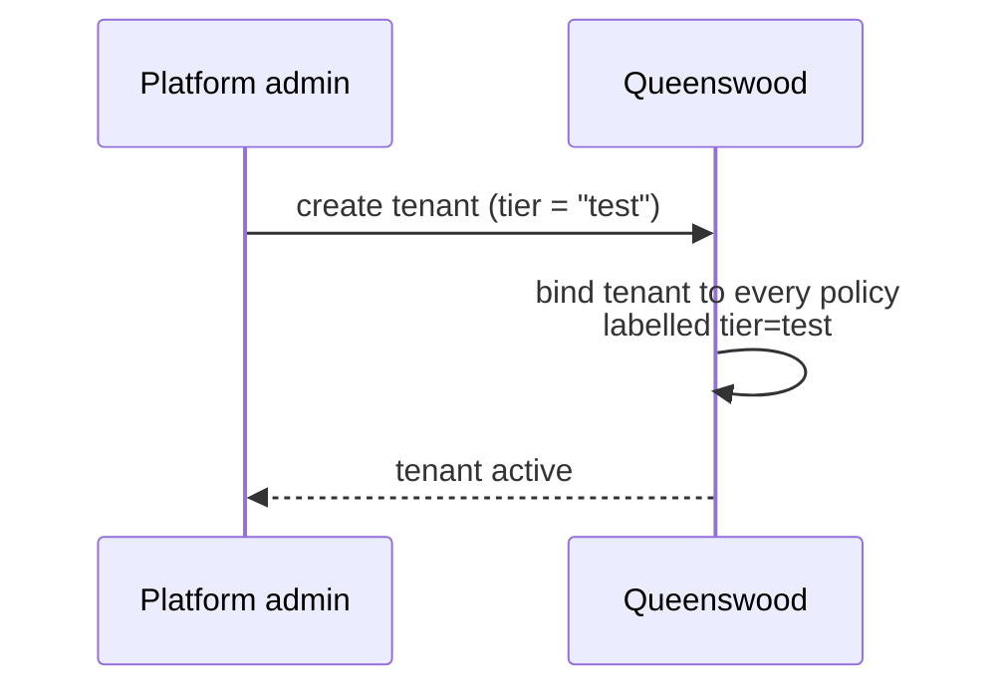

# Policies

## Objective

Banking is full of rules: what a tenant is allowed to do,
which kinds of accounts a customer can open, how many
payments can move on what cadence, what limits apply to
balances and transfers. Queenswood treats these rules as
**data** — every rule is a record the platform stores,
edits, and evaluates the same way. Two kinds of rule cover
every check: **capabilities** (is this action allowed?)
and **limits** (is this count or amount within bounds?).
Rules are linked to the targets they apply to via
**bindings**, so a small set of reusable policies can be
composed into the rule set that governs each tenant.

## Users and stakeholders

**Platform admin / Queenswood operator.** The author of
policies. Decides which capabilities tenants get and which
limits apply to them, packages those decisions into
policies, and binds the policies to tenants (or tenant
groups). Cares about: the rule set being legible and
editable, the deny outcome being explicit, the audit
trail of who has what.

**Tenant engineer.** Sees the *effects* of policies —
calls to the banking API succeed or are denied based on
the rules in force for their tenant. Cares about: the
denial reason being clear enough to act on, the limits in
force matching what they expect from the tier they signed
up under.

**Compliance / risk function.** Reviews the rule set in
force. Cares about: the rules being centrally listable
and inspectable, changes being observable, the policy
catalogue not silently drifting.

**End customer.** Doesn't see policies directly, but
experiences them through the tenant's surface — an
attempted payment that exceeds a limit, an account type
that isn't available. Cares about: clear feedback when a
limit bites, and (where applicable) the *curative
permit* pattern that lets them correct out of breach
without being locked out.

## Goals

- **Rules as data.** Every rule the platform enforces is
  a record — listable, editable, pausable. No rule is
  baked into code.
- **Two rule shapes cover everything.** A *capability*
  asks "is this kind of action allowed?" — answered with
  allow or deny. A *limit* asks "is this aggregate
  (count or amount) within bounds?" — answered with
  permitted or breached.
- **Composable.** Rules live in **policies**; policies
  attach to targets via **bindings**. A tenant's rule
  set is the union of every policy bound to them. Adding
  a constraint is adding a policy and a binding.
- **Pausable.** A policy carries an *enabled* flag. A
  policy can be turned off without deleting it. Disabled
  policies are skipped during evaluation.
- **Tier labelling.** Policies carry labels (e.g. a tier
  label). At tenant onboarding, the tenant is bound to
  the bundle of policies sharing the requested tier
  label. Different tiers ship with different rule sets.
- **Deny wins.** Within a tenant's rule set, an explicit
  deny overrides every allow in scope. The default in the
  absence of any matching rule is denial — the platform
  is positive, not permissive.
- **Curative permits.** A limit can be marked
  *curative*: a request that would breach the limit is
  permitted when the customer's pre-state already
  breaches and the post-state is no worse. This lets a
  customer correct themselves out of breach without
  needing manual intervention.
- **Centralised evaluation.** Every domain calls the
  same evaluator with a consistent shape. No domain
  implements its own rule logic.
- **Audit trail.** Denials carry a human-readable reason.
  The rule set in force at any moment is inspectable.
- **Multi-tenant isolation.** A tenant sees only the
  rules that bind to it. Tenants don't see each other's
  policies.

## Non-goals

- **Self-service policy editing by tenants.** Tenants
  don't author or edit their own policies. Operator-
  authored only.
- **Per-end-customer policies.** Rules apply at tenant
  scope (and below — by product type, account type, and
  similar). They don't target individual end customers.
- **A general-purpose rules language.** The platform
  supports two rule shapes (capabilities and limits)
  with a fixed set of action kinds. There's no
  expression language, no scripting hook.
- **External policy engine.** The evaluator runs in the
  platform itself — no Open Policy Agent, no Cerbos, no
  remote rules service.
- **Per-binding override of deny.** When a deny matches,
  it wins. Authors can't write "this binding overrides
  that other binding's deny."
- **Curative permits for capabilities.** The curative
  pattern only applies to limits (which are quantitative).
  Capabilities are allow/deny without a "less bad"
  notion.
- **Policy versioning at evaluation time.** A policy
  edit takes effect for the next evaluation. There is no
  "evaluate against the version that was current at
  request-time" mode.
- **Policy simulation / dry-run.** No "would this
  request pass against this rule set?" surface for
  testing or audit without actually running the request.
- **Tenant-supplied rule data at runtime.** Tenants
  don't pass rule data in their requests. The rule set
  is whatever's bound to them at the moment of the call.

## Functional scope

The platform exposes policies and bindings as records
through the banking API. Operators author and bind them;
the platform evaluates them on every domain action that
needs an authorisation or limit check.

### Policies

A **policy** is a unit of rules. It carries:

- A list of **capabilities** — each capability declares
  an action (e.g. "open account", "draft product",
  "submit outbound payment"), an *effect* (allow or
  deny), and an optional set of *filters* that narrow
  when the rule applies (e.g. by account type, by
  product type).
- A list of **limits** — each limit declares an action,
  an *aggregate* (a count or an amount), a *window*
  (instant, daily, weekly, monthly, rolling), and a
  *bound* (a maximum, a minimum, or a range), plus an
  *allow mode* (strict or curative).
- An *enabled* flag — true by default; setting it to
  false pauses the policy without deleting it.
- A set of **labels** — keyword-keyed, used for
  grouping (e.g. tier labels).

A policy is read, listed, edited, and paused through the
banking API.

### Bindings

A **binding** links a policy to one or more targets. Its
selectors describe the target — for example, a tenant
organisation. Multiple bindings to the same target
compose: a tenant's effective rule set is the union of
every policy bound to that tenant.

### Capabilities

A capability rule answers "is this kind of action
allowed?". The action is one of a fixed set the platform
recognises:

- Open or close a cash account.
- Draft, update, publish a cash account product.
- Register a party.
- Submit an internal, outbound, or inbound payment.
- (And so on — every domain operation that needs
  authorisation.)

The rule's filters narrow when it applies. A capability
might apply only to "personal current accounts in GBP",
for instance. When the platform evaluates a capability
check, it looks at the tenant's effective rule set,
finds the rules whose action and filters match the
request, and decides:

- If any matching rule denies → the action is denied.
- If any matching rule allows → the action is allowed.
- Otherwise → the action is denied (the default).

Deny wins. Default is deny.

### Limits

A limit rule answers "is this count or amount within
bounds?". The request describes the action, the
aggregate (count or amount), the window over which the
aggregate is computed (instant, daily, weekly, monthly,
rolling), and the value to check.

Examples:

- *Count, instant*: "at most 100,000 cash accounts per
  tenant".
- *Count, instant*: "at most 10 personal GBP current
  accounts per tenant".
- *Amount, daily*: "at most £100,000 in outbound
  payments per day".

A limit can be *strict* — any breach is rejected — or
*curative*. The curative mode is the platform's answer
to a real banking situation: a customer is already in
breach and wants to correct themselves.

### Curative permits

A curative limit permits a request that would breach the
bound, provided the customer's pre-state already
breaches and the post-state is no worse than the
pre-state.

Example: a savings account has a minimum balance limit
of £0 (no overdraft). Through some prior event the
account is at -£100 (overdrawn). An inbound transfer of
£50 brings the balance to -£50. Strictly, -£50 is still
below the minimum. With a curative limit, the platform
recognises that the pre-state was already in breach and
the post-state is better, so it permits the corrective
inbound transfer. Without this, the customer would be
locked out of the very transaction that fixes their
situation.

### Tiers and onboarding

At [onboarding](onboarding.md), the tenant is created
with a tier label. The platform binds the tenant to
every policy whose label matches the requested tier.
Different tiers ship with different rule sets — a "test"
tier might allow only a small number of accounts and
modest payment amounts; a "production" tier might
allow more.

The tier choice is permanent for the tenant. There is no
flow today to move a tenant between tiers.

### How domains use policies

Every domain action that needs authorisation or a limit
check calls the platform's policy evaluator with the
relevant action and filters. If the rule set denies or
the limit breaches, the call to the banking API is
rejected with a clear reason; if it permits, the
operation continues.

The tenant doesn't have to do anything to "opt in" to
policies — every operation goes through the evaluator
automatically.

### Evaluation outcomes

A denied capability or breached limit comes back through
the banking API as an authorisation error with a
human-readable reason. The tenant can then surface the
reason to their end customer, or take action themselves
(e.g. archive accounts to come below a count limit).

## User journeys

### 1. Operator authors a policy and binds it to a tenant



The operator authors a policy with the rules they want to
enforce, then binds it to the tenant. From that moment,
the tenant's actions are evaluated against the new rule
in addition to whatever was already bound.

### 2. Tenant hits a count limit

```mermaid
sequenceDiagram
    participant T as Tenant engineer
    participant Q as Queenswood

    Note over T,Q: tenant has 9,999 accounts;<br/>limit is 10,000
    T->>Q: open one more account
    Q->>Q: check capability + limit
    Q-->>T: allowed (now at 10,000)
    T->>Q: open another account
    Q->>Q: check capability + limit
    Q-->>T: denied (would be 10,001;<br/>over the per-tenant cap)
```

The tenant runs into the limit on the next request after
saturating it. The denial reason names the limit that
bit.

### 3. End customer corrects out of breach (curative permit)

```mermaid
sequenceDiagram
    participant E as End customer
    participant T as Tenant
    participant Q as Queenswood

    Note over E,Q: account at -£100;<br/>min balance limit £0 (curative)
    E->>T: deposits £50
    T->>Q: submit inbound transfer (£50)
    Q->>Q: check limit:<br/>pre=-£100 (breach), post=-£50 (better)
    Q-->>T: permitted (curative)
    Note over E,Q: balance now -£50;<br/>still in breach but improving
```

The customer's deposit is permitted because it improves
their position, even though it doesn't fully cure the
breach. Without the curative permit, the deposit would
be rejected and the customer would have no clean path
back into compliance.

### 4. Operator pauses a policy temporarily

```mermaid
sequenceDiagram
    participant O as Platform admin
    participant Q as Queenswood

    O->>Q: read policy
    Q-->>O: enabled = true
    O->>Q: update policy (enabled = false)
    Q-->>O: paused
    Note over O,Q: policy is no longer evaluated;<br/>everything else still applies
    Note over O,Q: later
    O->>Q: update policy (enabled = true)
    Q-->>O: re-enabled
```

Pausing is a non-destructive way to take a rule out of
play — for an incident, a migration, or a planned change
window. The policy stays in the catalogue and can be
re-enabled at any time.

### 5. Tenant onboarding picks up the tier's policy bundle



At onboarding, the tier label drives which bundle of
policies the tenant inherits. The choice is part of the
single onboarding call — see [onboarding](onboarding.md).

## Open questions

- **Per-target binding resolution.** The data model
  supports fine-grained "this policy binds only to this
  tenant's accounts of type X" bindings, but the
  resolver isn't fully there yet. Today binding tends
  to happen at tenant scope; finer-grained selectors
  are partial.
- **Per-binding override of deny.** Deny wins globally.
  If two policies bind to the same tenant and one denies
  while the other allows, the deny wins — there's no
  way for a binding to override that. If "this binding
  overrides that other binding's deny" becomes a real
  need, the rule combinator vocabulary needs extending.
- **Capability curative equivalent.** The curative
  permit is limit-only. Capabilities are inherently
  allow/deny. Whether there's a useful "curative
  capability" notion is an open question; today it
  doesn't exist.
- **Policy simulation / dry-run.** "Would this request
  pass against this rule set?" without actually running
  the request would help operators and tenants debug
  unexpected denials. Not exposed today.
- **Policy versioning at evaluation time.** A policy
  edit takes effect immediately for any subsequent
  evaluation. There's no "evaluate against the policy
  version that was current when the request was made"
  mode. For audit attribution this matters.
- **Richer audit attribution on denials.** A denial
  comes back with a human-readable reason. It doesn't
  carry the specific policy and clause that triggered
  the denial — useful for root-cause analysis. A future
  enrichment could include the policy and clause
  references.
- **Tier transitions post-creation.** A tenant's tier is
  set at onboarding and stays there. There's no flow to
  move a tenant between tiers (which would re-bind the
  policy set).
- **Self-service rule editing for tenants.** Today
  tenants can't author or edit policies. Operator-
  mediated only. A future product would likely give
  tenants a sandboxed slice of the rule set they can
  edit themselves.
- **Cross-tenant policy reuse.** Each policy is
  authored once and bound to many tenants. There's no
  inheritance, templating, or override flow that would
  let a tenant get the standard bundle "plus a few
  tweaks" without authoring duplicates.
- **In-process evaluation only.** The evaluator runs
  inside the platform. No remote evaluation service, no
  federated rule store. Acceptable for current scale;
  would need rethinking at higher tenancy.
- **Policy retirement and archival.** No flow to
  formally retire a policy that's no longer bound to
  anything. Operators can disable and leave it; there's
  no "archived" state with cleanup semantics.

## References

- **Engineering view**: [tdd/policy-evaluation](../tdd/policy-evaluation.md)
  for the data model, the matching engine that's
  shared between capabilities and limits, the curative-
  permit semantics, and the contract domains use to
  call the evaluator.
- **Platform context**: [platform](platform.md);
  [onboarding](onboarding.md) — tier labels and the
  initial policy binding.
- **Adjacent capabilities**: every other capability —
  [parties](parties.md), [cash-account-products](cash-account-products.md),
  [cash-accounts](cash-accounts.md), [payments](payments.md),
  [interest](interest.md) — calls the policy evaluator
  on its load-bearing actions.
- **Engineering depth**:
  [tdd/transaction-processing](../tdd/transaction-processing.md)
  — policy checks thread through the same command
  pipeline that every domain action runs on.
