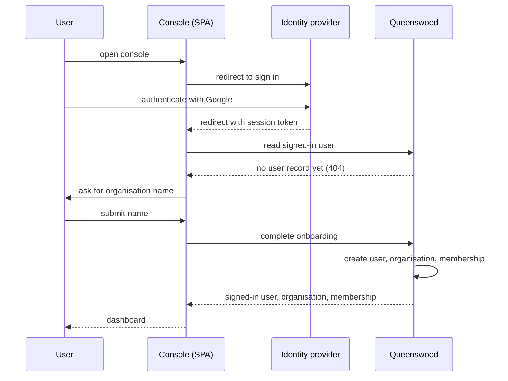
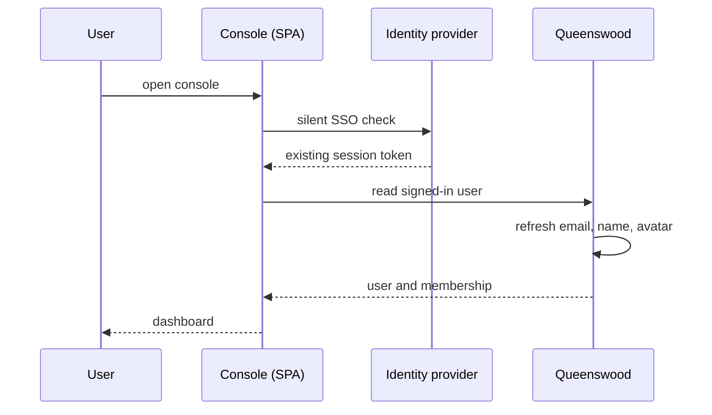
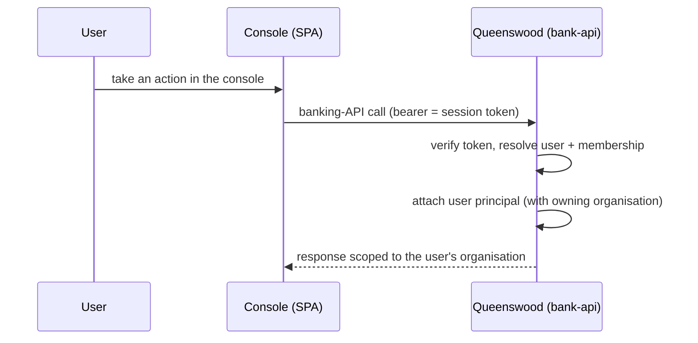

# Users

## Objective

The Queenswood platform now has a notion of a **user** — a human
who signs in to the management console and becomes the actor
behind their organisation's API calls. Users sign in with
Google; the act of first sign-in atomically creates a user
record, a new tenant organisation, and an owner membership
linking the two. From that point on, every console request the
user makes is attributable to them by identity, not just by
shared API key.

Users sit on the **platform-identity** side of the model, kept
strictly separate from the banking domain (parties, accounts,
payments). A user never appears on a payment message; a party
never logs in.

## Users and stakeholders

**End user.** The human signing in. Today, an engineer or
operator at a tenant fintech who wants to provision their
organisation and explore the banking API. Cares about the
sign-in feeling like every other modern SaaS, their email and
name being remembered across sessions, and the management
console showing them only what their organisation can see.

**Tenant organisation.** The entity the user owns once
onboarding completes. The console scopes everything by
organisation, so the user's first task — naming their org —
also fixes the multi-tenant boundary their subsequent work
lives inside.

**Platform admin / Queenswood operator.** Sees users as the
human counterpart of the existing service-account credentials.
Operators sign in to the `bank-app` SPA against the
`queenswood-ops` realm; users are how non-operator humans get
in to the org-facing `bank-console`.

## Goals

- **One identity per human.** A given Google account resolves
  to the same user on every sign-in. Email, name, and avatar
  refresh from the identity provider on each sign-in; the
  user's identifier and creation time do not.
- **Sign-in creates everything needed.** The first time a
  user signs in and names an organisation, the platform
  provisions their tenant organisation and binds them as the
  owner — no follow-up calls, no operator hand-off.
- **Federation, not local accounts.** Queenswood doesn't
  store passwords. Identity is delegated to an external
  provider (Google today; the model is built to absorb others
  later). The platform stores the federated subject identifier
  and uses it as the stable lookup key.
- **Email is informational.** The platform records the
  user's email and refreshes it on re-sign-in, but uses the
  federated subject — not the email — as the identity key.
  Changing email at the provider doesn't fork the user.
- **Strict separation from the banking domain.** Users live
  alongside parties, not as parties. A user-shaped record never
  ends up in an ISO 20022 payment; a party-shaped record never
  authenticates.
- **Token attribution.** Every API call originating from a
  signed-in user carries enough principal context for downstream
  authorisation and audit — the user identifier, the federated
  subject, and the active membership.

## Non-goals

- **Local password accounts.** The platform doesn't operate
  its own credential store, password reset, MFA enrolment, or
  account-lockout machinery. The federated provider owns all
  of that.
- **Identity providers beyond Google.** GitHub and password
  identity-provider values are reserved in the data model for
  later, but only Google federation is wired today.
- **User invitations.** The platform doesn't yet support an
  existing organisation inviting a second user. The MVP is a
  single user per organisation — the human who created it. See
  Open questions for the invitation path.
- **Self-service organisation switching.** A user belongs to
  exactly one organisation in the MVP. Multi-organisation
  membership is supported by the data model but not exposed in
  the console.
- **User suspension or deletion.** Users transition into
  active on first sign-in and stay there. There's no
  administrative path to suspend or delete a user record; the
  upstream identity provider's own disable / delete flow is
  the only off-ramp.
- **End-customer accounts.** Users are not the people whose
  money the platform moves. End-customer humans are modelled
  as **parties** — see [parties](parties.md). Users sit one
  layer up: the people who operate a fintech that holds
  parties.
- **Static admin bearer.** There is no env-var admin API key.
  Operator-grade access flows through Keycloak: an operator
  signs in to the `bank-app` SPA against the `queenswood-ops`
  realm, or a back-office service mints a service JWT via the
  `queenswood-admin` `client_credentials` client. Either path
  carries the `admin` realm role, which the API maps to the
  internal-organisation principal.

## Functional scope

A human reaches the platform through the management console,
signs in, and ends up at a working dashboard with their
organisation provisioned.

### Sign-in

The console redirects the user to the configured identity
provider. The user completes the sign-in flow there; the
provider redirects back to the console with proof of identity.
The console exchanges that proof for a session token and uses
it as the bearer credential on every subsequent banking-API
call.

The platform supports the **Authorization Code with PKCE**
flow only. The console is a public client — it has no
secret — so PKCE is mandatory for replay protection.

### First sign-in (onboarding)

The first time a given identity signs in, no user record
exists yet. The console detects this and prompts the user for
an organisation name. Submitting the form is a single call
that:

1. Creates the user record from the identity claims (the
   federated subject is the lookup key; email, name, and
   avatar are recorded).
2. Provisions a new customer organisation with the supplied
   name, default tier, and default currency.
3. Binds the user to the new organisation as its owner.

All three records are written together — see
[tdd/onboarding](../tdd/onboarding.md) for the technical
ordering. From the user's perspective the call is one form
submission and one screen transition.

### Re-sign-in

Subsequent sign-ins of the same identity resolve to the same
user. The platform refreshes email, name, and avatar from the
identity provider's claims on every sign-in — the user's
provider-side profile is treated as the authority for these
mutable fields. The user identifier, the created-at timestamp,
and the owned organisation do not change.

### Reading the signed-in user

The console retrieves the signed-in user and their
memberships on every page load. The response tells the
console which screen to render: the dashboard if a user
record exists, the onboarding form if not.

### Identity at the API layer

Every banking-API call the console makes carries the user's
session token. The platform extracts the federated subject
from the token, looks up the user, and attaches a user-typed
principal to the request alongside the existing service-
account-typed principal. Endpoints scoped to a tenant
organisation accept either principal as long as it carries
the tenant role.

## User journeys

### 1. First sign-in and onboarding

The user opens the console, is bounced to the identity
provider, comes back signed in, names their organisation, and
lands on the dashboard — one continuous flow with no follow-up
calls.

### 2. Re-sign-in

The console performs a silent single-sign-on check on every
page load. If the identity provider already has a live
session, the user lands directly on the dashboard.

### 3. Calling the banking API as a signed-in user

The console attaches the user's session token to every
banking-API call. The platform resolves the user behind the
token and treats the user's owning organisation as the
tenant scope — no per-organisation API key needed for
console-driven traffic.

## Open questions

- **Invitations.** Users can't invite a colleague to their
  organisation. A second user wanting to operate the same
  tenant has no path today. This is the next obvious gap;
  the data model is multi-user-per-organisation-ready, but
  the flow isn't built.
- **Roles beyond owner.** The membership model reserves
  admin, developer, and viewer roles in its enum but only
  ever assigns owner. Differentiated permissions and the
  policy hook that enforces them aren't designed yet.
- **Multi-organisation membership.** A user belongs to one
  organisation today. The data model supports a user being
  attached to many organisations with possibly different
  roles, but the console doesn't expose org-switching and the
  onboarding flow rejects a second call.
- **Identity providers beyond Google.** GitHub and password
  identity providers are placeholders in the data model.
  Wiring a second provider needs configuration on the
  federation broker, a way to discriminate which IdP a sign-in
  came from, and a UX decision about how the sign-in screen
  presents the choice.
- **User profile screen.** There's no surface for a user to
  edit their display name, change avatar, configure
  notification preferences, or rotate session lifetimes. The
  identity provider owns name and avatar today; the platform
  hasn't claimed any other profile fields.
- **User suspension and deletion.** Operators can't
  administratively suspend or delete a user. The upstream
  provider's disable flow is the only off-ramp; once disabled
  there, the user's last sign-in token expires and they can't
  get back in.
- **Service-account-key deprecation.** Once users carry
  enough of the banking-API surface, the per-organisation
  service-account credentials become redundant for
  console-driven traffic. They likely stay for machine-to-
  machine integrations, but the boundary isn't drawn yet.
- **End-customer-facing users.** The current user model is
  for the people operating a tenant fintech, not the
  fintech's customers. A future direction is whether
  end-customer humans (today modelled as person parties) also
  get user-shaped records for self-service banking flows. The
  separation between users and parties is deliberate and
  needs to stay, but the bridge between them isn't designed.

## References

- **Engineering view**: [tdd/onboarding](../tdd/onboarding.md)
  — the user / organisation / membership creation flow,
  identity-provider integration, and the API surface the
  console talks to.
- **Memberships**: [memberships](memberships.md) — how users
  attach to organisations.
- **Platform identity siblings**: [onboarding](onboarding.md)
  for the operator-driven tenant-creation path that still
  works alongside user-driven sign-in;
  [tdd/authentication](../tdd/authentication.md) for the
  JWT / Keycloak model these users authenticate through.
- **Banking-domain sibling**: [parties](parties.md) — users
  are not parties; the distinction is load-bearing.
