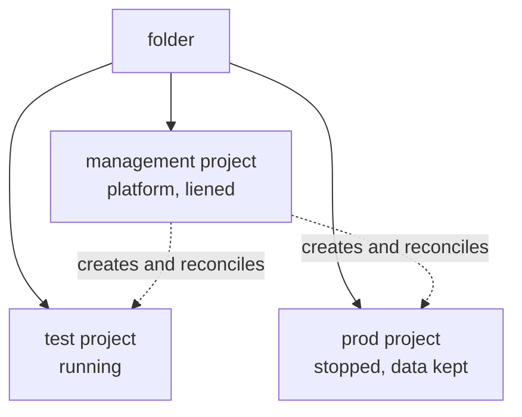

# Cloud foundation

<!-- tessl-plugin: deployment -->

## Problem

You want to run Queenswood on Google Cloud, and to keep deciding what
exists as you go.

## Solution

Install an API, then commit a manifest. The manifest is the whole
interface: what it lists exists, and what it stops listing goes away.

### What the API does

`XQueenswoodInstallation` is a single Crossplane composite that owns the
contents of one folder. Given that folder and an identity with rights on
it, it creates:

- the **management project**, running the platform that reconciles
  everything else, and the platform's own identity
- **folder-level org policies**, and the durable bucket and secrets that
  outlive every instance
- **one project per instance**, holding that instance's network,
  cluster, database and service accounts, plus a public address and
  certificate when the instance has a domain

Every instance carries a `state`, so stopping one is an edit rather than
a teardown. The folder, the management project and every instance
project are liened, so nothing the composite does can delete them.

It ships as a Crossplane Configuration package, installed like any other
package — not a Helm chart.

### A deployment, and what it produces

```yaml
apiVersion: platform.queenswood.repldriven.com/v1alpha1
kind: XQueenswoodInstallation
metadata:
  name: queenswood
  namespace: crossplane-system
spec:
  folderId: folders/123456789012
  billingAccountId: 0X0X0X-0X0X0X-0X0X0X
  region: europe-west2
  instances:
    - name: test
      state: up
    - name: prod
      state: down
      domain: queenswood.example
      automatedDatabaseBackups: true
```



- **management** — the platform, plus the secrets and backups that
  outlive both instances.
- **test** — a running bank, reached privately, with no public address
  or certificate because it declares no `domain`.
- **prod** — a project that exists and holds its data, with nothing
  running in it and no bill beyond storage. Its address and certificate
  appear when it comes up.

`instances: []` is valid, and is the cheapest useful deployment: the
platform and nothing else. Instances arrive later, as entries.

### Changing what exists

- `state: up` — running.
- `state: draining` — ordered shutdown. The exports that have to happen
  before anything is deleted run and are waited on.
- `state: down` — stopped. Node pools at zero, database not activated,
  the expensive tier gone, the project and its data kept.
- Remove the entry — the instance's resources go.

A project is never deleted by editing the manifest. Projects, the
folder, and the durable bucket carry a GCP lien, so retiring one for
good is a deliberate second act: lift the lien, then delete. That
asymmetry is on purpose — an edit can be a mistake, and this is the
class of mistake there is no recovering from.

### The two values you need

- **A folder id**, such as `folders/123456789012`.
- **An identity with folder-scoped rights** — `projectCreator` and
  `folderIamAdmin` on that folder, `billing.user` on a billing account,
  and `orgpolicy.policyAdmin` on the folder where the organisation
  allows it.

That identity lives outside the installation, in your organisation's
automation project or in one small project you create for it.

The folder is context rather than something you operate — you are given
one or it is created for you, and from then on the manifest is what you
touch. How the two values came to exist is not recorded and does not
matter: only the next two sections differ, and only in who does the
work.

`spec.createFolder.parent` decides where a created folder is nested, and
takes either `organizations/{id}` or `folders/{id}` — GCP checks
`resourcemanager.folders.create` on that parent, not on the
organisation. So the dividing line below is not really owning the
organisation: it is whether you were given a parent you may create in,
or the one folder you must use. An id is required, not a path of display
names, and `just gcp-preflight` lists the parents you can see.

## If you own the organisation

You are the platform team. Nobody grants you anything, and nobody is
going to apply the manifest for you.

### If you have no account at all

- Sign up for Cloud Identity Free. This creates the organisation, plus
  one super admin account.
- Verify the domain it is signed up against, with a TXT record at that
  domain's registrar.
- Create a billing account and attach a payment method.
- Reconcile conflict accounts — personal Google accounts already using
  an address on that domain.

None of this has an API, so none of it is a recipe. Cloud Identity needs
a domain you control, which is Google's condition for creating an
organisation rather than anything Queenswood asks for, and it does not
have to be a domain Queenswood is served on.

Signing in to the console with a personal Google account is not the same
thing. That gives you projects with no organisation above them, and so
no folder to install into.

### Standing it up

1. `just gcp-preflight` — reports the organisation, the billing account,
   the organisation roles bound directly to you, and the parents a
   folder could be created under.
2. `just gcp-bootstrap-identity` — creates one small project to hold the
   bootstrap service account, grants it the rights above, and grants you
   `serviceAccountTokenCreator` so you can impersonate it. The project
   is retained: it costs nothing, and a project id is consumed
   permanently. Drop that one binding when you are done, and add it back
   when you next need to act.
3. `just gcp-plane-up` — a local kind cluster running Crossplane and the
   Configuration package, authenticating as that service account.
4. Apply the manifest with `spec.createFolder` in place of
   `spec.folderId`, naming the parent to nest the folder under — the
   organisation, or an existing folder.
5. Read the folder id, the management project id and the platform
   identity out of the composite's `status`.
6. `just gcp-plane-pivot` — move the manifest onto the management
   cluster it just created, then discard the kind cluster.

The local plane exists for minutes, not permanently. After the pivot the
management cluster reconciles its own project and folder, which is what
the liens are for: a live Crossplane that can delete its own project is
the hazard.

Break-glass is you, using your organisation rights, with nothing
standing the rest of the time.

## If you are given a folder

The organisation is someone else's, and you were given one folder to
use rather than a parent to create in. You may not be allowed to set org
policy either, and should not expect to.

If they will instead grant `resourcemanager.folders.create` on a parent
folder, take that — it is a smaller ask than organisation rights, and
from then on you follow the path above with
`spec.createFolder.parent` set to that folder.

### What to ask for

- A folder, and its id.
- An identity with `projectCreator` and `folderIamAdmin` on it, and
  `billing.user` on a billing account.
- `orgpolicy.policyAdmin` on the folder, if they will grant it. If they
  won't, ask instead that `compute.skipDefaultNetworkCreation` and
  `iam.disableServiceAccountKeyCreation` are enforced on the folder for
  you. Without the first, every project is born with a default VPC
  nobody wants. Without the second, the ban on keys is a convention
  rather than a control.
- Either that they apply the manifest from their own control plane, or a
  Workload Identity Federation binding from that identity to your
  repository, so your CI is the applier.

### Standing it up

1. Commit the manifest with `spec.folderId` set to the folder you were
   given.
2. Whoever holds the control plane applies it — them, or your CI through
   federation.
3. Read the management project id and the platform identity from the
   composite's `status`.

There is no pivot on this path, and no local cluster. The manifest stays
where it was applied from, and that is what reconciles your folder.

Break-glass is their organisation admin, so the repair path is a request
rather than a command. Worth knowing before you need it.

## Both paths

### Two identities, and what may assume them

- **The bootstrap identity** creates the management project. Where an
  organisation provisions folders, a CI runner assumes it through
  Workload Identity Federation and no person can. On the self-owned path
  you impersonate it deliberately, rather than carrying its rights on
  your own account.
- **The platform identity** is created by the manifest and used by the
  management cluster through Workload Identity. Nobody impersonates it,
  and no person is granted `serviceAccountTokenCreator` on it.

Neither ever has a key. `iam.disableServiceAccountKeyCreation` is
enforced on the folder, so the stored-credential shortcut is unavailable
rather than discouraged.

Impersonate deliberately even when you could simply hold the rights. The
whole role set is revoked by removing one `serviceAccountTokenCreator`
binding, without touching any folder or organisation policy, and granted
again the same way. Elevation becomes an explicit act, so your everyday
identity cannot do damage by accident. The tokens are short-lived rather
than a long-lived login. Audit logs still name you, through
`serviceAccountDelegationInfo`, while the acting principal stays narrow.
And swapping yourself for a federated repository principal later changes
who may assume the identity, not what the identity is.

What it does not do is bound you. Creating the service account takes
organisation rights in the first place, so you can always grant yourself
back in. This removes standing authority, not authority.

### What lives in git

The manifest, with its parameters filled in — one per installation, in
whichever repository the applier reconciles from. It is the whole record
of what exists, and it holds nothing secret: a folder id, a billing
account id, instance names, a domain.

The API does not: the XRD and Composition are an installed package, and
`status` is read back rather than committed. Secrets — the FDB
encryption key, the HMAC key, database passwords — go to Secret Manager
in the management project.

A merge is the privileged action, so it is the merged state that
applies, never a working tree. A `pull_request` trigger must hold no
cloud identity at all — it validates and plans. Otherwise a fork's pull
request runs as the platform identity and the review gate is decoration.

### Where this stands

What runs today is `justfiles/cloud.just` plus the `queenswood-gcp`
chart, which creates one instance's project-scoped resources and takes
the project id as a given. The shape here is where that is going, per
[ADR-0022](../adr/0022-cloud-foundation-and-environment-lifecycle.md).

## Rules

**MUST:**

- Change what exists by editing the manifest, not by acting on GCP
  directly.
- Apply from merged state only. A `pull_request` trigger gets no cloud
  identity.
- Give each folder its own identity. The rights are folder-scoped, so
  one identity cannot serve two installations.
- Pivot the manifest off a throwaway control plane before discarding it.
  Nothing else would reconcile the folder.

**MUST NOT:**

- Grant a person `serviceAccountTokenCreator` on the platform identity,
  or create a key for either identity.
- Carry the bootstrap identity's rights on your own account. Impersonate
  it instead, so one binding grants and revokes the lot.
- Assume you can create a folder. Plenty of organisations won't grant
  it, and only one of the two paths needs it.
- Make retention or liens a spec field, or delete a project as a side
  effect of an edit.
- Commit anything secret alongside the manifest.

**MAY:**

- Deploy with `instances: []` and patch instances in later.
- Run an instance with no `domain`, when it is reached privately.
- Create more than one installation. One manifest per folder.

## References

- [ADR-0022](../adr/0022-cloud-foundation-and-environment-lifecycle.md)
  — the hub-and-spoke design, declared `state`, ordered draining, and
  why foundations are liened rather than deleted.
- [ADR-0016](../adr/0016-crossplane-over-terraform.md) — why
  infrastructure is declared rather than scripted.
- [cloud-deployment](cloud-deployment.md) — the tier model and the
  up/down runbook for an instance.
- [infrastructure](../tdd/infrastructure.md) — the bootstrap chain,
  sync waves, and the compositions this builds on.
- `justfiles/foundation.just` — `gcp-preflight`. The recipes named in
  the runbooks above are not written yet.
