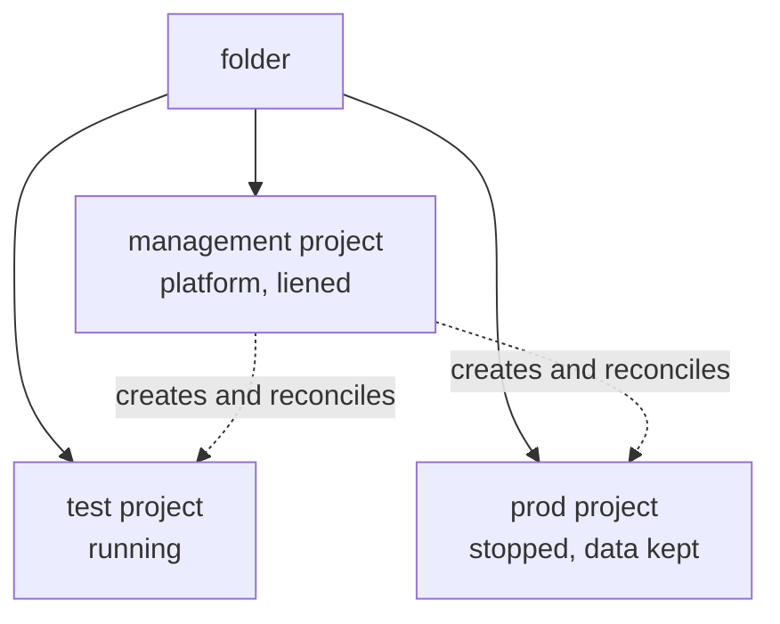

# Cloud foundation

<!-- tessl-plugin: deployment -->

## Problem

You want to run Queenswood on Google Cloud, and to keep deciding what
exists as you go.

## Solution

Install an API, then commit a manifest. What it lists exists, and what it
stops listing goes away.

### What the API does

`XQueenswoodInstallation` is one Crossplane composite owning the contents
of a folder. Given that folder and an identity with rights on it, it
creates:

- the **management project**, running the platform, and the platform's
  own identity
- **folder org policies**, and the durable bucket and secrets that
  outlive every instance
- **a project per instance**, with its network, cluster, database and
  service accounts, plus a public address and certificate when it
  declares a domain

Instances carry a `state`, so stopping one is an edit. The folder,
management project and instance projects are liened, so nothing the
composite does can delete them.

It ships as a Crossplane Configuration package, not a Helm chart.

### A deployment, and what it produces

```yaml
apiVersion: platform.queenswood.repldriven.com/v1alpha1
kind: XQueenswoodInstallation
metadata:
  name: queenswood
  namespace: crossplane-system
spec:
  folderId: folders/123456789012
  billingAccountId: 0X0X0X-0X0X0X-0X0X0X
  region: europe-west2
  instances:
    - name: test
      state: up
    - name: prod
      state: down
      domain: queenswood.example
      automatedDatabaseBackups: true
```



- **management** — the platform, and the secrets and backups outliving
  both instances.
- **test** — running, reached privately, with no address or certificate
  because it declares no `domain`.
- **prod** — exists and holds its data, nothing running, no bill beyond
  storage.

`instances: []` is valid, and the cheapest useful deployment.

### Changing what exists

- `state: up` — running.
- `state: draining` — ordered shutdown. The exports that must precede any
  deletion run, and are waited on.
- `state: down` — node pools at zero, database not activated, data kept.
- Remove the entry — that instance's resources go.

No edit deletes a project. Liens make retiring one a deliberate second
act: lift the lien, then delete.

### The two values you need

- **A folder id**, such as `folders/123456789012`.
- **An identity** with `projectCreator` and `folderIamAdmin` on that
  folder, `billing.user` on a billing account, and
  `orgpolicy.policyAdmin` on the folder where the organisation allows it.

It lives outside the installation — in the organisation's automation
project, or one small project you create for it.

`spec.createFolder.displayName` labels the installation for people and
nothing else — the folder id is the identifier, and a folder handed to
you carries whatever name its organisation chose. `gcp-plane-apply`
suffixes it like a project id unless you pass one, since GCP allows two
folders with the same name under one parent and a console cannot tell
them apart. `spec.createFolder.folderId` adopts an existing folder instead of
creating one, which is what makes a rebuilt control plane take over
rather than build a second installation beside the first.

`spec.createFolder.parent` takes `organizations/{id}` or `folders/{id}`,
and `folders.create` is checked on that parent. So the split below is
whether you were given a parent to create in or one folder to use. Ids
are required, not paths of display names; `just gcp-preflight` lists the
parents you can see.

## If you own the organisation

No Google Cloud at all yet: start with
[cloud-account](cloud-account.md), which is the browser-only half.

1. `just gcp-preflight` — organisation, billing account, your direct
   roles, and candidate parents.
2. `just gcp-bootstrap-identity`, as the operating user — the bootstrap
   project and service account, `billing.user`, and
   `gcp-platform-operators@` allowed to impersonate it.
3. `just gcp-bootstrap-org-roles`, as a member of
   `gcp-organization-admins@` — the organisation roles only an admin can
   grant. The one step needing break-glass.
4. `just gcp-adc-impersonate`, then `just gcp-plane-up` — a throwaway
   kind cluster running Crossplane and the GCP provider, authenticating
   from ADC that impersonates the bootstrap identity. No key exists, and
   `just gcp-adc-revoke` ends it.
5. Apply the manifest with `spec.createFolder` in place of
   `spec.folderId`.
6. Read the folder id, management project and platform identity from
   `status`.
7. `just gcp-plane-pivot` — move the manifest onto the management cluster
   it created, then discard the kind cluster.

After the pivot the management cluster reconciles its own project and
folder. The liens are what make that safe.

## If you are given a folder

One folder to use rather than a parent to create in. If they will grant
`resourcemanager.folders.create` on a parent instead, take that and
follow the path above — it is a smaller ask than organisation rights.

Ask for:

- The folder id.
- An identity with `projectCreator` and `folderIamAdmin` on it, and
  `billing.user` on a billing account.
- `orgpolicy.policyAdmin` on the folder. Failing that, ask that
  `compute.skipDefaultNetworkCreation` and
  `iam.disableServiceAccountKeyCreation` are enforced on it for you —
  without the first every project is born with an unwanted default VPC,
  and without the second the ban on keys is a convention.
- Either that they apply the manifest from their control plane, or a
  Workload Identity Federation binding from that identity to your
  repository.

Then commit the manifest with `spec.folderId` set, and whoever holds the
control plane applies it. There is no pivot: it already lives somewhere
permanent. Break-glass is their organisation admin, so repair is a
request rather than a command.

## Both paths

### Two identities

- **The bootstrap identity** creates the management project. Members of
  `gcp-platform-operators@` impersonate it; where an organisation
  provisions folders, a CI runner assumes it through federation and no
  person can.
- **The platform identity** is created by the manifest and used by the
  management cluster through Workload Identity. Nobody impersonates it.

Neither ever has a key: `iam.disableServiceAccountKeyCreation` is
enforced on the folder, so that is structural rather than a habit.

### What lives in git

The manifest, one per installation, in whichever repository the applier
reconciles from. It carries ids and names, nothing secret — secrets go to
Secret Manager in the management project, and `status` is read back
rather than committed.

A merge is the privileged action, so merged state applies and a
`pull_request` trigger gets no cloud identity. Otherwise a fork's pull
request runs as the platform identity.

### Where this stands

`justfiles/cloud.just` and the `queenswood-gcp` chart are what run today:
one instance's project-scoped resources, with the project id supplied
rather than created. This is where that goes, per
[ADR-0022](../adr/0022-cloud-foundation-and-environment-lifecycle.md).

New GCP recipes go in `justfiles/gcp.just`, and anything still needed
from `cloud.just` moves across rather than being called into. That way
`cloud.just` only ever shrinks, instead of becoming a file of two
generations.

## Rules

**MUST:**

- Change what exists by editing the manifest, not by acting on GCP.
- Apply from merged state only. A `pull_request` trigger gets no cloud
  identity.
- Bind groups where humans hold access, and principals directly where
  automation does.
- Pivot the manifest off a throwaway control plane before discarding it.

**MUST NOT:**

- Grant a person `serviceAccountTokenCreator` on either identity, or
  create a key for either.
- Assume you can create a folder. Only one of the two paths needs it.
- Make retention or liens a spec field, or delete a project as a side
  effect of an edit.
- Commit anything secret beside the manifest.

**MAY:**

- Deploy with `instances: []` and patch instances in later.
- Run an instance with no `domain`, reached privately.
- Create more than one installation. One manifest per folder.

## References

- [ADR-0022](../adr/0022-cloud-foundation-and-environment-lifecycle.md)
  — the folder as an installation, declared `state`, ordered draining,
  and why foundations are liened.
- [ADR-0016](../adr/0016-crossplane-over-terraform.md) — why
  infrastructure is declared rather than scripted.
- [cloud-account](cloud-account.md) — the organisation, access groups and
  billing account.
- [cloud-deployment](cloud-deployment.md) — the tier model and up/down
  runbook for an instance.
- [infrastructure](../tdd/infrastructure.md) — the bootstrap chain, sync
  waves and existing compositions.
- `justfiles/gcp.just` — `gcp-preflight`, `gcp-groups-bind`,
  `gcp-access-*`, `gcp-bootstrap-*`, `gcp-adc-*`, `gcp-plane-up` /
  `-apply` / `-status` / `-down`. `gcp-plane-pivot` is not written yet.
- `infra/platform/crossplane-xrds/xqueenswoodinstallation-*.yml` — the
  XRD and Composition. Folder only, so far.
