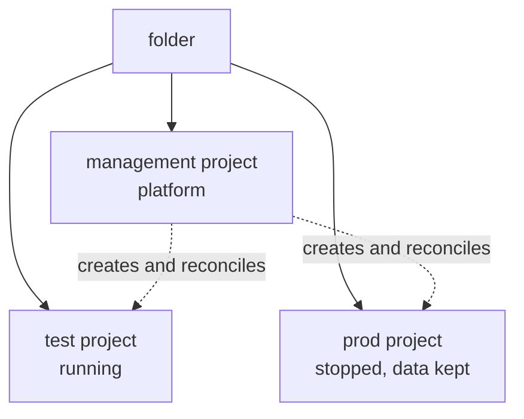

# Deploying Crossplane applications
<!-- tessl-plugin: deployment -->

## Problem

You want to run Queenswood on Google Cloud, and your organisation cannot
deploy Crossplane applications.

## Solution

Build the ability once: a folder, a management project, and a plane
inside it running Crossplane and Argo against a repository. Deploying an
application is then a merge — this one, or any other whose API that
plane has been taught.

### What "cannot deploy" means here

An organisation that already runs GitOps installs anything by landing a
manifest in the repository a privileged control plane reads. The
privilege is ambient: somebody established it before any of this, and
the install is a merge.

That privilege has to be of the right kind. A plane reconciling
Terraform against AWS cannot apply an `XManagementPlane` at all —
the manifest names a kind its API server has never heard of, so the
capability that installs everything else in that organisation installs
nothing here. The question is not whether you deploy declaratively, but
whether you hold a Crossplane control plane that can be taught this
kind. Where you do not, this recipe builds one.

What it leaves behind is not Queenswood-specific. A plane in a folder,
running Crossplane and Argo against a repository, reconciles whatever
composite it is given: load another XRD and composition, and applying
that is a merge too. An organisation builds this once and holds a
general capability afterwards.

### What gets built

`XManagementPlane` is one Crossplane composite owning the contents
of a folder. Given that folder and an identity with rights on it, it
creates:

- the **management project**, running the platform, and the platform's
  own identity
- **the network and the cluster** that platform runs on, with the
  identities its nodes and its secrets operator hold
- the durable **bucket and secrets** that outlive every instance
- **a project per instance**, with its network, cluster, database and
  service accounts, plus a public address and certificate when it
  declares a domain

It ships as a Crossplane Configuration package, not a Helm chart. The
manifest describing one, field by field, is
[queenswood-installation](queenswood-installation.md).

- **management** — the platform, and the secrets and backups outliving
  both instances.
- **test** — running, reached privately, with no address or certificate
  because it declares no `domain`.
- **prod** — exists and holds its data, nothing running, no bill beyond
  storage.

`instances: []` is valid, and the cheapest useful deployment.

### The two values you need

- **A folder id**, written `folders/<folder-id>`, or a parent to create
  one under.
- **An identity** with `projectCreator` and `folderIamAdmin` on that
  folder, `billing.user` on a billing account, and
  `orgpolicy.policyAdmin` on the folder where the organisation allows it.

The identity lives outside the installation — in the organisation's
automation project, or one small project you create for it.

`spec.createFolder.parent` takes `organizations/{id}` or `folders/{id}`,
and `folders.create` is checked on that parent, so which of the two
values you have decides whether the folder is created or adopted. Ids are
required, not paths of display names; `just gcp-preflight` lists the
parents you can see.

`spec.createFolder.displayName` labels the installation for people and
nothing else — the folder id is the identifier, and a folder handed to
you carries whatever name its organisation chose. Display names must be
unique among siblings, so a fixed one would refuse the second
installation under a parent.

Deleting a folder is not something reconciliation repairs. A soft-deleted
folder still reads as existing, so the provider reports it Available for
the whole 30-day window; the composite's readiness check on
`lifecycleState` is what turns that into a visible failure.

### The path

One path. Whether you run every step yourself or receive the output of
the early ones from a platform team is the only difference between
owning the organisation and being given a folder — the steps are the
same and the supplier varies. Where somebody hands you a folder, they
have run steps 1 to 3 on your behalf, and you set
`spec.createFolder.folderId` rather than creating one.

With no Google Cloud at all yet, start with
[cloud-account](cloud-account.md), which is the browser-only half.

1. `just gcp-preflight` — organisation, billing account, your direct
   roles, and candidate parents.
2. `just gcp-boot-identity`, as the operating user — the bootstrap
   project and service account, `billing.user`, and the platform-admin
   group allowed to impersonate it.
3. `just gcp-boot-org-roles`, as an organisation admin — the roles only
   an admin can grant. Where you were given a folder these are held on
   that folder instead, and granted by whoever owns it.
   `just gcp-folder-skip-default-network` follows once the folder
   exists, and is the same kind of act: `orgpolicy.policyAdmin` is
   granted at the organisation and nowhere else, so the plane can never
   set it and a folder inside an organisation you do not own may leave
   it unreachable. Without it every project in the folder acquires a
   default network with SSH and RDP open to the internet, the moment it
   enables the Compute API.
4. `just gcp-adc-boot`, then `just gcp-plane-up` — a throwaway kind
   cluster running Crossplane and the GCP providers, authenticating from
   ADC that impersonates the bootstrap identity. No key exists, and
   `just gcp-adc-revoke` ends it.
5. Commit the manifest, then `just gcp-plane-apply`. It is committed
   before it is applied because the ids in it are consumed permanently,
   and because the plane that takes over reads it from git rather than
   from a checkout.
6. Read the folder id, management project and platform identity from
   `status`.
7. Move the composite onto the management cluster it just created, and
   discard the kind cluster. No recipe does this yet.

After that the management cluster reconciles its own project and folder,
and every later change is a merge. Being given a folder shortens this
rather than changing it: the plane still has to exist somewhere, so
either their control plane applies your manifest — which needs your XRD
and composition loaded into it — or you raise one inside the folder they
gave you.

### Four identities

- **The bootstrap identity** creates the management project. Members of
  the platform-admin group impersonate it; where an organisation
  provisions folders, a CI runner assumes it through federation and no
  person can.
- **The platform identity** is created by the manifest and used by the
  management cluster through Workload Identity. Nobody impersonates it.
- **The secrets identity** reads Secret Manager for one cluster and does
  nothing else, for the operator that turns a stored credential into a
  cluster Secret. Separate from the platform identity, which could do
  the same reading but can also create projects and administer every
  cluster in the folder. One per cluster rather than per installation,
  so an instance's operator cannot read another instance's secrets.
- **The node identity** is what one cluster's nodes run as, holding only
  what a GKE node needs to report itself. Never the
  default compute service account: that one is shared by everything in
  the project that never chose an identity, and holds whatever the
  organisation's policy on automatic grants leaves it holding. A node
  pool asks for `cloud-platform` scopes, so whatever it holds is
  reachable by every workload on the cluster through the metadata
  server.

None holds a key, because GCP enforces
`iam.disableServiceAccountKeyCreation` at the organisation by default.
That is inherited rather than established here, so it holds for a folder
handed to you as well — and it is worth confirming rather than assuming,
since an exemption is a project-level edit somebody may already have
made for a workload that needs one.

### What protects a foundation

Projects, DNS zones and backup buckets carry `managementPolicies`
without `Delete`, so the composite cannot destroy what cannot be
rebuilt. A project lien is what
[ADR-0022](../adr/0022-cloud-foundation-and-environment-lifecycle.md)
puts above that, on the grounds that a policy is a convention a later
edit undoes; a folder cannot carry a lien at all, and what protects it
is that nobody holds `resourcemanager.folders.delete`.

A lien makes retiring a project a deliberate second act — lift it, then
delete — which is also why one is not applied while an installation is
still being rebuilt to prove that it can be.

### What is not enforced yet

`compute.skipDefaultNetworkCreation` is set by no recipe here and
composed by nothing, though the bootstrap identity is granted
`orgpolicy.policyAdmin` to set it with. Where it is not enforced on the
folder, every project inside is born with a default VPC nobody asked
for. Ask for it on a folder you are given, and set it on a folder you
create.

### Where this stands

The composite creates the folder, the management project and its APIs,
the network and the zonal GKE cluster, the platform identity with its
Workload Identity binding, and what that identity may do inside the
folder. One installation runs this way, reconciling itself from a
committed manifest.

Instances are where this goes next, and the `state` field with them —
`up`, `draining` for an ordered shutdown that waits on its exports, and
`down` for node pools at zero with the data kept. Until then
`justfiles/cloud.just` and the `queenswood-gcp` chart are what run an
instance.

New GCP recipes go in `justfiles/gcp.just`, and anything still needed
from `cloud.just` moves across rather than being called into. That way
`cloud.just` only ever shrinks, instead of becoming a file of two
generations.

## Rules

**MUST:**

- Build the plane before expecting a merge to install anything. A
  control plane running another toolchain cannot apply this kind.
- Grant the bootstrap identity its rights on the folder or the parent,
  never a key.
- Commit the manifest before applying it, and before any plane takes
  over reading it from git.
- Pivot the composite off a throwaway control plane before discarding
  that plane.

**MUST NOT:**

- Grant a person `serviceAccountTokenCreator` on the platform identity,
  or create a key for any of the four.
- Assume you can create a folder. Ids are required, and one may be
  handed to you instead.
- Delete a project as a side effect of an edit.

**MAY:**

- Deploy with `instances: []`, and add instances later.
- Ask a platform team for the folder and identity rather than making
  them, which shortens this path without changing it.
- Load another XRD and composition onto the plane, and deploy something
  else the same way.

## References

- [ADR-0022](../adr/0022-cloud-foundation-and-environment-lifecycle.md)
  — the folder as an installation, declared `state`, ordered draining,
  and why foundations are not deleted.
- [ADR-0016](../adr/0016-crossplane-over-terraform.md) — why
  infrastructure is declared rather than scripted.
- [queenswood-installation](queenswood-installation.md) — the manifest
  this plane reads, field by field.
- [cloud-account](cloud-account.md) — the organisation, access groups and
  billing account, none of which has an API.
- [crossplane](crossplane.md) — what identifies a composed resource, and
  what a composition owns.
- [gcp-iam](gcp-iam.md) — Workload Identity's two halves, and rights held
  by accident.
- [infrastructure](../tdd/infrastructure.md) — the bootstrap chain, sync
  waves and existing compositions.
- `justfiles/gcp.just` — `gcp-preflight`, `gcp-groups-bind`,
  `gcp-boot-*`, `gcp-platform-*`, `gcp-adc-*`, `gcp-plane-up` /
  `-manifest` / `-apply` / `-status` / `-down`. Nothing pivots yet, and
  group membership is Admin console work for the reason the directory
  work is.
- `infra/platform/crossplane-xrds/xmanagementplane-*.yml` — the
  XRD and Composition.
