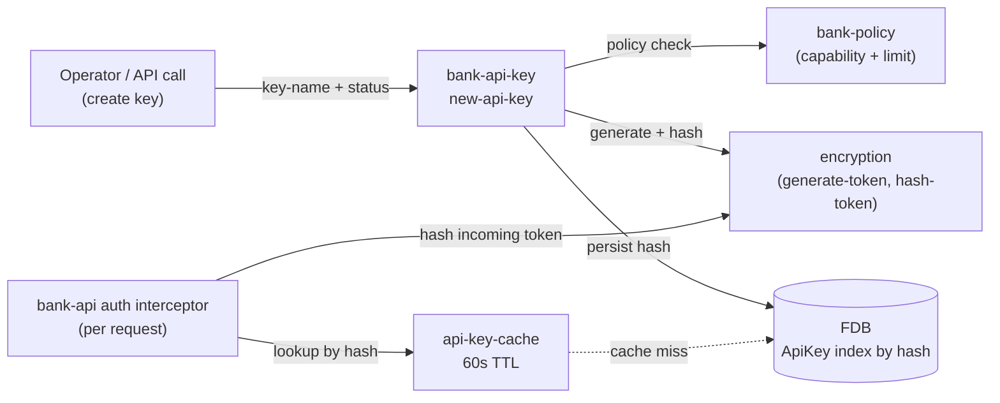

# API keys

## Objective

Queenswood is multi-tenant: each organisation that uses the
bank holds its own customers, accounts, payments, and
products. Every HTTP request needs to be attributable to an
organisation, with cryptographic confidence that the request
genuinely came from someone authorised to act on its behalf.
API keys are the bearer credential that does this.

This TDD describes how API keys are minted, stored, looked
up, and revoked; how they identify an organisation at the API
edge; how the prefix scheme tells operators at a glance
whether a key is for live or test traffic; and how policy
controls issuance.

API keys are the current credential model. They have
well-known limitations and we expect to move beyond them —
see "Future direction" for the path the auth model is heading
down (cert-based service-account auth, OAuth with a
customer-supplied IDP, and a proper user model).

In scope: the `bank-api-key` brick, key generation and
storage, the hash-only persistence model, the prefix
convention, the policy integration on issuance, the
verification path at the API edge.

Out of scope: the HTTP-edge auth interceptor itself (covered
in [service-apis.md](service-apis.md)); organisation
onboarding and lifecycle (forthcoming organisations TDD);
the encryption brick's primitives.

## Background

Two security properties have to hold simultaneously:

**Confidentiality of the credential.** The plain-text secret
must never be persisted, never logged, never recoverable from
a database compromise. The bank stores only a one-way hash;
the secret is shown to the user once at creation time and
then only its prefix is displayable.

**Tenant attribution.** Every request that arrives with a
valid Bearer token must resolve unambiguously to an
organisation. That mapping is what makes the API multi-
tenant: the rest of the system reads `:organization-id` off
the authenticated request and never asks how it got there.

The design answers both with a small set of conventions:

- Generate a high-entropy secret with a status-revealing
  prefix (`sk_live.` or `sk_test.`).
- Store the secret's hash plus a short display prefix (first
  twelve characters).
- Look up at auth time by hashing the incoming Bearer token
  and matching against the index.
- Cache the result briefly to keep the hot-path fast.

Issuance is policy-gated: a policy can deny issuance under
certain conditions (a limit on keys per organisation, a deny
under specific organisation states, and so on). The
authorisation flows through the same engine as every other
domain operation
([policy-evaluation.md](policy-evaluation.md)).

## Proposed Solution

### Architecture

`bank-api-key` is the brick. It owns the ApiKey record store
and exposes generation, lookup, and listing. The
`bank-api`-side auth interceptor consumes `get-api-key`
by hash; everything else in the system sees the resolved
`:organization-id` on the request and never touches keys
directly.



Two flows. **Issuance** is rare, policy-checked, and writes
to FDB. **Verification** is per-request, cached, and reads
from FDB only on cache miss.

### Data model

**ApiKey** record:

```clojure
{:api-key-id     "sk.<ulid>"
 :organization-id
 :key-hash       "<SHA-256-or-similar>"   ; the only stored secret
 :key-prefix     "sk_live.AB12CDEF"       ; first 12 chars, displayable
 :name           "Bookings integration"   ; human-friendly label
 :created-at     <ms>
 :revoked-at     <ms or 0>}               ; 0 = active
```

Two indices on the store:

- By `:api-key-id` (primary).
- By `:key-hash` (auth lookup).

The plain-text secret is **never stored**. The one-time
delivery at creation is the only moment it exists outside the
caller's possession.

### Key shape and prefix

The secret is a high-entropy token generated by the
`encryption` brick, prefixed with the issuing organisation's
status:

- **`sk_live.<random>`** for live organisations.
- **`sk_test.<random>`** for test organisations (and the
  default for unknown statuses).

The prefix has two purposes:

1. **Operator-visible status.** A key pasted into a config
   file or commit message is recognisable as live or test at
   a glance. Mistaking a test key for a live key is harder
   when the prefix is right there.
2. **Index discrimination.** The prefix separates the key
   namespace by intent — a live key never collides with a
   test key, even if the random part somehow matched.

The first twelve characters are stored as `:key-prefix` for
display. Operators can identify a key in a list ("the
bookings one starts with sk_live.AB12CDEF") without seeing
the secret.

### Issuance flow

`new-api-key` runs in one FDB transaction:

1. Resolve effective policies for the organisation
   (`get-effective-policies`).
2. Count existing keys for the organisation (the
   `:api-key #{:organization-id}` aggregate).
3. **Capability check**: `bank-policy/check-capability` for
   `:api-key` with `{:action :api-key-action-issue}`. A deny
   here returns an `:unauthorized/policy-denied` anomaly.
4. **Limit check**: `bank-policy/check-limit` for `:api-key`
   with `{:aggregate :count :window :instant :value (inc
   total)}` — counts including the about-to-be-created
   key. Lets the bank cap "this org can have at most 10
   active API keys" via policy.
5. Generate the secret with the right prefix.
6. Hash it (one-way).
7. Capture the display prefix (first 12 chars).
8. Persist the ApiKey record.
9. Return `{:api-key <record> :key-secret <plaintext>}`.

The `:key-secret` is returned only here. The HTTP handler
puts it in the response body. The client is responsible for
storing it; if they lose it, the only recovery is to revoke
and re-issue.

### Verification flow

At the API edge (per [service-apis.md](service-apis.md)),
the auth interceptor:

1. Extracts the Bearer token from the `Authorization`
   header.
2. Hashes it.
3. Looks up the ApiKey record by hash via `cache/lookup` —
   60-second in-memory cache backed by `get-api-key` on the
   FDB store.
4. Confirms the record is not revoked (`:revoked-at` is
   zero).
5. Attaches `{:role :org :organization-id <id>}` to the
   request.

If the hashed token doesn't match any record, or the record
is revoked, no `:auth` is attached and the downstream
`authorize` interceptor terminates with 401.

The hashed-lookup-with-cache shape is intentional: every
authenticated request hits this path, so the FDB read is
amortised over many requests within the cache window.

### Admin key vs org keys

Two tiers of bearer credential coexist:

- **Admin key** — a single shared secret configured at boot
  via `!env MONO_ADMIN_API_KEY` (see
  [system-configurations.md](system-configurations.md)).
  Compared at auth time using `encryption/bytes-equals?`
  (constant-time). Resolves to
  `{:role :admin :organization-id <internal-org-id>}`.
- **Org keys** — per-organisation, generated through this
  brick, stored hashed. Resolves to
  `{:role :org :organization-id <their-org-id>}`.

The two tiers serve different needs: the admin key is for
operator and platform-management calls (creating
organisations, system maintenance); org keys are for
tenant-scope API traffic. Routes opt into the right scheme
via OpenAPI `:security` (see service-apis TDD).

### Policy integration

Issuance goes through `bank-policy`. Two kinds of rule the
engine can express:

- **Capability denies** — "this organisation cannot issue
  any API keys right now" (e.g. during suspension, before
  KYC is complete, or during a tier-restricted state).
- **Count limits** — "this organisation can have at most N
  active API keys at once" — using the aggregate count
  passed in to `check-limit`.

Both are policy-data, not code. Adding a new constraint is
adding a policy + binding (see policy-evaluation TDD).

## Alternatives Considered

- **Plaintext secret storage.** Could simplify lookup
  (compare strings directly). Rejected for the obvious
  reason — a database leak would expose every customer's
  API key in usable form.
- **Bcrypt / Argon2 hashing instead of SHA-256.** Slow,
  CPU-intensive hashes designed for password hashing, where
  the source string is low-entropy. Rejected because API
  keys are high-entropy random tokens — a fast cryptographic
  hash is sufficient and the latency on the auth hot path
  matters. (If keys were *user-chosen passwords* rather than
  random tokens, bcrypt-style would be the right answer.)
- **JWT-based bearer tokens.** Self-contained, signed; no
  database lookup at auth. Rejected because revocation
  becomes a denylist problem; rotation requires JWKS
  machinery; the simplicity of "lookup by hash, ack or
  reject" beats the complexity of JWT at our scale.
- **mTLS with client certificates.** Stronger than bearer
  tokens but operationally heavier — clients need cert
  management, our edge needs cert validation, and the
  fintech consumer base typically prefers bearer tokens for
  integration ease. Worth revisiting if a high-security
  partner integration ever needs it.
- **Different key prefixes per environment** (e.g.
  `sk_dev.`, `sk_staging.`, `sk_prod.`). Rejected — the
  organisation's status (live vs test) is the signal that
  matters; environment-as-prefix would couple keys to
  deployment topology rather than tenant intent.
- **Storing only the hash, no display prefix.** Cleaner from
  a "minimum information stored" perspective. Rejected
  because the operator needs *some* way to identify a key in
  a list. Twelve characters of high-entropy prefix isn't
  enough to reverse the secret in any practical attack.
- **Admin key in FDB instead of env.** Would let admin keys
  be rotated via the same flow as org keys. Rejected for
  bootstrap chicken-and-egg: the admin key is what
  authorises the calls that would create org keys. Keeping
  it in the system configuration (env) avoids the cycle.

## Known Limitations

- **Revocation isn't exposed on the brick interface.** The
  `:revoked-at` field is consulted at auth time, but
  `bank-api-key` doesn't currently expose a `revoke-api-key`
  function. Revocation today requires a direct FDB write or
  a future API. This is a real gap.
- **Rotation isn't supported.** "Rotate this key — issue a
  new secret, mark the old one revoked, return the new
  secret in one transaction" is a common operational need
  not packaged today. Caller can simulate via separate
  revoke + issue calls once revoke exists.
- **The 60-second auth cache delays revocation.** A revoked
  key remains valid for up to 60 seconds across each API
  instance until the cache entry expires. Acceptable for
  most cases; not acceptable for emergency revocation.
  Mitigation would be cache invalidation on revoke (across
  instances, which needs the message-bus) or a shorter TTL.
- **The admin key is a single shared secret.** No
  per-operator credentials at the platform-admin tier;
  audit attribution is "someone with the admin key did
  this." For low-volume admin operations, acceptable;
  for any scale of platform team, would want a richer
  identity model.
- **Per-organisation count limits are the only quantitative
  policy today.** The capability/limit machinery could
  express more (rate limits per key, time-bound keys, scoped
  keys), but only the count limit and the binary
  "can-issue?" capability are wired up.
- **No scoped keys.** An org-issued key can do anything an
  org-authenticated request can do. Scoped keys ("this key
  can read but not write", "this key can only access these
  accounts") aren't modelled. The `:role` on `:auth` is the
  only authorisation dimension at the moment; finer
  granularity would extend the auth shape.
- **No audit trail of issuance.** The ApiKey record records
  who-or-when at creation but not who issued it (which
  authenticated principal made the call). Useful for
  compliance.
- **The display prefix length (12) is hardcoded.** Worth
  configurable if products want different prefix lengths;
  not pressing.

## Future direction

API keys work for programmatic integration between known
parties, but they have well-known limitations: shared
secrets that must be transmitted and stored carefully; no
binding to a specific machine identity; revocation is a
denylist rather than cryptographic; and they say *nothing*
about which human triggered an action. The model in this
TDD is where we are; it isn't where we expect to end up.

Three directions we expect to take. None are scheduled work
yet — captured here so the auth-model evolution is on the
record.

### Service accounts → certificate-based auth

For service-to-service traffic (an organisation's backend
calling the Queenswood API), the natural successor is
**mTLS with client certificates**. The bank issues a
certificate to each organisation's service identity; the
client presents it at TLS handshake; the bank verifies
against a trusted CA chain.

Trade-offs versus API keys:

- **Stronger cryptographic identity.** The private key never
  leaves the client; there's no bearer secret to leak.
- **Cleaner revocation.** Short-lived certificates plus
  CRL/OCSP give cryptographic revocation, not a denylist.
- **Operationally heavier.** Clients need certificate
  management (rotation, distribution, storage); the bank
  needs CA infrastructure or a managed PKI.

Service-to-service traffic is the natural first place to
make this move because the operational overhead is bounded —
known parties, controlled cert lifecycles.

### User accounts → OAuth with customer-supplied IDP

For end-user-facing flows (the customer of the customer
performing actions through their banking app), the right
pattern is **OAuth / OIDC with the customer's own identity
provider**. The customer (the fintech using Queenswood)
brings their existing SSO, Auth0, Okta, Cognito, or whatever
they already run. Queenswood becomes a relying party:
validates the OIDC token signature against the customer's
published JWKS, trusts the verified claims.

This means:

- **Queenswood doesn't store user credentials.** No
  passwords, no MFA seeds, no PII beyond what the IDP
  exposes in claims.
- **The customer keeps ownership of user lifecycle.**
  Onboarding, password reset, MFA, deactivation, GDPR
  rights — all the customer's job, not the bank's.
- **Standard relying-party patterns apply.** Token
  validation, audience checks, expiry handling, refresh
  flows — well-trodden ground.

This is the right shape for a B2B2C banking platform: the
bank serves the customer, the customer serves their users,
and the user identity layer belongs to whoever owns the
end-user relationship.

### A user model alongside the organisation model

Both of the above presume a piece that's missing today:
**there is no user concept in Queenswood**. Every
authenticated request resolves to an organisation. The audit
trail says "someone with this organisation's API key did
this" — which could be any service or human in that
organisation's environment. For compliance regimes that ask
"which person?", and for fraud and dispute handling, this is
a real gap.

The future state pairs `:organization-id` with an optional
`:user-id` on the authenticated request. Distinct types tell
us how the request was authenticated: a service account
(certificate identity) or a user (OIDC subject claim). The
identity flows through commands and events into transaction
records, so every posting attributes back to a specific
service or human.

That unlocks:

- **Per-user audit.** Reconstructing who did what.
- **Per-user policy.** "These users can authorise transfers,
  these can only read." Capability rules become richer.
- **Clean separation** of "the organisation's back-office
  service did this" from "an end customer did this" — they
  look different in audit, fraud, and dispute systems.

### How the pieces fit together

An organisation's *services* authenticate via certificates
with a service-account identity; an organisation's *users*
authenticate via the customer's IDP with a user identity;
both resolve to a request shape carrying
`{:organization-id ... :principal-id ... :principal-type
:service | :user}`. Policy reasons about all three of those
together. Audit attributes to the principal.

This TDD will be substantially rewritten when those
directions land. For now, it captures the API-key story as
it stands.

## References

- [ADR-0002](../adr/0002-foundationdb-record-layer.md) —
  FoundationDB Record Layer (key storage, hash-indexed)
- [ADR-0005](../adr/0005-error-handling-with-anomalies.md) —
  Error handling with anomalies (issuance denials)
- [policy-evaluation.md](policy-evaluation.md) — Policy
  evaluation (issuance capability + count limit)
- [service-apis.md](service-apis.md) — Service APIs (the
  auth interceptor that consumes `get-api-key` and the
  cache layer)
- [system-configurations.md](../recipes/system-configurations.md)
  — System configurations (`!env MONO_ADMIN_API_KEY`)
- `bank-api-key` brick interface
- `encryption` brick interface (`generate-token`,
  `hash-token`, `bytes-equals?`)
