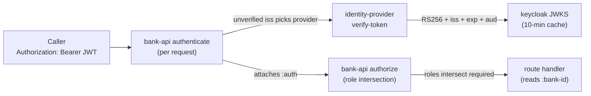

# Authentication

> Static API keys were removed (#82) and replaced by
> Keycloak-issued JWTs; this doc describes the current model. (It
> was previously named `api-keys.md`.)

## Objective

Queenswood is multi-tenant: each **bank** that runs on the
platform holds its own parties, cash accounts, payments, and
products. Every HTTP request must be attributable to a bank (or
to a platform operator), with cryptographic confidence that the
caller is who they claim to be. Authentication is delegated to
**Keycloak**: callers present a signed OAuth2 / OIDC bearer
token, and the API verifies it statelessly against Keycloak's
published signing keys.

This TDD describes how a request is authenticated at the API
edge, how the two principal types (a bank's backend service vs a
human user) are distinguished, what identity is attached to the
request, and how route authorization gates on roles.

In scope: the `bank-api` auth interceptors, the
`identity-provider` brick and its `keycloak` implementation, the
service-account lifecycle, the realm and client layout, and the
`:auth` shape the rest of the system reads.

Out of scope: the bank-creation flow that provisions a bank's
service-account client (see [banks.md](banks.md));
policy authorization of domain operations (see
[policy-evaluation.md](policy-evaluation.md)); the SPA-side OIDC
redirect/PKCE dance, which lives in the front-ends and Keycloak,
not this repo.

## Background

Two properties have to hold on every request:

**Authenticity.** The bearer token must be provably issued by a
trusted Keycloak realm and unaltered. The API never holds a
shared secret for the caller — it verifies the token's RS256
signature against Keycloak's JWKS, checks the issuer and expiry,
and checks that the token's audience is one the API accepts.

**Attribution.** A verified token must resolve to a principal:
either a specific **bank** (the rest of the system reads
`:bank-id` off the request and never asks how it got there), or
a platform **operator** acting bank-agnostically.

The previous model met these with static, hashed API keys minted
per tenant. That was replaced because shared secrets must be
transmitted and stored carefully, revocation is a denylist rather
than cryptographic, and a key says nothing about *which human*
acted. Keycloak-issued JWTs address all three: short-lived signed
tokens, key-rotation via JWKS, and a distinct user-identity path.

## Proposed Solution

### Architecture

Two interceptors run at the edge, in order:

- **`authenticate`** verifies the bearer token and attaches
  `:auth` to the request. It **never short-circuits** — a
  missing or invalid token simply leaves `:auth` absent, so the
  request still reaches `authorize`.
- **`authorize`** reads the roles a route requires (from its
  OpenAPI `bearerAuth` security) and the principal's roles, and
  terminates with 401 or 403, or passes through.



Verification is stateless: every request re-verifies its token
against cached JWKS signing keys. There is no per-request
authn-decision cache — the only caches are the JWKS keys
(10-minute TTL) and Keycloak's admin token.

### Token verification

`authenticate` does not trust the token to pick its verifier
blindly:

1. **Read `iss` unverified.** The JWT payload is base64url-decoded
   *without* a signature check, only to read the issuer.
2. **Pick the provider** whose `get-issuer` matches that `iss`.
   Multiple `identity-provider` instances are wired (one per
   realm); the unverified `iss` only routes *which* verifier runs.
3. **Verify** via `identity-provider/verify-token`, which (in the
   `keycloak` impl) fetches the signing key by `kid` from JWKS
   (force-refreshing once if the `kid` is unknown, to ride key
   rotation), then checks the **RS256 signature**, the **issuer**,
   the **expiry**, and that the token's **audience** intersects
   the API's `expected-audiences`. Any failure yields an
   `:auth/unauthenticated` rejection rather than an exception.

A forged `iss` only re-routes which verifier runs; the chosen
verifier still rejects on signature or issuer mismatch.

### The two principal types

After verification, the principal type is decided purely by the
**`azp`** (authorized party / client) claim:

- **User** — `azp` is one of the configured user-facing SPA
  clients (`queenswood-console`, `queenswood-app`).
- **Service** — anything else; by convention a bank's backend
  client, whose `client_id` *is* its `bank-id`.

**Service principal.** The `:auth` map:

```clojure
{:principal-type :service
 :principal-id   (:azp claims)              ; == client_id
 :bank-id        (when-not admin? (:azp claims))
 :roles          (into #{:org} realm-roles) ; realm_access.roles
 :token-jti      (:jti claims)}
```

`client_id == bank-id`, so a bank's service token attributes
directly to that bank. The shared `queenswood-admin` operator
client carries the `admin` realm role and therefore no
`:bank-id` (admin routes are platform-wide).

**User principal.** The user path **upserts a `bank-user` row**
keyed on `(iss, sub)` on every request (idempotent; refreshes
email / name / avatar from the OIDC profile claims), looks up the
user's memberships, and builds:

```clojure
{:principal-type :user
 :principal-id   (:user-id user)
 :issuer (:iss claims) :sub (:sub claims)
 :user user :claims claims :memberships memberships
 :roles (cond-> #{:user}
                admin?            (conj :admin :org)
                (seq memberships) (conj :org))
 :token-jti (:jti claims)
 :bank-id   (:bank-id (first memberships))}   ; when a member
```

A brand-new human with no memberships still authenticates as
`:user` (reaching `/me` and onboarding routes) and gains `:org`
scope once a membership exists. `:bank-id` comes from the first
membership.

### Roles and route authorization

The role vocabulary is `:user`, `:org`, `:admin`. (`:service` is
a *principal-type*, not a role — service principals carry `:org`,
plus `:admin` if their realm roles say so.)

A route declares the roles it needs in its OpenAPI security, e.g.
`:security [{"bearerAuth" ["admin"]}]`. `authorize`:

- passes through if the route has no security scheme;
- returns **401** (`auth/unauthenticated`) if the principal's
  role set is empty (no valid token);
- returns **403** (`auth/forbidden`) if roles are present but
  don't intersect the route's required roles.

Observed gates: `["admin"]` for bank / tier / policy creation and
the simulator, `["org"]` for cash-accounts / parties / payments /
balances, `["user"]` for `/me` and onboarding.

### Service-account lifecycle

The `identity-provider` brick (Keycloak-backed in production, a
local impl for tests) exposes:

- **`create-service-account`** — create a bank's service-account
  client (`client_id == bank-id`), stamping `access.token.lifespan
  = 3600` and an audience client-scope; returns
  `{:client-id … :client-secret …}` once.
- **`exchange-client-credentials`** — run OAuth2
  `client_credentials`, returning the raw token response. Proxied
  by `POST /oauth/token` so a bank can mint its own JWT.
- **`rotate-secret`** / **`revoke-service-account`** — reissue or
  delete a bank's client.
- **`verify-token`**, **`get-jwks`**, **`get-issuer`** — the
  verification surface used by `authenticate`.

`create-service-account` is wired into bank creation (`new-bank`,
behind the admin-only create-bank endpoint) and runs *before* the
FDB write so an IDP failure aborts cleanly; the `client-secret` is
surfaced once in the create-bank response. `rotate-secret` and
`revoke-service-account` are implemented but **not yet wired to
any endpoint** (see Known Limitations).

### Realms and clients

Two realms on one Keycloak instance:

- **`queenswood`** (orgs) — hosts the `queenswood-console` SPA
  (Authorization Code + PKCE for a bank's human operators), the
  per-bank service-account clients, and the `queenswood-admin`
  operator client (carries the `admin` realm role).
- **`queenswood-ops`** — hosts the `queenswood-app` SPA for
  Queenswood's own operators; verification-only from the API's
  side.

The API stamps a status-derived audience on a bank's tokens:
`bank-status-test → queenswood-api-test`,
`bank-status-live → queenswood-api-live`.

## Alternatives Considered

- **Static hashed API keys** (the previous model). Simple lookup
  by hash, no IDP dependency. Replaced — shared secrets must be
  transmitted/stored carefully, revocation is a denylist, and a
  key carries no human identity. The Keycloak model gives
  short-lived signed tokens, JWKS rotation, and a user path.
- **Opaque tokens with introspection.** Verify by calling
  Keycloak's introspection endpoint per request. Rejected — that
  reintroduces a synchronous IDP round-trip on the hot path;
  stateless JWKS verification keeps the edge fast and
  IDP-availability-tolerant within the token's lifetime.
- **A self-managed user store.** Own the password / MFA / profile
  lifecycle in-house. Rejected — Keycloak owns identity; the API
  is a relying party and only *projects* verified claims into a
  `bank-user` row keyed on `(iss, sub)`.
- **mTLS client certificates for service traffic.** Stronger
  machine identity, cryptographic revocation. Heavier
  operationally (cert management, CA infra) and the fintech
  consumer base expects bearer tokens. Worth revisiting for a
  high-security partner integration.
- **Per-request authn-decision cache.** Cache the verified result
  to skip re-verification. Rejected — JWKS verification is cheap
  and cacheing decisions would *delay* revocation; token expiry
  already bounds validity.

## Known Limitations

- **Rotation and revocation aren't wired.** `rotate-secret` and
  `revoke-service-account` exist on the `identity-provider`
  interface but have no callers — there is no rotate/revoke
  endpoint, and bank deletion doesn't call them. Revoking a
  bank's access today means deleting its Keycloak client by hand.
- **JWT validity is bounded by expiry, not revocation.** Tokens
  are stateless, so a revoked or rotated service account keeps any
  already-minted token working until its `exp` (≤ 1 h). Revocation
  prevents *new* tokens; it can't recall outstanding ones. The
  `:token-jti` is captured on `:auth` but nothing consumes it —
  there is no jti denylist.
- **A bank's service identity is shared.** All of a bank's backend
  callers use one service-account client (`client_id == bank-id`),
  so machine-to-machine audit attribution is "this bank's service
  did it," not which caller. Human operators do carry per-user
  identity via the user path.
- **Authorization is role-set only.** Routes gate on a principal's
  roles (`:user` / `:org` / `:admin`) intersecting the route's
  required roles. There is no resource scoping ("read-only", "only
  these accounts") — finer granularity would extend `authorize`.
- **The admin operator identity is shared.** `queenswood-admin` is
  one service account carrying the `admin` realm role and no
  `:bank-id`; back-office automation attributes to "the admin
  client," not a person. Human Queenswood operators sign in
  through `queenswood-app` and do carry per-user identity.

## References

- [ADR-0013](../adr/0013-single-unified-api.md) — Single unified
  API (the auth-bearing edge)
- [policy-evaluation.md](policy-evaluation.md) — Policy evaluation
  (authorization of domain operations, distinct from edge authn)
- [service-apis.md](service-apis.md) — Service APIs (the
  interceptor chain the auth interceptors sit in)
- [banks.md](banks.md) — Banks (bank creation
  provisions the service-account client)
- `bank-api` auth interceptors (`auth.clj`)
- `identity-provider` brick interface (`verify-token`,
  `create-service-account`, `exchange-client-credentials`,
  `rotate-secret`, `revoke-service-account`, `get-jwks`,
  `get-issuer`)
- `keycloak` brick (JWKS cache, admin token, per-bank clients)
