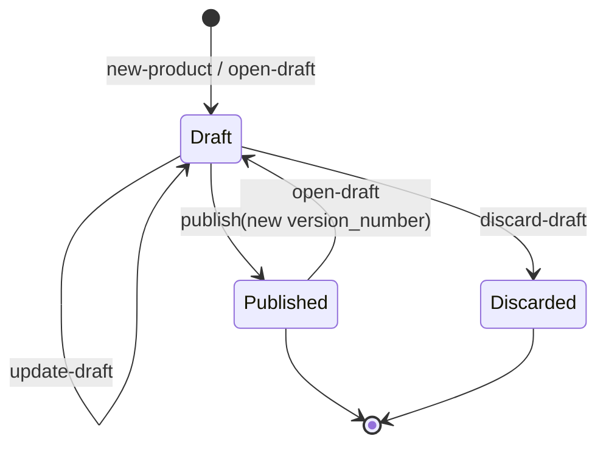

# Cash account products

## Objective

A **cash account product** is the template under which cash
accounts are opened — it defines the currency set, the
balance buckets the account will carry, the interest rate,
the payment-address schemes accepted, and so on. Products
are organisation-scoped (each organisation defines its own)
and **versioned**: terms change over time, but accounts
opened under a previous version keep its terms.

This TDD describes the product/version model, the
draft → published lifecycle, the immutability rule that
makes versioning load-bearing, and the connection from
account to version that pins terms forward in time.

In scope: the `bank-cash-account-product` brick; product and
version data model; lifecycle operations
(`new-product` / `open-draft` / `update-draft` /
`discard-draft` / `publish`); policy integration on draft
creation; the link from account to version.

Out of scope: cash account opening (forthcoming
cash-accounts TDD — accounts consume product versions);
interest accrual reading the rate
([interest.md](interest.md)); the policy machinery itself
([policy-evaluation.md](policy-evaluation.md)).

## Background

Banking products are not constants. Interest rates move,
fee structures evolve, compliance rules tighten. Existing
accounts cannot be retroactively repriced — that would
breach contractual T&Cs and (for retail products) the
regulatory framing under which the customer agreed to the
terms.

Two patterns answer the "products change over time" need:

1. **Edit in place.** The product record is mutable;
   updates apply to every account immediately. Wrong for
   retail banking — accounts agreed to one set of terms
   shouldn't see another.
2. **Versioned with cohorts.** The product has many
   versions; each is immutable once published; new accounts
   pick up the latest version; existing accounts stay on
   the version they were opened under. The right shape
   for retail banking.

Queenswood implements the second. Two entities matter:

- **Product** — the conceptual thing ("Premier Savings"). A
  stable product-id; everything else lives on versions.
- **Version** — a specific set of terms at a point in time
  ("Premier Savings v3 with 5.5% APR effective today").
  Once published, immutable forever.

The lifecycle: a draft is mutable until it's published or
discarded; a published version is fixed; opening a new
draft on a published product starts the next version.

## Proposed Solution

### Architecture

`bank-cash-account-product` is the brick. Internally:

- `domain.clj` — record shapes, the lifecycle transitions,
  the immutability and single-draft invariants.
- `store.clj` — FDB record store, indexed by org-id,
  product-id, version-id.
- `validation.clj` — Malli schema validation for product
  data shapes.
- `core.clj` — orchestrates store + domain + policy
  resolution.
- `interface.clj` — the public API.

The brick has no watchers and no commands — every operation
is a synchronous interface call from a request handler. The
lifecycle is short enough not to need eventual consistency.

### Data model

The product has no record of its own; it's implicit from the
set of versions sharing a `:product-id`. A **version** is
the unit of storage:

```clojure
{:organization-id
 :product-id              "prd.<ulid>"
 :version-id              "prv.<ulid>"
 :version-number          1               ;; 1, 2, 3, ...
 :status                  :cash-account-product-status-draft
                          ;; or -published, -discarded
 :name                    "Premier Savings"
 :product-type            :product-type-savings
                          ;; or -current, -term-deposit,
                          ;; -settlement, -internal
 :balance-sheet-side      :balance-sheet-side-liability
                          ;; (or -asset, for the bank's view)
 :allowed-currencies      ["GBP" "EUR"]   ;; ISO 4217 strings
 :balance-products        [...]           ;; balance buckets to create
 :allowed-payment-address-schemes  [...]  ;; FPS, BACS, ...
 :interest-rate-bps       550             ;; 550 bps = 5.5% APR
 :valid-from              <ms or absent>
 :created-at
 :updated-at}
```

Versions live under their `:product-id`. `get-product`
returns the aggregate (`{:versions [...]}` sorted
newest-first); `published-version` filters to status
published and returns the first — the "currently active"
version of the product.

### Lifecycle



- **Draft.** Mutable — `update-draft` rewrites mutable
  fields. Only one draft per product at a time.
- **Published.** Immutable. Any attempt to update returns
  `:cash-account-product/version-immutable`.
- **Discarded.** Terminal — a draft that was abandoned;
  preserved as history rather than deleted. Re-opening a
  draft after discard creates a new version, not a new
  attempt at the discarded one.

The `Published → Draft` transition (with a fresh
`:version-number`) is `open-draft` on a product that already
has a published version. The new draft starts from scratch
field-wise; it doesn't inherit from the previous version's
data.

### Operations

- **`new-product`** — creates a product (generating a fresh
  `:product-id`) with version 1 in draft.
  Capability + count-limit checked.
- **`open-draft`** — creates a new draft version
  (`:version-number` = `inc` highest existing number) on
  an existing product. Capability checked. Refuses if a
  draft already exists for this product.
- **`update-draft`** — replaces the draft's mutable fields
  with new data. Refuses if version is not in draft state
  (the immutability gate).
- **`discard-draft`** — flips a draft to discarded.
  Terminal; the slot is freed for a new draft.
- **`publish`** — flips a draft to published.
  Capability-checked. After this, immutability holds.

All operations resolve effective policies via
`bank-policy/get-effective-policies` (with selectors
`{:organization-id ... :cash-product-id ...}`) before the
domain check.

### Why immutability matters

Cash accounts hold a `:product-id` + `:version-id`
reference. Interest accrual reads the account's version to
find the rate; available-balance derivation uses the
product-type from the version (per
[transactions-and-balances.md](transactions-and-balances.md));
allowed-currencies is read off the version when validating
deposits.

If the version were mutable, those reads would silently
change behaviour for existing accounts — a customer who
signed up for 5.5% APR could find themselves earning 3.0%
overnight. Immutability forbids this. New rates require new
versions; new versions only apply to new accounts.

### Single-draft invariant

`open-draft` refuses if any draft already exists for the
product (`:cash-account-product/draft-already-exists`). One
work-stream of changes at a time. The control gate is
deliberate — parallel drafts would create the question of
"which one wins on publish?" without a clean answer.

The trade-off is that compliance and product teams can't
concurrently prepare independent changes. The argument for
the simpler model: most product changes are sequenced
edits that converge in one place anyway, and the single
draft is the natural workspace for them.

### Policy integration

Two policy checks apply at draft creation and update:

- **Capability** — `:cash-account-product` with
  `{:action :cash-account-product-action-draft
    :product-type <type>}`. Lets policies deny draft
  creation entirely, or by product-type
  ("this organisation cannot offer term-deposit products").
- **Count limit** — `:cash-account-product` with
  `{:aggregate :count :window :instant
    :value <existing+1>}` keyed by `:organization-id`.
  Caps the number of products an org can have.

Both flow through the same engine as every other domain
operation
([policy-evaluation.md](policy-evaluation.md)).

### Connection to accounts

When `bank-cash-account/open-account` opens an account, it
reads the published version of the chosen product and
stores both `:product-id` and `:version-id` on the account
record. From then on, every operation on that account that
needs product terms (interest rate, currency check,
balance-bucket layout) reads the version directly via
`get-version`.

A subsequent `open-draft` + `publish` on the same product
creates a new version. The old account keeps reading its
own `:version-id`; only newly-opened accounts see the new
version. This is what gives the cohort property: accounts
are pinned to the version they were opened under, and the
pinning is immutable as long as the version itself is.

The product-version cache (60-second TTL, see
[interest.md](interest.md)) sits in front of these reads on
hot paths.

## Alternatives Considered

- **Edit in place.** One product record, mutable. Rejected
  — breaks retail T&Cs and is regulatorily fraught.
  Cohorting by version is the standard answer to changing
  terms over time.
- **Per-account terms.** Every account carries its own
  rate, fees, allowed-currencies, etc. Rejected — no
  central place to change terms for new accounts; no audit
  trail of when product terms shifted; deduplicates the
  same data per account.
- **Single-version product with explicit rate-change
  events.** One product record; rate changes recorded as
  events that apply to specific cohorts. Rejected — the
  cohort definition becomes a separate concept; the
  versioned-product-with-cohort-by-version model
  collapses cohort-management into the product model
  itself.
- **Many concurrent drafts per product.** Compliance and
  product teams could prepare independent changes in
  parallel. Rejected — creates the "which draft becomes
  published?" problem without a clean answer. Single-draft
  is a deliberate gate.
- **Product as opaque blob.** Terms stored as a freeform
  map; brick doesn't interpret. Rejected — interest needs
  a typed rate, account opening needs the currencies and
  balance-products list, available-balance derivation
  needs the product-type. Structured fields are right.
- **Versions stored in `bank-cash-account` (not their own
  brick).** Versions and accounts share a lifecycle.
  Rejected — products and accounts are different
  concerns: a product author and an account holder are
  different actors; bricks separate accordingly.

## Known Limitations

- **No effective-from / effective-to dating.** Publishing
  takes effect immediately. The `:valid-from` field exists
  on the version but isn't enforced — there's no "this
  version takes effect on a future date" gate. Future
  scheduling would need an effective-date interpreter
  (probably a watcher checking date passage).
- **No explicit supersession marker.** When a new version
  publishes, the previous published version isn't marked
  superseded — it just stops being the highest-numbered
  published version. Querying "which versions are still in
  use by accounts" requires walking accounts; the product
  brick can't answer it directly.
- **Discarded drafts accumulate.** No cleanup. They're
  kept as history, but if an organisation rapid-iterates
  and discards many drafts, the version list grows
  without bound. Worth a cleanup or archival pass at some
  threshold.
- **No version-comparison helper.** "What changed between
  v2 and v3?" is left to callers (or to UIs reading the
  versions and diffing fields).
- **`:balance-products` is uninterpreted by the brick.**
  It declares which balance-type/status buckets the
  product carries, but the cash-account-opening code is
  responsible for actually creating those buckets at open
  time. A mismatch (account opens with fewer buckets than
  the product declares) wouldn't be caught here.
- **No multi-currency rate support.** A version carries a
  single `:interest-rate-bps`. Multi-currency products
  earning different rates per currency would need rate-
  per-currency on the version (see
  [interest.md](interest.md) Known Limitations).
- **No product templates across organisations.** Each
  organisation builds its own products from scratch. A
  shared library of common starter shapes (a "savings
  template", a "term-deposit template") would cut
  duplication for common products but doesn't exist today.
- **The single-draft invariant has no override.** If two
  product changes genuinely need parallel work, there's
  no escape hatch. Could be lifted later with explicit
  conflict resolution; today it's a hard rule.
- **No retirement / "stop accepting new accounts on this
  product."** A product with a published version is open
  for new accounts forever. Closing the product to new
  business needs an explicit status (or a policy denying
  new opens against retired products).

## References

- [ADR-0002](../adr/0002-foundationdb-record-layer.md) —
  FoundationDB Record Layer (version storage, indices)
- [ADR-0005](../adr/0005-error-handling-with-anomalies.md)
  — Error handling with anomalies (version-immutable,
  draft-already-exists rejections)
- [transactions-and-balances.md](transactions-and-balances.md)
  — Transactions and balances (`:balance-products` defines
  bucket shapes; product-type drives `available-balance`)
- [interest.md](interest.md) — Interest accrual (consumes
  `:interest-rate-bps` from the version)
- [policy-evaluation.md](policy-evaluation.md) — Policy
  evaluation (draft capability, count limit)
- `bank-cash-account-product` brick interface
