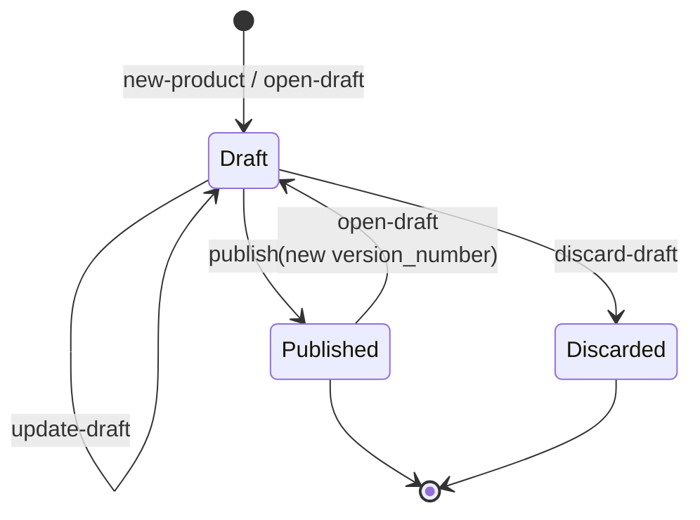

# Cash account products

## Objective

A **cash account product** is the template under which cash
accounts are opened — it defines the currency, the balance
buckets the account will carry, the interest rate, the
payment-address schemes accepted, and so on. Products are
bank-scoped (each bank defines its own) and **versioned**:
terms change over time, but accounts opened under a previous
version keep its terms.

The bank's own chart-of-accounts entries are a separate
concern — `LedgerAccount` records owned by
`bank-ledger-account`, not products.

This TDD describes the product/version model, the
draft → published lifecycle, the immutability rule that
makes versioning load-bearing, and the connection from
account to version that pins terms forward in time.

In scope: the `bank-cash-account-product` brick; product and
version data model; lifecycle operations
(`new-product` / `open-draft` / `update-draft` /
`discard-draft` / `publish`); policy integration on draft
creation; the link from account to version.

Out of scope: cash account opening — see
[cash-accounts.md](cash-accounts.md), where accounts consume
product versions; interest accrual reading the rate, see
[interest.md](interest.md); the policy machinery itself, see
[policy-evaluation.md](policy-evaluation.md).

## Background

Banking products are not constants. Interest rates move,
fee structures evolve, compliance rules tighten. Existing
accounts cannot be retroactively repriced — that would
breach contractual T&Cs and (for retail products) the
regulatory framing under which the customer agreed to the
terms.

Two patterns answer the "products change over time" need:

1. **Edit in place.** The product record is mutable;
   updates apply to every account immediately. Wrong for
   retail banking — accounts agreed to one set of terms
   shouldn't see another.
2. **Versioned with cohorts.** The product has many
   versions; each is immutable once published; new accounts
   pick up the latest version; existing accounts stay on
   the version they were opened under. The right shape
   for retail banking.

Queenswood implements the second. Two entities matter:

- **Product** — the conceptual thing ("Premier Savings"). A
  stable product-id; everything else lives on versions.
- **Version** — a specific set of terms at a point in time
  ("Premier Savings v3 with 5.5% APR effective today").
  Once published, immutable forever.

The lifecycle: a draft is mutable until it's published or
discarded; a published version is fixed; opening a new
draft on a published product starts the next version.

## Proposed Solution

### Architecture

`bank-cash-account-product` is the brick. Internally:

- `domain.clj` — record shapes, the per-product-type template
  merge, the lifecycle transitions, the immutability and
  single-draft invariants.
- `store.clj` — FDB record store, keyed by
  `[bank-id, product-id, version-id]`.
- `validation.clj` — Malli schema validation for product
  data shapes.
- `resources.clj` — the static per-product-type templates
  (loaded once from `bank-resources` on the classpath) that
  fill in a product's derived fields.
- `core.clj` — orchestrates store + domain + policy
  resolution.
- `interface.clj` — the public API.

The brick has no watchers and no commands — every operation
is a synchronous interface call from a request handler. The
lifecycle is short enough not to need eventual consistency.

### Data model

The product has no record of its own; it's implicit from the
set of versions sharing a `:product-id`. A **version** is
the unit of storage. The caller supplies `:name`,
`:currency`, `:product-type`, an effective window, and
optionally an `:interest-rate-bps` / `:iso-cash-account-type`;
the rest of the instrument terms are filled from a
per-product-type template (see `resources.clj`):

```clojure
{:bank-id
 :product-id          "prd.<ulid>"
 :version-id          "prv.<ulid>"
 :version-number      1             ;; 1, 2, 3, ...
 :status              :cash-account-product-status-draft
                      ;; or -published, -discarded
 :name                "Premier Savings"
 :allowed-currencies  ["GBP"]       ;; one currency per
                                    ;; product, wrapped in a vec
 :product-type        :product-type-sub-ledger-savings
 :balance-sheet-side  :balance-sheet-side-liability  ;; template
 :balance-products    [...]         ;; balance buckets, template
 :allowed-payment-address-schemes [...]              ;; template
 :interest-rate-bps   550           ;; 550 bps = 5.5% APR
 :iso-cash-account-type :iso-cash-account-type-svgs  ;; optional
 :effective-from      20089         ;; epoch-day (required)
 :effective-to        <epoch-day or absent>  ;; open-ended if absent
 :created-at
 :updated-at}
```

Versions are stored under the
`[bank-id, product-id, version-id]` primary key.
`get-product` returns the aggregate (`{:versions [...]}`
sorted newest-first); `active-version` returns the version
in effect on a given day — the published version whose
`[effective-from, effective-to)` window contains that day,
choosing the greatest `effective-from`. That's the version
account-opening pins (see **Effective dating** below).

### Lifecycle


```mermaid
stateDiagram-v2
    [*] --> Draft : new-product / open-draft

    Draft --> Draft : update-draft
    Draft --> Discarded : discard-draft
    Draft --> Published : publish

    Published --> [*]
    Discarded --> [*]

    Published --> Draft : open-draft<br/>(new version_number)
```

- **Draft.** Mutable — `update-draft` rewrites mutable
  fields. Only one draft per product at a time.
- **Published.** Immutable. Any attempt to update returns
  `:cash-account-product/version-immutable`.
- **Discarded.** Terminal — a draft that was abandoned;
  preserved as history rather than deleted. Re-opening a
  draft after discard creates a new version, not a new
  attempt at the discarded one.

The `Published → Draft` transition (with a fresh
`:version-number`) is `open-draft` on a product that already
has a published version. The new draft starts from scratch
field-wise; it doesn't inherit from the previous version's
data.

### Operations

- **`new-product`** — creates a product (generating a fresh
  `:product-id`) with version 1 in draft.
  Capability + count-limit checked.
- **`open-draft`** — creates a new draft version
  (`:version-number` = `inc` highest existing number) on
  an existing product. Capability checked. Refuses if a
  draft already exists for this product.
- **`update-draft`** — replaces the draft's mutable fields
  with new data. Refuses if version is not in draft state
  (the immutability gate).
- **`discard-draft`** — flips a draft to discarded.
  Terminal; the slot is freed for a new draft.
- **`publish`** — flips a draft to published.
  Capability-checked. After this, immutability holds.

The mutating operations resolve effective policies via
`bank-policy/get-effective-policies` before the domain check
— keyed by `{:bank-id ...}` for `new-product`, and by
`{:bank-id ... :cash-product-id ...}` for the version-scoped
operations. The read operations (`get-version`,
`get-product`, `get-products`, `list-templates`) are not
policy-gated. A caller may pass
`{:policies ...}` in `opts` to supply already-resolved
policies and skip the lookup.

### Why immutability matters

Cash accounts hold a `:product-id` + `:version-id`
reference. Interest accrual reads the account's version to
find the rate; available-balance derivation uses the
product-type from the version per
[transactions-and-balances.md](transactions-and-balances.md);
allowed-currencies is read off the version when validating
deposits.

If the version were mutable, those reads would silently
change behaviour for existing accounts — a customer who
signed up for 5.5% APR could find themselves earning 3.0%
overnight. Immutability forbids this. New rates require new
versions; new versions only apply to new accounts.

### Single-draft invariant

`open-draft` refuses if any draft already exists for the
product (`:cash-account-product/draft-already-exists`). One
work-stream of changes at a time. The control gate is
deliberate — parallel drafts would create the question of
"which one wins on publish?" without a clean answer.

The trade-off is that compliance and product teams can't
concurrently prepare independent changes. The argument for
the simpler model: most product changes are sequenced
edits that converge in one place anyway, and the single
draft is the natural workspace for them.

### Policy integration

Policy checks apply at draft creation/update and at publish:

- **Capability** — `:cash-account-product` with
  `{:action :cash-account-product-action-draft
    :product-type <type>}` on draft creation and update, and
  `:cash-account-product-action-publish` on publish. Lets
  policies deny the action entirely, or by product-type
  ("this bank cannot offer term-deposit products") via the
  `:product-type` filter on the capability request.
- **Count limit** — `:cash-account-product` with
  `{:aggregate :count :window :instant
    :value <existing+1>}` on `new-product`, keyed by
  `:bank-id`. Caps the number of products a bank can have.

Both flow through the same engine as every other domain
operation — see
[policy-evaluation.md](policy-evaluation.md).

### Connection to accounts

When `bank-cash-account/open-account` opens an account, it
reads the published version of the chosen product and
stores both `:product-id` and `:version-id` on the account
record. From then on, every operation on that account that
needs product terms (interest rate, currency check,
balance-bucket layout) reads the version directly via
`get-version`.

A subsequent `open-draft` + `publish` on the same product
creates a new version. The old account keeps reading its
own `:version-id`; only newly-opened accounts see the new
version. This is what gives the cohort property: accounts
are pinned to the version they were opened under, and the
pinning is immutable as long as the version itself is.

The product-version cache — 60-second TTL, see
[interest.md](interest.md) — sits in front of these reads
on hot paths.

### Effective dating

A version carries an `effective-from` (required) and an
optional `effective-to`, both epoch-day ints. They
define the window over which the version is the **active**
one. Publishing alone doesn't make a version live: the
active version on a given day is the published version whose
`[effective-from, effective-to)` window contains that day,
breaking ties by the greatest `effective-from` (then version
number).

Account opening resolves `active-version` for *today*
(`utility/today`) and pins it. A future-dated version is
published but dormant until its `effective-from`; an expired
one (past its `effective-to`) drops out. Overlap needs no
mutation of older versions — the latest-effective-from rule
selects the right one. Validation enforces the window at
draft creation and update: `effective-from` is required, and
`effective-to`, when present, must fall strictly after it.

## Alternatives Considered

- **Edit in place.** One product record, mutable. Rejected
  — breaks retail T&Cs and is regulatorily fraught.
  Cohorting by version is the standard answer to changing
  terms over time.
- **Per-account terms.** Every account carries its own
  rate, fees, allowed-currencies, etc. Rejected — no
  central place to change terms for new accounts; no audit
  trail of when product terms shifted; deduplicates the
  same data per account.
- **Single-version product with explicit rate-change
  events.** One product record; rate changes recorded as
  events that apply to specific cohorts. Rejected — the
  cohort definition becomes a separate concept; the
  versioned-product-with-cohort-by-version model
  collapses cohort-management into the product model
  itself.
- **Many concurrent drafts per product.** Compliance and
  product teams could prepare independent changes in
  parallel. Rejected — creates the "which draft becomes
  published?" problem without a clean answer. Single-draft
  is a deliberate gate.
- **Product as opaque blob.** Terms stored as a freeform
  map; brick doesn't interpret. Rejected — interest needs
  a typed rate, account opening needs the currencies and
  balance-products list, available-balance derivation
  needs the product-type. Structured fields are right.
- **Versions stored in `bank-cash-account` (not their own
  brick).** Versions and accounts share a lifecycle.
  Rejected — products and accounts are different
  concerns: a product author and an account holder are
  different actors; bricks separate accordingly.

## Known Limitations

- **Discarded drafts accumulate.** No cleanup. They're
  kept as history, but if a bank rapid-iterates
  and discards many drafts, the version list grows
  without bound. Worth a cleanup or archival pass at some
  threshold.
- **No version-comparison helper.** "What changed between
  v2 and v3?" is left to callers (or to UIs reading the
  versions and diffing fields).
- **Template buckets are trusted, not validated.** The
  brick stores whatever `:balance-products` the
  per-product-type template supplies and the
  cash-account-opening code creates exactly those buckets;
  it never checks they suit the product-type. A bad template
  would mis-shape every account opened under it.
- **One product is one currency.** A version pins a single
  currency (stored as a one-element `:allowed-currencies`)
  and a single `:interest-rate-bps`. Offering the "same"
  product in another currency means a separate product —
  there is no multi-currency product with per-currency rates
  (see [interest.md](interest.md) Known Limitations).
- **Product templates are static and global.** A fixed
  per-product-type menu (`list-templates`, backed by
  classpath resources) fills in a product's derived fields,
  but a bank can't author or customise its
  own templates — they are the same for every bank and only
  change with a redeploy. Intended to move to per-bank FDB
  records later.
- **The single-draft invariant has no override.** If two
  product changes genuinely need parallel work, there's
  no escape hatch. Could be lifted later with explicit
  conflict resolution; today it's a hard rule.
- **No explicit retirement status.** A version's
  `effective-to` already time-boxes it — set it to stop new
  accounts opening after a date (once it passes,
  `active-version` returns nil) — but there is no
  product-level `retired` flag. Retirement is per-version and
  date-driven, not an immediate status toggle.

## References

- [ADR-0002](../adr/0002-foundationdb-record-layer.md) —
  FoundationDB Record Layer (version storage, indices)
- [ADR-0005](../adr/0005-error-handling-with-anomalies.md)
  — Error handling with anomalies (version-immutable,
  draft-already-exists rejections)
- [transactions-and-balances.md](transactions-and-balances.md)
  — Transactions and balances (`:balance-products` defines
  bucket shapes; product-type drives `available-balance`)
- [interest.md](interest.md) — Interest accrual (consumes
  `:interest-rate-bps` from the version)
- [policy-evaluation.md](policy-evaluation.md) — Policy
  evaluation (draft capability, count limit)
- `bank-cash-account-product` brick interface
