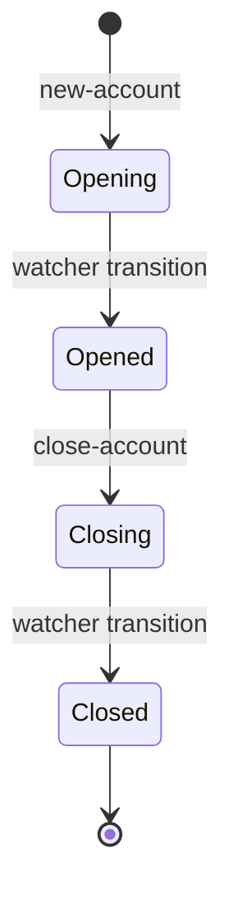

# Cash accounts

## Objective

A **cash account** is what a party holds and transacts
through. It's pinned to a published version of a product
([cash-account-products.md](cash-account-products.md)), set
in a specific currency, owned by an active party
([parties.md](parties.md)), and addressable via one or more
payment-address schemes (today: SCAN — UK Sort Code +
Account Number). Opening and closing are watcher-driven
lifecycle transitions; balances and transactions live in
their own bricks but everything points back to the account.

This TDD describes the cash account model: the four-way
join (organisation, party, product-version, currency), the
account lifecycle, the SCAN address generation, and the
distinction between *product-type* (from the product) and
*account-type* (from the party) that policies can filter on.

In scope: the `bank-cash-account` brick; account data model;
opening and closing flow; watcher-driven status transitions;
SCAN address generation; lookups (by id, by BBAN, by type);
balance-bucket creation at open time.

Out of scope: balances themselves (covered in
[transactions-and-balances.md](transactions-and-balances.md));
the legs that affect them
([payments.md](payments.md),
[interest.md](interest.md));
the payment-address scheme details (FPS / SCAN / BBAN
specifics belong in the payments TDD).

## Background

A cash account sits at the join of four concerns:

- **The organisation** — the multi-tenant boundary; every
  account belongs to exactly one.
- **The party** — the holder; person parties hold *personal*
  accounts, organisation and internal parties hold
  *business* accounts.
- **The product version** — pinned at open time and read for
  every product-derived behaviour (currency rules, allowed
  schemes, interest rate, balance-bucket layout).
- **The currency** — exactly one per account; multi-currency
  means multiple accounts.

Two type dimensions are easy to confuse:

- **`:product-type`** — from the product
  (current / savings / term-deposit / settlement / internal).
- **`:account-type`** — from the party
  (personal / business). Derived: person party → personal,
  non-person → business.

Policies (and downstream behaviour like available-balance
derivation) reason about both: "this organisation can open at
most N personal current accounts in GBP" filters on
product-type, account-type, and currency.

The lifecycle is two-step at both ends. Opening writes the
account in `:opening` status; a changelog watcher then
transitions it to `:opened`. Closing writes `:closing`; the
same watcher transitions to `:closed`. The pattern is the
same reactive choreography parties use for IDV
([parties.md](parties.md)) — and exactly the use case
ADR-0008 describes.

## Proposed Solution

### Architecture

`bank-cash-account` is the brick. Files:

- `domain.clj` — record shape, lifecycle transitions, the
  validation chain (product / currency / party).
- `store.clj` — FDB record store; primary index on
  account-id; secondary indices on BBAN and on (org,
  product-type) for lookups.
- `core.clj` — orchestration of open, get, list.
- `commands.clj` — command-pipeline handlers (the brick is
  command-processed; see
  [transaction-processing.md](transaction-processing.md)).
- `watcher.clj` — the changelog handler that flips
  opening → opened and closing → closed.
- `validation.clj` — Malli schemas for incoming data.
- `system.clj` — `defcomponents` for the processor and
  watcher.

### Data model

```clojure
{:organization-id
 :account-id        "acc.<ulid>"
 :party-id          ;; the holder
 :product-id        ;; the conceptual product
 :version-id        ;; pinned product version (immutable per ADR)
 :currency          "GBP"      ;; ISO 4217 string

 :name              ;; user-friendly label
 :product-type      :product-type-current
 :account-type      :account-type-personal
                    ;; or -business (derived from party type)
 :account-status    :cash-account-status-opening
                    ;; -opened, -closing, -closed

 :payment-addresses
 [{:scheme :payment-address-scheme-scan
   :scan {:sort-code      "040004"
          :account-number "12345678"}}]

 :bban              "04000412345678"   ;; derived from SCAN
 :created-at
 :updated-at}
```

`:bban` is denormalised from the SCAN address for the
inbound-payment lookup (see
[payments.md](payments.md) — settlement walks BBAN → account
to find the creditor on inbound webhooks). It's a secondary
index on the store.

### Lifecycle



The two-step open and close are the changelog-watcher
pattern. The processor commits the account in the
intermediate state (`:opening` or `:closing`), the changelog
fires, the watcher reads the account back and applies the
terminal transition.

### Opening flow

`new-account` runs in one FDB transaction:

1. Resolve effective policies for the organisation.
2. Load the **product** (the published version chosen by
   the caller). Refuse if missing or not published.
3. Load the **party**. Refuse if not active (parties TDD).
4. **Validate currency** against the product's
   `:allowed-currencies`.
5. **Capability check** — `:cash-account` with
   `{:action :cash-account-action-open
     :account-type <derived>}`.
6. **Count limits** — two checks:
   - Per-organisation total ("at most 100,000 accounts").
   - Per-(org, product-type, account-type, currency)
     combination ("at most 10 personal GBP current
     accounts per org").
7. **Generate payment addresses** from the product's
   `:allowed-payment-address-schemes`. For SCAN, the
   `address-fountain-fn` produces a fresh account-number
   under the bank's sort-code.
8. Build the account record in `:cash-account-status-opening`,
   with `:bban` derived from the SCAN.
9. Build **opening balances** — one Balance per
   `:balance-products` entry on the product, in the
   account's currency. These create the bucket structure
   that legs land into (transactions-and-balances TDD).
10. Persist the account and the balances. Commit.

The status is `:opening`. The changelog fires on commit; the
watcher consumes it.

### Watcher transitions

`cash-account-changelog-handler` watches the account
changelog and acts on `:status-after`:

- `:cash-account-status-opening` → flip to `:opened`.
- `:cash-account-status-closing` → flip to `:closed`.

The handler is a single function; the two terminal
transitions share the same pattern. Each transition is one
FDB transaction (the watcher reads the account, applies the
domain transition, saves).

### Closing flow

`close-account`:

1. Resolve policies.
2. Load the account.
3. **Capability check** — `:cash-account` with
   `{:action :cash-account-action-close
     :account-type <existing>}`.
4. Apply `domain/close-account` — flips to
   `:cash-account-status-closing`.
5. Persist. Commit.

The watcher fires on the changelog; closes to
`:cash-account-status-closed`.

The current implementation does not ship a balance-must-be-
zero invariant — closing a non-empty account is a caller-
side discipline today (see Known Limitations).

### SCAN address generation

For the SCAN scheme:

- **Sort-code** — Queenswood uses a single configured sort
  code (`040004` is the default constant in domain code).
- **Account-number** — generated by an
  `address-fountain-fn` passed in by the caller. The
  fountain is responsible for uniqueness within the sort
  code; the brick doesn't second-guess.

The generated SCAN is bundled into the account's
`:payment-addresses` vector and the BBAN is derived
(`<sort-code><account-number>`). BBAN is the lookup key for
inbound payments arriving via FPS (payments TDD).

### Lookups

Three indexed reads on the store:

- **`get-account`** by `(organization-id, account-id)` —
  primary key.
- **`get-account-by-bban`** — secondary index on BBAN.
  Used by the payment-event processor on inbound webhooks
  to identify the creditor.
- **`get-account-by-type`** by `(organization-id,
  product-type)` — used by the interest brick to find the
  organisation's settlement account
  ([interest.md](interest.md)).

The `get-account-by-type` index is documented as "caller
should expect at most one result" — it's the bank's *one*
settlement-typed account per organisation, not a general
multi-result query.

### Account-type vs product-type — why both

The two dimensions are orthogonal and both are useful in
policy:

- **product-type** comes from the version: a *current*
  account, a *savings* account.
- **account-type** comes from the party: a *personal*
  account, a *business* account.

A personal current account and a business current account
share product-type but differ in account-type. A personal
current account and a personal savings account share
account-type but differ in product-type. Policies that
filter on both can express rules like "personal customers
can have at most three current accounts per currency" or
"business customers cannot open term-deposit accounts of
this product-version."

The brick derives `:account-type` automatically from the
party. It's not a caller input — there's no override for
opening a "personal" account against a non-person party.

### Connection to balances and the rest of the system

At open time the brick writes one Balance record per
`:balance-products` entry on the product version. From then
on, every leg posted (transfers, fees, interest accrual,
inbound/outbound settlement) lands in one of those buckets.

The account itself doesn't carry monetary state — that
lives entirely in `bank-balance` (transactions-and-balances
TDD). The account is the *identity* and *terms reference*
the legs need to find the right buckets.

## Alternatives Considered

- **Synchronous open (no watcher).** Open account in one
  step; everything happens in the create handler.
  Rejected — couples open-time side effects to the
  request handler, weakens the changelog-as-source-of-
  truth story (ADR-0008), and loses the testable
  separation between persistence and post-creation work.
- **Combine product-type and account-type into a single
  enum.** Replace the two-dimensional split with one flat
  set ("personal-current", "business-savings", and so on).
  Rejected — collapses two genuinely independent
  classifications into a combinatorial enum that grows by
  multiplication; loses the ability for policy to filter
  on either dimension cleanly.
- **Multi-currency on a single account.** One account
  record carrying balances in many currencies. Rejected —
  every operation that deals with currency would have to
  pick one; lookups by currency become fan-outs; the
  per-(account, currency) bucket model in
  transactions-and-balances breaks. Multi-currency is
  expressed as multiple accounts.
- **IBAN as the only payment-address scheme.** International
  standard; cleaner than per-country variants. Rejected —
  UK FPS settlement uses BBAN/SCAN; integrating without it
  isn't possible. IBAN is a future addition (see Known
  Limitations).
- **Account number generation inside the brick.** A built-in
  fountain instead of a pluggable fn. Rejected — the
  fountain has bank-wide uniqueness concerns that belong
  outside the per-organisation account brick (the same
  sort-code spans all organisations on this clearing
  identity).
- **Caller-supplied account-type.** Let the API accept the
  account-type instead of deriving it. Rejected — the
  derivation is by design (a person party gets a personal
  account; the bank doesn't open business accounts for
  individuals or vice-versa). An override would be a foot-
  gun.

## Known Limitations

- **SCAN is the only payment-address scheme implemented.**
  IBAN, BIC, and other international schemes are listed as
  enum values in some places but not generated. Cross-
  border payments are out of scope today.
- **Account-number generation is uninterpreted by the
  brick.** The `address-fountain-fn` is responsible for
  uniqueness; the brick assumes the fountain delivers a
  unique number. A buggy fountain would produce duplicate
  BBAN — caught at the FDB index level via the secondary
  index, but only at insert time.
- **Default sort-code is hardcoded** in `domain.clj`
  (`"040004"`). Bank-routing flexibility (multiple sort
  codes, dynamic routing) isn't supported. Acceptable
  while Queenswood operates under one clearing identity.
- **Suspension isn't a lifecycle state.** The status enum
  hints at suspend/reopen actions (the policy
  capability vocabulary mentions them), but the lifecycle
  today is open/close only. Operationally, the difference
  between "this account is frozen pending review" and
  "this account is closed" matters and isn't expressible.
- **No balance-must-be-zero check on close.** Closing an
  account with a non-zero posted balance is permitted by
  the brick. Caller-side discipline today; should likely
  become a domain invariant or a configurable policy.
- **No re-open after close.** Closed is terminal. A party
  who closes an account and wants it back must open a
  fresh one with a new account-id and new SCAN.
- **No payment-address rotation.** SCAN is generated once
  at open time and stays for the account's life. Replacing
  it (after a fraud event, for example) isn't supported.
- **Account-number recycling after closure isn't
  specified.** Whether the closed account's number returns
  to the fountain or stays retired is up to the fountain
  implementation.
- **`account-type` derivation is rigid.** Always
  person → personal, non-person → business. No way to
  open a "business" account on behalf of a person party
  (e.g. a sole trader with their own legal entity).
- **No party-active re-validation on long-lived accounts.**
  The party's status is checked at open time only. If the
  party is later suspended (when that lifecycle exists),
  the account doesn't automatically reflect that — caller
  policy would need to re-check.
- **Get-account-by-type assumes "at most one".** The
  index works for the bank's per-org settlement account
  pattern but isn't a general multi-result query. Other
  product-types (multiple savings accounts per org, for
  instance) need a different lookup.
- **No inactivity / dormant flow.** Real banks have
  regulatory regimes around dormant accounts (no activity
  for N years → flagged → closed → escheated). None of
  that is modelled.

## References

- [ADR-0002](../adr/0002-foundationdb-record-layer.md) —
  FoundationDB Record Layer (account storage, secondary
  indices on BBAN and product-type)
- [ADR-0008](../adr/0008-changelog-watchers.md) —
  Changelog watchers (the lifecycle transitions)
- [parties.md](parties.md) — Parties (account-type
  derivation; active-only opens)
- [cash-account-products.md](cash-account-products.md) —
  Cash account products (the version pinned at open time)
- [transactions-and-balances.md](transactions-and-balances.md)
  — Transactions and balances (balance buckets created at
  open time; the legs that affect them)
- [payments.md](payments.md) — Payments (BBAN lookup for
  inbound settlements)
- [interest.md](interest.md) — Interest (settlement-account
  lookup by product-type)
- [policy-evaluation.md](policy-evaluation.md) — Policy
  evaluation (open / close capability and count limits)
- `bank-cash-account` brick interface
