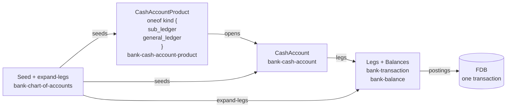
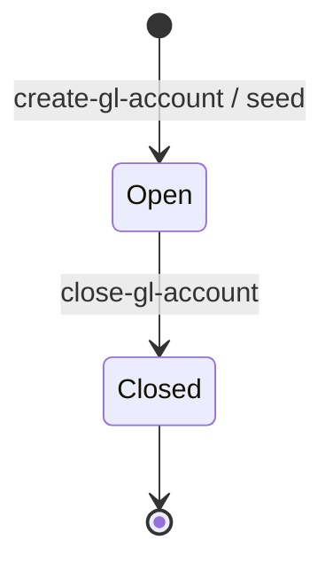

# Chart of accounts

## Objective

A bank keeps its own books. Customer cash-accounts are *what
the bank sells*; they are not *the bank's books*. The bank's
books are a chart of accounts — a structured set of
general-ledger (GL) accounts grouped Asset / Liability /
Equity / Income / Expense — against which every customer
movement, every fee, every interest accrual, every
settlement-clearing event posts as double-entry journals.

Today Queenswood approximates the bank's books with a per-bank
`:product-type-settlement` cash-account-product (holding
`interest-payable`) and a `:product-type-internal`
cash-account-product (holding suspense). The shape works for
the single banking flow it was built for, but it has no
chart-of-accounts vocabulary, no A/L/E/I/E grouping, no
double-entry enforcement, and no symmetric counter-leg for
fees (transactions-and-balances calls this out: *"a fee today
is one debit leg with no matching credit"*).

This TDD introduces a first-class **chart of accounts** as a
per-bank artefact, a new `bank-chart-of-accounts` brick to
own the GL account entity and the canonical template, the
**sub-ledger / GL split** that keeps customer cash-accounts as
they are while routing their financial-statement effect to
per-product-type control accounts, and two invariants that
forcing functions in scenario testing prove on every run.

In scope: the `bank-chart-of-accounts` brick; GL account data
model; A/L/E/I/E grouping; per-product-type control accounts
that aggregate customer cash-accounts of each product type;
the rule that GL leg-sets must balance per currency; the
canonical seeded chart and its codes; the `:gl-control-account-id`
mapping carried on cash accounts; the reframing of today's
settlement and internal cash-account products as GL accounts
proper; the two scenario-testing invariants that prove
correctness on every run; the migration shape.

Out of scope: tenant-visible reporting surfaces (trial
balance, balance sheet, P&L) — a future PRD/TDD will consume
the GL; financial-period closing (the closing-out journal that
flips accumulated income/expense into retained earnings);
multi-segment / cost-centre GL; export to external accounting
systems; Queenswood-the-platform's own books (SaaS
subscription / usage revenue) — a separate platform-level
concern not exposed in tenant APIs.

## Background

The bank-in-a-box positioning makes the tenant itself a bank.
That tenant needs to see and reconcile **its own** books, not
just its customers' balances. Real core-banking systems are
built around two distinct artefacts:

- A **sub-ledger** — per-customer detail at instrument
  granularity (every customer cash-account, every loan, every
  card). The customer-facing balance lives here.
- A **general ledger** — the bank's own books, organised by
  the chart of accounts (A/L/E/I/E), recording every financial
  effect of every sub-ledger movement and every bank-only
  event (P&L, equity).

The sub-ledger answers *"what does this customer have?"*; the
GL answers *"what does the bank own and owe, and what did it
earn and spend?"*. Both are needed; neither subsumes the
other.

The shape today reflects a single-ledger view that has not
distinguished the two:

- Cash-account products carry `:balance-sheet-side`
  (`-asset` / `-liability`). The axis is named on the product
  but doesn't compose into a full chart and doesn't drive
  posting validation.
- The settlement cash-account-product is the *only* place
  the bank's liability to customers (interest-payable) is
  recorded symmetrically.
- The internal cash-account-product carries a suspense bucket
  but no income accounts, expense accounts, or equity.
- One-sided legs are accepted — a fee posts as a single debit
  against the customer with no paired credit to a fee-income
  account. The bank's P&L isn't modelled symmetrically.
- `bank-interest`'s six-leg capitalisation already shows the
  pattern that a real GL forces everywhere — paired movements
  across customer and bank sides. The pattern is correct; it
  just needs a first-class home.

The pivot is to introduce that home: a chart of accounts the
bank owns and structures, a GL brick that records postings
against it, and a discipline that every customer-side leg
generates the paired GL legs that keep the bank's books
balanced.

## Proposed Solution

### Architecture

The chart of accounts is **modelled inside
`bank-cash-account-product`** via a discriminated-union
(`oneof kind`) on the product, mirroring how `Limit` is
modelled in `bank-policy`. There are two kinds of
cash-account-product:

- **Sub-ledger product** — the template for customer-facing
  instruments. Carries product-type
  (current / savings / term-deposit), balance-sheet-side,
  balance-products, allowed-payment-address-schemes,
  interest-rate-bps, and ISO 20022 cash-account-type. Each
  instance spawns many customer cash-accounts (one per
  customer).
- **GL product** — the template for bank-owned GL accounts.
  Carries gl-code, gl-account-type, gl-account-class,
  required, parent-gl-code, sub-ledger-kind. Each instance
  spawns exactly one CashAccount (the GL account itself).

Both kinds share identity and lifecycle fields (name, status,
version-number, timestamps) and the existing draft → published
→ discarded lifecycle.

A **`CashAccount`** record is the storage unit for both
customer and GL accounts; the kind is implied by the account's
product. The record carries shared fields (`bank_id`,
`account_id`, `currency`, `name`, `account_status`,
`party_id`, `product_id`, `version_id`) and sub-ledger-only
fields (`payment_addresses`, `bban`, `gl_control_account_id`
pointing at the customer's matching control). GL-discriminator
fields live on the product, not on the account.

`bank-chart-of-accounts` is a **thin veneer** over
`bank-cash-account-product` and `bank-cash-account`:

- Owns the canonical template (data) — the seven-row CoA
  every bank starts with
- `seed!` provisions one GL product per template row per
  currency, each spawning one GL account
- `expand-legs` performs paired-leg construction at posting
  time, following each customer-account leg with a
  control-account leg
- `mandatory?` predicate consults the seeded template



`bank-transaction` and `bank-balance` treat customer
cash-accounts and GL accounts uniformly — both are
`CashAccount` `account_id`s, and the existing balance-bucket
model `(account-id, balance-type, balance-status, currency)`
carries GL bucket totals exactly as it carries customer bucket
totals. The bricks don't distinguish.

The CoA is **per-bank**. Each tenant defines its own structure
within the fixed A/L/E/I/E top-level grouping. Banks on the
same platform never share a CoA — each one is its own books.

### Five classes and the code convention

Five top-level classes, numbered by convention:

| Range | Class     | Normal side |
|-------|-----------|-------------|
| 1xxx  | Asset     | Debit       |
| 2xxx  | Liability | Credit      |
| 3xxx  | Equity    | Credit      |
| 4xxx  | Income    | Credit      |
| 5xxx  | Expense   | Debit       |

The numbering is **convention, not enforcement** — codes are
free-form strings within a bank, but the seeded chart follows
the convention and downstream tooling (reporting,
trial-balance ordering) expects it. A bank that picks
different codes for its custom accounts is free to do so; a
bank that picks `4xxx` for an expense is asking for a
confusing trial balance.

### Data model

`CashAccountProduct` carries a `oneof kind` that determines
whether the product spawns customer accounts or a GL account:

```protobuf
message CashAccountProduct {
  // shared identity + lifecycle
  required string bank_id = 1;
  required string product_id = 2;
  required string version_id = 3;
  required int32 version_number = 4;
  required CashAccountProductStatus status = 5;
  required string name = 6;
  optional string valid_from = 7;
  repeated string allowed_currencies = 8;
  required int64 created_at = 9;
  required int64 updated_at = 10;
  optional int64 discarded_at = 11;

  oneof kind {
    SubLedgerProductKind sub_ledger = 20;
    GeneralLedgerProductKind general_ledger = 21;
  }
}

message SubLedgerProductKind {
  required ProductType product_type = 1;
                                       // current, savings, term-deposit
  required BalanceSheetSide balance_sheet_side = 2;
  repeated BalanceProduct balance_products = 3;
  repeated PaymentAddressScheme allowed_payment_address_schemes = 4;
  optional int32 interest_rate_bps = 5;
  optional IsoCashAccountType iso_cash_account_type = 6;
}

message GeneralLedgerProductKind {
  required string gl_code = 1;                  // "1100", "2400", ...
  required GlAccountType gl_account_type = 2;
                                       // A/L/E/I/E (one of the five classes)
  required GlAccountClass gl_account_class = 3;
                                       // detail, summary, control
  required Required required = 4;       // mandatory, optional
  optional string parent_gl_code = 5;           // summary hierarchy
  optional SubLedgerKind sub_ledger_kind = 6;
                                       // only on control accounts
}
```

The shared fields stay on the outer message (matching the
`Limit` proto pattern). Kind-specific fields live in the
variant where they apply.

`CashAccount` is a single record type for both customer and
GL accounts, with the kind implied by the account's product:

```protobuf
message CashAccount {
  // shared identity + lifecycle
  required string bank_id = 1;
  required string account_id = 2;
  required string party_id = 4;
  required string product_id = 5;
  required string version_id = 6;
  required string currency = 9;
  required string name = 8;
  required CashAccountStatus account_status = 10;
  required int64 created_at = 13;
  required int64 updated_at = 14;

  // cached from product for fast lookups
  optional ProductType product_type = 7;

  // sub-ledger-specific (nil/empty on GL accounts)
  optional AccountType account_type = 3;        // personal, business
  repeated PaymentAddress payment_addresses = 11;
  optional string bban = 12;
  optional string gl_control_account_id = 15;
                                       // pointer to control GL account
}
```

Notes:

- **`gl_code`, `gl_account_type`, `gl_account_class`,
  `required`** live on the product's `general_ledger`
  variant, not on the account record. Reading them is one
  product-version cache hit — 60-second TTL, see
  [interest.md](interest.md).
- **`gl_control_account_id`** is the direct pointer to a
  customer cash-account's matching control GL account.
  Resolved at open-time by chasing
  `:product-type` → control-code → GL product → GL account.
  Stored on the account as a denormalised cache so
  `expand-legs` is a single lookup at posting time, not a
  four-hop chain. Customer accounts have it set; GL accounts
  leave it nil.
- **`product_type`** stays denormalised on customer accounts
  for the existing
  `CashAccount_by_bank_product_type` /
  `CashAccount_count_by_bank_product_account_type_currency`
  indices. GL accounts leave it nil (or set to a sentinel
  the indices skip).
- **`account_type`** (personal / business) only applies to
  customer accounts and is derived from the holder party.
  Nil on GL accounts (the bank's own org-party isn't
  personal-or-business in the customer-classification sense).
- **`gl_account_class`** distinguishes three roles:
  - `detail` — leaf, accepts legs.
  - `summary` — rolls up children, never receives legs
    directly.
  - `control` — special leaf that aggregates a sub-ledger.
    Detail lives elsewhere (in customer cash-accounts); the
    control account is the GL's single line item for that
    sub-ledger cohort.
- **`sub_ledger_kind`** is set only on control products.
  Today's kinds are `cash-account-current`,
  `cash-account-savings`, `cash-account-term-deposit` — one
  per cash-account product type. Loans, cards, and other
  future instruments add new kinds.
- **Normal side** is *derived*, not stored — assets and
  expenses are debit-normal; liabilities, equity, and income
  are credit-normal. Reporting derives at read time.
- **`currency`** lives on the CashAccount record (one
  currency per account). A multi-currency GL "position"
  (e.g. "all of Interest payable") is computed as the sum
  of per-currency GL accounts under the same gl-code prefix
  or summary parent. There's no shared-currency
  product/account at any layer.

### The seeded standard chart

Every bank starts with a minimal seeded CoA — enough to
support the existing payment and interest flows without manual
setup. The bank can extend it freely; the seeded accounts
cannot be deleted (status flip only).

| Code | Name                              | Type      | Class   |
|------|-----------------------------------|-----------|---------|
| 1100 | Cash at correspondent             | Asset     | Detail  |
| 1200 | Pending outbound payments         | Asset     | Detail  |
| 1300 | Accrued fees receivable           | Asset     | Detail  |
| 2100 | Customer deposits — current       | Liability | Control |
| 2200 | Customer deposits — savings       | Liability | Control |
| 2300 | Customer deposits — term deposits | Liability | Control |
| 2400 | Interest payable                  | Liability | Detail  |
| 2500 | Suspense — unreconciled inbound   | Liability | Detail  |
| 3100 | Retained earnings                 | Equity    | Detail  |
| 4100 | Fee income                        | Income    | Detail  |
| 5100 | Interest expense                  | Expense   | Detail  |

Normal side follows from type per the convention table above
(A and E are debit-normal; L, Eq, I are credit-normal).
`5100` is interest expense paid to customers; the name is
shortened from "Interest expense (paid to customers)" in
display to fit narrow views.

The three control accounts (2100 / 2200 / 2300) — one per
customer-deposit product type — each carry a
`:sub-ledger-kind` matching their product type. Customer
cash-accounts of the corresponding product type roll up to
their respective control account.

`1100 — Cash at correspondent` is the bank's own settlement
account at its clearing rail — the ISO 20022
`ExternalCashAccountType1Code` value `SACC` (*"Account used
to post debit and credit entries, as a result of
transactions cleared and settled through a specific clearing
and settlement system"*). For a directly-connected bank, it
is the bank's account at the central-bank RTGS or scheme
operator; for an indirect-access bank, it is the bank's view
of its position with its sponsor — the same position appears
on the sponsor's books as `CPAC` ("clearing participant
account").

A bank participating in more than one scheme adds per-scheme
children — 1101 FPS-SACC, 1102 CHAPS-SACC, and so on — each
typed as a `default/posted` asset detail. The seed creates a
single 1100 by default, sufficient for an FPS-only deployment.

The seeded set is small on purpose. A bank that wants finer
breakdown (per-currency cash-at-correspondent children,
per-business-line expense buckets, multi-tier savings-product
sub-controls) extends the CoA itself.

### Sub-ledger / GL split

Customer cash-accounts remain the **sub-ledger** for the
matching control account. The link is the
`:gl-control-account-id` on each customer cash-account, derived at
open time from the product's `:product-type`:

| Product type           | Control code |
|------------------------|--------------|
| current                | 2100         |
| savings                | 2200         |
| term-deposit           | 2300         |

The mapping is a property of the bank's CoA (callable through
`bank-chart-of-accounts`'s
`control-code-for-product-type`), not a constant. A bank that
re-codes its CoA — moving "current accounts" from 2100 to
2110, say — re-points the mapping; existing cash accounts
keep their `:gl-control-account-id` field as the value at open
time, and a migration step re-points old accounts if needed.

`:product-type-settlement` and `:product-type-internal`
cease to exist as customer-facing product types after the
reframe — see "Reframing today's bricks" below.

### Balance buckets per account class

The bucket model `(balance-type, balance-status, currency)`
applies to every account; what differs by account class is
*which* buckets are maintained.

**Customer cash-accounts** carry the existing five-bucket
layout (unchanged from today):

| Balance type        | Statuses                                         |
|---------------------|--------------------------------------------------|
| `default`           | `posted`, `pending-incoming`, `pending-outgoing` |
| `interest-accrued`  | `posted`                                         |
| `interest-paid`     | `posted`                                         |

`available-balance` derives the customer-visible spendable
amount by summing buckets per product type — see
[transactions-and-balances.md](transactions-and-balances.md).
This logic is unchanged by the reframe; only the
`:product-type-settlement` and `:product-type-internal`
branches drop, since those product types retire.

**GL control accounts (2100 / 2200 / 2300)** mirror the
sub-ledger's *deposit* movements only:

| Balance type | Statuses                                            |
|--------------|-----------------------------------------------------|
| `default`    | `posted`, `pending-incoming`, `pending-outgoing`    |

Only the `default` balance-type mirrors. Customer
`interest-accrued` and `interest-paid` legs do *not*
auto-pair to a control bucket — interest lives on dedicated
GL accounts (2400) and the sub-ledger detail on the customer
side, with no third home on the control. This avoids
double-counting interest as both `2100.interest-accrued` and
`2400.default`.

**GL detail accounts** (1100, 1200, 1300, 2400, 2500, 3100,
4100, 5100) carry one bucket each:

| Balance type | Statuses |
|--------------|----------|
| `default`    | `posted` |

The account's *identity* carries what `balance-type` encodes
on customer and control accounts. Pending semantics are
expressed by separate GL accounts where business value exists
(1200 *Pending outbound payments* is its own asset account,
distinct from 1100 *Cash at correspondent*) rather than by a
pending status on a single account. A bank can add
`pending-incoming` / `pending-outgoing` to a `default`-typed
GL detail account if a real use case appears; the seeded
chart uses posted-only throughout.

**`:balance-type-interest-payable`** as an enum value retires
with the reframe. Its today-use on the settlement
cash-account is replaced by GL 2400's standard
`default/posted` bucket; the conceptual role of "what we owe
customers in interest" is recorded there directly, not via a
typed bucket on a separate account.

### The two invariants

Two invariants must hold after every commit. Both are
asserted as `nom-test>` assertions inside
`bank-test-scenarios` and run on every scenario, end-to-end.

**Invariant 1 — Double-entry.** For every transaction whose
leg-set touches a GL account, per currency:

```
Σ debit-amount = Σ credit-amount
```

**Invariant 2 — Sub-ledger ↔ control.** For each control
account (2100 / 2200 / 2300), per (balance-status, currency),
after every commit:

```
control balance per (default, status, currency)
  =
Σ default balance per (status, currency)
  across every open customer cash-account
  whose :gl-control-account-id points to this control
```

Same-side mirror plus the bucket-per-bucket pairing rule means
this reconciles per status independently — the posted bucket
on 2100 equals the sum of customer posted defaults; the
pending-outgoing bucket on 2100 equals the sum of customer
pending-outgoing defaults; and so on.

A third reconciliation falls out for interest, not enforced as
a hard invariant but asserted in interest-specific scenarios:

```
2400 balance per currency
  =
Σ interest-accrued/posted balance per currency
  across every open customer cash-account
```

Held by the discipline that every accrual posts both
(credit 2400, credit customer interest-accrued) in the same
transaction; broken cleanly by the scenario assertion if the
discipline lapses.

The first invariant is enforced *in the commit path* —
imbalanced GL postings reject before commit. The second is
enforced *by construction* — the leg-recording pipeline
automatically appends the paired control-account leg whenever
a customer cash-account `default` leg is recorded — and
*verified on every scenario* through the `nom-test>`
assertion.

The scenario-testing invariant is the forcing function: any
code change that breaks sub-ledger / control reconciliation
fails every scenario, not just the one that introduced the
bug. See
[scenario-testing.md](scenario-testing.md) for the testing
mechanism the invariant uses.

### Double-entry enforcement

A **GL posting** is a set of legs against accounts (one or
more) such that, for each currency, debits sum to credits.

`bank-transaction-processor`'s `record-transaction` command
is extended with one new check:

- If every leg in the posting targets a customer cash-account
  (no GL legs): existing behaviour — legs aren't checked.
- If any leg targets a GL account (mixed customer+GL or
  GL-only): the full leg-set must balance per currency.
  Imbalanced postings reject with `:gl/imbalanced` before
  commit.

The asymmetry is deliberate. The customer sub-ledger today
works fine without a strict double-entry check; tightening it
would require modelling P&L counter-legs for many flows
that don't have them today, a wide refactor for little gain.
The GL is the bank's own books, where strict balance is the
whole point and the alternative is undetected drift in the
financial statements.

In practice, after the reframe every customer-touching
transaction is also a GL transaction (the paired control leg
fires), so every transaction goes through the strict check.
The relaxation remains as a property of the substrate —
neither brick has hardcoded GL knowledge — rather than as a
guarantee the caller has to think about.

### Paired-leg construction

When a customer cash-account leg is recorded, the pipeline
derives and appends the **paired control-account leg** before
the balance check. The mirror is **same side**, same amount,
same `(balance-type, balance-status, currency)`:

| Customer leg side | Control account leg |
|-------------------|---------------------|
| debit             | debit               |
| credit            | credit              |

A customer cash-account is the sub-ledger *of* the control
account's liability — they represent the same obligation at
different granularities and move in lockstep. The opposite
leg of the GL transaction lives on a *different* account
(typically `1100 Cash at correspondent` for an external
movement, or another control / customer-account for an
internal one); the control and the customer-account never
oppose each other.

Worked example — £100 inbound deposit to a current account:

```
;; sub-ledger leg (not GL-balance-checked)
CREDIT customer-acc default / posted                    100  GBP

;; auto-paired control leg (GL)
CREDIT 2100 Customer deposits — current  default / posted  100  GBP

;; GL-only leg (the opposite side of the journal)
DEBIT  1100 Cash at correspondent         default / posted  100  GBP

;; GL balance check: debit 100 = credit 100 ✓
```

The control account is found via the customer cash-account's
`:gl-control-account-id`. Pairing is automatic and server-side; the
leg-recording API accepts the customer-side legs and the
pipeline appends the matching control legs and validates the
combined set balances.

A caller that posts only customer legs (e.g. an internal
transfer between two current-account customers) gets the full
GL posting written transparently — the two paired control
legs net against each other on 2100 and the GL balance check
passes without any GL-only leg. A caller that *also* writes
GL legs (an interest accrual posting, say) writes them in the
same call; the pairing combines naturally — the customer
leg's paired control leg is appended, the GL-only legs join
it, and the full set is balance-checked.

The amount, currency, and balance-status on the control leg
mirror the customer leg one-for-one — but only when the
customer leg's `balance-type` is `default`. Status mirroring
means a pending customer credit shows up as a pending
control-account credit, never a posted one. Legs against
`interest-accrued` or `interest-paid` on the customer side do
*not* auto-pair to a control bucket — interest sits on
dedicated GL accounts (2400 for payable; accruals expensed
directly to 5100). See "Balance buckets per account class"
above for the per-class bucket map and the per-bucket
invariant that falls out.

### Reframing today's bricks

`:product-type-settlement` and `:product-type-internal`
cash-account-products are no longer the home for the bank's
own postings. Their buckets become GL accounts proper:

| Today                                      | After              |
|--------------------------------------------|--------------------|
| settlement / interest-payable / posted     | GL 2400            |
| settlement / default / posted              | GL 1100            |
| internal / suspense / posted               | GL 2500            |
| internal / default / posted (P&L smear)    | 3100 / 4100 / 5100 |
| "internal organisation" (the platform-bank)| per-tenant CoA     |

The "internal default / posted" row splits across retained
earnings, fee income, and interest expense by the origin of
each historical movement — a one-off reconciliation step at
migration time. The "internal organisation" concept goes away
entirely: today the platform stands up an internal bank to
hold cross-cutting books; under the new model each tenant
bank owns its own CoA and there's no platform-level bank
inside the tenant API surface.

#### Two settlement-account concepts, only one retires

The word "settlement account" carries two distinct meanings
that today's Queenswood model conflates. Untangling them is
the point of the reframe:

- **Concept A — Queenswood's internal
  `:product-type-settlement` cash-account-product.** A
  per-tenant cash-account-shaped record used as the bank-side
  counterparty for interest accrual and capitalisation. This
  is a Queenswood-specific implementation hack: it dressed
  up an internal GL position as if it were a customer-facing
  cash account so the existing transaction substrate could
  carry both sides. **This concept retires.** Its two roles
  split across GL 1100 (cash position) and GL 2400 (interest
  payable).
- **Concept B — the bank's settlement account at the
  clearing rail (ISO 20022 `SACC`).** A real banking concept,
  defined by ISO 20022 as the account used to post debit and
  credit entries that result from transactions cleared and
  settled through a specific clearing and settlement system.
  **This concept stays, and GL 1100 is it.** A bank with
  multiple scheme memberships gets per-scheme children of
  1100 — each itself a `SACC` for its respective rail.
  Indirect-access banks see 1100 as their position with their
  sponsor; the sponsor sees the same position as `CPAC`
  ("clearing participant account") on its own books.

The interest brick's settlement-account lookup
(`get-account-by-type` for `:product-type-settlement`,
rejecting with `:interest/no-settlement` when missing) goes
away with Concept A. The replacement is "find GL 2400 by
code" via `bank-chart-of-accounts`. Because 2400 is part of
the seeded chart every bank gets at creation, the not-found
rejection becomes structurally impossible rather than
runtime-checked.

Existing settlement and internal accounts stay in the data
store, marked `:cash-account-status-closed` with their
balances drained to zero by the migration. They aren't
deleted — they remain queryable for historical
reconciliation.

The interest brick's daily accrual reshapes from two legs to
three:

```
;; today (two legs: customer + settlement)
DEBIT  settlement-account  interest-payable / posted   amount
CREDIT customer-account    interest-accrued / posted   amount

;; tomorrow (three legs: customer sub-ledger + GL expense + GL liability)
CREDIT customer-account    interest-accrued / posted   amount
DEBIT  GL 5100 Interest expense       default / posted amount
CREDIT GL 2400 Interest payable       default / posted amount
```

The customer leg lives entirely in the sub-ledger and does
not auto-pair to a control bucket (interest-accrued is one of
the balance-types that does not mirror — see "Balance buckets
per account class"). The two GL-only legs balance
independently: the bank recognises the expense and books the
matching liability. The customer's per-account accrual stays
visible in the sub-ledger; the bank's aggregate liability
sits in 2400.

Capitalisation reshapes from six legs to four — three
sub-ledger movements and one GL-only debit, with one
auto-paired control leg appearing because the customer's
`default` bucket changes:

```
;; sub-ledger: customer's accrued drains, default grows
DEBIT  customer-account    interest-accrued / posted   amount
CREDIT customer-account    default          / posted   amount

;; auto-pair (default leg mirrors to control)
CREDIT GL 21x0 Customer deposits — control  default / posted  amount

;; GL-only: bank's interest payable drains into the deposit liability
DEBIT  GL 2400 Interest payable             default / posted  amount
```

`21x0` resolves at construction time via the customer
account's `:gl-control-account-id`. The GL leg-set balances:
debit 2400, credit 21x0 — the reclassification of the bank's
liability from "interest payable" to "customer deposits". The
customer's interest-accrued leg has no auto-pair (no control
mirror on interest-accrued); the customer's default leg does,
producing the control credit. No cash movement on 1100 —
capitalisation reclassifies an existing liability, it
doesn't pay it out. (Cash only moves at 1100 when the
customer subsequently spends.)

The today-six-leg flow's `:balance-type-interest-paid` transit
bucket on the customer side becomes redundant — the same
audit trail (which capitalisation moved which amount on which
date) is available by querying the transaction's legs by
`:transaction-type-interest`. The transit bucket retires; see
"Known Limitations" for the migration note.

Fees gain their counter-leg too — a fee debit against the
customer cash-account auto-pairs as a debit on the matching
control (sub-ledger keeps balancing per-bucket), and the
brick posting the fee adds a GL-only
`CREDIT GL 4100 Fee income` so the bank's P&L is recorded.
GL legs: debit 21x0, credit 4100 — liability ↓, income ↑,
balanced.

The full reshape sits behind a flag (one bank at a time) so
the migration can be staged.

### Lifecycle

A GL account moves through two states:



- **Open** — accepts legs, can be the target of postings.
- **Closed** — terminal. Rejects new legs.

Closing a GL account with a non-zero balance rejects with
`:gl/non-zero-on-close`. The caller must post a clearing
entry (typically against `3100 — Retained earnings` for
income/expense, or against another account for
assets/liabilities) before closing.

There's no draft / published distinction. A GL account is
either available for posting or not; mutability of name,
description, parent, and code is allowed while the account
has no legs, restricted to name and description once it has
legs (an audit-trail concern — codes appearing in old
postings must mean what they meant at the time).

### Currency

A `-detail` or `-control` GL account is single-currency.
Multi-currency positions live as a `-summary` parent with
per-currency children:

```
2400   Interest payable                 (summary, no currency)
├ 2400-GBP  Interest payable — GBP      (detail, currency GBP)
└ 2400-USD  Interest payable — USD      (detail, currency USD)
```

The paired-leg pipeline routes a posting in currency X to the
matching X-denominated control account child. A bank that
hasn't (yet) added a child for a currency a customer leg
arrives in rejects with `:gl/missing-currency-account`.

### ISO 20022 cash-account-type classification

ISO 20022 defines `ExternalCashAccountType1Code` — a
free-list of four-character codes classifying cash accounts
for inclusion in payment messages (`pacs.008`, `pain.001`,
`camt.053`, and others). The codes describe *what kind of
account this is for payment-rail purposes*, not what it is
on the bank's GL. Customer cash-accounts and the bank's own
1100 are both addressable by this code set, in different
roles.

Customer cash-accounts carry an `:iso-cash-account-type`
field, defaulted from `:product-type` at open time and
override-able for sub-flavours the product-type doesn't
distinguish:

| Product type   | Default ISO code |
|----------------|------------------|
| `current`      | `CACC`           |
| `savings`      | `SVGS`           |
| `term-deposit` | `LLSV`           |

Overrides worth noting: `current` → `TRAN` for a basic
transacting variant (no overdraft, no chequebook);
`savings` → `LLSV` for savings with special interest or
withdrawal terms. The `term-deposit` → `LLSV` default is the
closest standard code — `LLSV` is "savings with special
interest and withdrawal terms", which includes term deposits
but isn't specific to them.

The field is read when emitting outbound ISO 20022 messages
that reference customer accounts. It's not read by the GL —
the chart of accounts is the bank's internal books and
doesn't see ISO codes; the codes are wire-format
classifiers.

The bank's own GL 1100 *Cash at correspondent* is the
`SACC` ("settlement account") in this classification, and
its per-scheme children carry the same `SACC` code (one per
scheme). 1100 is not stored as a customer cash-account so it
doesn't carry the `:iso-cash-account-type` field — it's a GL
account, and its ISO classification follows from its role,
not from a stored attribute.

Out of scope for v1: lending products (`LOAN`, `MGLD`),
overdrafts (`ODFT`), physical cash (`CASH`), tax/charge
sub-accounts (`TAXE`, `CHAR`), virtual accounts (`VACC`).
Each adds its own product-type when Queenswood grows into
that capability; the `:iso-cash-account-type` derivation
table extends naturally.

### Brick extensions

The bricks involved:

- **`bank-cash-account-product`** (extend). Top-level
  `CashAccountProduct` shape gains the `oneof kind`
  discriminator. `new-product` / `update-draft` / `publish`
  route through the variant. Validation reads the kind to
  enforce kind-specific invariants.
- **`bank-cash-account`** (extend). `CashAccount` record
  drops `gl_code`, `gl_account_type`, `gl_account_class`,
  `required`. Gains `gl_control_account_id` (replacing
  `gl_control_code` — a direct pointer instead of a code
  lookup). `new-account` no longer accepts GL fields;
  GL-account opens still use the same call but the GL
  fields come from the product, not the input.
- **`bank-chart-of-accounts`** (existing, refactor).
  Canonical template stays as data. `seed!` creates one GL
  product per template row per currency (seven products per
  currency instead of one), each spawning one GL account.
  `mandatory?` reads `required` from the product, not the
  account. `expand-legs` follows
  `gl_control_account_id` directly — one lookup instead of
  two.
- **`bank-bank`** (extend). Bank-creation calls `seed!` to
  provision the canonical chart.
- **`bank-transaction-processor`** (extend). Every leg that
  hits a customer cash account also posts to its control
  account (via `expand-legs`). Legs can also target GL
  accounts directly. The combined leg-set is balance-checked
  when any GL leg is present.
- **`bank-schema`** (extend). New messages
  (`SubLedgerProductKind`, `GeneralLedgerProductKind`); new
  enums (`GlAccountType`, `GlAccountClass`, `Required`,
  `SubLedgerKind`, `IsoCashAccountType`); `oneof kind` added
  to `CashAccountProduct`; GL fields stripped from
  `CashAccount`. Record-types YAML adds the nested index on
  `CashAccountProduct.general_ledger.gl_code` and removes
  `CashAccount_by_bank_gl_code`.
- **`bank-test-scenarios`** (extend). The two
  invariants — double-entry and sub-ledger ↔ control — run
  as `nom-test>` assertions on every scenario.

Two product-type enum values retire at the same time:

- **`PRODUCT_TYPE_SETTLEMENT`** — its function (holding the
  bank's interest-payable) moves to GL 2400.
- **`PRODUCT_TYPE_INTERNAL`** — its function (suspense,
  bank-side P&L smear) moves to GL 2500 / 3100 / 4100 / 5100.
- **`PRODUCT_TYPE_CHART_OF_ACCOUNTS`** — also retires; the
  CoA template is no longer a single mega-product but seven
  per-row GL products. The kind discriminator replaces the
  product-type tag.

The remaining `ProductType` enum values are
`-current`, `-savings`, `-term-deposit` (still used by
sub-ledger products to drive interest-rate, balance-bucket
layout, available-balance derivation, etc.).

### Migration

There are no production deployments today; the refactor lands
as a code-only change. Existing tests are updated to use the
new shape; seed code is rewritten; the
`:product-type-chart-of-accounts` /
`:product-type-settlement` / `:product-type-internal` enum
values disappear from generated code and from test fixtures
in the same PR. No data migration.

A future production rollout would seed the new chart per
bank, re-point existing customer accounts'
`gl_control_account_id`, post one wash entry per customer to
rebuild the control balance, and drain today's settlement /
internal balances into the appropriate GL detail accounts.
The mechanics are straightforward but out of scope here.

### Policy integration

GL accounts integrate with policy as a new capability kind:

- **`:gl-account`** capability with actions
  `-create` / `-update` / `-close`. Lets policies restrict
  who can author the CoA (typically a bank admin role, not a
  customer-facing operator).
- **Posting capability** stays on `:balance` (existing) — a
  policy can deny postings to specific GL accounts (e.g.
  *"only the interest brick may post to 5100"*) by adding a
  filter on the target account-id and account-class.

Count limits on GL accounts per bank (avoiding sprawling
charts) are expressible through the same `:aggregate :count`
mechanism the product brick uses.

### Caller contract

A caller that posts a customer-side transaction:

1. Builds customer legs as today.
2. Calls `bank-transaction/record-transaction` with those
   legs.
3. The pipeline appends the paired control legs server-side
   (using each customer account's `:gl-control-account-id`).
4. The combined leg-set is checked for GL balance and
   committed.

A caller that posts a GL-only transaction (interest expense
recognition, end-of-day fee-income capture, opening journal):

1. Builds GL legs spanning accounts whose
   `Σ debits = Σ credits` per currency.
2. Calls `bank-transaction/record-transaction`.
3. The pipeline does not append paired legs (no customer leg
   to pair); the balance check fires directly.

A caller that posts a mixed transaction (an interest accrual
that touches a customer accrued bucket and two GL accounts):

1. Builds both the customer leg(s) and the GL-only legs.
2. Calls `bank-transaction/record-transaction`.
3. The pipeline appends paired control legs for the customer
   side, combines with the GL-only legs, balances per
   currency, commits.

## Alternatives Considered

- **Unified ledger — customer cash-accounts ARE GL
  accounts.** No sub-ledger / GL split; every customer
  account sits directly in the chart as a leaf liability.
  Rejected — couples the bank's accounting structure to its
  customer-account shape; restructuring the chart (cost
  centres, segments) would force restructuring per-customer;
  the GL would have one leaf per customer (huge fan-out at
  the top of the chart); reporting "all customer deposits"
  becomes a tree walk rather than a single balance read. The
  sub-ledger / GL split is the standard core-banking pattern
  for good reason — it keeps the bank's books at
  financial-statement granularity and pushes per-customer
  detail down to the instrument layer.
- **Single combined customer-deposits control account.** One
  control (`2010 Customer deposits`) for every customer
  cash-account regardless of product type. Considered —
  cleaner reconciliation; the sub-ledger sums once. Rejected
  — the financial statements want to see current accounts,
  savings accounts, and term deposits as separate line items
  (they're different obligations with different liquidity
  characteristics). Per-product-type controls produce that
  view without a downstream split.
- **Bank-wide single CoA.** One chart shared across every
  bank on the platform. Rejected — each bank is its own legal
  entity with its own accountants; forcing a shared structure
  would impose one bank's choices on all tenants. Per-bank
  CoA is the minimum a multi-tenant banking platform can
  offer.
- **Strict double-entry on the customer sub-ledger too.**
  Reject any customer-side transaction whose legs don't
  balance. Considered — but would require modelling P&L
  counter-legs for every fee, every reversal as a refactor
  the sub-ledger doesn't otherwise need. The cleaner answer
  is to introduce the GL, which forces the symmetric
  modelling at the right boundary; once paired-leg
  construction is wired, every customer movement participates
  in a balanced GL posting and the sub-ledger relaxation
  becomes a non-issue in practice.
- **GL as a derived view, not a stored ledger.** Compute the
  bank's books at query time from customer-account aggregates
  plus product `:balance-sheet-side`. Rejected — works for
  the trivial invariants but cannot represent income,
  expense, or equity movements (no customer leg produces
  them); cannot enforce double-entry; cannot model cost
  centres or segments; cannot support the bank reconciling
  its own books against external accounting. The GL must be
  a stored, authoritative ledger of its own.
- **Chart of accounts as configuration (EDN files), not
  records.** Like the existing per-product-type seed EDNs.
  Rejected — the CoA is a per-bank business-configurable
  artefact; the bank's accountant must be able to add a cost
  centre without a code change. EDN seeds the canonical
  template; the live chart lives in the record store.
- **Caller-supplied paired legs.** Make the caller write both
  the customer leg and its control-account counter-leg
  explicitly. Rejected — pure ceremony, and a fertile source
  of subtle drift bugs where one half lands and the other
  doesn't. Server-side construction is the only way to
  guarantee the sub-ledger / control invariant by
  construction.
- **Split `bank-cash-account` and introduce a separate
  `bank-gl-account` brick with its own record type.**
  Customer cash-accounts and GL accounts stored in two
  distinct FDB record types, with two separate stores,
  lookups, and lifecycles. Considered. Rejected — the
  paired-leg construction needs a single lookup path for
  any leg's target account (`get-account`); two record
  types means a discriminator at every lookup site. The
  `expand-legs` machinery, the leg-recording pipeline, and
  balance buckets all stay simpler with one
  `CashAccount` record type. The product is where the
  discrimination lives cleanly — via `oneof kind` — without
  forcing a brick split that would ripple through every
  consumer.
- **Put GL discriminator fields directly on the
  `CashAccount` record alongside the customer-only fields.**
  This was the initial implementation (PR #134) and surfaced
  the modelling pressure that motivated the
  `oneof kind` on the product. Rejected as the steady
  state — the CashAccount schema ends up with two disjoint
  optional field sets with no enforcement that the
  combinations are valid, and consumers must
  guard-read by checking for `gl_code` presence. Pushing
  the discriminator up to the product (where the
  classification belongs) gives the schema honest semantics
  and matches how `Limit` already models its variant
  kinds.
- **Keep `:product-type-settlement` / `-internal` as
  cash-account-products** even after the GL lands. Considered
  — easier migration, no enum change. Rejected — leaves two
  homes for the same data ("is interest-payable on settlement
  or on GL 2400?") and invites drift. The reframe is the
  point; halfway leaves the inconsistency permanent.
- **Inherit an industry-standard taxonomy by default**
  (FRS 102, IFRS, regulator-specific reporting schemas).
  Considered. Out of scope for v1 — the seeded chart is
  intentionally minimal. A future taxonomy-mapping brick
  could attach standard codes to a bank's GL accounts for
  regulatory-report production without forcing the bank to
  adopt the taxonomy as its primary structure.

## Known Limitations

- **No reporting surfaces.** Trial balance, balance sheet,
  and P&L are not part of this TDD — they're future PRDs and
  TDDs that consume the GL. The chart and its postings are
  correct; presentation is separate work.
- **No financial-period closing.** Closing the books at
  month-end or year-end — posting accumulated income and
  expense into retained earnings, zeroing those accounts for
  the next period — is not modelled. A future closing brick
  would post the standard closing-out journal.
- **No reversal helper for GL postings.** Same gap as
  transactions-and-balances; reversal is "write a new
  transaction with mirrored legs" by hand. The pattern is
  straightforward but unpackaged.
- **No multi-segment / cost-centre dimension.** The GL has
  one hierarchy. Banks that want to slice their books across
  multiple independent dimensions (product line, geography,
  legal entity) need a multi-dimensional GL — out of scope.
- **No external GL feed.** A bank running a parallel
  accounting system (Sage, Xero, NetSuite) and wanting the
  platform's GL to mirror to it has no built-in export. A
  changelog watcher publishing GL postings to an export topic
  would be the shape; out of scope for v1.
- **No regulatory taxonomy mapping.** The bank's CoA is
  free-form within A/L/E/I/E. Mapping to FRS 102 or other
  published taxonomies for regulatory reporting is left to
  the bank.
- **Code convention isn't enforced.** A bank can code a
  liability as 5500 or an income as 1000; the system stores
  whatever it's given. Reporting that orders by code will
  produce a confusing view in that case. Worth a soft
  validation (warn if code's leading digit disagrees with
  account-type) before v1 graduates.
- **No CoA versioning.** A GL account's `:name` and
  `:description` are mutable after legs exist; the code
  isn't. There's no version-pinning of "what 5100 meant" at
  the time of an old posting — the account's current shape
  is the canonical reading. A future versioning model
  (mirroring cash-account-products) could land here if
  regulatory pressure requires it.
- **Re-opening a closed GL account isn't supported.** Closed
  is terminal. A bank that closes an account in error must
  create a new one with a fresh `:code`.
- **The customer `:balance-type-interest-paid` transit bucket
  becomes redundant** under the four-leg capitalisation. The
  same audit trail (which capitalisation paid which amount
  on which date to which customer) is available by querying
  transaction legs filtered by
  `:transaction-type-interest`. The bucket can stay on
  current-product cash-accounts for backward compatibility
  during the rollout and retire in a follow-up; the seed
  EDNs are the only place it appears at open time.
- **Interest-accrued has no control-account mirror by
  design.** The bank's interest payable lives on GL 2400
  directly; the sub-ledger ↔ control invariant is restricted
  to the `default` balance-type. The interest reconciliation
  (Σ customer interest-accrued = 2400 balance) is a separate
  scenario-test assertion, not a hard commit-path check.
- **Indirect-access (`CPAC`) modelling is single-sided.** A
  bank using sponsor access sees its 1100 position as its
  own `SACC` view of what the sponsor holds for it; the
  sponsor's books carry the matching `CPAC` position. Today
  Queenswood models only the bank-side view (1100); the
  sponsor's reconciliation file would be ingested as a
  reconciliation feed, not as a mirrored GL account. A
  future sponsor-integration design would formalise this.
- **`:iso-cash-account-type` defaults are best-effort.** The
  `term-deposit` → `LLSV` mapping is the closest standard
  code but not exact — `LLSV` is "savings with special
  interest and withdrawal terms", which includes term
  deposits but isn't specific to them. Banks integrating
  with counterparties that require a more precise
  classification can override at open time; future ISO 20022
  releases may add a more specific code.
- **No `:iso-cash-account-type` for GL accounts.** The bank's
  GL 1100 is conceptually `SACC` but doesn't carry the field
  — the ISO classification is derived from its role at
  message-emission time. Mixed-purpose GL accounts (rare in
  the seeded chart) would need explicit classification when
  they appear on the wire.
- **Suspense workflow isn't designed.** Suspense as a GL
  account (2500) is straightforward; the workflow for items
  landing there (review queue, resolution rules, posting
  out) is left to a separate TDD.
- **Capitalisation cadence stays operator-driven.** The
  shape change to interest postings doesn't change the
  operator's freedom to choose cadence — see
  [interest.md](interest.md). A daily-capitalisation bank
  produces daily GL postings; a monthly-capitalisation bank
  produces monthly.
- **Migration assumes a primary currency per bank.** The
  opening-balance translation step is described per
  currency; multi-currency banks need the seeded chart
  extended with per-currency children before migration of
  non-primary currencies runs.
- **GL account `:code` uniqueness is per bank only.** Two
  banks can both have a `2100` — they mean different things.
  Cross-bank reporting (a platform-wide view) would need a
  bank-prefix on display.
- **The canonical template is opinionated.** Banks wanting
  a different starting structure must extend or close-and-
  recreate seeded accounts. A "blank-chart bank with no
  seed" mode would be a useful escape hatch and isn't
  modelled.
- **Queenswood-the-platform's own books are out of scope.**
  Each tenant bank owns its CoA. The platform's own SaaS
  revenue, infrastructure costs, and internal P&L live in a
  separate concern not exposed via tenant APIs and not
  covered here.

## References

- [ADR-0002](../adr/0002-foundationdb-record-layer.md) —
  FoundationDB Record Layer (GL account storage and indices)
- [ADR-0005](../adr/0005-error-handling-with-anomalies.md) —
  Error handling with anomalies (`:gl/imbalanced`,
  `:gl/non-zero-on-close`, `:gl/missing-currency-account`)
- [ADR-0008](../adr/0008-changelog-watchers.md) — Changelog
  watchers (the pattern that GL-export feeds would consume,
  if added)
- [transactions-and-balances.md](transactions-and-balances.md)
  — Transactions and balances (the leg substrate this TDD
  extends with the GL balance check; the "double-entry by
  discipline" note this TDD tightens for GL)
- [cash-accounts.md](cash-accounts.md) — Cash accounts (the
  sub-ledger; the `:balance-sheet-side` field that this TDD
  generalises to a full A/L/E/I/E chart;
  `:gl-control-account-id` extension lands here)
- [cash-account-products.md](cash-account-products.md) —
  Cash account products (where `:product-type-settlement`
  and `:product-type-internal` live today, prior to the
  reframe this TDD describes)
- [interest.md](interest.md) — Interest accrual (the daily
  two-leg and monthly six-leg postings reshaped to land in
  the GL)
- [payments.md](payments.md) — Payments (fee-income legs,
  pending-outbound asset position 1200)
- [policy-evaluation.md](policy-evaluation.md) — Policy
  evaluation (capability checks on GL account creation and
  per-account posting restrictions)
- [scenario-testing.md](scenario-testing.md) — Scenario
  testing (the framework for the two invariants asserted via
  `nom-test>`)
- [processor-bricks.md](processor-bricks.md) — Processor
  brick conventions (relevant if a future processor variant
  emerges)
- [ISO 20022 external codes](https://www.iso20022.org/external-code-lists) —
  Source for `ExternalCashAccountType1Code`
  (`CACC`, `SVGS`, `LLSV`, `TRAN`, `SACC`, `CPAC`, etc.),
  maintained by the ISO 20022 Registration Authority and
  republished periodically
- `bank-chart-of-accounts` brick interface (proposed)
- `bank-transaction` / `bank-transaction-processor` brick
  interfaces
- `bank-balance` brick interface
- `bank-bank` brick interface (bootstrap extension)
- `bank-cash-account` brick interface
  (`:gl-control-account-id` and `:iso-cash-account-type`
  extensions)
- `bank-schema` brick (proto messages for `GLAccount` and
  `GLEntry`)
- `bank-test-scenarios` brick (invariant assertions)
