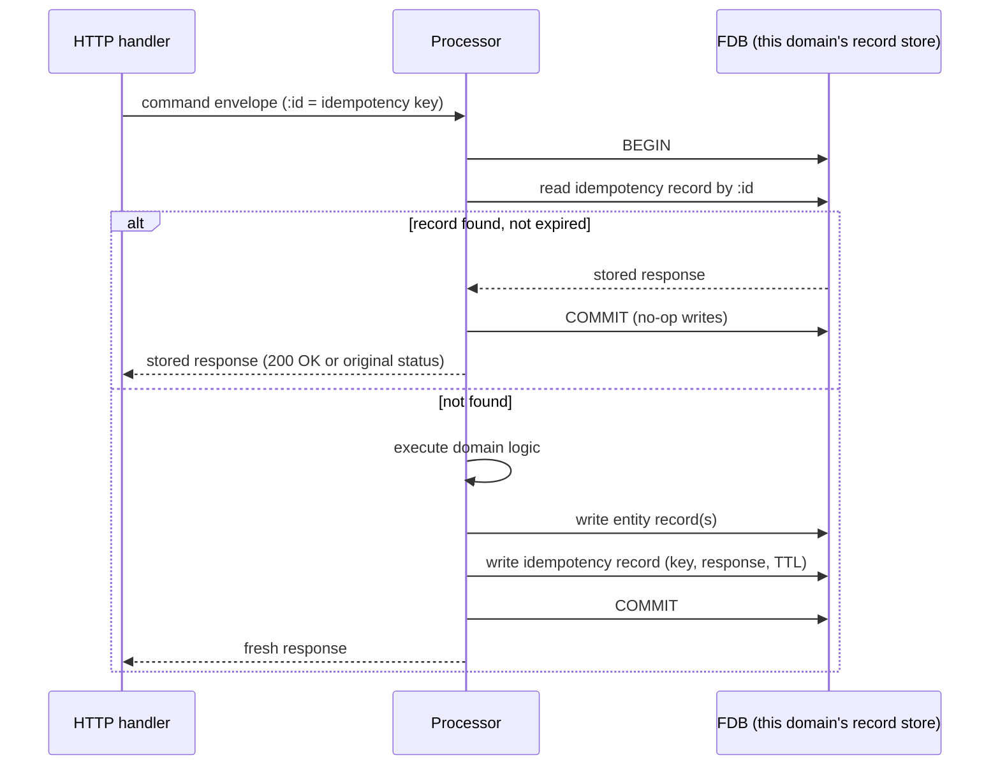

# Idempotency

> **Status: proposal.** Unlike the other TDDs in this folder,
> this document proposes a design that has not yet been
> implemented uniformly. The Background section describes
> today's fragmented state honestly; the Proposed Solution
> describes what we should build.

## Objective

A POST against Queenswood is idempotent when retrying it with
the same `Idempotency-Key` produces the effect of one
transaction and returns the same response. We need a universal
design that gives this guarantee for every write operation in
the bank, atomically with the write itself, durable across
restarts and across multiple instances of the API or
processors.

In scope: command-pipeline writes (cash accounts, payments,
parties, products, etc.); the envelope `:id` field; the
storage layer for idempotency records; the API edge contract
(`Idempotency-Key` header).

Out of scope: read endpoints (idempotent by nature); event
processing on the bus (deduplication there is the bus
backend's responsibility — see ADR-0003).

## Background

Today's state is partial and inconsistent.

**What works well:**

- The HTTP API enforces `Idempotency-Key` header presence and
  format on POST writes that opt in
  (`telemetry/require-idempotency-key` interceptor; 16–255
  URL-safe ASCII chars). Missing or malformed → 400.
- The `Idempotency-Key` is carried in the command envelope's
  `:id` field, separate from the command payload — clients can
  retry without the key polluting the message body. Envelope
  hygiene is good.

**What's fragmented:**

- **Some FDB record stores have idempotency-key indices** that
  the processor consults before writing. The check and the
  write are atomic inside one FDB transaction. This is the
  good pattern, but it isn't applied universally.
- **Some HTTP handlers maintain in-memory idempotency caches**
  at the API layer. These aren't durable across restarts, don't
  coordinate across multiple API instances, and create false
  confidence. They predate the cleaner per-store FDB approach.
- **Some write paths have no idempotency check at all** — they
  rely on the caller not retrying, which is a poor invariant
  for a bank.
- **Replay behaviour varies.** A duplicate detected at the FDB
  layer typically returns a `:rejection/anomaly` ("already
  exists"), not the original response. Caller has to either
  treat the rejection as success or go fetch the actual
  record. Stripe-style replay (return the original response)
  isn't implemented.

**Why this matters.** Banking operations are precisely the
kind of work where retries are routine — network blips, client
timeouts, queue redelivery — and the cost of a missed-
idempotency bug is double-charging, double-posting, or the
discovery during reconciliation that two transactions were
created from one user intent. The current state is one
incident away from a real problem.

## Proposed Solution

A universal idempotency design with five rules.

### 1. Per-domain storage, atomic with the write

Each FDB record store that owns writes carries its own
idempotency record alongside the entity records. The
idempotency record has an index on the key.

The processor's transaction:

1. Begins an FDB transaction.
2. Reads the idempotency record by `:id` from this store's
   idempotency index.
3. If found and not expired → returns the stored response
   without further work.
4. If not found → executes the domain logic, writes the
   idempotency record (key + response + TTL), and commits.

All four steps happen inside one FDB transaction.
`record-db` provides multi-record atomicity (ADR-0002), so the
check and the write commit together or not at all.



### 2. Per-domain, not centralised

Each record store manages its own idempotency. There is no
single bank-wide idempotency store.

The trade-off: a centralised store would be a global hotspot
under write load — every write across the bank would touch it.
Per-domain distributes the load across stores that already
serve the relevant entity writes; an idempotency check on a
cash-account command lives next to the cash-account record it
guards, in the same FDB record store, in the same transaction.

The cost is fragmentation risk: every domain has to integrate
the same idempotency machinery. The shared brick (rule 5) is
how we keep that consistent.

### 3. Stripe-style: store the key and the response

The idempotency record carries the full response payload, not
just the key. On replay, the processor returns the stored
response unchanged — same status, same body, same fields.

This means a retried POST is indistinguishable from the
original from the caller's perspective. No "already exists"
rejection that the caller has to interpret; just the original
response.

The cost is storage: response bodies are typically small (a
few hundred bytes for a created-resource response) but they're
not free. We accept this in exchange for predictable client
ergonomics.

### 4. Bounded TTL

Each idempotency record carries an expiry timestamp. Default
TTL is 24 hours, configurable per-domain if a flow has
specific needs (e.g. interest accrual might want longer; a
short-lived simulation might want shorter).

After expiry, the key can be reused. A background sweeper (or
per-write probabilistic cleanup) reclaims expired records
from each store.

The trade-off: bounded TTL means a client retrying after the
TTL window can re-execute. Forever-storage avoids this but
grows unbounded. 24 hours matches industry practice (Stripe,
Square, etc.) and aligns with realistic retry windows for
client-side error handling.

### 5. A shared `idempotency` brick

Each record store integrates the same machinery via a shared
brick. The brick provides:

- **A protocol** the per-store implementation extends. Methods
  cover: lookup by key inside an FDB transaction, write a
  record (key + response + ttl), expire/sweep.
- **A helper macro** that wraps the check-execute-store
  pattern:

  ```clojure
  (idempotency/with-idempotency [tx store id]
    ;; body executed only on first run; result stored
    (do-the-write tx ...))
  ```

  On replay, the macro returns the stored response without
  evaluating the body.
- **Schema** for the idempotency record (key, response,
  expires-at). Shared across stores so the shape is uniform.

Each FDB record-layer record-type registry adds one
`IdempotencyRecord` entry with a key index, configured at
brick boot time.

### 6. Remove in-memory API-side caches

Once per-store idempotency is universal, the in-memory caches
at the API layer can be deleted. They aren't durable, don't
coordinate across instances, and add a layer of confusion
(which check fired? the API one or the processor one?). The
processor's atomic check is the sole source of truth.

### Migration

Implementing this is a per-domain rollout:

1. Build the `idempotency` brick (protocol, macro, schema).
2. Pick a low-risk domain (e.g. parties or cash-account
   products) and migrate.
3. Iterate per domain. Each migration: add the
   `IdempotencyRecord` to the store's metadata, wrap the
   processor's commands.clj transactions in the macro, remove
   any in-memory cache at the corresponding API handler,
   adjust tests.
4. Once every write domain is on the shared machinery, mark
   the design as adopted and update this TDD's status.

## Alternatives Considered

- **Centralised idempotency store.** A single FDB record store
  holding all idempotency records bank-wide. Rejected. Every
  write would contend on the same store; cross-domain
  operations would need a separate dance to write into both
  the central store and the domain store atomically; the
  central store becomes a global hotspot and a single point
  of failure.
- **Key-only, no response stored.** Idempotency record holds
  the key (and maybe a transaction reference); replay returns
  a "duplicate detected" rejection that the caller interprets.
  Rejected. Caller ergonomics are poor — every client has to
  branch on duplicate-rejection vs success, and look up the
  underlying record by ID to get the response shape.
- **Forever TTL.** No expiry; a key is permanently retired
  once seen. Rejected. Storage grows without bound; eventual
  cleanup is required anyway. Bounded TTL with documented
  reuse window is operationally simpler.
- **Eager API-side check, lazy processor check (defence in
  depth).** API does an in-memory check before forwarding;
  processor does the durable check at commit time. Rejected
  for now. Adds complexity (cache invalidation across API
  instances, race between eager pass and lazy fail) for
  benefit only at extreme load. The processor's atomic check
  is sufficient. Can revisit if measurement shows the
  forwarded-but-redundant traffic is a problem.
- **Bus-level deduplication only.** Lean on the message-bus
  backend (Pulsar) to deduplicate on `:id`. Rejected.
  Backend-specific (channels backend has different
  semantics); doesn't survive bus replay/redelivery; doesn't
  preserve the response on retry; not portable across our
  abstraction (ADR-0003).
- **Cross-domain orchestration with a top-level idempotency
  key.** A single Idempotency-Key spans multiple domain
  commands when one HTTP call fans out. Rejected for the
  initial design — keeps each domain's idempotency local. If
  cross-domain orchestration later needs guarantees, that's a
  separate piece of design (saga-shaped).

## Known Limitations

- **Response storage cost.** Most write responses are small,
  but the cost is real. Need to monitor record size and
  consider truncation or storing only essentials for
  specific high-volume flows.
- **Bounded TTL means key reuse is allowed after expiry.**
  Clients that genuinely retain idempotency keys longer than
  24 hours will see new transactions on the second request.
  This needs to be documented in the API contract.
- **Sweeper cost.** Expiring records need cleanup. A
  background sweeper is one option; per-write probabilistic
  cleanup is lighter but uneven. To be picked at
  implementation time per domain.
- **Cross-domain operations need ID propagation discipline.**
  An HTTP request that triggers multiple domain commands
  needs each command to have its own `:id`. The `:correlation-id`
  ties them as one user action; the `:id` per command is
  what each domain dedupes on.
- **Idempotency is opt-in per route.** The
  `telemetry/require-idempotency-key` interceptor is added
  per-route. A write endpoint that forgets it lets clients
  retry blindly. Worth a pre-commit check or a default-on
  policy at the route level.
- **Schema evolution of stored responses.** A response shape
  changing under a stored key means a replay returns the old
  shape. For most cases this is correct (the original
  response should be replayed), but during a deployment
  window with mixed shapes, the gap matters. Document the
  invariant: stored responses are immutable artefacts of the
  original transaction.

## References

- [ADR-0002](../adr/0002-foundationdb-record-layer.md) —
  FoundationDB Record Layer (multi-record transactions)
- [ADR-0003](../adr/0003-message-bus-abstraction.md) —
  Message-bus abstraction
- [ADR-0005](../adr/0005-error-handling-with-anomalies.md) —
  Error handling with anomalies
- [transaction-processing.md](transaction-processing.md) —
  Transaction processing (envelope shape, `:id` semantics)
- [service-apis.md](service-apis.md) — Service APIs
  (`Idempotency-Key` header, `require-idempotency-key`
  interceptor)
- `command` brick interface
- [Stripe — Idempotent
  requests](https://stripe.com/docs/api/idempotent_requests)
- [RFC 7231 §4.2.2 — Idempotent
  methods](https://datatracker.ietf.org/doc/html/rfc7231#section-4.2.2)
