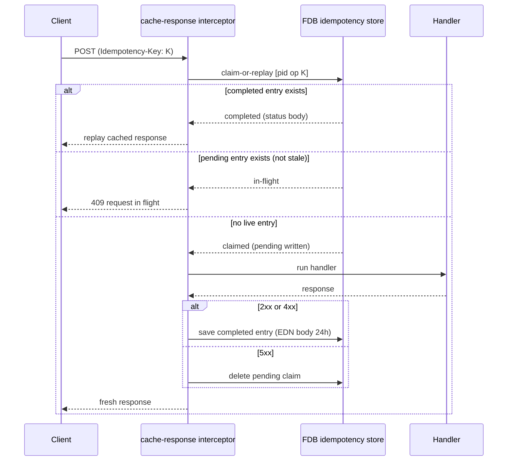

# Idempotency

> **Status: implemented.**

## Objective

A POST against Queenswood is idempotent when retrying it with
the same `Idempotency-Key` produces the effect of one
transaction and returns the same response. The design gives
this guarantee for every write operation in the bank, durable
across restarts and across multiple instances of the API.

In scope: all write routes (cash accounts, parties, payments,
simulate endpoints); the `Idempotency-Key` header contract;
the FDB-backed cache; concurrent-duplicate handling.

Out of scope: read endpoints (idempotent by nature); the
consume-then-ack and outbox de-duplication that processors and
adapters do on the bus — that boundary model lives in
[transaction-processing.md](transaction-processing.md).

## Background

The API enforces `Idempotency-Key` header presence and format
on every write route via the `server/require-idempotency-key`
interceptor. The header value is 16–255 URL-safe ASCII chars
(letters, digits, `_`, `-`). Missing or malformed → 400.

The `Idempotency-Key` is also carried in the command
envelope's `:id` field so processors can deduplicate at the
domain layer if needed — see [ADR-0008](../adr/0008-changelog-watchers.md).
Envelope hygiene stays clean: the key is never folded into the
message payload.

FDB record stores that own writes carry a per-store
idempotency-key index. The processor checks it before writing
— see `bank-transaction` and `bank-payment` stores, and the
adapter outbox and intent stores, which dedup a redelivered
webhook or command on a unique `dedup-key`. This inner-loop
check is atomic with the write (same FDB transaction). The
API-layer cache described below is layered on top.

## Solution

An API-layer idempotency cache backed by a single central FDB
record store, operated by the `bank-idempotency` brick as a
Sieppari interceptor.

### Cache scope

Each entry is keyed by `[principal_id, operation,
idempotency_key]`:

- **principal_id** — `api-key-id` for org-scoped requests;
  the JWT's `azp` (== `queenswood-admin` for service-account
  admin tokens) for Keycloak-authenticated requests.
- **operation** — `METHOD + path-template`, e.g.
  `POST /v1/cash-accounts`. Scopes the key independently per
  endpoint, so the same key can be used across different
  routes.
- **idempotency_key** — the client-supplied header value.

### Two-state machine

Each cache entry is in one of two states:

- **`pending`** — a handler is currently processing this
  key. Set on first arrival; cleared when the handler
  completes.
- **`completed`** — handler finished; `status` and `body`
  hold the response to replay.

A stale-`pending` entry (older than 60 s) is treated as
abandoned (e.g. server crashed). It is reclaimable by the
next request; the reclaim writes a fresh `pending` marker
atomically.

### Interceptor lifecycle

The `bank-idempotency/cache-response` interceptor is added
to every mutating route after `server/require-idempotency-key`
and after auth.

**`:enter`** — runs a single FDB transaction
(`claim-or-replay`):

| Entry state              | Action                                       |
| ------------------------ | -------------------------------------------- |
| `completed`, not expired | `sc/terminate` with cached body              |
| `pending`, not stale     | `sc/terminate` with 409 — duplicate          |
| `pending`, stale/absent  | write `pending` marker, run handler          |

FDB's optimistic concurrency serialises concurrent arrivals:
if two threads both pass the lookup and attempt to write
`pending`, one transaction aborts and retries; the retry sees
the now-`pending` entry and returns 409.

**`:leave`** — finalises the claim:

| Response status | Action                                       |
| --------------- | -------------------------------------------- |
| 2xx or 4xx      | overwrite with `completed` (EDN, 24 h TTL)   |
| 5xx             | delete `pending` marker — retryable          |

An `:error` stage releases the `pending` claim when the
handler throws through Sieppari's error path (Sieppari skips
`:leave` on the throwing path). The 60 s stale-pending TTL
remains as a backstop for hard crashes that skip `:error`
entirely.


```mermaid
sequenceDiagram
    participant C as Client
    participant I as cache-response interceptor
    participant F as FDB idempotency store
    participant H as Handler

    C->>I: POST (Idempotency-Key: K)
    I->>F: claim-or-replay [pid op K]
    alt completed entry exists
        F-->>I: completed (status body)
        I-->>C: replay cached response
    else pending entry exists (not stale)
        F-->>I: in-flight
        I-->>C: 409 request in flight
    else no live entry
        F-->>I: claimed (pending written)
        I->>H: run handler
        H-->>I: response
        alt 2xx or 4xx
            I->>F: save completed entry (EDN body 24h)
        else 5xx
            I->>F: delete pending claim
        end
        I-->>C: fresh response
    end
```

### Body serialisation

Cached bodies are stored as EDN, not JSON. EDN preserves
keyword values (e.g. `:cash-account-status-closed`) that a
JSON round-trip would flatten to plain strings. Downstream
malli response coercion on replay requires the original type.

### Proto and FDB schema

`Idempotency` proto fields:

| Field | Type | Notes |
|-------|------|-------|
| `principal_id` | string | required |
| `operation` | string | required |
| `idempotency_key` | string | required |
| `state` | string | `"pending"` or `"completed"` |
| `status` | int32 | optional (completed only) |
| `body` | string | optional EDN (completed only) |
| `created_at` | int64 | epoch ms |
| `expires_at` | int64 | epoch ms |

Primary key: `[principal_id, operation, idempotency_key]`.
No secondary indexes.

### Opt-in per route

Every write route must declare both interceptors:

```clojure
:interceptors [server/require-idempotency-key
               bank-idempotency/cache-response]
```

The `server/require-idempotency-key` interceptor (header
validation, 400 on missing/malformed) must precede
`cache-response` so the key is known valid before the FDB
lookup runs.

## Alternatives Considered

- **Per-domain, processor-layer atomicity.** Each FDB record
  store owns its idempotency records; the processor wraps the
  check-write-store in one FDB transaction. This is the
  approach described in the original proposal. Not adopted for
  the first implementation: it requires per-domain
  instrumentation across every write store, and the API-layer
  cache already satisfies the durability and correctness
  requirements without per-store integration work. The
  processor's existing per-store key indices still provide
  inner-loop deduplication as a second layer.

- **Centralised store is a hotspot.** The original proposal
  rejected a central store on hotspot grounds. In practice,
  entries are point-read by `[principal_id, operation, key]`
  — no range scans, no sequential write patterns. FDB handles
  this comfortably. The hotspot concern applies to stores with
  contiguous primary keys under write load; this store has
  neither.

- **Key-only, no response stored.** Duplicate detected → 409
  with "already exists"; client must refetch by ID. Poor
  ergonomics: client must branch on this case and perform an
  extra GET. Rejected in favour of Stripe-style full replay.

- **In-memory API-side cache.** Not durable across restarts,
  not shared across API instances. Superseded by the FDB-
  backed design.

- **Forever TTL.** Storage grows without bound. Not adopted —
  24 h matches industry practice and realistic retry windows.

- **Bus-level deduplication only.** Backend-specific, doesn't
  preserve the response on retry, not portable. Rejected; see
  ADR-0003.

## Known Limitations

- **No sweeper for expired `completed` entries.** Entries
  expire after 24 h but remain in FDB until overwritten or
  actively deleted. Volume should be low (one entry per
  successful idempotent request per day per principal), but a
  sweeper or TTL-native delete should be added before
  sustained high write volumes make this significant.

- **Response schema evolution.** A stored EDN body reflects
  the response shape at write time. A deploy that changes the
  response schema may cause a replay to return the old shape
  during the 24 h window. Document the invariant: stored
  responses are immutable artefacts of the original
  transaction. Schema changes to idempotency-protected
  responses should be additive.

- **Bounded TTL means key reuse is allowed after 24 h.**
  Clients that retain idempotency keys longer than 24 h and
  retry will see a fresh transaction. This should be stated
  in the API reference.

- **Opt-in per route.** A write endpoint that omits both
  interceptors accepts retries without deduplication. Worth a
  lint check or a default-on policy at the router level.

- **Admin service-account scope is shared.** Service tokens
  minted via `client_credentials` against `queenswood-admin`
  all share the same `azp` principal scope, so two callers
  using that client with the same `Idempotency-Key` on the
  same operation will collide. Acceptable given the
  back-office usage pattern; per-operator humans use the
  user-JWT path with a distinct `:user-id` principal and
  don't share scope.

## References

- [ADR-0002](../adr/0002-foundationdb-record-layer.md) —
  FoundationDB Record Layer (multi-record transactions)
- [ADR-0003](../adr/0003-message-bus-abstraction.md) —
  Message-bus abstraction
- [ADR-0005](../adr/0005-error-handling-with-anomalies.md) —
  Error handling with anomalies
- [service-apis.md](service-apis.md) — Service APIs
  (`Idempotency-Key` header, `require-idempotency-key`
  interceptor)
- [transaction-processing.md](transaction-processing.md) —
  Transaction processing (envelope shape, `:id` semantics)
- `bank-idempotency` brick — interceptor, core, store
- `server` brick — `require-idempotency-key` interceptor
- `command` brick — `req->command-request` (`:id` propagation)
- [Stripe — Idempotent
  requests](https://stripe.com/docs/api/idempotent_requests)
- [RFC 7231 §4.2.2 — Idempotent
  methods](https://datatracker.ietf.org/doc/html/rfc7231#section-4.2.2)
