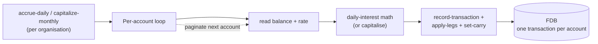
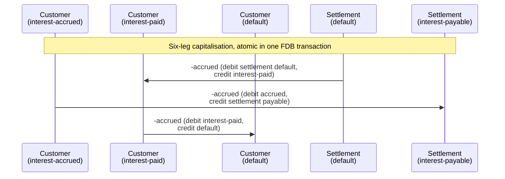

# Interest accrual and capitalisation

## Objective

Customer accounts earn interest. The bank computes it daily,
records it against the customer's balance, and capitalises it
monthly so the customer can spend it. Across millions of
accounts and 365 days, fractions of a penny per day add up to
real money. The math has to conserve every micro-unit.

This TDD describes the daily-accrual + monthly-capitalisation
machinery: the integer-only arithmetic with sub-minor-unit
carry; the two- and six-leg posting structures; the per-account
FDB transactions that compose into bounded-batch runs; and the
idempotency keys that make a re-run safe.

In scope: the `bank-interest` brick, the daily-interest
formula and carry mechanism, accrual and capitalisation
postings, the run pattern that processes an organisation's
customer accounts.

Out of scope: rate setting and product configuration (see
forthcoming cash-account-product TDD); the substrate that
records and applies legs (covered in
[transactions-and-balances.md](transactions-and-balances.md));
the policy filters that scope limit checks to specific
transaction types
([policy-evaluation.md](policy-evaluation.md)).

## Background

Three things make interest math subtle in a way naive
arithmetic gets wrong.

**Sub-minor-unit precision.** Daily interest on £1.00 at 5%
APR is well under a penny. Integer arithmetic that rounds at
the minor unit (pence) every day produces zero — £1 earns no
interest forever. The fix is to track sub-minor-unit residue
between days and only post when the residue accumulates past
one minor unit.

**Penny conservation.** Across millions of accounts and 365
days, the difference between "rounded each day" and
"correctly accumulated" can be measurable money. A bank that
loses pennies systematically is a bank with an audit
problem. The arithmetic must be deterministic and lossless
across run boundaries.

**Multi-leg postings at capitalisation.** When accrued
interest becomes part of the customer's spendable balance,
several balance buckets shift in concert: the customer's
accrued bucket drains, their default bucket grows, the
bank's interest-payable on the settlement side clears, and
the bank's settlement default reduces. All atomically.

The design answers all three with a single mechanism:
**integer micro-unit arithmetic with carry between days**,
backed by FDB record-store transactions for atomicity. No
floating point. Carry lives on the customer's balance record
in `:credit-carry` and is updated alongside the daily
posting.

## Proposed Solution

### Architecture

`bank-interest` is the brick. Two top-level operations:

- **`accrue-daily`** — runs daily; iterates an organisation's
  customer accounts and accrues per-account interest based
  on the posted balance and the product's rate.
- **`capitalize-monthly`** — runs monthly; iterates the same
  accounts and capitalises any accrued interest.

Both processes follow the same iteration pattern (paginated
through `cash-accounts/get-accounts`) and treat each account
as an independent FDB transaction — the bounded-batch
discipline from
[transactions-and-balances.md](transactions-and-balances.md).



A single `accrue-daily` run for one organisation might commit
thousands of small FDB transactions — one per account. Failure
mid-run loses only the in-flight account; the rest of the
day's work has already committed.

### Balance-type vocabulary

Interest uses four balance-type buckets:

- **`:balance-type-default`** — the customer's spendable
  posted balance. Earns interest. Receives capitalised
  interest as a credit.
- **`:balance-type-interest-accrued`** — interest earned by
  the customer, recorded daily, not yet spendable. Drained
  at capitalisation.
- **`:balance-type-interest-paid`** — transit bucket on the
  customer side during capitalisation. Equal credit and
  debit in the same transaction; net zero. Provides an audit
  trail of "this much interest was paid out."
- **`:balance-type-interest-payable`** — the bank's liability
  on the settlement account, mirroring the customer's
  accrued. Drained at capitalisation.

Plus the `:credit-carry` field on the customer's
`:balance-type-default` posted balance, which carries
sub-minor-unit fractions between days.

### Daily-interest math

Implementation is integer-only at micro-scale (one minor unit
= one million micro-minor-units). The algorithm:

```clojure
;; conceptual; see bank-interest/domain.clj for the actual code
(let [net          (- credit debit)               ; minor units
      bps-factor   100                            ; 1 bps in micro per minor
      annual-micro (* net interest-rate-bps bps-factor)
      ;; carry was sub-minor-unit; treat it as annual-equivalent
      ;; so dividing by 365 returns its daily share exactly
      total-micro  (+ annual-micro (* credit-carry 365))
      daily-micro  (quot total-micro 365)
      whole-units  (quot daily-micro 1000000)
      new-carry    (rem daily-micro 1000000)]
  {:whole-units whole-units :carry new-carry})
```

The clever bit is `(* credit-carry 365)`. The carry is in
micro-minor-units of *daily* residue. By multiplying by 365
before summing with the annual interest, then dividing the
total by 365, the carry's daily share is preserved exactly —
no precision loss in the round-trip.

Rate is annual (in basis points; 500 bps = 5% APR). Day-count
is a simple actual/365. The math is **simple daily interest**
on a fixed posted balance — each day's accrual is computed on
the same `:balance-type-default / posted` value and lands in
`:balance-type-interest-accrued`. Compounding emerges from
the *cadence of capitalisation*, not from the daily math
itself: once accrued has been swept into default, the next
day's accrual sees the larger balance.

This means the compounding cadence is an **operator decision,
not a math constraint** — see "Capitalisation cadence" below.

### Daily accrual posting

When `whole-units > 0`, the day's accrual is a
**two-leg transaction**:

```
DEBIT  settlement-account  interest-payable / posted   amount
CREDIT customer-account    interest-accrued / posted   amount
```

The bank's settlement account records the liability owed to
customers; the customer's interest-accrued bucket grows by
the same amount.

The customer's `:credit-carry` is then updated independently
via `set-carry` — carry isn't a leg event, it's a bookkeeping
field on the balance.

When `whole-units = 0` (the entire day's interest stays in
carry), no transaction is recorded; only the carry update.
This keeps the leg log free of zero-value postings.

### Monthly capitalisation posting

When the customer's `:balance-type-interest-accrued` is
non-zero at capitalisation time, the **six-leg transaction**
moves the accrued amount into the customer's spendable
default balance and clears the bank's matching liability:

```
;; 1-2: bank pays interest from settlement default to customer paid
DEBIT  settlement-account  default          / posted    accrued
CREDIT customer-account    interest-paid    / posted    accrued

;; 3-4: customer's accrued and bank's payable both drain
DEBIT  customer-account    interest-accrued / posted    accrued
CREDIT settlement-account  interest-payable / posted    accrued

;; 5-6: customer's interest-paid transits into default
DEBIT  customer-account    interest-paid    / posted    accrued
CREDIT customer-account    default          / posted    accrued
```

The result on each side:

- **Customer**: interest-accrued ↓ accrued; default ↑ accrued.
  Interest-paid receives a credit then a debit of the same
  amount in the same transaction — net zero, but the leg pair
  is preserved as an audit trail.
- **Settlement (bank)**: default ↓ accrued; interest-payable
  drained.

Six legs because three concerns move in concert:
the bank's payment-out, the customer's accrued release, and
the customer's spendable credit. Each must net to zero on
its side, so each requires a paired debit and credit.



Net: customer's spendable balance grows by `accrued`; bank's
default and liability both reduce by `accrued`.

### Capitalisation cadence

The brick exposes `capitalize-monthly` by name, but the
function is **not constrained to a monthly cadence**. It
sweeps accrued interest into default whenever it's called. The
operator (or whoever schedules the run) chooses the cadence,
and the choice has real customer-facing consequences.

The compounding behaviour falls out of the cadence:

- **Daily.** Accrued is swept into default every day. Next
  day's interest is computed on the new default. Effectively
  daily-compounded interest, which an increasing number of
  digital banks offer to compete on rate visibility.
- **Weekly / monthly.** Accrued sits in its bucket and only
  rolls into default at the chosen cadence. Customers see
  the credit less frequently, and compounding happens at
  that cadence too.
- **Annually.** Accrued sits all year. Compounding only on
  the anniversary.

The trade-off is real money. Less frequent capitalisation is
*money on the table for the bank*: a year of accrued sitting
in `:balance-type-interest-accrued` doesn't itself earn
interest under simple-daily-on-posted-only math (see Known
Limitations on this), so the customer earns less compared to
a daily-capitalisation product. Different operators take
different positions; the system supports any choice.

The function name `capitalize-monthly` is convention from the
project's first product, not a constraint on what the brick
does. See Known Limitations.

### Run pattern

`accrue-daily` and `capitalize-monthly` accept `:organization-id`
and `:as-of-date`. They:

1. Look up the organisation's settlement account (per-org;
   one settlement account holds the bank's interest-payable
   for all customers).
2. Page through customer accounts via
   `cash-accounts/get-accounts`, filtering to *opened*
   customer accounts (skipping internal and settlement
   accounts).
3. For each, call the per-account FDB transaction
   (`accrue-account` or `capitalize-account`).
4. Track count of accounts processed; short-circuit on the
   first anomaly.

The `as-of-date` is part of the per-account idempotency key:

- Accrual: `accrue-<account-id>-<as-of-date>`
- Capitalisation: `capitalize-<account-id>-<as-of-date>`

Re-running a date is safe — the second pass finds the
existing accrual transactions via the idempotency key and
either skips (today's per-domain pattern) or returns the
prior outcome (under the proposed universal idempotency
design, [idempotency.md](idempotency.md)).

### Per-account atomicity, cross-account resumability

Each account's accrual or capitalisation is its own FDB
transaction. The transaction commits the leg-posting and the
carry update together — the customer's balance can never be
in a state where interest was credited but carry wasn't
updated.

Across accounts, the run is **resumable but not atomic**.
A crash mid-run leaves earlier accounts processed, later
ones not. Re-running the date picks up where it left off
because the per-account idempotency keys make already-done
work a no-op.

This is the bounded-batch discipline applied to a long-
running process: many small transactions, predictable
failure modes, forward progress preserved.

### Settlement-account dependency

Every organisation has a `:product-type-settlement` account
that holds the bank's `interest-payable` and pays out
`default` at capitalisation. If no settlement account exists,
the run rejects with `:interest/no-settlement` (mapped to a
404 by `bank-api/errors.clj`).

This is one of the few places where the bank's own
bookkeeping (settlement account) is exposed in the policy
and product surface. Most other components treat customer
accounts as the universe; interest has to model the bank
side too because money has to come from somewhere.

## Alternatives Considered

- **Floating-point arithmetic.** Compute interest in doubles
  or BigDecimals. Rejected — introduces rounding errors
  unless every operation is carefully framed; produces
  results that depend on operation order; non-deterministic
  across JVM upgrades. Integer micro-unit arithmetic gives
  exact reproducibility.
- **No carry — round to minor unit each day.** Simpler but
  £1 earns no interest forever. Rejected; it's a real bug,
  not a minor inaccuracy.
- **One big transaction for the whole org's daily accrual.**
  Tempting (one commit, one timestamp, atomic across all
  customers). Rejected — exceeds FDB transaction size and
  time limits; one corrupt account's failure rolls back the
  whole org's run. The per-account approach trades atomicity
  for resumability and bounded resource use.
- **Daily compounding *as a separate code path*.** Make
  daily-compounding a distinct mode, with the math
  implementing the compounding directly inside the daily
  step. Rejected — the cleaner answer is to capitalise
  daily under the same mechanism. A daily-capitalisation
  cadence gives daily compounding without a parallel code
  path; the math stays simple, and the operator chooses by
  scheduling. See "Capitalisation cadence".
- **Capitalisation as a 2-leg transaction (just move
  accrued → default).** Loses the audit trail of which
  customer's interest-paid passed through. The 6-leg form
  preserves the bank's liability discharge symmetrically and
  leaves the interest-paid bucket as a paper trail.
- **Storing the interest rate per account.** Would denormalise
  rate from product to account. Rejected — rate is a
  product-version property; storing it per account loses
  the connection to product changes. The product-version
  cache (60s TTL) handles repeated lookups efficiently.
- **Interest accrual via the changelog watcher pattern
  (ADR-0008).** Watchers react to writes; accrual is
  time-driven, not write-driven. Rejected — wrong tool.
  Accrual is a scheduled batch driven externally (a cron or
  similar) calling the command interface.

## Known Limitations

- **Single day-count convention (actual/365).** Other
  conventions (actual/360, 30/360) aren't supported. Most
  retail UK products use actual/365, so this is fine for
  the current product set, but new products may need
  configurable day-count.
- **Single-currency at the rate level.** The product carries
  one `:interest-rate-bps`. Multi-currency products that
  earn different rates per currency would need rate-per-
  currency on the product version.
- **No mid-period rate changes.** A rate change between
  product-version applies to all accruals against that
  version, not to a "rate effective from date X" within a
  version. Rate changes happen at version boundary; the
  account's `:version-id` records which version was active.
- **The run is invocation-driven, not scheduled.** A
  scheduler outside the bank (cron, a workflow engine) has
  to call `accrue-daily` once per day per organisation.
  There's no internal scheduler that *will* run accruals;
  the operations team is responsible for triggering them.
- **Accruals happen on posted balance only.** Pending-
  incoming and pending-outgoing don't earn interest. This
  is correct for most products (settled funds earn) but
  worth noting — a "earn interest on cleared funds same day"
  feature would need explicit treatment.
- **`capitalize-monthly` is misleadingly named.** The
  function isn't constrained to a monthly cadence — it
  sweeps accrued interest into default whenever called.
  Daily, weekly, monthly, quarterly, annual cadences all
  work. The name is convention from the project's first
  product. Worth renaming to `capitalize` (no cadence in
  the name) so the flexibility is visible at the call site.
- **Capitalisation timing is a date, not a financial-period
  boundary.** Calling `capitalize-monthly` with `:as-of-date
  2026-01-31` capitalises whatever's in interest-accrued at
  that moment; the function doesn't validate that the date
  is a period-end or that all of the period's accruals have
  posted. The caller is responsible for sequencing.
- **No reversal helper.** A wrongly-accrued day or
  wrongly-capitalised month requires a manual reversing
  transaction. The patterns are simple but not packaged.
- **Carry is on the default-posted balance only.** Other
  buckets (pending, accrued) don't carry. This is consistent
  with "accrual is on posted-only" but worth noting if
  multi-bucket interest models ever appear.
- **Account-paging cursor is FDB-managed.** A run that
  encounters an account that fails its policy check returns
  the anomaly and stops; no skip-and-continue. A future
  enhancement could log-and-skip and report a tally at the
  end.

## References

- [ADR-0002](../adr/0002-foundationdb-record-layer.md) —
  FoundationDB Record Layer (per-account atomicity)
- [ADR-0005](../adr/0005-error-handling-with-anomalies.md) —
  Error handling with anomalies
- [transactions-and-balances.md](transactions-and-balances.md)
  — Transactions and balances (the substrate; carry field;
  bounded-batch discipline)
- [policy-evaluation.md](policy-evaluation.md) — Policy
  evaluation (transaction-type filtering, e.g.
  excluding interest from available-balance limits)
- [idempotency.md](idempotency.md) — Idempotency (the
  proposed universal design that interest's per-(account,
  date) key fits into)
- `bank-interest` brick interface
- `bank-cash-account-product` brick (rate via product
  version)
