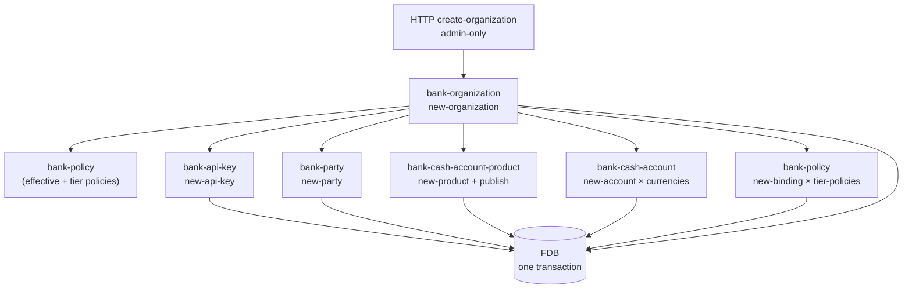

# Organisations

## Objective

An **organisation** is the multi-tenant boundary in
Queenswood. Every other domain entity — every party, every
cash account, every payment, every product version, every
API key, every policy binding — carries an
`:organization-id`. The entire data model partitions along
this axis.

This TDD describes the organisation model: the two types
(internal / customer), the all-or-nothing creation flow that
mints every foundational record a new tenant needs, the
tier mechanism that binds tier-specific policies at create
time, and the read enrichment that returns an organisation
with its party, accounts, balances, and key in a single
shape.

In scope: the `bank-organization` brick; the type and status
enums; the multi-brick atomic create flow; the tier label
and policy-binding choreography; the enrich-on-read pattern.

Out of scope: each foundational brick's own mechanics —
api-key generation
([api-keys.md](api-keys.md)), party creation
([parties.md](parties.md)), product publish
([cash-account-products.md](cash-account-products.md)),
account opening
([cash-accounts.md](cash-accounts.md)), policy bindings
([policy-evaluation.md](policy-evaluation.md)).

## Background

Two needs.

**Tenant isolation.** A multi-tenant bank must keep one
customer's data fully separate from another's. Queenswood
expresses this by carrying `:organization-id` on every
record and by indexing every store on it. Cross-tenant
queries are explicitly impossible at the data layer.

**Bootstrap completeness.** A bare organisation record is
useless. To do anything, a new tenant needs:

- An API key, so requests can authenticate.
- A party representing the organisation itself in the
  bank's books.
- A product, so accounts can be opened.
- One cash account per supported currency, where the bank's
  bookkeeping for that organisation lives (settlement
  account for customers; internal accounts for internal
  organisations).
- Policy bindings that pin the tier-appropriate rule set.

Without all of these, the organisation can't be authenticated
against, can't be billed, can't accrue interest, can't be
constrained by tier-policies. The system answers with a
single `new-organization` operation that mints every
foundational record in **one FDB transaction across six
bricks** (organization, api-key, party, cash-account-product,
cash-account, policy). Atomic. All-or-nothing.

## Proposed Solution

### Architecture

`bank-organization` is the brick. Synchronous interface — no
command processing, no watchers. The create flow composes
other bricks' interfaces inside one FDB transaction; ADR-0002
makes this atomic across record stores.



The diagram understates the choreography — those branches
all happen sequentially inside one
`store/transact`, threaded through `error/let-nom>`. A
failure at any step rolls everything back; a successful
commit means the whole tenant is up.

### Two organisation types

```clojure
:organization-type-internal   ;; Queenswood's own
:organization-type-customer   ;; external fintech tenants
```

The type drives several derivations at create time:

- **Internal** organisation: party-type `:party-type-internal`,
  default product-type `:product-type-internal`, balance
  buckets are *default-posted* + *suspense-posted*.
- **Customer** organisation: party-type
  `:party-type-organization`, default product-type
  `:product-type-settlement`, balance buckets are
  *default-posted* + *interest-payable-posted*.

An internal organisation's accounts hold the bank's own
bookkeeping (P&L, suspense). A customer organisation's
settlement accounts hold the bank's
**interest-payable to that customer's customers** — the
liability side of accrued interest before capitalisation
(see [interest.md](interest.md)).

### Status and the API key prefix

```clojure
:organization-status-live   ;; production tenant
:organization-status-test   ;; sandbox tenant
```

Status flows through to the freshly-minted API key's prefix
(see [api-keys.md](api-keys.md)) — `sk_live.` for live,
`sk_test.` for test. The visible prefix is how operators
recognise live vs test traffic at a glance.

### The atomic create flow

`new-organization` runs the following inside one FDB
transaction:

1. **Resolve effective policies** —
   `policy/get-effective-policies {}` for the platform-level
   capability and limit checks (no organisation context yet
   — the org doesn't exist).
2. **Resolve tier policies** — `policy/get-policies-by-tier
   tier` returns the policies labelled
   `{:tier "<tier-name>"}`; these are the rules that should
   bind to the new tenant.
3. **Validate** — `domain/new-organization` runs
   capability + count-limit checks
   (e.g. "can a new customer organisation be created?").
4. **Mint the API key** — `bank-api-key/new-api-key` —
   policy-checked itself, returns
   `{:api-key <record> :key-secret <plaintext>}`.
5. **Persist the org and api-key together.**
6. **Create the org's party** — `bank-party/new-party` with
   `:type` derived from organisation type; org's name as
   display-name.
7. **Create the default product** —
   `bank-cash-account-product/new-product` with
   product-type, balance-products, and
   allowed-payment-address-schemes derived from
   organisation type. Returns a draft v1.
8. **Publish the product** — `publish` flips draft to
   published. After this, immutable per
   [cash-account-products.md](cash-account-products.md).
9. **Open one cash account per currency** —
   `bank-cash-account/new-account` per entry in
   `currencies`. Each opens in `:cash-account-status-opening`
   state (the watcher transitions to `:opened` after commit
   — see [cash-accounts.md](cash-accounts.md)).
10. **Bind tier policies** — for each tier policy,
    `policy/new-binding` with selectors
    `{:organization-id <new-id>}`.
11. **Enrich and return** — load party, accounts (with
    balances), and api-key, return
    `{:organization {... :party ... :accounts [...] :api-key
    {...}} :key-secret <plaintext>}`.

The `:key-secret` is returned only here — same one-time
delivery pattern api-keys uses (see
[api-keys.md](api-keys.md)). The caller (typically a
platform admin) is responsible for forwarding it to the
new tenant.

### Tier and the policy-binding model

The `tier` argument is a string label that selects which
policies are bound to the new organisation.

The mechanism:

- Policies carry a `{:tier "<name>"}` label as part of their
  data (the policy author decides which tier the policy
  belongs to).
- `policy/get-policies-by-tier "platinum"` returns every
  policy whose label matches.
- For each such policy, `new-organization` creates a
  Binding tying it to the freshly-created organisation.

This is a *hybrid* of the old tier system and the new
policy/binding system. The bindings are written (good); the
binding selectors are partially honoured at read time
(per [policy-evaluation.md](policy-evaluation.md), today
`get-effective-policies` always loads platform-tier policies
regardless of selectors). So a tier binding is durable but
not yet load-bearing for runtime evaluation.

The implication: today, an organisation's effective rule
set is the platform tier plus whatever bindings are read by
the partial resolver. As selector resolution lands properly
(per the policy TDD's known limitations), the bindings
written here become live without any change to the create
flow.

### Enrichment for reads

`get-organization` returns more than the bare organisation
record — it walks the related bricks and assembles:

```clojure
{:organization
 {:organization-id ...
  :name ...
  :type ...
  :status ...
  :tier ...
  :created-at ...
  :updated-at ...
  :party {...}                ; the org's party
  :accounts [{...}]           ; with embedded balances
  :api-key {...}              ; metadata only — no secret}
 :key-secret "..."}            ; only when freshly minted
```

The api-key shape carried in the response is metadata only:
`:api-key-id`, `:key-prefix`, `:name`, `:created-at`. The
key-hash never appears in the response; the secret is shown
only on creation.

`get-organizations` returns the same enriched shape
list-wise. `get-organizations-by-type` is a thinner lookup
without the enrich (used internally for routing — for
example, finding the platform's internal organisation to
attribute system fees against).

## Alternatives Considered

- **Separate creation commands.** Have the platform admin
  call create-org, then create-api-key, then create-party,
  and so on. Rejected — partial failure at any step leaves
  the tenant in an inconsistent state (an organisation
  with no API key, or a product with no accounts). The
  one-transaction approach is the only way to guarantee
  bootstrap completeness.
- **No type distinction (everything's a customer).**
  Internal bookkeeping (P&L, suspense) and customer
  bookkeeping (settlement, interest-payable) differ in
  what balance buckets they need; collapsing them into one
  type would force every internal bookkeeping concern into
  the customer shape.
- **Lazy account creation.** Open accounts on first use of
  a currency, not at create time. Rejected — the per-org
  settlement account is needed before any payment, fee, or
  interest activity can happen for that org. Bootstrap
  upfront is simpler and predictable.
- **No tier mechanism — all policies bound explicitly.**
  Force callers to specify exactly which policies bind.
  Rejected for ergonomics — most tenants fall into named
  buckets ("free", "pro", "enterprise") that map to
  bundles of policies; the tier label is a shorthand for
  the bundle. Explicit bindings can still be added on top.
- **Tier as a numeric ordering.** Tiers as `1, 2, 3, ...`
  with implicit precedence. Rejected — tiers don't always
  form a clean total order (a "developer" tier and a
  "production" tier are different shapes, not different
  levels). String labels are flexible.
- **Org records writable post-creation through the same
  flow.** Treat the create as just another write; allow
  edits. Rejected for the foundational records (api-key,
  party, default product) — those have their own lifecycle
  rules. Editing an org's name or status is a separate
  concern (see Known Limitations).

## Known Limitations

- **Tier-binding selectors are partially resolved.** The
  bindings are written at create, but
  `policy/get-effective-policies` doesn't yet honour the
  selectors fully (per policy-evaluation TDD). The bindings
  are durable; the runtime resolution is the gap.
- **Tier is a string label, not a structure.** No
  hierarchical relationships expressed
  (`platinum > gold > silver`). Each policy carries one
  tier label and that's the granularity.
- **No tier change after creation.** No exposed flow moves
  an organisation between tiers. Would need to recompute
  the binding set (drop old tier-bindings, add new
  tier-bindings). Operationally needed if a customer
  upgrades or downgrades; not implemented.
- **No status change after creation.** A live organisation
  stays live; a test organisation stays test. The api-key
  prefix was minted at create time off the original status,
  so retrofitting a status change has implications beyond
  one record.
- **No organisation closure or off-boarding.** An
  organisation once created is permanent. Closing a
  customer relationship has no machinery — closing
  every account, revoking every api-key, archiving party
  data are all manual today.
- **No org-level audit trail.** Created-at is the only
  history. Who created the organisation (which platform
  admin operator) isn't recorded — only that the admin key
  was used.
- **Single default product.** The create flow gives the
  organisation one settlement (or internal) product.
  Customers wanting additional products of different
  shapes (savings, current, term-deposit) create them
  separately via the products API afterwards. Multi-product
  bootstrap isn't supported.
- **Currencies are committed at create.** The default
  product's `:allowed-currencies` is set from the
  `currencies` argument. Adding a currency later means
  publishing a new version of the default product (per
  cash-account-products TDD) — feasible, but not exposed
  as a "add-currency" convenience.
- **Org name and party display-name are coupled.** The
  party for an organisation is created with display-name
  = organisation-name. If the org renames itself later,
  the party doesn't follow automatically (and there's no
  rename flow).
- **Effective-policies-during-create has no organisation
  context.** Step 1 of the create flow calls
  `get-effective-policies {}` (empty selectors), since the
  org doesn't yet exist. This means platform-tier policies
  govern the create — fine in principle, but a subtle
  point if the platform-tier rules ever needed to know the
  about-to-be-created organisation.
- **The create is admin-only by convention, not by code.**
  The route requires the admin auth scheme (per
  [service-apis.md](service-apis.md)), but
  `new-organization` itself doesn't check the principal.
  Calling it directly from non-admin code paths would
  bypass the intended gate.

## References

- [ADR-0002](../adr/0002-foundationdb-record-layer.md) —
  FoundationDB Record Layer (multi-store atomicity for the
  create flow)
- [ADR-0005](../adr/0005-error-handling-with-anomalies.md) —
  Error handling with anomalies (rollback on partial
  failure)
- [api-keys.md](api-keys.md) — API keys (default key minted
  at organisation creation; prefix derived from status)
- [parties.md](parties.md) — Parties (the organisation's
  party; party-type derived from organisation type)
- [cash-account-products.md](cash-account-products.md) —
  Cash account products (the default product drafted and
  published per organisation)
- [cash-accounts.md](cash-accounts.md) — Cash accounts (one
  per currency, opened at organisation creation)
- [policy-evaluation.md](policy-evaluation.md) — Policy
  evaluation (tier label, binding selectors, partial
  resolution)
- [interest.md](interest.md) — Interest (settlement account
  per customer organisation, internal account per internal
  organisation)
- [service-apis.md](service-apis.md) — Service APIs (admin
  auth scheme for the create endpoint)
- `bank-organization` brick interface
