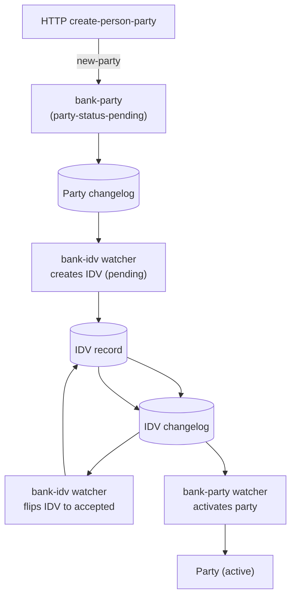
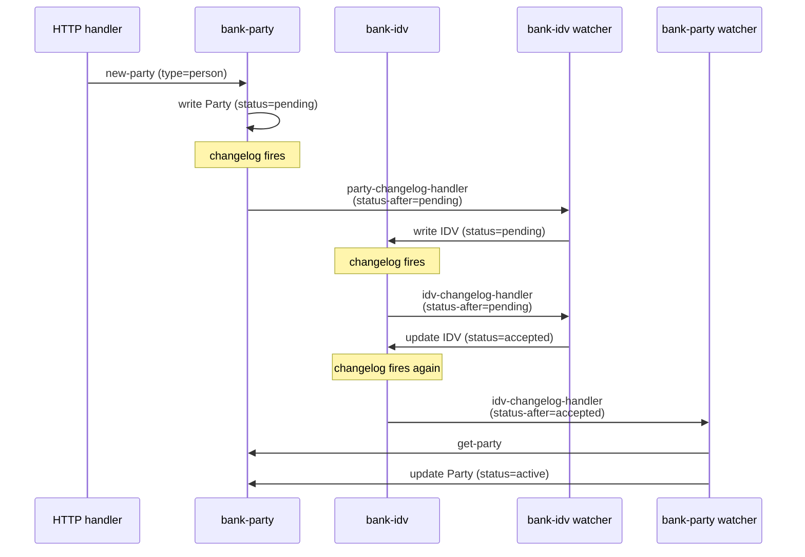

# Parties and identity verification

## Objective

Every account in Queenswood belongs to a **party** —
either a natural person, a non-person legal entity, or an
internal bookkeeping identity for the bank itself. Persons
are subject to identity verification (IDV) before they can
transact; non-person and internal parties become active
immediately. This TDD describes the party model, the three
types, the reactive IDV flow that activates persons, and the
honest gaps in today's IDV machinery.

In scope: the `bank-party` and `bank-idv` bricks; party types
and lifecycle; the changelog-watcher chain that drives
person-party activation; name-matching; party identifiers and
person identifications.

Out of scope: the HTTP-edge auth model and user identity
(see [api-keys.md](api-keys.md) — parties are distinct from
users; see Background); cash account ownership and SCAN
assignment (forthcoming cash-accounts TDD); Confirmation of
Payee callers (covered in
[payments.md](payments.md)).

## Background

A **party** is a participant the bank tracks: the *who* on
both sides of every transaction. The model has three types,
each with different lifecycle rules.

- **Person parties** — natural humans. KYC requires verified
  identity before they can hold a cash account or transact.
  Status starts `pending`; flips to `active` when IDV
  accepts.
- **Organisation parties** — non-person legal entities (a
  customer's customer that's a company, for example). No
  per-person KYC; status starts `active`.
- **Internal parties** — Queenswood's own bookkeeping
  identities (settlement, fee P&L, suspense accounts, and so
  on). The bank's books. Status starts `active`.

A note on terminology that often confuses: **a party is not
a user**. Today there's no user concept in the system at all
(see [api-keys.md](api-keys.md) — Future direction). A party
is the customer-of-the-customer or counterparty the bank
deals with as a *customer of the bank's customer*; a user
(when modelled) will be the authenticated human triggering a
request. They serve different concerns.

For person parties, KYC sits between creation and activation.
The system implements this via a chain of changelog watchers
([ADR-0008](../adr/0008-changelog-watchers.md)) — a party
write triggers an IDV write, an IDV write triggers a status
flip, the eventual accepted status triggers party activation.
The flow is reactive, decoupled, and exactly the use case
ADR-0008 highlights.

## Proposed Solution

### Architecture

Two bricks split by concern:

- **`bank-party`** — owns Party records, party CRUD, name
  matching, party identifiers (passport, NI), person
  identifications (given/family/middle names), and the
  watcher that activates parties on IDV acceptance.
- **`bank-idv`** — owns IDV records and the watchers that
  create and accept them.

Neither brick calls the other directly. They communicate via
FDB changelog (ADR-0008): a write to one brick's records
fires a changelog event that the other brick's watcher
consumes.



Three watcher transitions, each independently observable
and testable. The choreography is the design — see Known
Limitations on what's missing today.

### Data model

**Party**:

```clojure
{:organization-id
 :party-id        "pty.<ulid>"
 :type            :party-type-person
                  ;; or -organization, -internal
 :display-name
 :status          :party-status-pending
                  ;; or -active, ...
 :created-at
 :updated-at}
```

**PartyNationalIdentifier** — one per identifier type per
party:

```clojure
{:organization-id
 :party-id
 :type            ;; :passport, :ni, etc.
 :value
 :issuing-country
 :created-at}
```

**PersonIdentification** — names and demographics for person
parties:

```clojure
{:party-id
 :given-name
 :middle-names
 :family-name
 ;; ... (date of birth, etc., per implementation)
 :created-at}
```

**IDV** — the verification record itself:

```clojure
{:organization-id
 :verification-id
 :party-id
 :status        :idv-status-pending
                ;; or -accepted, -rejected
 :created-at
 :updated-at}
```

### Party types and initial status

```clojure
:party-type-person       → :party-status-pending
:party-type-organization → :party-status-active
:party-type-internal     → :party-status-active
```

The split is intentional. Person parties carry the KYC
obligation; orgs and internal don't. The bank's own
bookkeeping (internal) and the customer's non-person
counterparties (organization) don't need IDV before they can
appear in transactions.

### The reactive activation flow

The pending → active transition for a person party happens
through three changelog handlers — one per state change.



Each handler is idempotent on the matching status — running
twice doesn't double-activate. Each handler is independently
testable: feed it a synthetic changelog event, verify the
resulting write.

### Name matching

`match-name` compares two name strings and returns one of:

- **`:match`** — exact equality after lower-casing,
  whitespace normalisation.
- **`:close-match`** — every token in the shorter name
  appears in the longer (handles middle-names, abbreviations
  in either direction).
- **`:no-match`** — neither.

Used by Confirmation of Payee flows (in the
ClearBank adapter; see payments TDD) and elsewhere when the
caller needs a soft equality on display names.

The implementation is a deliberately simple normalise-and-
tokenise pass — it covers the bulk of real cases without a
fuzzy-matching dependency. See Known Limitations for the
edge cases it doesn't cover.

### Why changelog watchers (and not direct calls)

The party → IDV → party-active flow could equally be written
as direct procedural calls inside the create-party handler:
write the party, write the IDV, kick off external IDV, wait,
flip the party. Choosing the watcher pattern is deliberate
([ADR-0008](../adr/0008-changelog-watchers.md)).

Reasons:

- **Decoupling.** `bank-party` doesn't import `bank-idv` and
  vice versa. The two bricks evolve independently.
- **Reactive observability.** Each transition is its own
  event in the changelog; debugging "where did this party
  get stuck" is a question of "which watcher hasn't fired
  yet?".
- **Testability.** Each handler is a function of `(ctx,
  changelog-bytes)` returning anomaly or value. Unit-testable
  without booting the full system.
- **Idempotency by status.** Each handler short-circuits if
  the status isn't the one it cares about. Re-emitting an
  event doesn't cause re-execution of the actual transition.

The trade-off is the one ADR-0008 names: the watcher
processors don't scale horizontally without leader election,
and the chain is harder to follow if you don't already know
the model. Both costs are accepted.

## Alternatives Considered

- **Direct procedural calls between bricks.** Create-party
  calls IDV-create directly. Rejected — couples bricks; the
  reactive observability story disappears; testability
  weakens. Watchers preserve the brick boundaries.
- **Single brick covering parties and IDV.** Coarser; loses
  the testability split; conflates KYC with party identity.
  Rejected — the two are conceptually separate even if
  always-paired in this product.
- **Synchronous IDV during create-party.** The HTTP handler
  blocks on the IDV provider's response, returns an active
  party (or error). Rejected for two reasons: real IDV
  providers can take seconds to minutes (or human review for
  hours/days); blocking the HTTP handler is a poor caller
  experience. Async with a status-poll model is the right
  shape.
- **Saga / orchestrator.** A central orchestrator coordinates
  the three transitions. Rejected — overkill for a three-step
  reactive chain that watchers handle naturally.
- **Person-only party model.** Just persons; orgs and
  internal modelled differently. Rejected — bookkeeping
  needs a unified party concept (settlement *parties*, fee
  *parties*); collapsing them into one model with type
  discrimination is cleaner than three parallel models.

## Known Limitations

- **No real IDV simulator.** The IDV brick's watcher
  unconditionally flips a pending IDV to accepted. There's
  no integration with a real IDV provider (Onfido, Persona,
  Veriff, ComplyAdvantage, Stripe Identity), and no
  simulator base in the spirit of
  `bank-clearbank-simulator` that mocks one. Production
  use of this code path requires implementing a real IDV
  provider integration (or a configurable simulator base
  for development and tests).
- **`seed-active-party` is a test shortcut.** The
  `bank-party/seed-active-party` interface fn writes the
  active status directly to the store, bypassing the
  changelog-watcher chain entirely. It exists because there
  is no IDV simulator yet — harnesses that need an active
  person-party fast use this as a transitional shim. The
  function itself documents this and asks to be deleted
  when an IDV simulator lands.
- **No re-verification flow.** Once a person party is
  active, there's no machinery to re-IDV them (periodic
  refresh, sanctions list re-screening, address change
  triggering re-verification). Compliance regimes
  increasingly require this; today the model assumes one-
  shot KYC.
- **No party suspension or closure.** Active is essentially
  terminal. A party flagged for fraud or sanctions has no
  status path away from active via the current API. The
  status enum admits more values; the lifecycle code
  doesn't drive them.
- **No user model.** As noted in
  [api-keys.md](api-keys.md), the system has no concept of
  the human triggering a request. Once a user model lands,
  the relationship between parties and users will need
  modelling — a user might *act on behalf of* a party, or
  *be* a party (in self-service flows). Today neither link
  exists.
- **Name matching is naive.** Token-set matching after
  lower-casing. No accent folding, no transliteration, no
  edit-distance fuzziness, no honorific stripping. Real
  Confirmation-of-Payee scoring is harder than this brick
  admits and tends to need vendor-grade matching libraries.
- **National identifier types are uninterpreted.** The
  brick stores type/value/issuing-country but doesn't
  validate format per type — a "passport" record could
  contain anything. Caller-side discipline.
- **PII at rest is unencrypted.** Personal names, identifier
  values, and demographics live in FDB without field-level
  encryption. Production would want either tokenised
  storage or per-field encryption, depending on the
  regulator's view.
- **No party-merging.** Two records for the same physical
  person (often arising from address corrections, name
  changes, or duplicate creation) can't be merged today.
  Operationally a real gap once any deduplication need
  arises.

## References

- [ADR-0002](../adr/0002-foundationdb-record-layer.md) —
  FoundationDB Record Layer (party storage)
- [ADR-0008](../adr/0008-changelog-watchers.md) — Changelog
  watchers (the reactive activation chain)
- [api-keys.md](api-keys.md) — API keys (the user-model
  gap, distinct from parties)
- [payments.md](payments.md) — Payments (CoP consumes
  `match-name`)
- `bank-party` brick interface
- `bank-idv` brick interface
