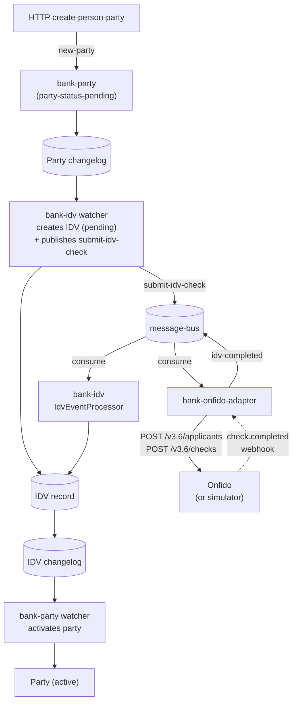
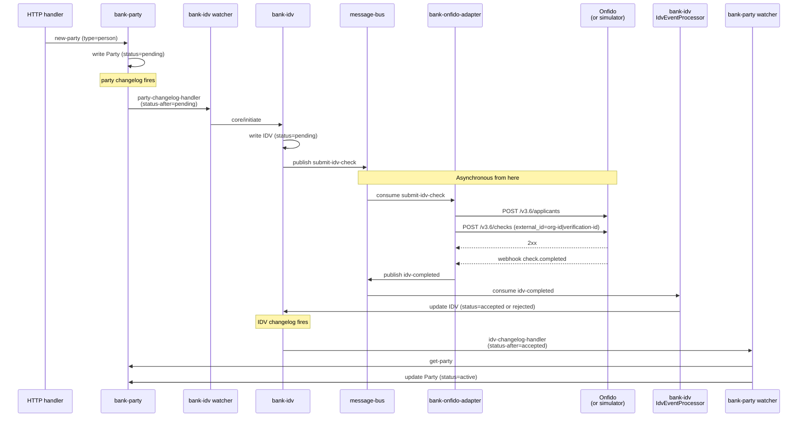

# Parties and identity verification

## Objective

Every account in Queenswood belongs to a **party** —
either a natural person, a non-person legal entity, or an
internal bookkeeping identity for the bank itself. Persons
are subject to identity verification (IDV) before they can
transact; non-person and internal parties become active
immediately. IDV runs through a real provider integration
(or a simulator standing in for one): a person party's
creation publishes a `submit-idv-check` command, the
adapter calls the provider, and a webhook-borne
`idv-completed` event flips the IDV record. This TDD
describes the party model, the three types, the activation
flow that traverses FDB changelogs and the message bus to
the IDV adapter, and the honest gaps in today's IDV
machinery.

In scope: the `bank-party` and `bank-idv` bricks; the
`bank-onfido-adapter` and `bank-onfido-simulator` bases;
party types and lifecycle; the watcher + bus + event flow
that drives person-party activation; name-matching; party
identifiers and person identifications.

Out of scope: the HTTP-edge auth model and user identity —
see [api-keys.md](api-keys.md), with parties distinct from
users; see Background; cash account ownership and SCAN
assignment, see [cash-accounts.md](cash-accounts.md);
Confirmation of Payee callers, covered in
[payments.md](payments.md).

## Background

A **party** is a participant the bank tracks: the *who* on
both sides of every transaction. The model has three types,
each with different lifecycle rules.

- **Person parties** — natural humans. KYC requires verified
  identity before they can hold a cash account or transact.
  Status starts `pending`; flips to `active` when IDV
  accepts.
- **Organisation parties** — non-person legal entities (a
  customer's customer that's a company, for example). No
  per-person KYC; status starts `active`.
- **Internal parties** — Queenswood's own bookkeeping
  identities (settlement, fee P&L, suspense accounts, and so
  on). The bank's books. Status starts `active`.

A note on terminology that often confuses: **a party is not
a user**. Today there's no user concept in the system at all
(see [api-keys.md](api-keys.md) — Future direction). A party
is the customer-of-the-customer or counterparty the bank
deals with as a *customer of the bank's customer*; a user
(when modelled) will be the authenticated human triggering a
request. They serve different concerns.

For person parties, KYC sits between creation and activation.
The system implements this with FDB changelog watchers per
[ADR-0008](../adr/0008-changelog-watchers.md) at the
boundaries and the message bus per
[ADR-0003](../adr/0003-message-bus-abstraction.md) in the
middle: a party write triggers an IDV write, the IDV write
publishes a `submit-idv-check` command, the IDV-provider
adapter calls the provider and republishes the eventual
webhook as an `idv-completed` event, the IDV event
processor flips the IDV record, and the IDV flip triggers
party activation. The flow is decoupled end-to-end — no
direct call from `bank-party` to `bank-idv` to the
adapter; each hop crosses a durable channel.

## Proposed Solution

### Architecture

Two bricks plus an adapter/simulator base pair:

- **`bank-party`** — owns Party records, party CRUD, name
  matching, party identifiers (passport, NI), person
  identifications (given/family/middle names), and the
  watcher that activates parties on IDV acceptance.
- **`bank-idv`** — owns IDV records, the watcher that
  creates IDVs from pending parties, the `initiate` core
  fn that publishes `submit-idv-check`, and the
  `IdvEventProcessor` that consumes `idv-completed` events
  and flips the IDV record.
- **`bank-onfido-adapter`** (base) — talks to the
  IDV provider over HTTP. Subscribes to `submit-idv-check`
  on the bus, calls Onfido's `POST /v3.6/applicants` and
  `POST /v3.6/checks`, receives `check.completed`
  webhooks, and republishes them as `idv-completed`
  events on the bus.
- **`bank-onfido-simulator`** (base) — Onfido-shaped HTTP
  service used for development and tests. Mocks the
  applicant + check + webhook lifecycle deterministically.

`bank-party` and `bank-idv` communicate via FDB changelog
per [ADR-0008](../adr/0008-changelog-watchers.md).
`bank-idv` and `bank-onfido-adapter` communicate via the
message bus per
[ADR-0003](../adr/0003-message-bus-abstraction.md) — a
command channel for `submit-idv-check` and an event
channel for `idv-completed`.


```mermaid
graph TD
    HTTP[HTTP create-person-party]
    PARTY["bank-party<br/>(party-status-pending)"]
    PCH[("Party changelog")]
    IDV1["bank-idv watcher<br/>creates IDV (pending)<br/>+ publishes submit-idv-check"]
    IDV[("IDV record")]
    BUS[("message-bus")]
    ADAPTER["bank-onfido-adapter"]
    ONFIDO["Onfido<br/>(or simulator)"]
    EP["bank-idv<br/>IdvEventProcessor"]
    ICH[("IDV changelog")]
    PARTY3["bank-party watcher<br/>activates party"]
    PARTY4["Party (active)"]

    HTTP -->|new-party| PARTY
    PARTY --> PCH
    PCH --> IDV1
    IDV1 --> IDV
    IDV1 -->|submit-idv-check| BUS
    BUS -->|consume| ADAPTER
    ADAPTER -->|POST /v3.6/applicants<br/>POST /v3.6/checks| ONFIDO
    ONFIDO -.->|check.completed<br/>webhook| ADAPTER
    ADAPTER -->|idv-completed| BUS
    BUS -->|consume| EP
    EP --> IDV
    IDV --> ICH
    ICH --> PARTY3
    PARTY3 --> PARTY4
```

Each hop is independently observable and testable: the
party → IDV write via the changelog handler, the
`submit-idv-check` command on the bus, the adapter's HTTP
call, the webhook receipt, the `idv-completed` event, the
event processor's flip, and the party activation watcher.

### Data model

**Party**:

```clojure
{:organization-id
 :party-id        "pty.<ulid>"
 :type            :party-type-person
                  ;; or -organization, -internal
 :display-name
 :status          :party-status-pending
                  ;; or -active, ...
 :created-at
 :updated-at}
```

**PartyNationalIdentifier** — one per identifier type per
party:

```clojure
{:organization-id
 :party-id
 :type            ;; :passport, :ni, etc.
 :value
 :issuing-country
 :created-at}
```

**PersonIdentification** — names and demographics for person
parties:

```clojure
{:party-id
 :given-name
 :middle-names
 :family-name
 ;; ... (date of birth, etc., per implementation)
 :created-at}
```

**IDV** — the verification record itself:

```clojure
{:organization-id
 :verification-id
 :party-id
 :status        :idv-status-pending
                ;; or -accepted, -rejected
 :created-at
 :updated-at}
```

### Party types and initial status

```clojure
:party-type-person       → :party-status-pending
:party-type-organization → :party-status-active
:party-type-internal     → :party-status-active
```

The split is intentional. Person parties carry the KYC
obligation; orgs and internal don't. The bank's own
bookkeeping (internal) and the customer's non-person
counterparties (organization) don't need IDV before they can
appear in transactions.

### The activation flow

The pending → active transition for a person party
crosses two changelog handlers, one bus command, one HTTP
round-trip to the IDV provider, and one bus event.


```mermaid
sequenceDiagram
    participant H as HTTP handler
    participant P as bank-party
    participant W1 as bank-idv watcher
    participant I as bank-idv
    participant B as message-bus
    participant A as bank-onfido-adapter
    participant O as Onfido<br/>(or simulator)
    participant E as bank-idv<br/>IdvEventProcessor
    participant W2 as bank-party watcher

    H->>P: new-party (type=person)
    P->>P: write Party (status=pending)
    Note over P: party changelog fires

    P->>W1: party-changelog-handler<br/>(status-after=pending)
    W1->>I: core/initiate
    I->>I: write IDV (status=pending)
    I->>B: publish submit-idv-check

    Note over B,O: Asynchronous from here

    B->>A: consume submit-idv-check
    A->>O: POST /v3.6/applicants
    A->>O: POST /v3.6/checks (external_id=org-id|verification-id)
    O-->>A: 2xx
    O-->>A: webhook check.completed
    A->>B: publish idv-completed

    B->>E: consume idv-completed
    E->>I: update IDV (status=accepted or rejected)
    Note over I: IDV changelog fires

    I->>W2: idv-changelog-handler<br/>(status-after=accepted)
    W2->>P: get-party
    W2->>P: update Party (status=active)
```

Each handler is idempotent on the matching status — running
twice doesn't double-initiate or double-activate. The IDV
watcher additionally consults the
unique `Idv_by_party` index before initiating, so a
changelog replay or a duplicate party-pending event won't
create a second IDV.

### Onfido adapter

`bank-onfido-adapter` is its own base. It owns:

- **Command consumer** — Pulsar consumer for
  `submit-idv-check` commands. For each, calls Onfido's
  `POST /v3.6/applicants` (mapping the IDV's first-name /
  last-name / date-of-birth) and `POST /v3.6/checks`,
  smuggling the originating
  `:organization-id|:verification-id` into the check's
  `external_id` field as a correlation channel.
- **Webhook receiver** — HTTP endpoint
  `POST /webhooks/onfido/check-completed` under its own
  server (separate from `bank-api`). Verifies the
  signature, parses the Onfido payload, parses the
  composite `external_id` back into org-id /
  verification-id, and republishes as an `idv-completed`
  event with `:status` set to `ACCEPTED` (Onfido `clear`)
  or `REJECTED` (Onfido `consider`).
- **Periodic webhook re-register daemon** — re-asserts
  the adapter's webhook registration with the provider
  on a schedule. Closes the silent-loss window when the
  simulator (or provider) restarts and forgets registered
  webhooks.

The adapter is the only Queenswood code that talks HTTP to
Onfido. The rest of the system sees only bus messages.

### Onfido simulator

`bank-onfido-simulator` is its own base, deployed in
development and tests. It exposes the subset of Onfido's
HTTP API that the adapter uses:

- **`POST /v3.6/applicants`**, **`GET /v3.6/applicants/{id}`**.
- **`POST /v3.6/checks`** — async. Records the check, then
  fires a `check.completed` webhook after a configurable
  delay.
- **`GET /v3.6/checks/{id}`**.
- **`POST/GET/DELETE /v3.6/webhooks`** — registration CRUD;
  `POST` deduplicates by URL so adapter bounces don't
  accumulate duplicate registrations.

Outcome routing is deterministic and keyed off the
applicant's `first_name`:

- `Reject` (case-sensitive) → Onfido `consider` → maps to
  `REJECTED` at the adapter.
- Default → `clear` → maps to `ACCEPTED`.

The `external_id` field on the create-check request flows
through to the webhook payload as a correlation channel —
a simulator-only extension to the Onfido shape, used in
tests but transparent to production-Onfido callers.

The simulator is approximate (happy-path applicant + check
roundtrip; deterministic outcomes; no rate limiting; no
real document upload pipeline) but covers the choreography
end-to-end so tests can exercise the full activation loop
without external calls.

### Name matching

`match-name` compares two name strings and returns one of:

- **`:match`** — exact equality after lower-casing,
  whitespace normalisation.
- **`:close-match`** — every token in the shorter name
  appears in the longer (handles middle-names, abbreviations
  in either direction).
- **`:no-match`** — neither.

Used by Confirmation of Payee flows (in the
ClearBank adapter; see payments TDD) and elsewhere when the
caller needs a soft equality on display names.

The implementation is a deliberately simple normalise-and-
tokenise pass — it covers the bulk of real cases without a
fuzzy-matching dependency. See Known Limitations for the
edge cases it doesn't cover.

### Why changelog watchers + bus (and not direct calls)

The party → IDV → provider → party-active flow could
equally be written as direct procedural calls inside the
create-party handler: write the party, write the IDV, call
the provider over HTTP in-band, wait, flip the party.
Choosing the watcher + bus pattern is deliberate — see
[ADR-0003](../adr/0003-message-bus-abstraction.md) and
[ADR-0008](../adr/0008-changelog-watchers.md).

Reasons:

- **Decoupling.** `bank-party` doesn't import `bank-idv`
  and vice versa; `bank-idv` doesn't import the adapter;
  the adapter doesn't import `bank-idv`. Each brick or
  base evolves independently.
- **Observability.** Each transition is its own durable
  event — a changelog entry or a bus message — visible to
  tracing and replayable. Debugging "where did this party
  get stuck" is a question of "which step has no successor
  yet?".
- **Decoupled from provider latency.** Onfido checks can
  take seconds to minutes, or human review hours to days.
  The bus + webhook shape lets the HTTP path return
  immediately with a pending party; the adapter's
  command-consume / HTTP / webhook / event-publish loop
  finishes whenever the provider does.
- **Testability.** Each handler is a function of (ctx,
  bytes) returning a value or anomaly. Unit-testable
  without booting the full system.
- **Idempotency by status and unique index.** The IDV
  watcher consults `Idv_by_party` before initiating; each
  handler short-circuits unless the status is the one it
  cares about; re-emitting an event doesn't cause
  re-execution of the actual transition.

The trade-offs are the ones ADR-0008 names: the watcher
processors don't scale horizontally without leader
election, and the chain is harder to follow if you don't
already know the model. Both costs are accepted.

## Alternatives Considered

- **Direct procedural calls between bricks.** Create-party
  calls IDV-create directly; IDV-create calls the adapter
  directly. Rejected — couples bricks; the
  observability story disappears; testability
  weakens. Watchers + bus preserve the brick boundaries.
- **Single brick covering parties and IDV.** Coarser; loses
  the testability split; conflates KYC with party identity.
  Rejected — the two are conceptually separate even if
  always-paired in this product.
- **Synchronous IDV during create-party.** The HTTP handler
  blocks on the IDV provider's response, returns an active
  party (or error). Rejected for two reasons: real IDV
  providers can take seconds to minutes (or human review for
  hours/days); blocking the HTTP handler is a poor caller
  experience. Bus + webhook with a status-poll/read model
  is the right shape.
- **Auto-flipping IDV in the watcher.** The previous
  iteration of `bank-idv` had its watcher unconditionally
  flip pending IDVs to accepted, with no provider involved.
  Replaced — left no place for a real provider to plug in,
  and the flip-without-evidence pattern was never going to
  survive contact with a compliance review.
- **Direct adapter dependency in `bank-idv`.** Have
  `bank-idv` call Onfido's HTTP API directly. Rejected —
  couples the IDV brick to a vendor's API. The adapter
  base is the only place that knows about Onfido's wire
  shape; the rest of the system sees bus messages.
- **Saga / orchestrator.** A central orchestrator
  coordinates the steps. Rejected — overkill for a chain
  that watchers and bus subscribers handle naturally.
- **Person-only party model.** Just persons; orgs and
  internal modelled differently. Rejected — bookkeeping
  needs a unified party concept (settlement *parties*, fee
  *parties*); collapsing them into one model with type
  discrimination is cleaner than three parallel models.

## Known Limitations

- **Production Onfido integration isn't deployed.**
  `bank-onfido-adapter` speaks Onfido's HTTP API and is
  wired against `bank-onfido-simulator` for development
  and tests. Pointing it at production Onfido needs real
  credentials, the production webhook URL, signature
  verification keys, and operator playbooks — none of
  which are deployed today. The architecture is
  pluggable; the production deployment isn't yet there.
- **Simulator outcomes are deterministic, not realistic.**
  `bank-onfido-simulator` routes outcomes off the
  applicant's `first_name` (`Reject` → `consider`,
  default → `clear`). It doesn't model partial outcomes,
  manual-review queues, document-quality failures, or
  rate limits. Useful for end-to-end tests; not a stand-
  in for production behaviour.
- **IDV outcomes beyond accept and reject.** The
  `idv-completed` event today carries `ACCEPTED` or
  `REJECTED`. Onfido's real outcome model is richer
  (manual review, expired, partially completed). The
  event vocabulary needs broadening before pointing at
  production.
- **No re-verification flow.** Once a person party is
  active, there's no machinery to re-IDV them (periodic
  refresh, sanctions list re-screening, address change
  triggering re-verification). Compliance regimes
  increasingly require this; today the model assumes one-
  shot KYC.
- **No party suspension or closure.** Active is essentially
  terminal. A party flagged for fraud or sanctions has no
  status path away from active via the current API. The
  status enum admits more values; the lifecycle code
  doesn't drive them.
- **No user model.** As noted in
  [api-keys.md](api-keys.md), the system has no concept of
  the human triggering a request. Once a user model lands,
  the relationship between parties and users will need
  modelling — a user might *act on behalf of* a party, or
  *be* a party (in self-service flows). Today neither link
  exists.
- **Name matching is naive.** Token-set matching after
  lower-casing. No accent folding, no transliteration, no
  edit-distance fuzziness, no honorific stripping. Real
  Confirmation-of-Payee scoring is harder than this brick
  admits and tends to need vendor-grade matching libraries.
- **National identifier types are uninterpreted.** The
  brick stores type/value/issuing-country but doesn't
  validate format per type — a "passport" record could
  contain anything. Caller-side discipline.
- **PII at rest is unencrypted.** Personal names, identifier
  values, and demographics live in FDB without field-level
  encryption. Production would want either tokenised
  storage or per-field encryption, depending on the
  regulator's view.
- **No party-merging.** Two records for the same physical
  person (often arising from address corrections, name
  changes, or duplicate creation) can't be merged today.
  Operationally a real gap once any deduplication need
  arises.

## References

- [ADR-0002](../adr/0002-foundationdb-record-layer.md) —
  FoundationDB Record Layer (party storage)
- [ADR-0003](../adr/0003-message-bus-abstraction.md) —
  Message-bus abstraction (the IDV-provider channel and
  IDV event channel)
- [ADR-0008](../adr/0008-changelog-watchers.md) — Changelog
  watchers (the activation chain endpoints)
- [api-keys.md](api-keys.md) — API keys (the user-model
  gap, distinct from parties)
- [payments.md](payments.md) — Payments (CoP consumes
  `match-name`; the same adapter/simulator pattern lives
  there for ClearBank)
- `bank-party` brick interface
- `bank-idv` brick interface
- `bank-onfido-adapter` base
- `bank-onfido-simulator` base
- `bank-onfido-webhook` component (Malli schemas for the
  webhook envelope)
