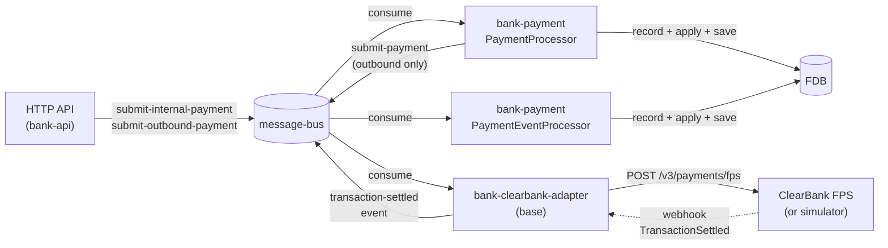
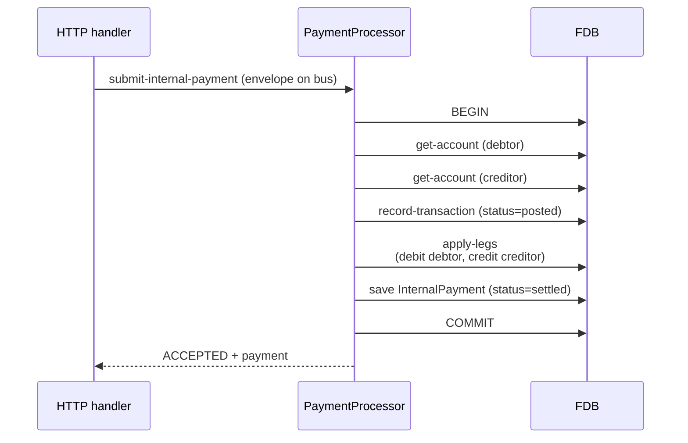
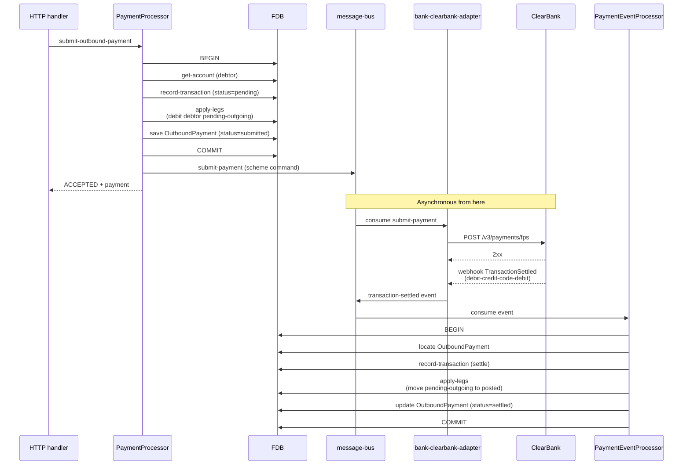
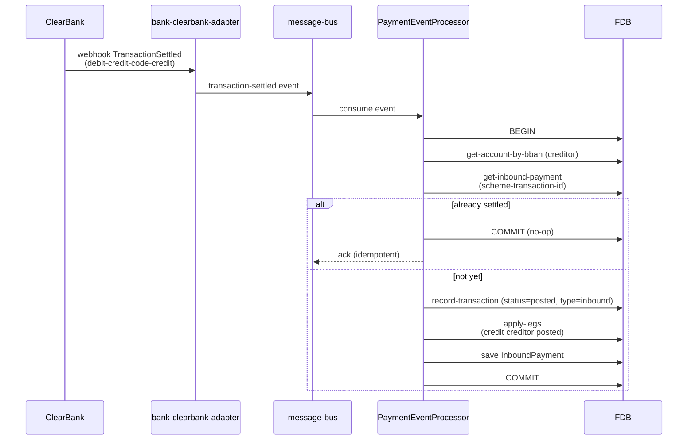

# Payments and ClearBank choreography

## Objective

Queenswood handles three kinds of payment: **internal** (one
Queenswood account to another), **outbound** (money leaving
Queenswood via UK Faster Payments Service through ClearBank),
and **inbound** (money arriving at a Queenswood account via
the same scheme). This TDD describes how each is structured,
how the bank's payment records relate to the underlying
double-entry transactions, and how Queenswood choreographs
with ClearBank for the FPS-bound flows.

In scope: the `bank-payment` brick, the
`bank-clearbank-adapter` and `bank-clearbank-simulator` bases,
the three payment flows, settlement via webhook → event →
event processor.

Out of scope: the underlying double-entry mechanics (see
[transactions-and-balances.md](transactions-and-balances.md));
idempotency mechanics
([idempotency.md](idempotency.md)); fee semantics; the
specific FPS scheme rules and messages (ClearBank documents
these).

## Background

Three payment kinds; two settlement patterns.

**Internal payment.** Both accounts are inside Queenswood. No
external scheme is involved. The payment can settle
immediately — the bank moves money between two of its own
ledgers, atomically.

**Outbound payment.** Money leaves Queenswood through the FPS
scheme. The bank doesn't itself talk to FPS — it talks to
ClearBank, which is the clearing bank that fronts the scheme.
At submission time the payment is *intent*: we know we want
to send money, but until ClearBank confirms the scheme has
accepted it, the money mustn't be considered gone. We hold it
in a `pending-outgoing` bucket. Later, when ClearBank tells
us via a settlement webhook that the scheme has confirmed,
we move it from pending-outgoing to posted.

**Inbound payment.** Money arrives at one of our SCAN
addresses (sort code + account number). ClearBank receives
the scheme message, fires us a settlement webhook with the
creditor BBAN and amount. We look up the account, record a
transaction, and credit the receiving balance.

The two settlement patterns:

- **Atomic-now** (internal): record + apply in one FDB
  transaction. No pending state.
- **Two-phase** (outbound, inbound): record the intent /
  receipt; settle later when the scheme confirms. The
  pending bucket is the "intent registered, value not yet
  spendable" state.

The choreography sits on the message-bus
([ADR-0003](../adr/0003-message-bus-abstraction.md)) and Avro
payloads ([ADR-0004](../adr/0004-avro-for-message-payloads.md)).
ClearBank itself is interfaced through a dedicated adapter
base, with a simulator for development and tests.

## Proposed Solution

### Architecture

Three bases collaborate around the `bank-payment` brick:

- **`bank-payment`** (brick) — owns InternalPayment,
  OutboundPayment, and InboundPayment records. Provides a
  `PaymentProcessor` (consumes commands) and a
  `PaymentEventProcessor` (consumes settlement events).
- **`bank-clearbank-adapter`** (base) — talks to ClearBank.
  Consumes scheme-level submit-payment commands from the
  bus, calls the real ClearBank FPS API, receives webhooks,
  and republishes them as `transaction-settled` events on
  the bus.
- **`bank-clearbank-simulator`** (base) — mocks the ClearBank
  FPS HTTP API for development and tests. Fires
  TransactionSettled webhooks back asynchronously. Not
  deployed in production.

Two distinct paths through the message bus:

- **Command path** for submission (HTTP → PaymentProcessor).
- **Event path** for settlement (Adapter →
  PaymentEventProcessor).

### Payment records

Three record types in `bank-payment`:

- **InternalPayment** — debtor account, creditor account,
  amount, reference, transaction-id, status (`submitted` /
  `settled`).
- **OutboundPayment** — debtor account, creditor BBAN +
  name, amount, reference, transaction-id, status
  (`submitted` / `settled` / `failed`).
- **InboundPayment** — creditor account, debtor name + BBAN,
  amount, reference, transaction-id, scheme-transaction-id
  (ClearBank's identifier), status.

Each payment links to a Transaction via `:transaction-id`.
The Payment record carries the user-facing intent and the
external-scheme metadata; the Transaction record carries the
double-entry posting. They live in different bricks; they
join via the id.

### Internal payment flow

One processor, one FDB transaction, atomic. No external
scheme; no pending state. The reply returns immediately.

### Outbound payment flow

The HTTP response returns *intent accepted*, not *money sent*.
The amount is held in `pending-outgoing` (visible to the
customer via the available-balance derivation) until ClearBank
confirms.

The submit-payment command published on a separate scheme
channel is fire-and-forget from `bank-payment`'s perspective:
the adapter is responsible for retry, error mapping, and
eventually publishing the settlement event.

### Inbound payment flow

Inbound payments are *triggered by* the scheme — there's no
prior HTTP request. The webhook arrives, the adapter
publishes an event, the event processor settles. The whole
flow is reactive.

Idempotency on inbound: the lookup by `scheme-transaction-id`
is the dedup. If ClearBank retries a webhook (network blip,
adapter crash before ack), the second pass finds the existing
InboundPayment and returns it without re-posting.

### ClearBank adapter

`bank-clearbank-adapter` is its own base. It owns:

- **Webhook receiver** — HTTP endpoints under its own server
  (separate from `bank-api`), receiving signed webhooks from
  ClearBank. Verifies signatures, parses the
  scheme-specific payload, normalises into an internal
  `transaction-settled` shape.
- **Scheme command consumer** — Pulsar consumer for
  `submit-payment` commands; for each, calls ClearBank's
  `/v3/payments/fps` endpoint with the appropriate FPS
  payload.
- **Confirmation of Payee (CoP)** — separate code path under
  `cop/` that handles CoP lookups; not directly part of the
  payment-settlement path but co-located in the adapter.
- **Event publisher** — converts webhook receipts into bus
  events on the event channel.

The adapter is the only Queenswood code that talks HTTP to
ClearBank. The rest of the system sees only bus messages.

### ClearBank simulator

`bank-clearbank-simulator` is its own base, deployed only in
development and test. It exposes the subset of ClearBank's
HTTP API that Queenswood uses:

- **`/v3/payments/fps`** — accepts payment submissions,
  returns the same shape ClearBank does.
- **TransactionSettled webhook firing** — after a configurable
  delay, fires the same shape of webhook back to the
  adapter, completing the round-trip.
- **CoP endpoints** — same idea for Confirmation of Payee.

The simulator is approximate (happy paths plus a small set of
rejection scenarios) but covers the choreography end-to-end so
tests can exercise the full settlement loop without external
calls.

### Atomicity, ordering, idempotency

**Atomicity.** Each settlement is one FDB transaction —
record + apply + save commits together. Cross-process the
choreography is asynchronous, but each leg of it (the
processor's commit, the adapter's webhook handling, the event
processor's settlement) is locally atomic.

**Ordering.** Events on the bus arrive in commit order from
their publishing component. Webhooks from ClearBank arrive in
the order ClearBank emits them; we trust ClearBank's
sequencing for FPS settlements. Within Queenswood, the event
processor handles events serially (one consumer; per-account
ordering follows).

**Idempotency.** Today's mix:

- **Internal payments** dedup at submission via the envelope
  `:id` (idempotency-key). Today's storage is per-domain and
  not yet universal — see
  [idempotency.md](idempotency.md) for the proposed unified
  design.
- **Inbound payments** dedup via `scheme-transaction-id` (the
  ClearBank identifier). The check is FDB-indexed and atomic
  with the settlement transaction.
- **Outbound payments** at submission dedup via envelope
  `:id`; settlement (the event-driven side) dedups by the
  outbound payment's known status.

### Three roles for Pulsar in this flow

- **HTTP-facing command channel** — submit-internal-payment
  / submit-outbound-payment commands from the API.
- **Scheme command channel** — submit-payment commands from
  `bank-payment` to the ClearBank adapter (separate channel
  to keep scheme traffic distinct).
- **Event channel** — `transaction-settled` events from the
  adapter to subscribers.

All three sit on the same message-bus abstraction; the
channel separation is configuration, not infrastructure.

## Alternatives Considered

- **Synchronous call to ClearBank from the HTTP handler.**
  Submit the payment over the wire to ClearBank in-band with
  the HTTP request; respond with the scheme outcome
  directly. Rejected — ties HTTP thread-pool capacity to
  ClearBank's latency; failures during the call leave the
  bank's records in an unknown state; replay is awkward. The
  fire-and-forget-with-events pattern decouples the bank
  from ClearBank's response time and gives durable
  intent records to retry against.
- **Single Payment record, no separate Transaction record.**
  Combine the user-facing payment intent and the financial
  posting into one record. Rejected — Payment carries
  scheme metadata (BBAN, scheme-transaction-id) that the
  bookkeeping layer doesn't care about; Transaction carries
  posting metadata (legs, balance buckets) that the user
  doesn't see. Two records, one id link, separate concerns.
- **Direct ClearBank dependency in the payment processor.**
  Have `bank-payment` call ClearBank's HTTP API directly.
  Rejected — couples the payment brick to an external
  vendor's API. The adapter base is the only place that
  knows about ClearBank's wire shape; the rest of the system
  sees bus messages.
- **Eventual-consistency-only (no settlement step).** Apply
  outbound to the posted bucket immediately; reconcile later
  if the scheme rejects. Rejected — risks showing the
  customer money as "spent" when ClearBank later rejects;
  reconciliation is operationally painful. The
  pending-outgoing bucket is the right answer.
- **One Pulsar topic for everything.** Submit, scheme
  command, and settlement events all on one channel.
  Rejected — confuses tracing, mixes traffic with very
  different reliability needs (settlement events are
  audit-relevant; scheme commands can be retried freely).
  Channel separation is cheap and clarifying.
- **Polling ClearBank instead of webhooks.** Periodically
  ask ClearBank for payment status. Rejected — webhooks are
  the standard FPS pattern; polling adds latency and load
  for no benefit when ClearBank already pushes.

## Known Limitations

- **Webhook absence isn't handled.** If ClearBank confirms a
  payment but the webhook never arrives (network failure,
  endpoint downtime), the OutboundPayment stays in
  `submitted` indefinitely. There's no sweeper that polls
  ClearBank to reconcile. Worth a future
  reconciliation-sweep design.
- **Outbound failure flow is partial.** When ClearBank
  rejects a payment, the adapter publishes a failure event;
  `settle-outbound` reverses the pending-outgoing leg and
  marks the payment failed. The depth of the failure
  taxonomy (transient vs permanent, retry vs not) is
  shallower than ClearBank's actual error model.
- **Settlement reordering is trusted to ClearBank.** Events
  on the bus arrive in commit order, and Queenswood handles
  them serially. If ClearBank ever delivered settlement
  webhooks out of scheme-order, downstream invariants might
  break. We trust ClearBank's discipline here.
- **The simulator is approximate.** It covers the happy path
  and a small set of named rejection scenarios. Real-world
  edge cases (partial scheme acceptance, retry storms,
  malformed webhooks) aren't simulated.
- **Scheme-command publication is best-effort.** The
  fire-and-forget publish from `bank-payment` to the adapter
  channel relies on Pulsar's durability. If Pulsar is
  unavailable at the moment of publish, the command is
  lost; the OutboundPayment exists but the adapter never
  sees the submission. A durable-outbox pattern at the
  payment-side commit would close this gap; today the
  reliability story leans on Pulsar.
- **No FX.** Inbound and outbound payments are
  single-currency end-to-end. Cross-currency would need
  explicit FX legs (transactions-and-balances TDD) plus
  scheme-side currency translation that ClearBank handles
  at its boundary. Out of scope here.
- **Confirmation of Payee is in the adapter, not the
  payment brick.** Worth flagging because CoP is part of
  the customer-facing payment journey; the adapter
  owning it works but creates a small layering question
  if CoP-result handling ever needs to live alongside
  payment domain logic.
- **Idempotency on internal payments is per-domain.** As
  with all writes, internal payment idempotency is whatever
  `bank-payment` implements today, with the universal
  design proposed in
  [idempotency.md](idempotency.md).

## References

- [ADR-0002](../adr/0002-foundationdb-record-layer.md) —
  FoundationDB Record Layer (atomic record + apply)
- [ADR-0003](../adr/0003-message-bus-abstraction.md) —
  Message-bus abstraction
- [ADR-0004](../adr/0004-avro-for-message-payloads.md) —
  Avro for message payloads
- [transaction-processing.md](transaction-processing.md) —
  Transaction processing (the command/event substrate)
- [transactions-and-balances.md](transactions-and-balances.md)
  — Transactions and balances (the bookkeeping substrate)
- [service-apis.md](service-apis.md) — Service APIs (HTTP
  surface; ClearBank simulator and adapter HTTP shapes)
- [idempotency.md](idempotency.md) — Idempotency (proposed)
- `bank-payment` brick interface
- `bank-clearbank-adapter` base
- `bank-clearbank-simulator` base
