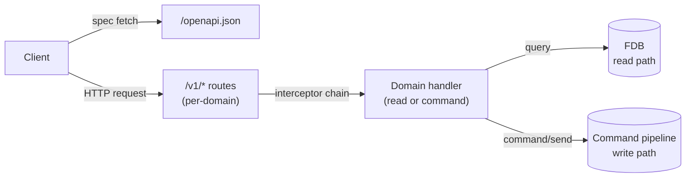
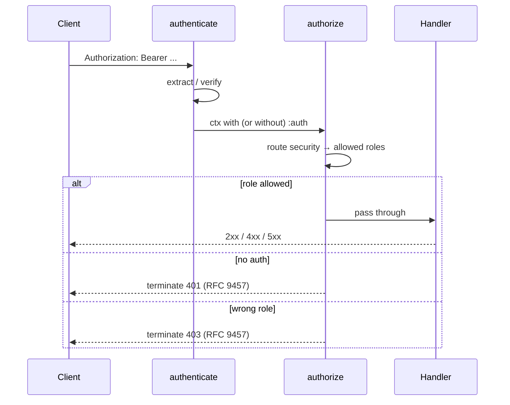

# Service APIs

## Objective

Queenswood serves more than one HTTP API. The headline is
`bank-api` — one unified API for the whole bank
([ADR-0013](../adr/0013-single-unified-api.md)) with full
OpenAPI 3.x compliance as the contract
([ADR-0014](../adr/0014-openapi-3x-compliance.md)). The
ClearBank simulator and ClearBank adapter also serve HTTP
surfaces, with their own contracts shaped by external
specifications.

This TDD documents the canonical patterns we use to build any
HTTP API in this codebase — the `server` brick, the interceptor
chain, RFC 9457 error mapping, Reitit/Malli coercion, OpenAPI
assembly, and how handlers cross into the command pipeline.
`bank-api` is the worked example throughout; the simulator and
adapter inherit the same patterns where applicable and are
called out where they diverge.

In scope: the `server` brick, the canonical interceptor chain,
auth and error-mapping patterns, OpenAPI assembly, the
domain-folder layout for routing, with `bank-api` as the
worked example.

Out of scope: domain-specific request/response shapes (those
live in per-domain components and the OpenAPI document); the
command pipeline behind handlers
([transaction-processing.md](transaction-processing.md));
idempotency (planned recipe).

## Background

Three concerns intersect at every HTTP API: routing and
coercion (Reitit + Malli), serialization (Muuntaja), and auth
(custom interceptors). The interceptor chain is where they meet
— each step has a defined job, the order matters, and the
error-handling pathway has to compose with all of them.

The libraries themselves are wrapped through their respective
bricks per
[ADR-0011](../adr/0011-one-component-per-third-party-library.md)
— `server` wraps Reitit, Sieppari, Muuntaja, and Jetty. Each API
base depends on `server` interfaces plus its own routes and
interceptors.

The wire and storage formats are settled elsewhere: Avro on the
message bus
([ADR-0004](../adr/0004-avro-for-message-payloads.md)),
kebab-case keyword keys throughout
([ADR-0006](../adr/0006-kebab-case-keyword-keys.md)), anomalies
at component boundaries
([ADR-0005](../adr/0005-error-handling-with-anomalies.md)).
This TDD is about how those decisions land at any HTTP
boundary.

## Proposed Solution

### Architecture

The `server` brick is the canonical HTTP-API foundation. Each
API base depends on it.

- **`server`** wraps Reitit, Sieppari, Muuntaja, and Jetty.
  Provides `standard-router-data` (the default interceptor
  chain), `standard-default-handler` (404/405/406 fallback),
  `standard-openapi-handler`, and `standard-openapi-ui-handler`.

The HTTP API bases in the codebase today:

- **`bank-api`** — the unified banking API. Domain-folder
  layout, two-tier auth (admin / org), full OpenAPI 3.x
  compliance, idempotency on writes, command-pipeline
  integration. The worked example for the rest of this TDD.
- **`bank-clearbank-simulator`** — mocks the ClearBank FPS
  HTTP API for development and tests. Inherits the `server`
  brick's chain, RFC 9457 error mapping, and Muuntaja
  serialization. Auth follows ClearBank's own scheme rather
  than the bank-api admin/org pattern, and OpenAPI compliance
  is shaped by mirroring ClearBank's published spec.
- **`bank-clearbank-adapter`** — receives ClearBank webhooks
  and exposes a small HTTP surface. Inherits the same chain;
  its endpoints are narrow and webhook-shaped, with auth
  following ClearBank webhook signing rather than bearer
  tokens.



The diagram shows `bank-api`'s shape. The simulator and adapter
follow the same client → interceptor-chain → handler pattern,
but their handlers don't cross into the command pipeline — they
respond directly (simulator) or relay through Pulsar to the
event processor (adapter).

### Domain folder layout

Per-domain organisation inside `bank-api/src/.../bank_api/`:

```
<domain>/
  routes.clj       ; route definitions, OpenAPI metadata
  handlers.clj     ; read-side handlers
  commands.clj     ; write-side handlers (issue commands)
  queries.clj      ; (often) read-side query helpers
  components.clj   ; Malli registry — typed schemas
  examples.clj     ; OpenAPI examples (request/response/errors)
  coercion.clj     ; (when needed) domain-specific coercion
```

The top-level `api.clj` requires every domain's `routes`,
`components`, and `examples`, merges them into the unified
router data, and wires the OpenAPI document.

### Resource and verb conventions

Endpoints follow standard HTTP resource conventions where they
map cleanly:

- `GET /v1/<resource>` — list
- `GET /v1/<resource>/{id}` — retrieve
- `POST /v1/<resource>` — create
- `PUT` / `PATCH /v1/<resource>/{id}` — update
- `DELETE /v1/<resource>/{id}` — destroy

For state transitions that don't fit a resource-based shape,
we adopt gRPC-style verb sub-resources via POST. Closing a cash
account is `POST /v1/cash-accounts/{id}/close` — not `DELETE
/v1/cash-accounts/{id}`. Closing isn't deletion: the account
record stays in FDB with a `closed` lifecycle state, so the
verb makes the semantics explicit.

Common verb endpoints in the bank-api:

- `POST /v1/cash-accounts/{id}/close`
- `POST /v1/cash-accounts/{id}/suspend`
- `POST /v1/cash-accounts/{id}/reopen`
- `POST /v1/parties/{id}/activate`

The rule: if the operation is a state transition rather than a
resource-based operation, model it as a verb.

### Hypermedia (and what counts as REST here)

Response bodies include `_links` fields where useful, typically
pointing at related resources or follow-up operations. The link
set is *pragmatic*, not a navigation model:

- They aid API fuzzing tools, which can traverse the API by
  following links rather than needing route templates baked in.
- They are convenient for clients — a cash-account response can
  include a link to its transactions collection without the
  client constructing the URL itself.
- They are **not** the canonical way to navigate the API.
  Clients integrate against the documented routes and the
  OpenAPI spec; links are decoration that aids tooling and
  provides hints.

Explicitly: this is *not* Richardson Maturity Model Level 4
(HATEOAS). We don't expect or require clients to be driven by
hypermedia; the contract is the OpenAPI document, and a client
that ignores `_links` entirely is fine. Links may expand over
time, particularly to support fuzzing coverage, but they remain
supplementary to the route surface.

### OpenAPI assembly

`/openapi.json` is its own route, separate from `/v1`. Its
handler returns the spec assembled from:

- **Per-domain Malli component registries.** Each domain's
  `components/registry` is merged into the router's coercion
  registry; Reitit projects them as named OpenAPI components
  via `$ref` (ADR-0014).
- **Per-domain example registries.** Merged into
  `:openapi :components :examples`. Endpoints reference
  examples by `$ref` in their request and response bodies.
- **Security schemes.** Two declared at the top:
  `adminAuth` and `orgAuth`, both `http`/`bearer`. Routes opt
  in per-operation via `:openapi :security`.
- **Default 4xx/5xx responses on the `/v1` group.** Declared
  once on the route group, inherited by every endpoint
  underneath. Per-endpoint responses extend (4xx domain-
  specific) rather than re-declaring shared ones.

This produces a fully-compliant 3.x spec — reusable schemas,
named components, declared security, examples on every
operation, complete response coverage. ADR-0014 captures the
discipline.

### Interceptor chain

Two layers compose into the chain a request flows through.

**Server-level (default, from `server/router.clj`):**

1. `request-log` — captures `:start-ns`, logs method/uri/status
   and elapsed time on `:leave`.
2. `openapi-feature` — Reitit's OpenAPI route handling.
3. `parameters` — query and form params.
4. `format-negotiate` — Muuntaja content negotiation.
5. `format-response` — Muuntaja response encoding.
6. `exception-interceptor` — exception → RFC 9457 body via
   default handlers (see below).
7. `format-request` — Muuntaja request decoding.
8. `coerce-response` — Malli response coercion.
9. `coerce-request` — Malli request coercion.

**API-level (added by `bank-api/api.clj` on the `/v1` group):**

10. `telemetry/trace-span` — opens an OTEL span per request.
11. **Component-injecting interceptors** from system context
    (record-db, record-store, dispatchers, schemas, etc.).
    These attach handles to the request map so handlers can
    use them without global state.
12. `auth/authenticate` — identifies the caller.
13. `auth/authorize` — checks permissions.

A custom `nest-bracket-query-params` interceptor is spliced
*just before* `coerce-request`, so it can rewrite
bracket-notation query params (`?foo[bar]=...`) into nested
maps before Malli sees them.

### Auth

Bearer-token authentication. The `Authorization: Bearer <token>`
header is checked against:

- The configured admin API key (constant-time byte compare via
  `encryption/bytes-equals?`).
- The per-organisation API keys (cached lookup of the
  hashed token, with a 60-second TTL cache layered over an FDB
  read).

A successful identification attaches `:auth` to the request:

```clojure
{:role :admin :organization-id "..."}
;; or
{:role :org   :organization-id "..."}
```

`authenticate` only attaches `:auth` if a key is valid; it
never short-circuits. Routes without `:openapi :security` are
genuinely public.

`authorize` reads the route's `:openapi :security` (e.g.
`[{"orgAuth" []}]`) and resolves required schemes to allowed
roles via the table:

```clojure
{"adminAuth" #{:admin}
 "orgAuth"   #{:org :admin}}
```

If no role is attached → terminate 401. If the role isn't in
the allowed set → terminate 403. Termination uses
`sieppari.context/terminate` — never `:response` or `:error`,
which don't reliably short-circuit (see code-style recipe).



### Error mapping (RFC 9457)

Every error response is shaped as RFC 9457 Problem Details:

```clojure
{:title  "REJECTED"
 :type   "<anomaly-kind-as-namespaced-keyword>"
 :status 422
 :detail "Human-readable message"}
```

`bank-api/errors.clj` provides the mapping. Anomaly kind →
HTTP status:

- `:unauthorized/anomaly` → 401.
- `:rejection/anomaly` → 4xx, picked by kind:
  - kind ends with `not-found` → 404.
  - kind is `already-exists` / `exists` or contains
    `duplicate` → 409.
  - explicit overrides for cases that don't fit the heuristic
    (`:cash-account-product/version-immutable` → 409,
    `:interest/no-settlement` → 404).
  - default → 422.
- `:error/anomaly` → 500. The full underlying exception is
  logged; clients see only a terse message.

The Reitit exception interceptor handles framework-level
failures the same way:

- Malformed JSON body → 400 (`mono/malformed-body`).
- Request coercion failure → 400 (`mono/bad-request`) with a
  humanised explanation of the schema violation.
- Response coercion failure → 500 (`mono/bad-response`) — the
  bug is on our side.
- Catch-all `::exception/default` → 500, logs the stack trace.

Default 404 / 405 / 406 also emit RFC 9457 bodies, with `Allow`
populated for 405.

### Coercion

Malli coercion with three customisations:

- A custom `:api` transformer for `:decode/api` and
  `:encode/api` properties on schemas. Lets API-friendly enum
  values decode to internal namespaced keywords (and back on
  the way out).
- `:strip-extra-keys false` so closed schemas reject unknown
  keys with a 400 instead of silently dropping them. Strict by
  design — clients sending extra fields find out immediately.
- Keyword `decode-key-fn` for JSON (per ADR-0006); request
  bodies arrive as kebab-case keyword maps.

### Crossing into the command pipeline

For write operations, the handler calls `command/send`
(transaction-processing TDD). The handler is responsible for:

- Building the command envelope via
  `command/req->command-request` (which reads
  `Idempotency-Key` and `Correlation-Id` headers).
- `assoc`-ing the command-specific `:payload`.
- Sending it via the dispatcher and awaiting the reply.
- Mapping the reply's status to the HTTP response — `ACCEPTED`
  → 2xx with payload, `REJECTED`/`FAILED` → 4xx/5xx via
  `errors/error-response`.

Read operations skip the pipeline and query FDB directly.

## Alternatives Considered

- **Compojure or hand-rolled routing.** Simpler but no built-in
  OpenAPI generation, no Malli-driven coercion, and the auth/
  error-handling story would be ad-hoc. Rejected — Reitit gives
  us most of ADR-0014's compliance for free, plus the
  interceptor model that suits Sieppari and our anomaly
  discipline.
- **Per-domain HTTP servers.** Each domain owns its own
  routing and serialization. Rejected by ADR-0013 at the API
  level. The base-level alternative (separate Jetty per
  domain) would also fragment the interceptor chain and
  duplicate the OpenAPI assembly.
- **Static OpenAPI doc, hand-maintained.** Drift between the
  doc and the implementation is the failure mode. Rejected —
  the spec generated from Reitit + Malli is the contract
  (ADR-0014).
- **Auth as middleware before Reitit (pre-router).** Sometimes
  cleaner for "always require auth" cases. Rejected because
  per-route security in OpenAPI is the canonical place for
  this — `authorize` reads the same security map the spec
  publishes, so the doc and the runtime can't disagree.
- **Manual exception → response mapping in each handler.**
  Rejected for obvious reasons; centralised in
  `errors.clj` and the Reitit exception interceptor.
- **Pure REST / Richardson Maturity Level 4 (HATEOAS).**
  Rejected. The OpenAPI document is the contract; clients
  integrate against documented routes, not by following
  hypermedia. `_links` exist as decoration to aid tooling
  (notably API fuzzers) and client convenience, not as a
  navigation requirement. Pure HATEOAS would force every
  client to encode link-traversal logic and would still need
  a route catalogue somewhere — for which the OpenAPI doc is
  already the canonical artefact.
- **Pure resource-based endpoint design (DELETE for closure,
  etc.).** Rejected for state-transition operations that
  aren't resource removal. Closing a cash account isn't
  deletion — the record stays — so `POST .../close` is more
  honest than `DELETE`. The hybrid (resource-based where it
  fits, gRPC-style verb sub-resources where it doesn't) is
  documented in "Resource and verb conventions" above.

## Known Limitations

- **The `nest-bracket-query-params` interceptor** is a
  workaround for a Reitit/Malli quirk with bracket-notation
  query parameters. Ad-hoc; not in upstream Reitit.
- **Exception handlers are configured at boot.** Adding a
  domain-specific handler requires modifying the router data
  before `system/start`. Not runtime-injectable.
- **The auth cache is in-memory per process.** A revoked org
  key takes up to 60 seconds to invalidate across instances.
  Acceptable for current scale; would need a distributed
  invalidation story (or shorter TTL) at higher tenancy.
- **API versioning is `/v1` only.** Adding `/v2` would mean
  either coexistence (running both surfaces during migration)
  or a breaking-change protocol. Neither is automated.
- **Rate limiting isn't implemented.** No per-key or per-IP
  limits at the API layer.
- **Polymorphic schema coercion takes care.** Malli unions
  need explicit discriminator fields to project as proper
  OpenAPI `oneOf`. Easy to mis-shape.
- **`:strip-extra-keys false` is strict.** Clients sending
  extra fields are rejected with 400. Deliberate, but means
  client teams need to be careful with optional-field
  conventions.
- **Idempotency is a per-route opt-in interceptor**
  (`telemetry/require-idempotency-key`). Forgetting to add it
  to a write endpoint means the endpoint accepts retries
  blindly. Worth a dedicated recipe to capture the discipline.

## References

- [ADR-0011](../adr/0011-one-component-per-third-party-library.md) —
  One component per third-party library
- [ADR-0013](../adr/0013-single-unified-api.md) —
  Single unified API for the whole bank
- [ADR-0014](../adr/0014-openapi-3x-compliance.md) —
  Full OpenAPI 3.x compliance for the API contract
- [ADR-0005](../adr/0005-error-handling-with-anomalies.md) —
  Error handling with anomalies
- [ADR-0006](../adr/0006-kebab-case-keyword-keys.md) —
  Kebab-case keyword keys
- [transaction-processing.md](transaction-processing.md) —
  Transaction processing
- [error-handling.md](../recipes/error-handling.md)
- [code-style.md](../recipes/code-style.md) — sieppari
  `terminate` rule
- `bank-api` base
- `server` brick interface
- [RFC 9457](https://www.rfc-editor.org/rfc/rfc9457.html) —
  Problem Details for HTTP APIs
