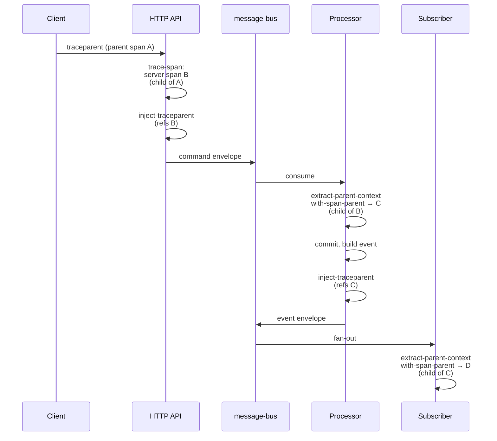

# Traceability

## Objective

A single user action against Queenswood typically fans out
across many components — an HTTP handler, a command on the bus,
a processor that commits a transaction, events emitted from the
commit, downstream subscribers that react. When something goes
wrong (or just takes too long), we need to follow that action
end-to-end: which command went where, what reacted to it, where
time was spent.

This TDD describes the traceability machinery: the set of IDs
that thread through the system, how they propagate across the
HTTP boundary and the message bus, the OpenTelemetry stack
sitting underneath, and the gaps in coverage we have today.

In scope: the `telemetry` brick, OpenTelemetry tracing, the
ID set (correlation-id, causation-id, idempotency `:id`,
traceparent, tracestate), and how they propagate.

Out of scope: the log brick's plain-text logging mechanics
(`log/info`, `log/error`); idempotency semantics (separate
recipe, planned); error surfacing (covered by error-handling
recipe and ADR-0005).

## Background

Traceability in a CQRS-with-events system has more moving parts
than a single-process app:

- A user action triggers a command, which lives briefly on a
  bus before a processor consumes it.
- Processors may emit events, which fan out to multiple
  subscribers.
- Subscribers may emit further commands or events.
- All of this happens across process boundaries and possibly
  across deployments.

A trace tool like Jaeger or Tempo needs a way to see this whole
tree as one trace. The industry standard for that is W3C Trace
Context (`traceparent` / `tracestate` headers / fields), which
OpenTelemetry implements.

W3C trace context alone isn't enough, though. OTEL trace IDs are
128-bit hex blobs designed for trace tools, not human-readable
correlation. We also want:

- A **human-readable identifier** for a user action that's easy
  to put in support tickets, logs, and HTTP responses.
- A **causal chain** that shows which command spawned which
  event spawned which command — independent of OTEL's
  span-tree view.
- An **idempotency key** to deduplicate retries.

So we carry four IDs alongside W3C trace context, each doing a
different job.

## Proposed Solution

### The ID set

Five fields travel on every command, reply, and event envelope.
Each has a distinct role.

- **`:id`** — the message's own identifier. For commands, this
  is the caller-supplied idempotency key (from the
  `Idempotency-Key` header). For replies and events, a fresh
  UUIDv7. Used for dedup.
- **`:correlation-id`** — the human-readable thread for a
  single user action. Set once at the HTTP edge (from the
  `Correlation-Id` header, defaulting to `:id` if not
  supplied) and copied unchanged onto every downstream
  message in the resulting tree. The token a support engineer
  pastes into queries.
- **`:causation-id`** — the parent-child link in the message
  chain. A reply's `:causation-id` is the command's `:id`; an
  event's `:causation-id` is the commit reference; a follow-up
  command's `:causation-id` is the event that triggered it.
  Tracing causation follows this chain.
- **`:traceparent`** — W3C Trace Context. The OTEL trace and
  span IDs encoded as a string. Read on entry, populated on
  outbound messages by `telemetry/inject-traceparent`.
- **`:tracestate`** — W3C state alongside traceparent.
  Vendor-specific data; usually empty for us.

The IDs play together:

- `:correlation-id` answers *"what user action was this?"*
- `:causation-id` answers *"what triggered this specific
  message?"*
- `:traceparent` answers *"where does this fit in the trace
  tree the OTEL backend will render?"*
- `:id` answers *"is this a retry of something we already
  processed?"*

### The telemetry brick

`telemetry` wraps
[`clj-otel`](https://github.com/steffan-westcott/clj-otel) and
exposes a Clojure-friendly surface to domain code:

- **`telemetry/with-span`** — macro, wraps a body in a child
  span. Gracefully degrades if OTEL isn't configured.
- **`telemetry/with-span-parent`** — opens a child span under
  an explicit parent context (used on the consumer side of the
  bus to continue a trace from `traceparent`).
- **`telemetry/add-event` / `set-attribute`** — span
  enrichment.
- **`telemetry/inject-traceparent`** — extracts the W3C
  traceparent string from the *current* thread-local span, for
  embedding in outbound envelopes.
- **`telemetry/extract-parent-context`** — reads
  `traceparent` / `tracestate` from a received envelope and
  returns an OTEL context suitable for `with-span-parent`.
- **`telemetry/trace-span`** — Reitit/Sieppari interceptor
  vector that creates a server span from incoming HTTP W3C
  headers. Used by the `bank-api` interceptor chain (see
  service-apis TDD).
- **`telemetry/counter` / `inc-counter` / `add-counter`** —
  metric primitives. The API exists; broad instrumentation
  does not yet.

The brick is the project's only consumer of OTEL libraries
(per ADR-0011); domain code never imports clj-otel directly.

### Trace propagation

The trace tree the OTEL backend sees: A (client) → B (HTTP
server) → C (processor) → D (subscriber). All with the same
trace ID. Time spent in each span is visible.

### HTTP edge

`telemetry/trace-span` (a vector of clj-otel
`server-span-interceptors`) is concatenated into the `bank-api`
interceptor chain. On `:enter`:

- Extracts the W3C traceparent from incoming headers.
- Creates a server span as a child of the extracted context.
- Sets the span as the current context for the rest of the
  request (synchronous; safe because Reitit/Sieppari run on a
  single thread per request).

On `:leave` or exception, records HTTP response status and ends
the span.

The handler — when it builds an outbound command envelope —
calls `telemetry/inject-traceparent` to embed the current
span's traceparent into the envelope.

### Message-bus boundary

When a processor consumes a command (or a subscriber consumes
an event):

1. Read the envelope's `:traceparent` and `:tracestate` via
   `telemetry/extract-parent-context`. This returns an OTEL
   context wrapping the parent span ID.
2. Open a child span with
   `telemetry/with-span-parent ["process-X" parent-ctx attrs
   f]`. The processor's work executes inside `f`, with the
   span set as the current thread-local context.
3. If the processor emits further messages (replies, events,
   downstream commands), `inject-traceparent` from inside the
   span captures the *child* span's traceparent for the
   outbound envelope.

The chain continues for as many hops as the action takes.

### Logging

The `log` brick wraps `clojure.tools.logging` over SLF4J. Logs
go to logback. **Logs are not currently correlated with traces**
— there is no MDC integration that injects the OTEL trace ID
into log lines. Today, finding logs that match a span means
either (a) cross-referencing by timestamp, or (b) including
`:correlation-id` in the log message manually.

This is a real gap (see Known Limitations).

### Metrics

`telemetry/counter` and friends exist as primitives. A handful
of usages exist in infrastructure code. **Most domain
operations are not instrumented with counters today.** The API
is ready when we want to instrument; the instrumentation work
itself is largely outstanding.

### Test support

`telemetry/with-span-tests` runs a body under an in-memory OTEL
SDK, then asserts:

- Each named span exists.
- All finished spans share the same trace ID (i.e. propagation
  worked across the bus).

Used in scenario tests where trace continuity is part of the
property under test.

## Alternatives Considered

- **Correlation-ID only, no OpenTelemetry.** Simple, no library
  dependency. Rejected because real trace tooling (Jaeger,
  Tempo, Honeycomb, Datadog) needs W3C trace context to render
  span trees with timing. A correlation-id alone gives you log
  grouping but no latency view.
- **OTEL only, no correlation-id / causation-id.** OTEL trace
  IDs are technically sufficient to thread an action.
  Rejected because OTEL IDs are 128-bit hex blobs — they're
  not human-readable, not easy to put in error responses or
  support tickets, and don't expose causal links separate from
  the span tree (an OTEL span tree is shaped by *time
  containment*, not message causation).
- **Vendor-specific propagation (Zipkin B3, Datadog).**
  Rejected because OTEL with W3C is vendor-neutral; we can
  swap backends without changing instrumentation.
- **Custom trace format on the wire.** Rejected. W3C is a
  standard; building custom propagation is reinventing the
  wheel and locks us out of standard tooling.
- **Asynchronous span context propagation.** clj-otel offers
  patterns for this. Rejected for now: Reitit / Sieppari runs
  synchronously per request, and the bus consumer side reopens
  spans explicitly via `extract-parent-context` — no need for
  async context machinery.

## Known Limitations

- **No log/trace correlation.** The `log` brick produces
  string log lines that don't include the OTEL trace ID. A
  span and its log lines can't be joined by anything other
  than timestamp. Worth addressing — at minimum a logback
  pattern that pulls trace ID from MDC, plus an interceptor
  to populate MDC from the active span.
- **Counters exist but aren't widely instrumented.** The
  `telemetry/counter` API is in place but most domain
  operations don't increment any counters. Rejection rates,
  command throughput, latency histograms, etc. are unobserved.
  Worth a separate piece of work.
- **No structured logging.** Logs are formatted strings, not
  JSON or EDN with queryable fields. A structured-logging
  appender (logstash-encoder or similar) would let log
  aggregators query by `:correlation-id`, `:causation-id`,
  command name, etc.
- **Correlation-Id header defaults to Idempotency-Key.** When
  a client doesn't supply `Correlation-Id`, the `:id` is used.
  Two retries of the same operation share both — which is
  fine for tracing one user-intent through retries, but means
  the correlation-id space and idempotency-key space overlap.
- **Trace sampling is not configured.** Every request emits a
  full span tree. At higher volume we'd want a sampling
  strategy (head-based, tail-based, or per-route).
- **`with-span-parent` is synchronous.** It sets the current
  thread-local context. Code that hands work off to an
  executor (core.async, futures) breaks the span chain unless
  it explicitly captures and re-applies the context.
- **Counter/span functions use `!` suffix.** `inc-counter!`
  and `add-counter!` carry the bang convention from clj-otel.
  This contradicts the project's no-bang-on-side-effects
  convention (see code-style recipe). Worth a future rename
  pass on the wrapper functions.

## References

- [ADR-0005](../adr/0005-error-handling-with-anomalies.md) —
  Error handling with anomalies
- [ADR-0011](../adr/0011-one-component-per-third-party-library.md) —
  One component per third-party library
- [transaction-processing.md](transaction-processing.md) —
  Transaction processing (defines envelope ID set)
- [service-apis.md](service-apis.md) — Service APIs (HTTP
  edge interceptors)
- [error-handling.md](../recipes/error-handling.md)
- `telemetry` brick interface
- `log` brick interface
- [W3C Trace Context](https://www.w3.org/TR/trace-context/)
- [OpenTelemetry](https://opentelemetry.io/)
- [`clj-otel`](https://github.com/steffan-westcott/clj-otel)
