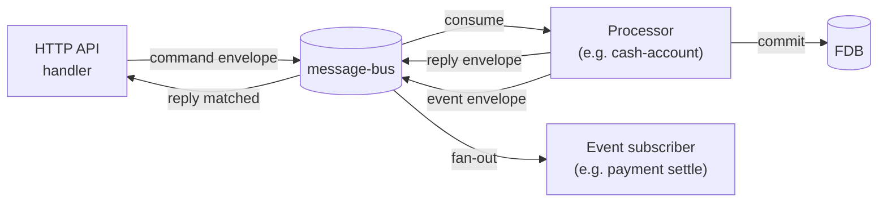
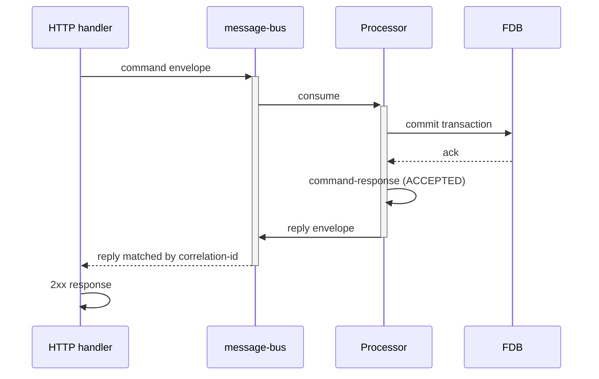
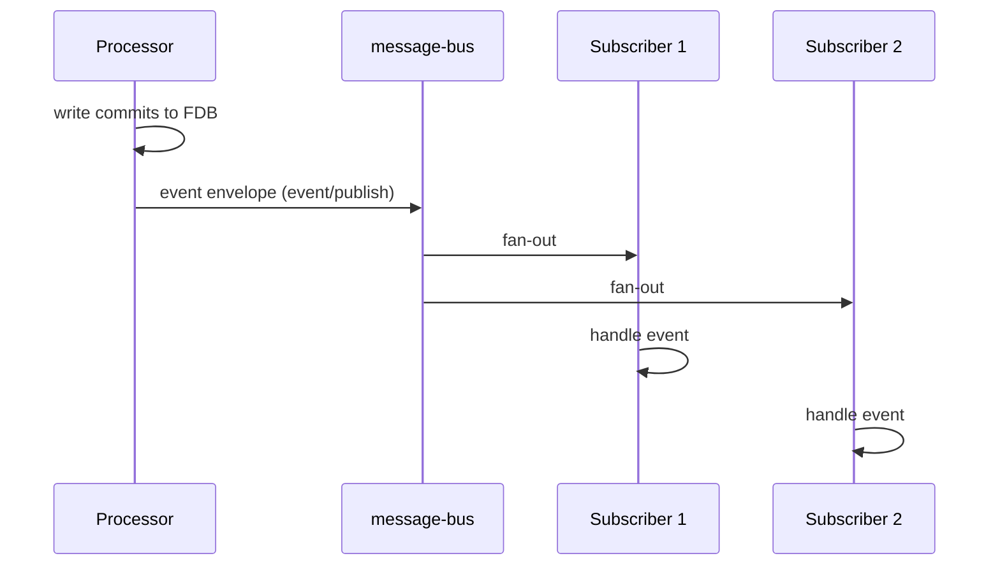

# Transaction processing

## Objective

Queenswood is fundamentally an OLTP system — online transaction
processing. A user request must become an atomically-committed
transaction with a clear outcome reported back to the caller.
Other parts of the system must be able to react to facts emitted
by committed transactions.

This TDD describes how Queenswood implements transaction
processing — the request-response round-trip from HTTP through
processors, the downstream event fan-out from committed writes,
and the status semantics that thread these together.

In scope: the `command`, `command-processor`, `event`, and
`event-processor` bricks; envelope shape; status semantics;
correlation; reply round-trip.

Out of scope: the message-bus abstraction
([ADR-0003](../adr/0003-message-bus-abstraction.md)), Avro
encoding ([ADR-0004](../adr/0004-avro-for-message-payloads.md)),
FDB changelog mechanics
([ADR-0008](../adr/0008-changelog-watchers.md)).

## Background

Banking is the prototypical OLTP use case. A request to open an
account, transfer money, or apply a fee must commit atomically
or refuse cleanly, report its outcome back to the caller in a
timely way, and surface its facts so other parts of the system
can react.

The synchronous-feeling shape (caller waits for outcome) is
load-bearing. Banking APIs are expected to return "your transfer
was accepted" or "your transfer was rejected because ..." — not
"we'll get back to you." Response timing matters; an end user
is looking at a spinner.

Queenswood implements OLTP with three flows on a shared message
bus:

- **Commands** — imperative requests that one processor handles
  ("open this account", "settle this payment").
- **Replies** — structured responses returned to the caller via
  the same bus.
- **Events** — facts emitted from committed writes that any
  number of subscribers can react to ("transaction settled").

The shared substrate is the message-bus abstraction
([ADR-0003](../adr/0003-message-bus-abstraction.md)) with Avro
payloads ([ADR-0004](../adr/0004-avro-for-message-payloads.md)).
Anomalies at component boundaries
([ADR-0005](../adr/0005-error-handling-with-anomalies.md))
provide the typed-failure semantics that map directly to
envelope statuses.

## Proposed Solution

### Architecture

Five bricks make up the transaction-processing pipeline:

- **`command`** — provides the wire envelope, the dispatcher
  (caller side), and the processor harness (handler side). Used
  by HTTP handlers and processors alike.
- **`command-processor`** — system-component registrations
  binding named processors (`cash-account/processor`,
  `payment/processor`, etc.) to the bus.
- **`event`** — provides the event envelope, the publisher,
  and the consumer harness.
- **`event-processor`** — system-component registrations for
  named event subscribers.
- **`processor`** — small `Processor` protocol that
  domain-specific processors implement.



### Data model

**Command envelope** (request from HTTP to processor):

```clojure
{:command         "<command-name>"
 :id              "<idempotency-key>"
 :correlation-id  "<trace-id>"
 :causation-id    nil
 :traceparent     "<otel>"
 :tracestate      nil
 :payload         {...}             ; command-specific
 :reply-to        nil}              ; set by dispatcher
```

`:id` is the caller-supplied idempotency key.
`:correlation-id` threads through the whole chain and defaults
to `:id` if no header was supplied. `:causation-id` links a
downstream message to its predecessor.

**Response envelope** (reply from processor to caller):

```clojure
{:id              "<fresh-uuidv7>"
 :correlation-id  "<from-request>"
 :causation-id    "<request :id>"
 :traceparent     "<otel>"
 :status          "ACCEPTED" | "REJECTED" | "FAILED"
 :payload         {...}             ; on ACCEPTED
 :reason          "<anomaly-kind>"  ; on REJECTED / FAILED
 :message         "..."}            ; on REJECTED / FAILED
```

**Event envelope** (fact from processor to subscribers):

```clojure
{:id              "<fresh-uuidv7>"
 :event           "<event-name>"
 :correlation-id  "<originating-correlation>"
 :causation-id    "<commit-id-or-prior>"
 :traceparent     "<otel>"
 :payload         {...}}            ; event-specific
```

**Status mapping** — three outcomes from process-fn map cleanly
to envelope statuses and HTTP families:

- Non-anomaly value → `ACCEPTED` → 2xx
- `:rejection/anomaly` → `REJECTED` → 4xx
- `:error/anomaly` → `FAILED` → 5xx

`:unauthorized/anomaly` does not reach the pipeline — the auth
interceptor short-circuits the HTTP request before the command
is dispatched.

### Flows

**Happy command path:**



**Rejected command path:** Same shape, but the process-fn
returns a `:rejection/anomaly` (policy denial, missing
prerequisite, conflict). `command-response` builds
`status=REJECTED` with `:reason` and `:message`. The HTTP
handler maps to a 4xx response.

**Failed command path:** Same shape, but an `:error/anomaly`
(infrastructure fault, bug, caught exception) becomes
`status=FAILED`. HTTP 5xx.

**Event fan-out:**



A subscriber's handler may itself emit further commands or
events, continuing the causation chain.

### Detailed design

**Dispatcher and reply matching.** `command/send` on the caller
side keeps a registry of in-flight requests keyed by
`:correlation-id`. When a reply arrives on the reply channel,
the dispatcher resolves it against the registry and returns the
response (or anomaly) to the caller. Default timeout is 10
seconds; expired requests return a timeout anomaly.

**Processor harness.** `command/process` runs a consume-loop on
the bus, handing each envelope to the supplied process-fn. The
fn returns either a result map with a `:payload`, or an anomaly.
The harness wraps the outcome in `command/command-response` and
publishes the reply.

**Idempotency.** The caller-supplied `:id` (idempotency-key
header) is what processors use to deduplicate retries. Each
processor stores the idempotency key alongside the transaction
record so that a replay returns the prior outcome rather than
re-applying. The pipeline carries the key but does not enforce
dedup — that's processor-side discipline.

**Correlation and causation.** `:correlation-id` is set once at
the HTTP edge and threaded through every command, reply, and
event in the resulting tree. `:causation-id` chains
parent → child: a reply's `:causation-id` is the command's
`:id`; an event's `:causation-id` is the commit reference; a
follow-up command's `:causation-id` is the event that triggered
it. Tracing across the bus follows the causation chain;
correlating a user action to its full effect tree follows
correlation-id.

**OpenTelemetry propagation.** `:traceparent` and `:tracestate`
travel on every envelope so traces span the bus boundary.
Headers are populated by `telemetry/inject-traceparent` at
envelope assembly.

**Avro on the wire.** Both command and event envelopes are
Avro-encoded for transport. Schemas live in `bank-schema`
alongside the proto record schemas. See ADR-0004 for the
rationale and the brick organisation.

## Alternatives Considered

- **Synchronous RPC end-to-end (e.g. gRPC).** Keeps the sync
  feel without a message bus. Rejected because every call site
  would need explicit retry / timeout / circuit-breaker logic;
  downstream fan-out (the event side) needs separate plumbing;
  testing needs a mock service mesh. The bus-based approach
  gives all of this for free at the cost of a sync-over-async
  dispatcher.
- **Event-only architecture (no commands).** Every state change
  is an event; processors react, no request/response. Rejected
  because banking APIs need synchronous outcomes — callers
  expect "your transfer was accepted/rejected", not "we'll get
  back to you." Event-only systems work for some domains but
  not OLTP.
- **Saga orchestration.** A central orchestrator coordinates
  multi-step transactions across processors. Rejected for
  current scope: multi-record atomicity at the FDB layer covers
  the cases that would otherwise need sagas (a transfer touches
  sender balance, receiver balance, both posting legs, and a
  transaction record in one FDB transaction). Sagas would be
  needed if we ever spanned transaction boundaries (e.g.
  cross-bank transfers with external compensation), but we
  don't yet.
- **Direct HTTP → database.** No bus, no processors;
  controllers write directly. Rejected because: it ties HTTP
  thread-pool capacity to write throughput; replay/debugging
  needs ad-hoc instrumentation; downstream fan-out has no
  natural home; horizontal scaling of writes means scaling the
  API too.

## Known Limitations

- **Single reply timeout.** `command/send` defaults to 10
  seconds with no per-command override exposed. Long-running
  operations would need either an explicit timeout argument or
  a different async-acknowledgement pattern.
- **In-flight commands during processor restart.** A command on
  the bus that has been delivered but not yet processed when
  the processor restarts depends on the bus backend's
  redelivery semantics. The Pulsar backend acks on success;
  the channel-based backend has different semantics. Test- and
  prod-shape behaviour can diverge here; covered by scenario
  testing
  ([ADR-0009](../adr/0009-model-equality-property-testing.md)).
- **Authorisation is not pipeline-aware.** The auth interceptor
  short-circuits before commands are dispatched; the pipeline
  treats every received command as already-authorised. If a
  future requirement needed per-command auth (rather than
  per-route), this would need to extend the envelope.
- **No multi-step saga coordination.** Per the alternative
  above — if cross-processor atomicity is ever required, this
  becomes a gap.
- **Idempotency is processor-side discipline.** The pipeline
  carries `:id` but doesn't enforce dedup. A processor that
  forgets to check its idempotency table is a real bug class
  worth a dedicated recipe.

## References

- [ADR-0003](../adr/0003-message-bus-abstraction.md) —
  Message-bus abstraction
- [ADR-0004](../adr/0004-avro-for-message-payloads.md) —
  Avro for message payloads
- [ADR-0005](../adr/0005-error-handling-with-anomalies.md) —
  Error handling with anomalies
- [ADR-0008](../adr/0008-changelog-watchers.md) —
  Changelog watchers for reactive state transitions
- [ADR-0009](../adr/0009-model-equality-property-testing.md) —
  Model-equality property testing
- [error-handling.md](../recipes/error-handling.md)
- [system-components.md](../recipes/system-components.md)
- `command` brick interface
- `command-processor` brick interface
- `event` brick interface
- `event-processor` brick interface
- `processor` brick interface
