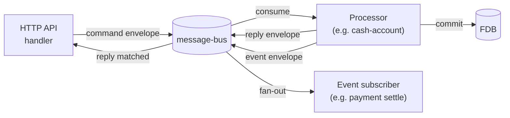
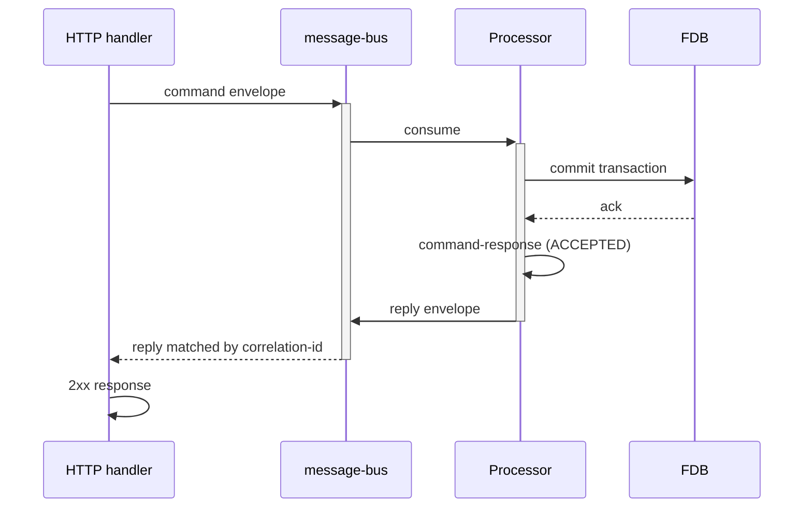
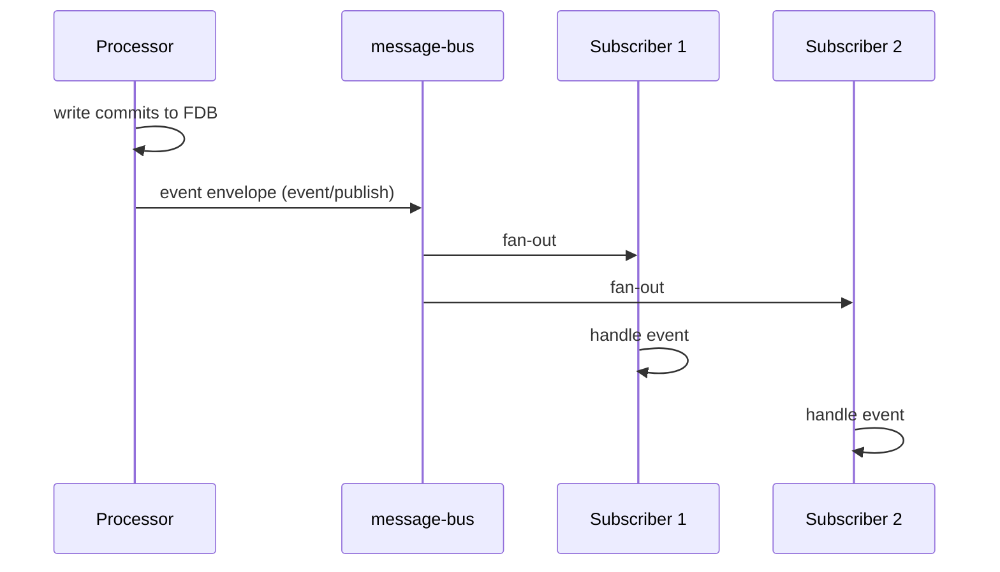
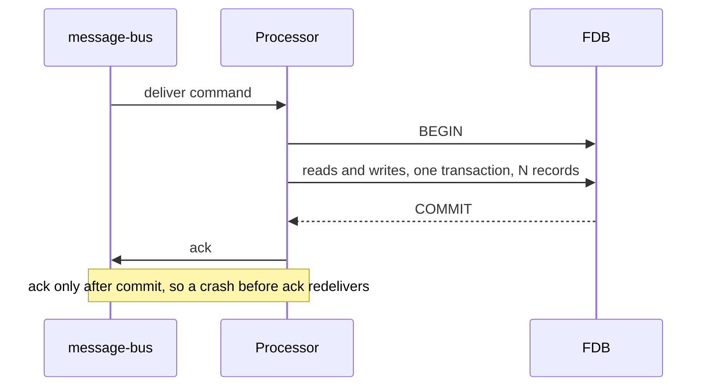
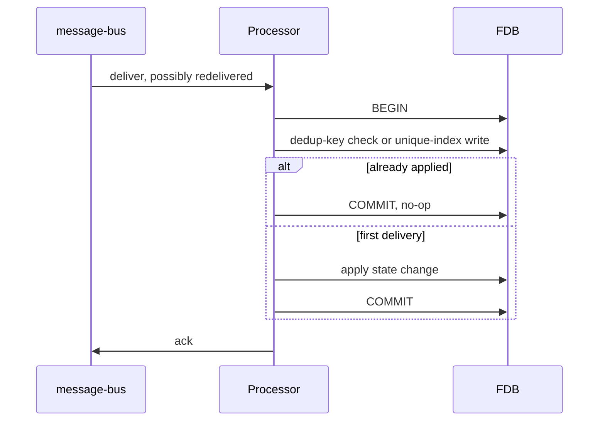
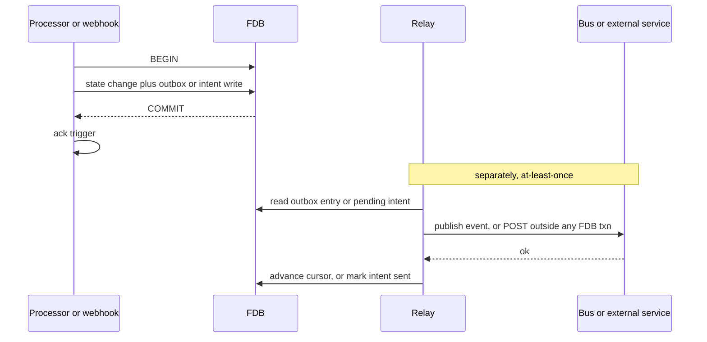

# Transaction processing

## Objective

Queenswood is fundamentally an OLTP system — online transaction
processing. A user request must become an atomically-committed
transaction with a clear outcome reported back to the caller.
Other parts of the system must be able to react to facts emitted
by committed transactions.

This TDD describes how Queenswood implements transaction
processing — the request-response round-trip from HTTP through
processors, the downstream event fan-out from committed writes,
and the status semantics that thread these together.

In scope: the `command`, `command-processor`, `event`, and
`event-processor` bricks; envelope shape; status semantics;
correlation; reply round-trip; and the transactional guarantees
that separate work inside FDB from work that crosses a boundary.

Out of scope: the message-bus abstraction per
[ADR-0003](../adr/0003-message-bus-abstraction.md), Avro
encoding per
[ADR-0004](../adr/0004-avro-for-message-payloads.md), and
FDB changelog mechanics per
[ADR-0008](../adr/0008-changelog-watchers.md).

## Background

Banking is the prototypical OLTP use case. A request to open an
account, transfer money, or apply a fee must commit atomically
or refuse cleanly, report its outcome back to the caller in a
timely way, and surface its facts so other parts of the system
can react.

The synchronous-feeling shape (caller waits for outcome) is
load-bearing. Banking APIs are expected to return "your transfer
was accepted" or "your transfer was rejected because ..." — not
"we'll get back to you." Response timing matters; an end user
is looking at a spinner.

Queenswood implements OLTP with three flows on a shared message
bus:

- **Commands** — imperative requests that one processor handles
  ("open this account", "settle this payment").
- **Replies** — structured responses returned to the caller via
  the same bus.
- **Events** — facts emitted from committed writes that any
  number of subscribers can react to ("transaction settled").

The shared substrate is the message-bus abstraction per
[ADR-0003](../adr/0003-message-bus-abstraction.md) with Avro
payloads per
[ADR-0004](../adr/0004-avro-for-message-payloads.md).
Anomalies at component boundaries per
[ADR-0005](../adr/0005-error-handling-with-anomalies.md)
provide the typed-failure semantics that map directly to
envelope statuses.

## Proposed Solution

### Architecture

Five bricks make up the transaction-processing pipeline:

- **`command`** — provides the wire envelope, the dispatcher
  (caller side), and the processor harness (handler side). Used
  by HTTP handlers and processors alike.
- **`command-processor`** — system-component registrations
  binding named processors (`cash-account/processor`,
  `payment/processor`, etc.) to the bus.
- **`event`** — provides the event envelope, the publisher,
  and the consumer harness.
- **`event-processor`** — system-component registrations for
  named event subscribers.
- **`processor`** — small `Processor` protocol that
  domain-specific processors implement.


```mermaid
graph LR
    HTTP["HTTP API<br/>handler"]
    BUS[("message-bus")]
    PROC["Processor<br/>(e.g. cash-account)"]
    FDB[("FDB")]
    SUB["Event subscriber<br/>(e.g. payment settle)"]

    HTTP -->|"command envelope"| BUS
    BUS -->|consume| PROC
    PROC -->|commit| FDB
    PROC -->|"reply envelope"| BUS
    BUS -->|"reply matched"| HTTP
    PROC -->|"event envelope"| BUS
    BUS -->|"fan-out"| SUB
```

### Data model

**Command envelope** (request from HTTP to processor):

```clojure
{:command         "<command-name>"
 :id              "<idempotency-key>"
 :correlation-id  "<trace-id>"
 :causation-id    nil
 :traceparent     "<otel>"
 :tracestate      nil
 :payload         {...}             ; command-specific
 :reply-to        nil}              ; set by dispatcher
```

`:id` is the caller-supplied idempotency key.
`:correlation-id` threads through the whole chain and defaults
to `:id` if no header was supplied. `:causation-id` links a
downstream message to its predecessor.

**Response envelope** (reply from processor to caller):

```clojure
{:id              "<fresh-uuidv7>"
 :correlation-id  "<from-request>"
 :causation-id    "<request :id>"
 :traceparent     "<otel>"
 :status          "ACCEPTED" | "REJECTED" | "FAILED"
 :payload         {...}             ; on ACCEPTED
 :reason          "<anomaly-kind>"  ; on REJECTED / FAILED
 :message         "..."}            ; on REJECTED / FAILED
```

**Event envelope** (fact from processor to subscribers):

```clojure
{:id              "<fresh-uuidv7>"
 :event           "<event-name>"
 :correlation-id  "<originating-correlation>"
 :causation-id    "<commit-id-or-prior>"
 :traceparent     "<otel>"
 :payload         {...}}            ; event-specific
```

**Status mapping** — three outcomes from process-fn map cleanly
to envelope statuses and HTTP families:

- Non-anomaly value → `ACCEPTED` → 2xx
- `:rejection/anomaly` → `REJECTED` → 4xx
- `:error/anomaly` → `FAILED` → 5xx

`:unauthorized/anomaly` does not reach the pipeline — the auth
interceptor short-circuits the HTTP request before the command
is dispatched.

### Flows

**Happy command path:**


```mermaid
sequenceDiagram
    participant H as HTTP handler
    participant B as message-bus
    participant P as Processor
    participant F as FDB

    H->>+B: command envelope
    B->>+P: consume
    P->>F: commit transaction
    F-->>P: ack
    P->>P: command-response (ACCEPTED)
    P->>-B: reply envelope
    B-->>-H: reply matched by correlation-id
    H->>H: 2xx response
```

**Rejected command path:** Same shape, but the process-fn
returns a `:rejection/anomaly` (policy denial, missing
prerequisite, conflict). `command-response` builds
`status=REJECTED` with `:reason` and `:message`. The HTTP
handler maps to a 4xx response.

**Failed command path:** Same shape, but an `:error/anomaly`
(infrastructure fault, bug, caught exception) becomes
`status=FAILED`. HTTP 5xx.

**Event fan-out:**


```mermaid
sequenceDiagram
    participant P as Processor
    participant B as message-bus
    participant S1 as Subscriber 1
    participant S2 as Subscriber 2

    P->>P: write commits to FDB
    P->>B: event envelope (event/publish)
    B->>S1: fan-out
    B->>S2: fan-out
    S1->>S1: handle event
    S2->>S2: handle event
```

A subscriber's handler may itself emit further commands or
events, continuing the causation chain.

### Transactional guarantees: inside FDB, across the boundary

One rule runs through the pipeline: everything that fits in a single FDB
transaction stays synchronous and atomic, and everything that crosses a
process or service boundary is at-least-once, made effectively-once by
de-duplicating on a key. The two halves need different handling, and
conflating them is where correctness bugs hide.

**Inside the FDB ecosystem — commit, then ack.** FDB gives multi-record
ACID in one transaction, so a processor does all its reads and writes,
across as many records and bricks as the operation touches, in a single
transaction that commits or refuses as a unit. A transfer's debit,
credit, both posting legs, and the transaction record commit together or
not at all. Nothing here goes through the bus: intra-FDB work is a call
inside `fdb/transact`, not a message. The one ordering rule for a
consumer is commit before ack — the processor commits its transaction,
and only then is the bus message acknowledged. Ack-before-commit loses
the command on a crash; commit-then-crash-before-ack redelivers it, and
idempotency makes the reprocess safe.


```mermaid
sequenceDiagram
    participant B as message-bus
    participant P as Processor
    participant F as FDB

    B->>P: deliver command
    P->>F: BEGIN
    P->>F: reads and writes, one transaction, N records
    F-->>P: COMMIT
    P->>B: ack
    Note over P,B: ack only after commit, so a crash before ack redelivers
```

**As consumer across a boundary — idempotent consume-then-ack.** Anything
arriving over the bus (a command, a settlement event, a webhook-derived
event) is at-least-once: Pulsar redelivers on failure, and a crash
between commit and ack reprocesses. The consumer absorbs that by making
the effect idempotent on a key, in the same transaction: check or write
the idempotency key — a unique index, or a `bank-idempotency` record —
alongside the state change, so a second delivery either no-ops or is
refused by the index rather than doubling the effect. This is not an
outbox: the outbox is for producing, not consuming.


```mermaid
sequenceDiagram
    participant B as message-bus
    participant P as Processor
    participant F as FDB

    B->>P: deliver, possibly redelivered
    P->>F: BEGIN
    P->>F: dedup-key check or unique-index write
    alt already applied
        P->>F: COMMIT, no-op
    else first delivery
        P->>F: apply state change
        P->>F: COMMIT
    end
    P->>B: ack
```

**As producer across a boundary — outbox and intent, then relay.** A
message a processor must emit as a result of a committed change (a domain
event, a next command, or an external HTTP call) cannot be sent inside
the FDB transaction without risking divergence: send-then-crash-before-
commit tells the world about a change that never happened;
commit-then-crash-before-send hides one that did. So write what to emit
into FDB in the same transaction as the state change, and relay it
separately. Two shapes, by what is emitted:

- A bus event becomes an outbox entry. Write the event to FDB atomically
  with the state change. FDB's changelog is the outbox, per
  [ADR-0008](../adr/0008-changelog-watchers.md) — a relay watcher reads
  the cursor, publishes to the bus, and advances the cursor,
  at-least-once, because the cursor only advances after a successful
  publish. A failed publish leaves the cursor unmoved and the entry is
  redriven; the consumer de-duplicates.
- An external call becomes an intent. Write the pending call to FDB as
  an intent record, then ack the trigger. A relay makes the call outside
  any FDB transaction — an HTTP round-trip cannot run inside one (FDB
  caps a transaction at five seconds, and a transaction retry would
  re-issue the call), so the relay reads the intent, calls out, and
  records the outcome in a separate transaction. The external service
  de-duplicates on its own idempotency field, so a retried call is safe.

The dedup key travels with each emitted message — the outbox entry's own
id, not only the originating command's key — so one command can produce
several distinct events without colliding at the consumer.


```mermaid
sequenceDiagram
    participant P as Processor or webhook
    participant F as FDB
    participant R as Relay
    participant X as Bus or external service

    P->>F: BEGIN
    P->>F: state change plus outbox or intent write
    F-->>P: COMMIT
    P->>P: ack trigger

    Note over R,X: separately, at-least-once
    R->>F: read outbox entry or pending intent
    R->>X: publish event, or POST outside any FDB txn
    X-->>R: ok
    R->>F: advance cursor, or mark intent sent
```

**Effectively-once, not exactly-once.** There is no exactly-once across
the bus boundary — that is the guarantee a durable log gives you, and
reaching for synchronous cross-service calls to fake it reintroduces the
timeout problem the pipeline exists to avoid. Every consumer
de-duplicates on a key, which makes the end-to-end behaviour
effectively-once: a message may be delivered, or a relay may publish,
more than once, but the effect lands once. The external adapters
(ClearBank, Onfido) apply exactly this — ingress-idempotent
consume-then-ack, egress via an outbox for events and an intent for the
outbound HTTP call. See [payments.md](payments.md) for the concrete
adapter flows.

### Detailed design

**Dispatcher and reply matching.** `command/send` on the caller
side keeps a registry of in-flight requests keyed by
`:correlation-id`. When a reply arrives on the reply channel,
the dispatcher resolves it against the registry and returns the
response (or anomaly) to the caller. Default timeout is 10
seconds; expired requests return a timeout anomaly.

**Processor harness.** `command/process` runs a consume-loop on
the bus, handing each envelope to the supplied process-fn. The
fn returns either a result map with a `:payload`, or an anomaly.
The harness wraps the outcome in `command/command-response` and
publishes the reply.

**Idempotency.** The caller-supplied `:id` (idempotency-key
header) rides every command. Dedup has two layers. At the HTTP
edge, the idempotency cache — keyed by principal, operation, and
client key — replays the original response on a client retry;
this is the exact-replay guarantee for HTTP-level retries. Below
it, processors that carry a unique idempotency-key index
(payments, transactions, cash-accounts) deduplicate a *bus
redelivery* at the store: the second write violates the index.
Cash-accounts additionally read the existing account back on that
violation, so a redelivery returns the original resource rather
than a rejection. A timeout is deliberately not cached (it maps
to a 5xx, which the cache skips so the caller can retry), so the
store-level index is what keeps that retry safe. Command families
without such an index inherit only the HTTP-edge layer.

**Correlation and causation.** `:correlation-id` is set once at
the HTTP edge and threaded through every command, reply, and
event in the resulting tree. `:causation-id` chains
parent → child: a reply's `:causation-id` is the command's
`:id`; an event's `:causation-id` is the commit reference; a
follow-up command's `:causation-id` is the event that triggered
it. Tracing across the bus follows the causation chain;
correlating a user action to its full effect tree follows
correlation-id.

**OpenTelemetry propagation.** `:traceparent` and `:tracestate`
travel on every envelope so traces span the bus boundary.
Headers are populated by `telemetry/inject-traceparent` at
envelope assembly.

**Avro on the wire.** Both command and event envelopes are
Avro-encoded for transport. Schemas live in `bank-schema`
alongside the proto record schemas. See ADR-0004 for the
rationale and the brick organisation.

**Delivery guarantees and failure modes.** The synchronous
caller experience is a facade over an at-least-once bus, so a
reply timeout means "no reply within the window", not "not
executed" — the command may have committed while its reply was
lost. Callers treat a timeout as retryable and retry with the
same idempotency key; the store-level dedup above makes that
safe.

Processing is at-least-once: the consumer acks only after the
process-fn returns and the reply is published, so a crash before
the ack redelivers the command. Three things bound the failure
envelope:

- The consume loop wraps the handler. An unexpected throw is
  caught and negative-acked for redelivery instead of killing the
  loop (which would silently wedge the whole channel), and the
  process-fn is itself wrapped so a thrown exception becomes a
  `FAILED` reply — the caller always gets a response.
- A 30 s `ackTimeout` on every consumer redelivers a message that
  was delivered but never acked (a stuck handler, a dropped loop)
  even while the consumer stays connected — Pulsar's default
  leaves such a message undelivered indefinitely.
- A `deadLetterPolicy` (maxRedeliverCount 5, per-channel
  `*-command-dlq` topic) moves a genuinely poison command aside
  rather than redelivering it forever. Routing a message to the
  DLQ is silent until something watches the DLQ topic — alerting
  on it is an operational task, not a code one.

A reply can still be lost — a reply publish that fails, or one
that arrives after the caller's timeout — but the command ran, so
the idempotent retry path recovers it.

**Late replies are discarded, not cached.** The dispatcher's
in-flight registry is keyed by `correlation-id` and holds only the
callers currently waiting; `send` removes its entry the moment it
returns, whether a reply arrived or the timeout fired. So a reply
that lands after the timeout matches no waiter and is dropped —
nothing stashes it for a later request. Recovery is the idempotent
retry, not a replayed reply: the HTTP idempotency cache
deliberately does not cache a timeout (it is a 5xx), so the retry
re-runs the command and the store-level dedup makes that
re-execution safe.

One subtlety follows from `correlation-id` doubling as both the
trace id and the reply-matching key: it defaults to the
idempotency key, so a sequential retry reuses it. If the first
attempt's straggling reply arrives while the retry is waiting, it
can satisfy the retry's promise — so the retry may return the
original `ACCEPTED` reply or its own de-duplicated one. Both are
safe (the effect landed once), but the reply status can differ
(200 versus an already-submitted 4xx). Two follow-ups close this,
and both are wanted in the end. The read-back (see Known
Limitations) is the higher-value one and comes first: returning
the original resource on a de-duplicated retry, as cash-accounts
already do, makes both possible replies a 200 with the resource,
so the status no longer flips and the race stops mattering.
Per-attempt reply-routing keys, kept distinct from the trace
correlation id, then make reply matching deterministic in its own
right.

**Local channel bus.** The single-pod deployment replaces Pulsar
with an in-process core.async bus. It is at-most-once — no ack,
no redelivery, lost on crash — so durability there rests on FDB
plus idempotent retry, not the bus. The consume loop is still
throw-safe (a handler exception is logged, not fatal).

## Alternatives Considered

- **Synchronous RPC end-to-end (e.g. gRPC).** Keeps the sync
  feel without a message bus. Rejected because every call site
  would need explicit retry / timeout / circuit-breaker logic;
  downstream fan-out (the event side) needs separate plumbing;
  testing needs a mock service mesh. The bus-based approach
  gives all of this for free at the cost of a sync-over-async
  dispatcher.
- **Event-only architecture (no commands).** Every state change
  is an event; processors react, no request/response. Rejected
  because banking APIs need synchronous outcomes — callers
  expect "your transfer was accepted/rejected", not "we'll get
  back to you." Event-only systems work for some domains but
  not OLTP.
- **Saga orchestration.** A central orchestrator coordinates
  multi-step transactions across processors. Rejected for
  current scope: multi-record atomicity at the FDB layer covers
  the cases that would otherwise need sagas (a transfer touches
  sender balance, receiver balance, both posting legs, and a
  transaction record in one FDB transaction). Sagas would be
  needed if we ever spanned transaction boundaries (e.g.
  cross-bank transfers with external compensation), but we
  don't yet.
- **Direct HTTP → database.** No bus, no processors;
  controllers write directly. Rejected because: it ties HTTP
  thread-pool capacity to write throughput; replay/debugging
  needs ad-hoc instrumentation; downstream fan-out has no
  natural home; horizontal scaling of writes means scaling the
  API too.

## Known Limitations

- **Single reply timeout in practice.** `command/send`
  accepts a per-command `:timeout-ms` (default 10 s), but no
  call site overrides it today, so every command rides the
  10 s default. Long-running operations would need callers to
  pass `:timeout-ms` or adopt a different
  async-acknowledgement pattern.
- **In-flight commands during processor restart.** A command on
  the bus that has been delivered but not yet processed when
  the processor restarts depends on the bus backend's
  redelivery semantics. The Pulsar backend acks on success and
  redelivers otherwise (bounded by `ackTimeout` and the DLQ);
  the channel-based backend is at-most-once and loses it. Test-
  and prod-shape behaviour can diverge here; covered by scenario
  testing — see
  [ADR-0009](../adr/0009-model-equality-property-testing.md).
- **Retried success returns a rejection on some paths.** When a
  bus redelivery re-runs a command whose reply was lost, payments
  and transactions dedup at the store but reply with
  `:already-submitted` / `:already-recorded` rather than the
  original resource (the HTTP idempotency cache masks this for
  HTTP retries). Cash-accounts read the original back; extending
  that read-back to payments and transactions is a deliberate
  follow-up, kept out of this change because those paths already
  dedup safely and altering money-movement reply semantics
  warrants its own tested change. This is the preferred fix — it
  also makes the late-reply race above moot, since both possible
  replies then carry the same 200 and resource.
- **Authorisation is not pipeline-aware.** The auth interceptor
  short-circuits before commands are dispatched; the pipeline
  treats every received command as already-authorised. If a
  future requirement needed per-command auth (rather than
  per-route), this would need to extend the envelope.
- **No multi-step saga coordination.** Per the alternative
  above — if cross-processor atomicity is ever required, this
  becomes a gap.
- **Store-level idempotency is per-processor and opt-in.** The
  pipeline carries `:id`, and the HTTP-edge cache covers client
  retries, but bus-redelivery dedup depends on each processor
  wiring a unique idempotency-key index. Payments, transactions,
  and cash-accounts do; a processor that adds a write path
  without one reopens the double-effect class. Confirmation of
  Payee, for example, has no such index — a redelivered CoP
  command records a duplicate check, accepted because it carries
  no financial effect and the records are short-lived.

## References

- [ADR-0003](../adr/0003-message-bus-abstraction.md) —
  Message-bus abstraction
- [ADR-0004](../adr/0004-avro-for-message-payloads.md) —
  Avro for message payloads
- [ADR-0005](../adr/0005-error-handling-with-anomalies.md) —
  Error handling with anomalies
- [ADR-0008](../adr/0008-changelog-watchers.md) —
  Changelog watchers for reactive state transitions
- [ADR-0009](../adr/0009-model-equality-property-testing.md) —
  Model-equality property testing
- [error-handling.md](../recipes/error-handling.md)
- [system-components.md](../recipes/system-components.md)
- `command` brick interface
- `command-processor` brick interface
- `event` brick interface
- `event-processor` brick interface
- `processor` brick interface
