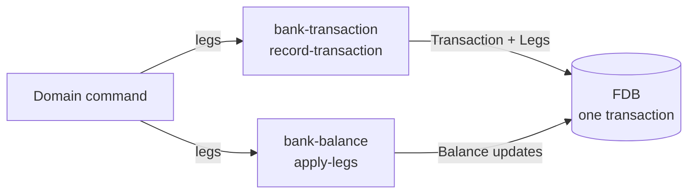

# Transactions and balances

## Objective

Banking is bookkeeping. Every transfer, fee, interest
payment, and FPS settlement has to be recorded against
accounts in a way that's atomically consistent, auditable,
and never loses pennies. This TDD describes how Queenswood
records financial events (Transactions and Legs) and
maintains the running totals (Balances) those events
produce.

In scope: the `bank-transaction` and `bank-balance` bricks;
Transaction, Leg, and Balance shapes; the record + apply
atomicity contract; posted vs available balance derivation;
policy integration at the leg level; the credit-carry
mechanism that supports fractional units.

Out of scope: payment flows that consume this layer (see
forthcoming payments TDD); interest accrual math (forthcoming
interest TDD); fee semantics.

## Background

Two things must hold simultaneously.

**Atomicity across legs.** A transfer credits one account and
debits another. If only one leg lands, money has been printed
or destroyed. Both must commit or neither.

**Multi-status balances.** A real bank shows a customer their
*available* balance, but pending payments have already left
the account from the customer's perspective. The system needs
to represent both states, plus the cleared (posted) total
they reconcile to.

Three design choices fall out:

- **Records of events** (Transactions + Legs) are kept
  separate from **running totals** (Balances). The legs are
  immutable; balances are a materialised view over them.
- Each `(account, balance-type, balance-status, currency)`
  is its own balance bucket. "The balance" of an account is
  a derivation across buckets, not a single number.
- Atomicity is enforced by FDB record-store transactions
  (ADR-0002). Recording an event and updating its balances
  happens in one commit.

Why not derive balances from the leg log on every read? Query
cost grows with history; the customer-facing "what's my
balance" call would scan a growing log forever. The leg log
is the source of truth; balances are the running view kept
fresh on every commit.

Why not store one balance per account? Pending and posted
need different buckets. Multi-currency needs different
buckets. Interest accrual needs its own bucket. One number
per account isn't enough.

## Proposed Solution

### Architecture

Two bricks:

- **`bank-transaction`** — owns the immutable record
  (Transaction + Legs). `record-transaction` is the only
  write surface.
- **`bank-balance`** — owns the running Balance buckets and
  the derived posted/available views. `apply-legs` updates
  buckets; `get-balances` reads the derivation.



A domain processor (payment, interest, fee) calls both inside
one FDB transaction. Both commit or neither does.

### Data model

**Transaction** — the immutable record of an event:

```clojure
{:transaction-id   "txn.<ulid>"
 :idempotency-key  "<from envelope :id>"
 :transaction-type :transaction-type-internal-transfer
                   ;; or -inbound, -outbound, -fee, -interest, ...
 :currency         "GBP"          ;; ISO 4217 string
 :reference        "<optional human-readable>"
 :status           :transaction-status-pending
                   ;; or -posted, -reversed, ...
 :created-at       <ms>
 :updated-at       <ms>}
```

Internal transfers post immediately; other types start
pending and are promoted to posted on settlement (or
reversed).

**Leg** — one side of a posting against one balance bucket:

```clojure
{:leg-id          "leg.<ulid>"
 :transaction-id  "<parent>"
 :account-id
 :balance-type    :balance-type-default
                  ;; or :balance-type-interest-payable
 :balance-status  :balance-status-posted
                  ;; or -pending-incoming, -pending-outgoing
 :side            :debit         ;; or :credit
 :amount          1000           ;; integer minor units (pence)
 :currency        "GBP"          ;; ISO 4217 string
 :created-at      <ms>}
```

A leg targets a specific
`(account, balance-type, balance-status)` bucket within a
currency. Multiple legs per transaction are normal — a
transfer is two legs (debit one account, credit another); a
settlement promotion is two legs (debit pending bucket,
credit posted bucket).

**Balance** — the running total for one bucket:

```clojure
{:account-id
 :balance-type
 :balance-status
 :currency
 :credit           ;; sum of all credit legs to this bucket
 :debit            ;; sum of all debit legs to this bucket
 :credit-carry     ;; fractional sub-minor-unit residue
 ...}
```

The composite key
`(account-id, balance-type, balance-status, currency)` is
the primary identifier. `(- credit debit)` is the bucket's
net value; `:credit-carry` holds fractional residue from
interest math (see interest TDD).

### Recording an event

`bank-transaction/record-transaction`:

- Builds the Transaction map, generates a `:transaction-id`,
  sets the initial `:status` based on `:transaction-type`
  (internal transfers post immediately; other types start
  pending).
- Creates a Leg per input leg, linking each to the
  transaction.
- Persists both. **Does not touch balances.**

The split is deliberate. The Transaction is the immutable
record of what happened; the Balance update is a separate
concern that happens against potentially many buckets.

### Applying legs to balances

`bank-balance/apply-legs`:

- For each leg, locates its target Balance by the composite
  key.
- Increments the bucket's `:credit` or `:debit` (per the
  leg's `:side`) by `:amount`.
- Calls `bank-policy/check-capability` per leg with kind
  `:balance` — the policy can deny postings to specific
  balance buckets, and (via the threaded `transaction-type`)
  scope policy filters to the kind of transaction.
- Saves the updated balances.

`apply-legs` is a separate call from `record-transaction`.
The processor wraps both in one FDB transaction:

```clojure
(fdb/transact record-db
  (fn [tx]
    (error/let-nom>
      [txn (bank-transaction/record-transaction tx data)
       _   (bank-balance/apply-legs tx
                                    (:legs data)
                                    (:transaction-type data))]
      txn)))
```

If either fails, neither commits — atomicity preserved
across the immutable record and the mutable running totals.

### Multi-bucket balances

A single account has many Balance buckets, e.g.:

- `(:default, :posted)` — cleared and settled.
- `(:default, :pending-incoming)` — money expected, not yet
  settled.
- `(:default, :pending-outgoing)` — money sent, not yet
  settled.
- `(:interest-payable, :posted)` — accrued interest
  recorded but not yet capitalised.

Multi-currency: the same balance-type/status pair exists
once per currency. A "GBP" account doesn't see "USD"
postings unless explicit FX legs move money between
currencies.

Settlement is a multi-leg posting that moves money between
buckets — typically two legs that debit a pending bucket and
credit the posted bucket of the same account.

### Posted and available balances

`get-balances` returns:

- `:balances` — every bucket record for the account.
- `:posted-balance` — net of `(:default, :posted)`. The
  cleared, settled view.
- `:available-balance` — derived per product-type:

  | Product type        | Available =                                     |
  |---------------------|-------------------------------------------------|
  | current             | posted + pending-incoming + pending-outgoing    |
  | savings             | posted + pending-incoming + pending-outgoing    |
  | term-deposit        | posted + pending-incoming + pending-outgoing    |
  | settlement          | posted + interest-payable                       |
  | internal            | posted only                                     |

"Available" depends on what the product wants the customer to
*see* as spendable:

- A current account counts pending payments because the
  customer's intent has been registered.
- A settlement account counts accrued interest because it's
  earned (just not yet capitalised).
- An internal (system) account is strictly posted — no
  optimism allowed.

### Policy integration

`apply-legs` consults `bank-policy/check-capability` per leg
with kind `:balance`. The request includes the action,
balance-type, balance-status, and the threaded
transaction-type. Policies can therefore:

- Deny postings to specific buckets ("this account-status
  can't receive credits").
- Apply limits scoped by transaction-type (the
  "available balance must stay non-negative" limit fires on
  internal / inbound / outbound transfers, *not* on fees or
  interest, so the bank can apply a fee that drives an
  account into breach).

Per-leg evaluation means a multi-leg transaction can fail on
one leg while others would pass. The `error/let-nom>` chain
in `apply-legs` short-circuits on the first anomaly. First
failure wins; the transaction doesn't commit.

### Currency

Every Balance and Leg carries `:currency` as an ISO 4217
string code (`"GBP"`, `"USD"`). Currency is one of the few
project-wide values that stays a string rather than a keyword
— ISO 4217 is the standard external format and translation to
keywords would only add friction at every wire boundary.

Multi-currency is supported by additional buckets per currency
on the same account. Cross-currency operations require
explicit FX legs; there's no automatic conversion.
`(:default, :posted, "GBP")` and `(:default, :posted, "USD")`
are distinct buckets, never silently combined.

### Bounded-batch discipline

FDB transactions have practical size and time limits — a
single commit shouldn't span more than a few seconds or a few
megabytes of writes. Long-running operations that touch many
accounts (interest accrual, capitalisation, end-of-day
posting) are deliberately structured as **many small batches,
not one large transaction**.

Concretely: an interest-accrual run iterates accounts in
chunks (typically tens to a few hundred per chunk), and each
chunk is one FDB transaction containing the record-transaction
+ apply-legs for that chunk's accounts. Failure in chunk N
doesn't lose the work of chunks 1..N-1; the run resumes from
the next un-processed chunk on retry.

This is a deliberate design choice, not a workaround. Reasons:

- **Predictable resource footprint.** Bounded write size and
  bounded lock duration, regardless of total run size.
- **Bounded retry cost.** Conflict on one chunk re-runs that
  chunk only. A monolithic transaction would have to retry
  the entire run.
- **Independent observability.** Each chunk emits its own
  trace span; failure narrows to the offending chunk.
- **Forward progress under failure.** A run that crashes
  midway has already committed its earlier chunks.

The cost is that a multi-chunk run isn't atomic across chunks
— a half-complete run is observable. Operations that need
all-or-nothing across many accounts (rare in banking) would
need different machinery; for the cases that have come up so
far, partial progress is acceptable and resumability is more
valuable.

### Credit-carry and fractional units

Some operations (notably interest accrual) work at
sub-minor-unit precision: the per-day interest on £1.00 at
5% APR is well under a penny. The system tracks fractional
residue in `:credit-carry` on the relevant balance. Once
carry accumulates past one minor unit, the integer portion
is posted as a credit leg and the fractional remainder
stays in carry.

`set-carry` updates the field independently of legs — carry
isn't a leg event; it's a bookkeeping field that the
interest engine reads, mutates, and writes back. The
mechanism's semantics are detailed in the interest TDD.

### Caller contract

A caller of `record-transaction` + `apply-legs` must:

1. Wrap both calls in one FDB transaction.
2. Pass the same `:transaction-type` to both (record sets
   the transaction's type; apply uses it for policy
   filtering).
3. Pass legs whose currencies match the transaction
   currency. Cross-currency operations need explicit FX
   legs.
4. Ensure debits and credits balance across legs *as a
   matter of caller discipline* — the bricks don't enforce
   strict double-entry today (see Known Limitations).

## Alternatives Considered

- **Mutable transaction records.** Edit the transaction in
  place to flip status. Rejected — destroys the audit
  trail. Status updates can rewrite the `:status` field but
  the legs stay immutable; reversal is a *new* transaction
  with reversing legs.
- **Single balance per account.** One running total per
  account, no bucket split. Rejected — can't represent
  pending vs posted, can't support multi-currency, no place
  for interest-payable.
- **Compute balances from the leg log on every read.** Treat
  legs as the only source of truth; aggregate at query time.
  Rejected — query cost grows with history. The current
  design treats the leg log as the source of truth and
  balances as a materialised view, kept fresh on every
  commit.
- **One call that records and applies.** A combined
  `record-and-apply` fn that hides the split. Rejected —
  separate calls let callers compose flows where the
  record happens but apply is deferred (e.g. authorisations
  that register intent without moving money until capture).
- **Policy enforcement at the transaction level, not per
  leg.** One check per transaction. Rejected — legs may
  target different buckets with different rules; per-leg
  evaluation lets each leg fail independently while the
  others pass.
- **Strict double-entry validation in the brick.** Reject
  any transaction whose debits don't sum to credits.
  Considered. Not enforced today because fees and similar
  one-sided operations don't always model the counterparty
  side (P&L, fees-receivable). Worth revisiting if we ever
  model the bank's own books symmetrically.

## Known Limitations

- **Double-entry is by-discipline, not by-construction.**
  The bricks accept any list of legs; they don't assert
  debits sum to credits. A fee today is one debit leg with
  no matching credit. Worth tightening if we model the
  bank's P&L explicitly.
- **No leg-reversal helper.** Reversing a transaction means
  writing a new transaction with reversed legs (debit
  ↔ credit). The pattern is straightforward but a
  `reverse-transaction` helper isn't on the interface yet.
- **Cross-account queries are caller-side.** `get-transactions`
  returns legs for one account, enriched. Querying all
  legs of one transaction requires iterating by
  `:transaction-id`; not exposed today.
- **Currency conversion is caller-side.** No FX engine;
  cross-currency operations need explicit FX legs. Acceptable
  at current scope (single-currency dominates); a multi-currency
  story would benefit from a dedicated FX brick.
- **`:credit-carry` doesn't appear in the leg log.** It's a
  bookkeeping field on the balance, mutated by `set-carry`.
  Audit of carry changes relies on balance record-versioning,
  not on legs.
- **`available-balance` is hardcoded per product-type.** The
  mapping lives in `bank-balance/domain.clj`. Adding a new
  product-type requires editing the brick. A
  policy-configurable mapping would belong here if the
  variation grew, but today the set is small and stable.
- **Transaction-status flow is implicit.** The set of
  statuses and the legal transitions between them aren't
  documented in one place; today it's discovered by reading
  the type → initial-status table plus the various command
  handlers that promote or reverse. A formal state diagram
  would help; the cash-account-lifecycle TDD will sketch
  the parallel concept on the account side.
- **Multi-chunk runs aren't atomic across chunks.** This is
  the cost of the bounded-batch discipline (see Proposed
  Solution). Operations that genuinely need all-or-nothing
  semantics across many accounts have no machinery here;
  today they don't arise. If they do, the answer is likely a
  saga-shaped coordinator, not a larger FDB transaction.

## References

- [ADR-0002](../adr/0002-foundationdb-record-layer.md) —
  FoundationDB Record Layer (multi-record atomicity)
- [ADR-0005](../adr/0005-error-handling-with-anomalies.md) —
  Error handling with anomalies
- [transaction-processing.md](transaction-processing.md) —
  Transaction processing (envelope, command flow)
- [policy-evaluation.md](policy-evaluation.md) — Policy
  evaluation engine (the per-leg `:balance` capability check)
- `bank-transaction` brick interface
- `bank-balance` brick interface
