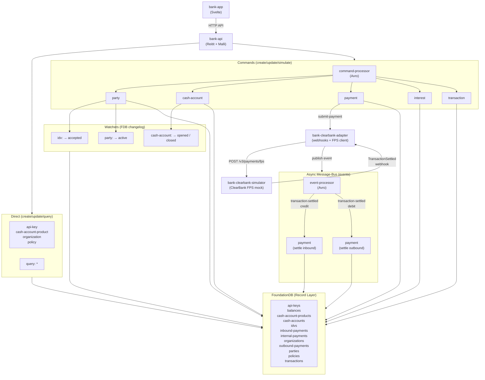

# Queenswood

A multi-tenant banking platform: core banking with double-entry
transactions and interest accrual, UK Faster Payments, and tenant
onboarding with IDV.

[](https://github.com/user-attachments/assets/d6941c18-54c6-4954-aa7d-b8150f5d2891)

## Capabilities

| Capability                   | Description                                                                                                                                                       |
| ---------------------------- | ----------------------------------------------------------------------------------------------------------------------------------------------------------------- |
| **Payments & Transactions**  | Internal transfers, outbound UK Faster Payments via a pluggable scheme adapter, inbound settlement with BBAN lookup and idempotency                               |
| **Interest**                 | Daily accrual and monthly capitalisation with fractional carry at sub-minor-unit precision                                                                        |
| **Cash Accounts**            | Open accounts against published products, assigned UK SCAN payment addresses (sort code + account number). Lifecycle: `opening` → `opened` → `closing` → `closed` |
| **Cash Account Products**    | Draft products with balance configurations, publish versioned releases                                                                                            |
| **Parties & Identity**       | Register customers with national identifiers; automatic IDV triggers `pending` → `active`                                                                         |
| **Organisations & API Keys** | Multi-tenant onboarding — create a tenant, issue API keys (returned once, stored hashed)                                                                          |

API documentation:
[kjothen.github.io/queenswood](https://kjothen.github.io/queenswood/)
| OpenAPI at [localhost:8080](http://localhost:8080) when running.

## What's interesting

The engineering choices that shape this codebase, each linked to
the doc that goes deep on it:

- **One unified API for the whole bank, with full OpenAPI 3.x
  compliance.** Bank-shaped, not implementation-shaped; the spec
  is the contract. See
  [ADR-0013](docs/adr/0013-single-unified-api.md) and
  [ADR-0014](docs/adr/0014-openapi-3x-compliance.md).
- **Policies and bindings are first-class data, not hardcoded
  rules.** Capabilities and limits as records; a curative-permit
  pattern that lets a customer self-correct out of breach.
  See [policy-evaluation](docs/tdd/policy-evaluation.md).
- **Daily interest accrual that conserves pennies.** Integer
  micro-unit arithmetic with sub-minor-unit carry; six-leg
  postings at capitalisation; cadence (daily, monthly, anything)
  is the operator's choice. See [interest](docs/tdd/interest.md).
- **A pure-functional model runs alongside the real system; tests
  pass only when they agree.** Property-based testing via fugato +
  hand-authored EDN scenarios share one runner.
  See [scenario-testing](docs/tdd/scenario-testing.md).
- **Anomalies, not exceptions, at every component interface.**
  Three semantic kinds (error / rejection / unauthorized) mapping
  directly to HTTP status families.
  See [ADR-0005](docs/adr/0005-error-handling-with-anomalies.md).
- **System-as-data via donut.system + YAML.** Components are
  records, profiles are values, testcontainers and production
  share one bootstrap path.
  See [ADR-0007](docs/adr/0007-system-as-data.md) and the
  [slides](docs/slides/systems-as-data/slides.md).
- **FoundationDB Record Layer with the changelog as the
  transactional outbox.** Multi-record ACID by default; the
  outbox pattern falls out of the storage engine.
  See [ADR-0002](docs/adr/0002-foundationdb-record-layer.md).
- **Domain fork of `mono`** — infrastructure bricks present in
  the workspace, not pulled in as a library.
  See [ADR-0001](docs/adr/0001-reuse-mono-as-upstream.md).

## Architecture



**Direct path** — low-volume activity (organisations, products,
policies, API keys) is created and updated directly by the API
handlers; all records are queried on-demand using FDB record
primary key ordering.

**Commands path** — high-volume activity (parties, cash accounts,
payments, interest, transactions) flows as Avro-serialised
commands through the message bus to processors. Processors write
to FDB and reply via the same bus. Envelope statuses: `ACCEPTED`
(2xx), `REJECTED` (4xx), `FAILED` (5xx).
See [transaction-processing](docs/tdd/transaction-processing.md).

**Events path** — outbound payments publish a `submit-payment`
command to a pluggable scheme adapter, which POSTs to the FPS
API. Settlement webhooks become `transaction-settled` events;
the event processor routes credits to inbound creation and
debits to outbound completion. The simulator base
(`bank-clearbank-simulator`) is the live integration today; a
ClearBank-specific adapter (`bank-clearbank-adapter`) is wired
as the production target. See [payments](docs/tdd/payments.md).

**Watchers** — FDB changelog triggers drive reactive state
transitions: IDV acceptance activates the party; account
opening/closing auto-transitions.
See [ADR-0008](docs/adr/0008-changelog-watchers.md).

## Documentation

The bank is documented:

- **[docs/adr/](docs/adr/)** — fourteen architecture decision
  records (mono fork, FoundationDB, message-bus abstraction,
  Avro, anomalies, kebab-case keys, system-as-data, changelog
  watchers, model-equality testing, code generation via
  prep-lib, one-component-per-library, pre-commit hooks, single
  unified API, OpenAPI 3.x compliance).
- **[docs/tdd/](docs/tdd/)** — fourteen technical design
  documents covering the substrate (transaction processing,
  transactions and balances, traceability, scenario testing,
  idempotency proposal), the API surface and auth (service-apis,
  api-keys), the policy engine, and every domain (organisations,
  parties, products, accounts, payments, interest).
- **[docs/recipes/](docs/recipes/)** — twelve task-oriented
  recipes (Problem / Solution / Rules / Discussion / References)
  for components, bases, projects, system-components,
  system-configurations, testcontainers, error-handling, testing,
  code-style, code-generation, common-helpers, git-workflow.
- **[docs/slides/](docs/slides/)** — a slidev walk-through of how
  systems-as-data assembles a running system.

## Running

Start a REPL with `just repl` and connect your editor. The
development entry point follows the standard Polylith pattern —
a namespace under `development/src/dev/` that requires the base
and Testcontainers:

```clojure
;; development/src/dev/bank_monolith.clj — evaluate the comment block
(def sys
  (main/start "classpath:bank-monolith/application-test.yml" :dev))
(main/stop sys)
```

This boots the full system — FDB, Pulsar, HTTP server — inside
Testcontainers. Then start the Svelte front-end:

```bash
just start-bank-app
```

## Built on mono

Queenswood is a **domain fork** of
[mono](https://github.com/kjothen/mono), a Clojure component
library for production-ready distributed systems built on
[Polylith](https://polylith.gitbook.io/polylith). Bricks prefixed
`bank-*` are Queenswood-specific; everything else is shared
infrastructure inherited from upstream and pulled down via
`git merge upstream/main`.
See [ADR-0001](docs/adr/0001-reuse-mono-as-upstream.md) for the
reasoning. The shared component library (lifecycle,
persistence, messaging, security, etc.) is documented in the
[mono README](https://github.com/kjothen/mono#mono-components).

For the workspace layout, see `components/`, `bases/`, and
`projects/`. Brick conventions are documented in
[recipes/components](docs/recipes/components.md).
