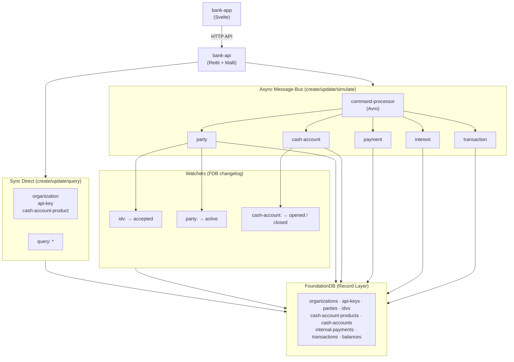

# Queenswood

Core banking as a service — organisations, parties, identity verification,
cash account products, account lifecycle, double-entry transactions,
internal payments, and interest accrual with fractional carry.

[](https://github.com/user-attachments/assets/d6941c18-54c6-4954-aa7d-b8150f5d2891)

| Capability                   | Description                                                                                                                                                       |
| ---------------------------- | ----------------------------------------------------------------------------------------------------------------------------------------------------------------- |
| **Organisations & API Keys** | Multi-tenant onboarding — create a tenant, issue API keys (returned once, stored hashed)                                                                          |
| **Cash Account Products**    | Draft products with balance configurations, publish versioned releases                                                                                            |
| **Parties & Identity**       | Register customers with national identifiers; automatic IDV triggers `pending` → `active`                                                                         |
| **Cash Accounts**            | Open accounts against published products, assigned UK SCAN payment addresses (sort code + account number). Lifecycle: `opening` → `opened` → `closing` → `closed` |
| **Payments & Transactions**  | Double-entry internal transfers — fund accounts, reward customers, move money between accounts                                                                    |
| **Interest**                 | Daily accrual and monthly capitalisation with fractional carry at sub-minor-unit precision                                                                        |

Full API documentation:
[kjothen.github.io/queenswood](https://kjothen.github.io/queenswood/)
| OpenAPI locally at [localhost:8080](http://localhost:8080) when running

## Architecture



**Sync path** — low-volume activity, concerning organisations, products and
API keys are created/updated directly by the API handlers.
All records are queried on-demand using FDB record primary key ordering.

**Async path** — high volume activity, concerning parties,
cash accounts and payments are Avro-serialised commands
sent through message bus to command processors.
Processors write to FDB and reply via message bus.
Responses use envelope statuses:
`ACCEPTED` (2xx), `REJECTED` (4xx), or `FAILED` (5xx).

**Watchers** — FDB changelog triggers drive reactive state transitions:
IDV acceptance activates the party; account opening/closing auto-transitions.

## How It Works

Queenswood is a **domain fork of [mono](https://github.com/kjothen/mono)**,
a Clojure component library for building production-ready distributed
systems with [Polylith](https://polylith.gitbook.io/polylith). It is
assembled from mono's infrastructure primitives:

- **FoundationDB Record Layer** stores organisations, parties, IDV record,
  account products, accounts, payments, transaction and balances
  with multi-store FDB transactions for atomicity.
- **Changelog watchers** on FDB drive the reactive flow — IDV acceptance
  activates the party; account closing auto-transitions to closed.
- **Apache Pulsar** carries commands between the HTTP API and processors,
  with Avro-serialised messages and request-reply.
- **Reitit + Malli** provide routing, schema validation, and OpenAPI spec
  generation.
- The whole system — containers, message brokers, databases — is declared in
  YAML and started by the same lifecycle machinery used in tests.

## Running It

Start a REPL with `just repl` and connect your editor. The development
entry point follows the standard Polylith pattern — a namespace under
`development/src/dev/` that requires the base and Testcontainers:

```clojure
;; development/src/dev/bank_monolith.clj — evaluate the comment block
(def sys
  (main/start "classpath:bank-monolith/application-test.yml"
              :dev))
(main/stop sys)
```

This boots the full system — FDB, Pulsar, HTTP server — inside
Testcontainers. Then start the Svelte front-end:

```bash
just start-bank-app
```

## Upstream Components

The shared component library (lifecycle, persistence, messaging, security,
etc.) is documented in the
[mono README](https://github.com/kjothen/mono#mono-components).

## Components

| Component &nbsp;&nbsp;&nbsp;&nbsp;&nbsp;&nbsp;&nbsp;&nbsp;&nbsp;&nbsp;&nbsp;&nbsp;&nbsp;&nbsp;&nbsp;&nbsp;&nbsp;&nbsp;&nbsp;&nbsp;&nbsp;&nbsp;&nbsp;&nbsp; | Purpose                                                                                            |
| ---------------------------------------------------------------------------------------------------------------------------------------------------------- | -------------------------------------------------------------------------------------------------- |
| `bank-api-key`                                                                                                                                             | API key generation, hashing, and verification                                                      |
| `bank-balance`                                                                                                                                             | Account balance management — create, query by type/currency/status                                 |
| `bank-bootstrap`                                                                                                                                           | Internal organization bootstrap and seed data                                                      |
| `bank-cash-account`                                                                                                                                        | Account lifecycle — open, close, suspend, reopen, archive                                          |
| `bank-cash-account-product`                                                                                                                                | Product and version management — draft, publish, balance product config                            |
| `bank-idv`                                                                                                                                                 | Identity verification processing                                                                   |
| `bank-organization`                                                                                                                                        | Organisation management — create org, API key generation and verification                          |
| `bank-party`                                                                                                                                               | Party creation and management                                                                      |
| `bank-interest`                                                                                                                                            | Interest accrual and capitalization with fractional carry                                          |
| `bank-payment`                                                                                                                                             | Payment processing — internal transfers between accounts                                           |
| `bank-schema`                                                                                                                                              | Protobuf definitions (Person, Account, Organization, ApiKey, Balance, AccountProduct, Transaction) |
| `bank-test-resources`                                                                                                                                      | Bank-specific test configuration (FDB stores, Avro schemas)                                        |
| `bank-transaction`                                                                                                                                         | Transaction recording with double-entry legs                                                       |

## Bases

| Base            | Purpose                                              |
| --------------- | ---------------------------------------------------- |
| `bank-api`      | HTTP API handlers, routes, and OpenAPI spec          |
| `bank-app`      | Svelte front-end for the banking application         |
| `bank-monolith` | Full system entry point combining API and processors |

## Projects

| Project                     | Base            | Description                                   |
| --------------------------- | --------------- | --------------------------------------------- |
| `bank-app`                  | `bank-app`      | Svelte front-end for the banking application  |
| `bank-cash-account-service` | `service`       | Async command handler for account operations  |
| `bank-monolith`             | `bank-monolith` | Full Queenswood system (API + processors)     |
| `bank-web`                  | `bank-api`      | HTTP API for accounts, products, and balances |
