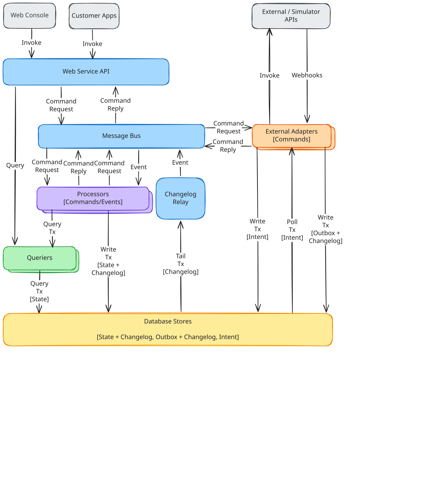

<p align="center">
  
</p>

# Queenswood

**A bank in a box.** Provision a fully-formed tenant bank —
double-entry ledgers, UK Faster Payments, interest accrual, and
identity-checked onboarding — from a single API call. Core banking,
rebuilt as a clean Clojure/Polylith workspace you can actually read.

## Demos

<table>
  <tr>
    <td align="center"><strong>Spin up a Bank</strong></td>
    <td align="center"><strong>Use the Bank</strong></td>
  </tr>
  <tr>
    <td><video src="https://github.com/user-attachments/assets/1dcf2a74-b198-4757-b271-84896f0daec8" controls></video></td>
    <td><video src="https://github.com/user-attachments/assets/5f5403c2-3ada-4985-826b-209e1826f550" controls></video></td>
  </tr>
</table>

## What it does

Everything a tenant bank needs, from the same API:

- **Payments** — internal transfers and outbound UK Faster Payments;
  funds reserved on submit, settled or released on the scheme's word.
- **Ledger** — double-entry postings on every movement, penny-exact,
  always balancing.
- **Interest** — daily accrual, monthly capitalisation, fractional
  carry below the minor unit so nothing rounds away.
- **Accounts & products** — publish versioned account products, then
  open accounts against them with real UK sort-code / account-number
  addresses.
- **Onboarding & identity** — register customers, run identity
  verification through a pluggable adapter, activate on the result.
- **Policies** — capabilities and limits as editable records, not
  hardcoded rules; deny-wins, with a curative-permit escape so a
  customer can act their way back into compliance.
- **Multi-tenancy** — one `POST /v1/banks` provisions a bank and hands
  back an OAuth2 service credential, shown once.

API reference:
[repldriven.github.io/queenswood](https://repldriven.github.io/queenswood/),
or live OpenAPI at [localhost:8080](http://localhost:8080) when
running.

## Architecture

CQRS on two substrates: Apache Pulsar carries commands and events,
FoundationDB's Record Layer holds state and its own changelog.

<picture>
  <source media="(prefers-color-scheme: dark)"  srcset="docs/diagrams/system-diagram-dark.svg">
  <source media="(prefers-color-scheme: light)" srcset="docs/diagrams/system-diagram-light.svg">
  
</picture>

**Writes are commands.** The API turns a request into an
Avro-serialised command on the bus; a processor consumes it, does the
whole operation in one FDB transaction, and replies — `ACCEPTED` (2xx),
`REJECTED` (4xx), or `FAILED` (5xx). Processors are packaged into two
services along the financial boundary (payment / transaction / interest
/ payee-check, versus bank / party / account / product / idv); the
grouping is YAML composition, not code. A handful of low-stakes
config writes — API keys, policies, seeded jobs — still go straight to
FDB. See [transaction-processing](docs/tdd/transaction-processing.md).

**Reads are queries.** The read side loads records directly by primary
key, off a separate query surface — no command round-trip. Write bricks
and their query siblings are distinct components, so the API can only
call read paths.

**The changelog is the engine room.** Every committed write lands on
FoundationDB's changelog in order, atomically with the write — so it
doubles as a transactional outbox. In-process watchers drain it to
drive reactive transitions (an account opening, an IDV result
activating a party) and to relay events onto the bus. See
[changelog watchers](docs/adr/0008-changelog-watchers.md).

**Egress crosses a boundary carefully.** Outbound Faster Payments and
identity checks never call out from inside a transaction: the write
records an intent, and a relay makes the external call and folds the
provider's webhook back in as an event. Adapter/simulator pairs front
the real providers (ClearBank FPS, Onfido) — the simulators stand in
during development and tests. See
[deployment](docs/recipes/deployment.md).

## What's interesting

The decisions that make this codebase worth reading — each with a
doc that goes deep:

- **One unified API for the whole bank, with full OpenAPI 3.x
  compliance.** Bank-shaped, not implementation-shaped; the spec
  is the contract. See
  [ADR-0013](docs/adr/0013-single-unified-api.md) and
  [ADR-0014](docs/adr/0014-openapi-3x-compliance.md).
- **Policies and bindings are first-class data, not hardcoded
  rules.** Capabilities and limits as records; a curative-permit
  pattern that lets a customer self-correct out of breach.
  See [policy-evaluation](docs/tdd/policy-evaluation.md).
- **Daily interest accrual that conserves pennies.** Integer
  micro-unit arithmetic with sub-minor-unit carry; six-leg
  postings at capitalisation; cadence (daily, monthly, anything)
  is the operator's choice. See [interest](docs/tdd/interest.md).
- **A pure-functional model runs alongside the real system; tests
  pass only when they agree.** Property-based testing via fugato +
  hand-authored EDN scenarios share one runner.
  See [scenario-testing](docs/tdd/scenario-testing.md).
- **Anomalies, not exceptions, at every component interface.**
  Three semantic kinds (error / rejection / unauthorized) mapping
  directly to HTTP status families.
  See [ADR-0005](docs/adr/0005-error-handling-with-anomalies.md).
- **System-as-data via donut.system + YAML.** Components are
  records, profiles are values, testcontainers and production
  share one bootstrap path.
  See [ADR-0007](docs/adr/0007-system-as-data.md) and the
  [slides](docs/slides/systems-as-data/slides.md).
- **FoundationDB Record Layer with the changelog as the
  transactional outbox.** Multi-record ACID by default; the
  outbox pattern falls out of the storage engine.
  See [ADR-0002](docs/adr/0002-foundationdb-record-layer.md).
- **Domain fork of `mono`** — infrastructure bricks present in
  the workspace, not pulled in as a library.
  See [ADR-0001](docs/adr/0001-reuse-mono-as-upstream.md).

## Documentation

The bank is documented end to end — the why, the how, and the
decisions in between:

- **[docs/prd/](docs/prd/)** — product requirements documents:
  a platform-wide umbrella plus one per capability (onboarding,
  parties, cash-account-products, cash-accounts, payments,
  interest, policies). The _what and why_ — intended scope,
  users, and domain rules — companion to the TDDs' _how_.
- **[docs/tdd/](docs/tdd/)** — technical design documents
  covering the substrate (transaction processing, transactions
  and balances, traceability, scenario testing, idempotency
  proposal), the API surface and auth (service-apis,
  authentication), the policy engine, and every domain (banks,
  parties, products, accounts, payments, interest).
- **[docs/adr/](docs/adr/)** — architecture decision records
  (mono fork, FoundationDB, message-bus abstraction, Avro,
  anomalies, kebab-case keys, system-as-data, changelog watchers,
  model-equality testing, code generation via prep-lib,
  one-component-per-library, pre-commit hooks, single unified
  API, OpenAPI 3.x compliance, comments and docstrings).
- **[docs/slides/](docs/slides/)** — a slidev walk-through of how
  systems-as-data assembles a running system.
- **[docs/recipes/](docs/recipes/)** — task-oriented recipes
  (Problem / Solution / Rules / Discussion / References) for
  components, bases, projects, system-components,
  system-configurations, testcontainers, error-handling, testing,
  code-style, code-generation, common-helpers, deployment,
  git-workflow, writing-docs.

## Running

Two options: a REPL-driven dev loop with everything inside
Testcontainers, or a one-liner Helm install onto a local
Kubernetes cluster.

### REPL (Testcontainers)

Start a REPL with `just repl` and connect your editor. The
development entry point follows the standard Polylith pattern —
a namespace under `development/src/dev/` that requires the base
and Testcontainers:

```clojure
;; development/src/dev/bank_monolith.clj — evaluate the comment block
(def sys
  (main/start "classpath:bank-monolith/application-test.yml" :dev))
(main/stop sys)
```

This boots the full system — FDB, Pulsar, HTTP server — inside
Testcontainers. Then start the Svelte front-end:

```bash
just bank-console-start
```

### Kubernetes

The released Helm chart deploys the entire platform (API,
processors, adapters/simulators, the Svelte front-end, Pulsar,
FoundationDB) onto any Kubernetes cluster.

**Get a local Kubernetes runtime on macOS** — pick one:

- **OrbStack** — single-app, fastest setup:

  ```bash
  brew install orbstack
  # Open OrbStack, enable Kubernetes in Settings → Kubernetes
  ```

- **kind on Colima** — closer to upstream, more configurable:

  ```bash
  brew install colima kind kubectl helm
  colima start --vm-type vz --vz-rosetta --cpu 6 --memory 24
  kind create cluster --name queenswood \
    --config <(curl -fsSL https://raw.githubusercontent.com/repldriven/queenswood/main/infra/kind/queenswood-config.yaml)
  ```

  The kind config bumps containerd's `max_concurrent_downloads`
  from 3 to 6 so the ~20 first-install image pulls don't queue
  behind the biggest layer. From a checkout, the equivalent is
  `kind create cluster --name queenswood --config
  infra/kind/queenswood-config.yaml`.

**Install:**

```bash
helm install queenswood \
  oci://ghcr.io/repldriven/queenswood \
  -n queenswood --create-namespace \
  --wait --timeout 10m
```

**Reach the API and the console** (separate terminals):

```bash
kubectl -n queenswood port-forward svc/queenswood-bank-api-service 8080:8080
kubectl -n queenswood port-forward svc/queenswood-bank-console     8081:8080
```

The console's nginx reverse-proxies its realm's Keycloak at
`/keycloak/*`, so no separate Keycloak port-forward is
needed for sign-in. Then open:

- <http://localhost:8081> — the console (`bank-console`).
  Sign in with `dev` / `dev` against the `queenswood` realm.

If you need the Keycloak admin UI (to inspect or edit the
realm directly), it rides the same proxy:
<http://localhost:8081/keycloak/admin> with `admin` /
`admin`. OpenAPI docs at <http://localhost:8080/scalar>.
The full quickstart — including tear-down — ships with
each
[release](https://github.com/repldriven/queenswood/releases/latest).

## Built on mono

Queenswood is a **domain fork** of
[mono](https://github.com/repldriven/mono), a Clojure component
library for production-ready distributed systems built on
[Polylith](https://polylith.gitbook.io/polylith). Bricks prefixed
`bank-*` are Queenswood-specific; everything else is shared
infrastructure inherited from upstream and pulled down via
`git merge upstream/main`.
See [ADR-0001](docs/adr/0001-reuse-mono-as-upstream.md) for the
reasoning. The shared component library (lifecycle,
persistence, messaging, security, etc.) is documented in the
[mono README](https://github.com/repldriven/mono#mono-components).

For the workspace layout, see `components/`, `bases/`, and
`projects/`. Brick conventions are documented in
[recipes/components](docs/recipes/components.md).
