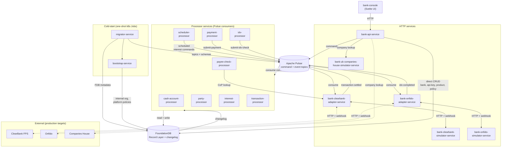

<p align="center">
  
</p>

# Queenswood

A multi-tenant banking platform: core banking with double-entry
transactions and interest accrual, UK Faster Payments, and bank
onboarding with IDV.

## Demos

<table>
  <tr>
    <td align="center"><strong>Spin up a Bank</strong></td>
    <td align="center"><strong>Use the Bank</strong></td>
  </tr>
  <tr>
    <td><video src="https://github.com/user-attachments/assets/1dcf2a74-b198-4757-b271-84896f0daec8" controls></video></td>
    <td><video src="https://github.com/user-attachments/assets/5f5403c2-3ada-4985-826b-209e1826f550" controls></video></td>
  </tr>
</table>

## Capabilities

| Capability                   | Description                                                                                                                                                       |
| ---------------------------- | ----------------------------------------------------------------------------------------------------------------------------------------------------------------- |
| **Payments & Transactions**  | Internal transfers; outbound UK Faster Payments via a pluggable scheme adapter, reserved on submit and settled (or released) on the scheme's confirmation; inbound settlement with BBAN lookup and idempotency |
| **Interest**                 | Daily accrual and monthly capitalisation with fractional carry at sub-minor-unit precision |
| **Cash Accounts**            | Open accounts against published products, assigned UK SCAN payment addresses (sort code + account number). Lifecycle: `opening` → `opened` → `closing` → `closed` |
| **Cash Account Products**    | Draft products with balance configurations, publish versioned releases |
| **Parties & Identity**       | Register customers with national identifiers; Onfido-shaped IDV via pluggable adapter drives `pending` → `active` (or rejected) |
| **Policies**                 | Capabilities and limits as editable records; deny-wins resolution and a curative-permit pattern — a breaching action is allowed only when it moves the position back toward compliance |
| **Banks & API Keys**         | Multi-tenant onboarding — create a bank (`POST /v1/banks`), which returns a service-account credential (client-id / secret, shown once) that authenticates via Keycloak OAuth2 bearer tokens |

API documentation:
[repldriven.github.io/queenswood](https://repldriven.github.io/queenswood/)
| OpenAPI at [localhost:8080](http://localhost:8080) when running.

## What's interesting

The engineering choices that shape this codebase, each linked to
the doc that goes deep on it:

- **One unified API for the whole bank, with full OpenAPI 3.x
  compliance.** Bank-shaped, not implementation-shaped; the spec
  is the contract. See
  [ADR-0013](docs/adr/0013-single-unified-api.md) and
  [ADR-0014](docs/adr/0014-openapi-3x-compliance.md).
- **Policies and bindings are first-class data, not hardcoded
  rules.** Capabilities and limits as records; a curative-permit
  pattern that lets a customer self-correct out of breach.
  See [policy-evaluation](docs/tdd/policy-evaluation.md).
- **Daily interest accrual that conserves pennies.** Integer
  micro-unit arithmetic with sub-minor-unit carry; six-leg
  postings at capitalisation; cadence (daily, monthly, anything)
  is the operator's choice. See [interest](docs/tdd/interest.md).
- **A pure-functional model runs alongside the real system; tests
  pass only when they agree.** Property-based testing via fugato +
  hand-authored EDN scenarios share one runner.
  See [scenario-testing](docs/tdd/scenario-testing.md).
- **Anomalies, not exceptions, at every component interface.**
  Three semantic kinds (error / rejection / unauthorized) mapping
  directly to HTTP status families.
  See [ADR-0005](docs/adr/0005-error-handling-with-anomalies.md).
- **System-as-data via donut.system + YAML.** Components are
  records, profiles are values, testcontainers and production
  share one bootstrap path.
  See [ADR-0007](docs/adr/0007-system-as-data.md) and the
  [slides](docs/slides/systems-as-data/slides.md).
- **FoundationDB Record Layer with the changelog as the
  transactional outbox.** Multi-record ACID by default; the
  outbox pattern falls out of the storage engine.
  See [ADR-0002](docs/adr/0002-foundationdb-record-layer.md).
- **Domain fork of `mono`** — infrastructure bricks present in
  the workspace, not pulled in as a library.
  See [ADR-0001](docs/adr/0001-reuse-mono-as-upstream.md).

## Architecture

Per-domain deployable services on two substrates — Apache Pulsar
for command and event flow, FoundationDB Record Layer for
storage and changelog. Adapter/simulator pairs front the two
external integrations (UK Faster Payments via ClearBank, IDV
via Onfido); the simulators stand in for the production
providers in development and tests.


```mermaid
graph TB
    CONSOLE["bank-console<br/>(Svelte UI)"]

    subgraph http ["HTTP services"]
        direction LR
        API[bank-api-service]
        CBA[bank-clearbank-<br/>adapter-service]
        CBS[bank-clearbank-<br/>simulator-service]
        OFA[bank-onfido-<br/>adapter-service]
        OFS[bank-onfido-<br/>simulator-service]
        CHS[bank-uk-companies-<br/>house-simulator-service]
    end

    PULSAR[("Apache Pulsar<br/>command + event topics")]

    subgraph processors ["Processor services (Pulsar consumers)"]
        direction LR
        PCA[cash-account-<br/>processor]
        PPT[party-<br/>processor]
        PPY[payment-<br/>processor]
        PIN[interest-<br/>processor]
        PTX[transaction-<br/>processor]
        PID[idv-<br/>processor]
        PPC[payee-check-<br/>processor]
        PSCH[scheduler-<br/>processor]
    end

    FDB[("FoundationDB<br/>Record Layer + changelog")]

    subgraph oneshots ["Cold-start (one-shot k8s Jobs)"]
        direction LR
        MIG[migrator-service]
        BS[bootstrap-service]
    end

    subgraph external ["External (production targets)"]
        direction LR
        CB[ClearBank FPS]
        OF[Onfido]
        CH[Companies House]
    end

    CONSOLE -->|HTTP| API
    API -->|commands| PULSAR
    API -->|direct CRUD<br/>bank, api-key, product, policy| FDB
    API -->|company lookup| CHS
    API -.->|company lookup| CH

    PULSAR -->|consume commands| processors
    processors -->|read + write| FDB
    FDB -->|changelog| processors
    PPC -->|CoP lookup| CBA

    PSCH -->|scheduled<br/>interest commands| PULSAR

    PPY -->|submit-payment| PULSAR
    PULSAR -->|consume| CBA
    CBA <-->|HTTP + webhook| CBS
    CBA <-.->|HTTP + webhook| CB
    CBA -->|transaction-settled| PULSAR

    PID -->|submit-idv-check| PULSAR
    PULSAR -->|consume| OFA
    OFA <-->|HTTP + webhook| OFS
    OFA <-.->|HTTP + webhook| OF
    OFA -->|idv-completed| PULSAR

    MIG -->|FDB metadata| FDB
    MIG -->|topics + schemas| PULSAR
    MIG --> BS
    BS -->|internal org,<br/>platform policies| FDB
```

**HTTP services** — `bank-api-service` is the public banking
surface (Reitit + Malli + Sieppari + Muuntaja). The
adapter/simulator pairs serve their own HTTP surfaces:
adapters host webhook receivers and call out to providers;
simulators stand in for the providers in development and
tests. `bank-api-service` also calls a UK Companies House
simulator directly over HTTP for the onboarding company
lookup; the dotted edge marks the real Companies House it
stands in for.

**Direct path** — low-volume, idempotent records
(banks, products, policies, API keys) are created
and updated directly by `bank-api-service` against FDB. All
records query on-demand using FDB record primary key
ordering.

**Commands path** — high-volume activity (parties, cash
accounts, payments, interest, transactions, payee checks)
flows as Avro-serialised commands from `bank-api-service`
through Pulsar to a domain processor. Each processor writes to
FDB and replies via the same bus. Envelope statuses:
`ACCEPTED` (2xx), `REJECTED` (4xx), `FAILED` (5xx).
`bank-payee-check-processor-service` additionally calls the
ClearBank adapter over HTTP for the Confirmation of Payee
lookup before persisting and replying. See
[transaction-processing](docs/tdd/transaction-processing.md).

**Scheduled work** — `bank-scheduler-processor-service` fires
seeded jobs (e.g. daily interest) on a cron, publishing the
interest commands onto the same bus for the interest
processor to consume.

**Scheme + IDV paths** — outbound payments publish a
`submit-payment` command on a scheme channel;
`bank-clearbank-adapter-service` consumes, calls FPS, and
republishes settlement webhooks as `transaction-settled`
events. The IDV path mirrors this:
`bank-idv-processor-service` publishes `submit-idv-check`,
`bank-onfido-adapter-service` calls Onfido, the
`check.completed` webhook becomes an `idv-completed` event.
The simulator services stand in for ClearBank FPS and
Onfido respectively; the dotted edges to ClearBank and
Onfido mark the production targets.

**Watchers** — FDB changelog triggers drive reactive
state transitions inside the processor services: cash
account `opening` → `opened` and `closing` → `closed`;
the party–IDV–party activation chain (party-processor
writes a pending party, idv-processor reacts to the
party changelog and initiates IDV, the `idv-completed`
event flips the IDV record, party-processor reacts to
the IDV changelog and activates the party). See
[ADR-0008](docs/adr/0008-changelog-watchers.md) and
[parties](docs/tdd/parties.md).

**Cold-start** — `bank-migrator-service` applies FDB
record metadata and Pulsar topics/schemas;
`bank-bootstrap-service` seeds the singleton internal
organisation and the platform/micro policies. Both run as
one-shot k8s Jobs; services wait on the bootstrap Job
before starting. See
[deployment](docs/recipes/deployment.md).

## Documentation

The bank is documented:

- **[docs/prd/](docs/prd/)** — product requirements documents:
  a platform-wide umbrella plus one per capability (onboarding,
  parties, cash-account-products, cash-accounts, payments,
  interest, policies). The _what and why_ — intended scope,
  users, and domain rules — companion to the TDDs' _how_.
- **[docs/tdd/](docs/tdd/)** — technical design documents
  covering the substrate (transaction processing, transactions
  and balances, traceability, scenario testing, idempotency
  proposal), the API surface and auth (service-apis,
  authentication), the policy engine, and every domain (banks,
  parties, products, accounts, payments, interest).
- **[docs/adr/](docs/adr/)** — architecture decision records
  (mono fork, FoundationDB, message-bus abstraction, Avro,
  anomalies, kebab-case keys, system-as-data, changelog watchers,
  model-equality testing, code generation via prep-lib,
  one-component-per-library, pre-commit hooks, single unified
  API, OpenAPI 3.x compliance, comments and docstrings).
- **[docs/slides/](docs/slides/)** — a slidev walk-through of how
  systems-as-data assembles a running system.
- **[docs/recipes/](docs/recipes/)** — task-oriented recipes
  (Problem / Solution / Rules / Discussion / References) for
  components, bases, projects, system-components,
  system-configurations, testcontainers, error-handling, testing,
  code-style, code-generation, common-helpers, deployment,
  git-workflow, writing-docs.

## Running

Two options: a REPL-driven dev loop with everything inside
Testcontainers, or a one-liner Helm install onto a local
Kubernetes cluster.

### REPL (Testcontainers)

Start a REPL with `just repl` and connect your editor. The
development entry point follows the standard Polylith pattern —
a namespace under `development/src/dev/` that requires the base
and Testcontainers:

```clojure
;; development/src/dev/bank_monolith.clj — evaluate the comment block
(def sys
  (main/start "classpath:bank-monolith/application-test.yml" :dev))
(main/stop sys)
```

This boots the full system — FDB, Pulsar, HTTP server — inside
Testcontainers. Then start the Svelte front-end:

```bash
just bank-console-start
```

### Kubernetes

The released Helm chart deploys the entire platform (API,
processors, adapters/simulators, the Svelte front-end, Pulsar,
FoundationDB) onto any Kubernetes cluster.

**Get a local Kubernetes runtime on macOS** — pick one:

- **OrbStack** — single-app, fastest setup:

  ```bash
  brew install orbstack
  # Open OrbStack, enable Kubernetes in Settings → Kubernetes
  ```

- **kind on Colima** — closer to upstream, more configurable:

  ```bash
  brew install colima kind kubectl helm
  colima start --vm-type vz --vz-rosetta --cpu 6 --memory 24
  kind create cluster --name queenswood \
    --config <(curl -fsSL https://raw.githubusercontent.com/repldriven/queenswood/main/infra/kind/queenswood-config.yaml)
  ```

  The kind config bumps containerd's `max_concurrent_downloads`
  from 3 to 6 so the ~20 first-install image pulls don't queue
  behind the biggest layer. From a checkout, the equivalent is
  `kind create cluster --name queenswood --config
  infra/kind/queenswood-config.yaml`.

**Install:**

```bash
helm install queenswood \
  oci://ghcr.io/repldriven/queenswood \
  -n queenswood --create-namespace \
  --wait --timeout 10m
```

**Reach the API and the console** (separate terminals):

```bash
kubectl -n queenswood port-forward svc/queenswood-bank-api-service 8080:8080
kubectl -n queenswood port-forward svc/queenswood-bank-console     8081:8080
```

The console's nginx reverse-proxies its realm's Keycloak at
`/keycloak/*`, so no separate Keycloak port-forward is
needed for sign-in. Then open:

- <http://localhost:8081> — the console (`bank-console`).
  Sign in with `dev` / `dev` against the `queenswood` realm.

If you need the Keycloak admin UI (to inspect or edit the
realm directly), it rides the same proxy:
<http://localhost:8081/keycloak/admin> with `admin` /
`admin`. OpenAPI docs at <http://localhost:8080/scalar>.
The full quickstart — including tear-down — ships with
each
[release](https://github.com/repldriven/queenswood/releases/latest).

## Built on mono

Queenswood is a **domain fork** of
[mono](https://github.com/repldriven/mono), a Clojure component
library for production-ready distributed systems built on
[Polylith](https://polylith.gitbook.io/polylith). Bricks prefixed
`bank-*` are Queenswood-specific; everything else is shared
infrastructure inherited from upstream and pulled down via
`git merge upstream/main`.
See [ADR-0001](docs/adr/0001-reuse-mono-as-upstream.md) for the
reasoning. The shared component library (lifecycle,
persistence, messaging, security, etc.) is documented in the
[mono README](https://github.com/repldriven/mono#mono-components).

For the workspace layout, see `components/`, `bases/`, and
`projects/`. Brick conventions are documented in
[recipes/components](docs/recipes/components.md).
